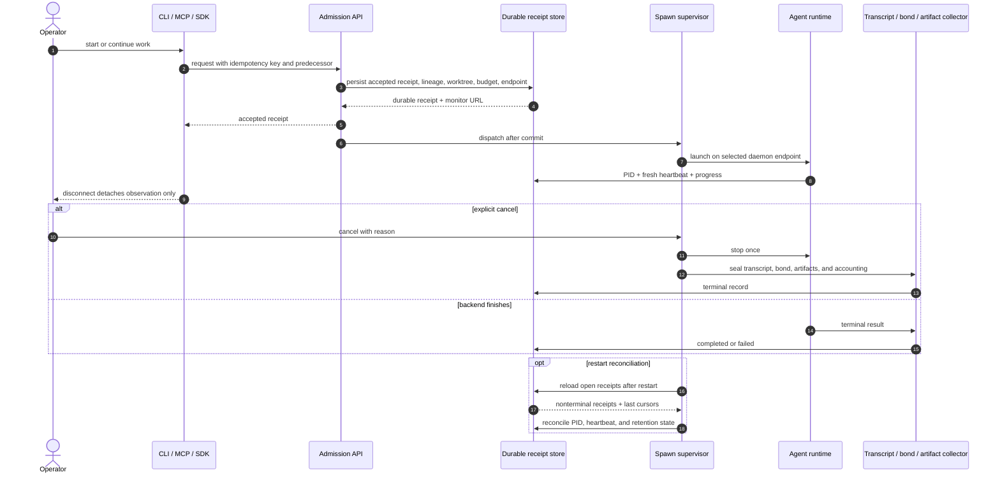
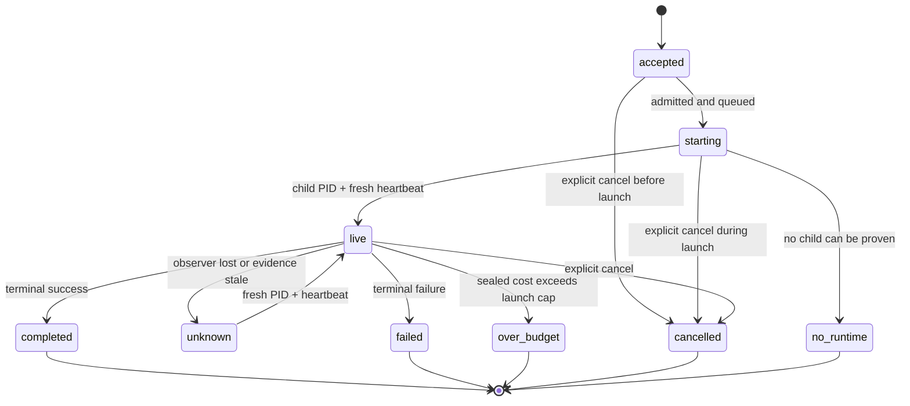

# Spawn lifecycle

A spawn is a durable receipt, not a PID. Acceptance is the moment the run becomes real; the child process, transcript, and client session are just projections of that receipt.

This contract applies to CLI, MCP, SDK, Beacon, FleetBar, and pd-console implementations.

## Core contract

- Admission is atomic: persist the receipt, predecessor and successor lineage, worktree, daemon endpoint, budget, and idempotency key before dispatch.
- `live` requires both a positive child PID and fresh heartbeat or health evidence. A recent file timestamp, a non-null session row, or a UI indicator is not enough.
- Closing a terminal, losing transport, or pressing Ctrl-C detaches observation only. It does not cancel the run.
- There is no generic wall-clock spawn timeout. OpenAI's Codex CLI docs describe resumable non-interactive and background work, and the current README points there [Codex CLI README](https://github.com/openai/codex/blob/main/codex-rs/README.md), [Codex CLI](https://developers.openai.com/codex/cli). Anthropic's Claude Code CLI exposes `-p`, `--bg`, `-c`, and `-r` for non-interactive, background, continue, and resume flows [Claude Code CLI reference](https://code.claude.com/docs/en/cli-usage). Temporal says workflow timeouts are generally not recommended, workflow execution timeout defaults to infinity, and workflow task timeout mainly detects a lost worker [Temporal detecting Workflow failures](https://docs.temporal.io/encyclopedia/detecting-workflow-failures). Kubernetes keeps `activeDeadlineSeconds` optional and separates cleanup from completion [Kubernetes Jobs](https://kubernetes.io/docs/concepts/workloads/controllers/job/).
- Use an explicit task deadline only when the caller asks for one. A deadline expiry records `cancelled` with a deadline reason; it is never reported as an unexplained failure.
- Cancellation is explicit. When the caller cancels, seal the child, transcript, bond, and artifact records exactly once.
- Restart reconciliation reloads open receipts, rechecks PID and heartbeat freshness, and continues collection from the durable store.
- Terminal receipts, transcripts, artifacts, and accounting stay retained until retention policy expires them.

## Sequence

## State contract

| State | Required evidence | Meaning |
|---|---|---|
| `accepted` | Durable receipt exists | The run is owned, but no runtime has been claimed yet |
| `starting` | Dispatch recorded | Runtime formation is in progress |
| `live` | Positive child PID plus fresh heartbeat | The runtime is observable now |
| `unknown` | Observer lost contact before a terminal fact was learned | Outcome is not known yet; reconnect to the same receipt |
| `no_runtime` | Receipt exists but no runtime can be proven | The session survived, but no child can be attached |
| `completed` | Terminal success and sealed collection | Work finished successfully |
| `failed` | Terminal failure and sealed collection | Work finished unsuccessfully |
| `over_budget` | Sealed accounting exceeds the launch cap | Work stopped at the explicit spend boundary |
| `cancelled` | Explicit cancel record | Work was intentionally stopped |

`accepted`, `starting`, `live`, `unknown`, and `no_runtime` can all present a successor action. Terminal states never reuse the predecessor identity; they only retain collection.

## Restart and retry

- A new attempt creates a successor receipt.
- The successor preserves the predecessor link, the retained transcript, and the original work context.
- Replays with the same idempotency key must return the same receipt or the same terminal fact.
- If a daemon restart leaves the runtime unprovable, report `no_runtime` or `unknown`, not a fake failure.

## See also

- [Daemon and supervision](./daemon-and-supervision.md)
- [First-class agent sessions](../design/first-class-agent-sessions.md)
