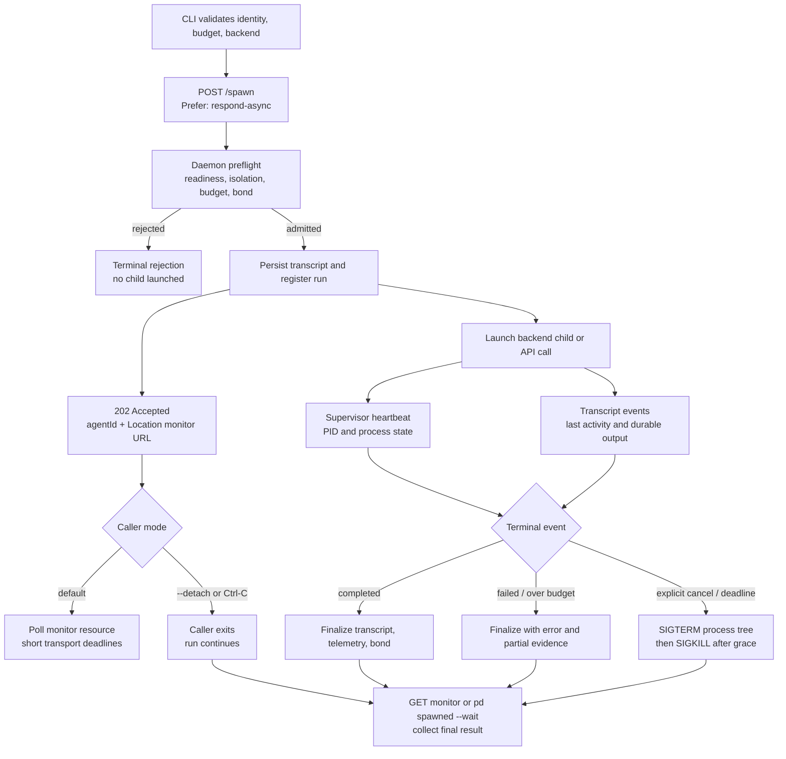

# `pd spawn`: durable execution, liveness, and collection

`pd spawn` starts work; it does not make one HTTP request impersonate a process
supervisor. The daemon owns the run after admission. The invoking CLI may follow,
detach, crash, reconnect, or collect later without changing that ownership.

## Operator contract

```sh
# Submit and follow. Ctrl-C detaches this CLI; it does not kill the run.
pd spawn --backend cli:codex --identity myapp:review --budget 1 -- "Review the change"

# Submit and return the receipt immediately.
pd spawn --detach --backend cli:codex --identity myapp:review --budget 1 -- "Review the change"

# Inspect once, resume following, or cancel explicitly.
pd spawned <agent-id>
pd spawned <agent-id> --wait
pd spawn kill <agent-id>
```

`--timeout <ms>` is an optional hard execution deadline. It is not a client
request timeout and there is no default hard deadline for CLI agents. Budget,
turn, and token caps should constrain useful work; cancellation should be an
explicit operator or policy decision.

## Lifecycle



The HTTP shape follows [RFC 9110 section 15.3.3](https://www.rfc-editor.org/rfc/rfc9110.html#name-202-accepted):
a `202 Accepted` response describes current state and points to a monitor instead
of holding the connection until background work finishes.

## Three clocks, not one timeout

| Clock | Meaning | Correct reaction |
|---|---|---|
| Admission request | Can the daemon validate and durably accept the run? | Short transport timeout; retry only if no receipt was returned |
| Observation request | Can this client read the monitor now? | Short timeout and reconnect; never infer that the worker died |
| Execution deadline | Has the run exceeded an explicit policy limit? | Cancel the process tree and finalize honestly |

Liveness is also plural:

- Supervisor heartbeat means the daemon still owns the run.
- Child PID means the direct process still exists.
- Last activity means stdout, a tool event, or a transcript event arrived.
- Durable transcript state is the collection authority after the live registry is
  gone. It is also the recovery evidence after a daemon restart.

Silence is not automatically death. A model request or tool can legitimately
produce no output for a while. Surface the quiet duration; do not silently kill
on inactivity alone.

For named development daemons, liveness proof also includes client provenance.
`pd dev up` exports the matching build as `PORT_DADDY_CLI`; spawned agents and
managed hooks invoke `"$PORT_DADDY_CLI"`. Treating a successful bare `pd` from a
login shell as proof is unsafe because shell initialization can restore the
Homebrew CLI ahead of the feature shim while retaining the feature daemon URL.

Codex CLI runs model-authored commands in `workspace-write`. Port Daddy enables
that sandbox's documented `sandbox_workspace_write.network_access` setting so
the child can reach the local control plane; the outer Coast Guard confinement,
secret scrubbing, and egress cap still apply to the entire Codex process. This is
strictly narrower than selecting Codex `danger-full-access`, and it preserves
filesystem confinement. See OpenAI's [configuration reference](https://developers.openai.com/codex/config-reference/#sandbox_workspace_write-network_access).

## How long do `codex exec` and `claude -p` last?

Neither upstream CLI advertises a universal wall-clock duration. `codex exec`
streams JSONL events and exits when its turn finishes; `claude -p` likewise runs
non-interactively and supports structural limits such as `--max-turns` and
`--max-budget-usd`. See the [Codex exec implementation](https://github.com/openai/codex/blob/main/codex-rs/exec/src/lib.rs)
and [Claude Code CLI reference](https://docs.anthropic.com/en/docs/claude-code/cli-usage).

The useful duration depends on tool calls, repository size, retries, model
latency, and task scope. In the named Squid release daemon on 2026-08-04, the 28
most recent completed `cli:codex` runs ranged from 23.5 seconds to 366.5 seconds,
with a 121.3-second lower median. That is a local operational sample, not a
service-level promise. It proves that the former five-minute default could cut
through normal review work and should not be encoded as truth.

## Failure and recovery rules

1. A lost client connection never kills a run.
2. A receipt makes retries non-ambiguous: collect that ID instead of submitting
   the task again.
3. The monitor returns live liveness fields while the daemon owns the process and
   falls back to the durable transcript after live memory is gone.
4. A supervised daemon restart cancels active children and finalizes their
   transcripts before closing the database. After an unclean crash, a `running`
   transcript without a live supervisor is finalized as `failed` on collection;
   the system does not pretend it reattached to lost stdio.
5. Cancellation is explicit and staged. Node documents that child process
   signals are asynchronous and that `close` follows stdio closure; collection
   waits for that lifecycle instead of declaring success at `kill()` time. See
   [Node child process lifecycle](https://nodejs.org/api/child_process.html).
6. Terminal state always retains partial transcript, error, telemetry, and bond
   outcome. “Timed out” is not a substitute for the actual last evidence.
7. A named feature run records and uses its paired CLI. Version-skewed clients
   are a failed dogfood proof even when the child process itself completes.

The next durability tier would persist a worker-unit identity that can be
reattached after a daemon crash. Until that exists, reporting supervisor loss is
safer than claiming a detached CLI is still managed.

## API compatibility

`POST /spawn` retains its synchronous response for older callers. New callers
send `Prefer: respond-async`; the CLI does this by default. Migration can proceed
without breaking existing SDK and console clients, while all new automation gets
the durable receipt/monitor contract.
