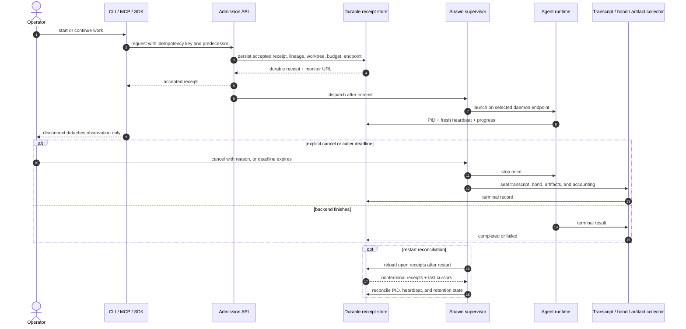
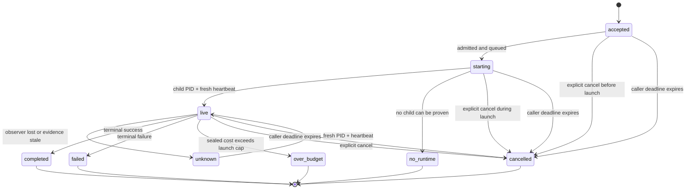

# Spawn lifecycle

A spawn is a durable receipt, not a PID. Acceptance is the moment the run becomes real; the child process, transcript, and client session are just projections of that receipt.

This contract applies to CLI, MCP, SDK, Beacon, FleetBar, and pd-console implementations.

## Core contract

- Admission is atomic: persist the receipt, predecessor and successor lineage, worktree, daemon endpoint, budget, and idempotency key before dispatch.
- `live` requires both a positive child PID and fresh heartbeat or health evidence. A recent file timestamp, a non-null session row, or a UI indicator is not enough.
- Closing a terminal, losing transport, or pressing Ctrl-C detaches observation only. It does not cancel the run.
- There is no generic wall-clock spawn timeout. `codex exec` can stream progress
  or JSONL and can resume a prior run; Claude Code exposes print mode with
  `-p`, continuation/resumption with `-c` and `-r`, and an optional
  `--max-turns`. Neither CLI reference documents a universal task-duration
  limit. Sources: [Codex non-interactive mode](https://learn.chatgpt.com/docs/non-interactive-mode),
  [Codex developer commands](https://learn.chatgpt.com/docs/developer-commands?surface=cli),
  [Claude Code CLI reference](https://code.claude.com/docs/en/cli-usage).
- Use an explicit task deadline only when the caller asks for one. A deadline expiry records `cancelled` with a deadline reason; it is never reported as an unexplained failure.
- Cancellation is explicit. When the caller cancels, seal the child, transcript, bond, and artifact records exactly once.
- Restart reconciliation reloads open receipts, rechecks PID and heartbeat freshness, and continues collection from the durable store.
- Terminal receipts, transcripts, artifacts, and accounting stay retained until retention policy expires them.

## Duration and ownership

An agent CLI may reasonably run for seconds, minutes, or hours. Port Daddy does
not infer a task deadline from a transport timeout or from how long an ordinary
interactive command usually takes. A run continues until one of these facts is
recorded:

- the backend exits with a terminal result;
- the operator or owning caller explicitly cancels it;
- an explicit caller-owned deadline expires;
- a declared spend or policy boundary stops it;
- reconciliation can no longer prove a runtime, in which case the outcome is
  `unknown` or `no_runtime`, not silently converted to failure.

Collection is cursor-based. The supervisor persists progress and transcript
events while the process runs; observers may reconnect from the durable cursor.
Backpressure slows observation or spills to the durable transcript store. It
does not justify killing healthy work.

## Layered sandbox and daemon reachability

Exactly one OS sandbox owns a subprocess tree. Port Daddy wraps every subprocess
backend, including every `cli:*` provider, in Coast Guard. When that outer OS
sandbox is confirmed active, Codex uses its documented externally-sandboxed
mode; starting a second Seatbelt profile inside the first fails on macOS. Coast
Guard scrubs managed secrets, applies the declared write policy, and meters
external egress.

If Coast Guard is disabled or OS confinement is unavailable, Codex falls back
to its own `workspace-write` sandbox plus the explicit
`sandbox_workspace_write.network_access=true` setting documented in the
[Codex configuration reference](https://learn.chatgpt.com/docs/config-file/config-reference).
That permission is required because the agent must reach the dynamically
selected Port Daddy daemon for attention, heartbeats, notes, and collection. It
does not make the preferred daemon port a fixed endpoint.

The selected loopback daemon endpoint remains directly reachable through Coast
Guard's `NO_PROXY` policy; other network traffic remains subject to Coast
Guard's budget and policy.

A subprocess receipt with no Coast Guard evidence is not conformant. End-to-end
proof must show the agent reached the selected daemon and that its durable run
receipt contains a non-null, confined Coast Guard record.

## Sequence

## State contract

| State | Required evidence | Meaning |
|---|---|---|
| `accepted` | Durable receipt exists | The run is owned, but no runtime has been claimed yet |
| `starting` | Dispatch recorded | Runtime formation is in progress |
| `live` | Positive child PID plus fresh heartbeat | The runtime is observable now |
| `unknown` | Observer lost contact before a terminal fact was learned | Outcome is not known yet; reconnect to the same receipt |
| `no_runtime` | Receipt exists but no runtime can be proven | The session survived, but no child can be attached |
| `completed` | Terminal success and sealed collection | Work finished successfully |
| `failed` | Terminal failure and sealed collection | Work finished unsuccessfully |
| `over_budget` | Sealed accounting exceeds the launch cap | Work stopped at the explicit spend boundary |
| `cancelled` | Explicit cancel record or caller-owned deadline expiry | Work was intentionally stopped, with the exact reason retained |

`accepted`, `starting`, `live`, `unknown`, and `no_runtime` can all present a successor action. Terminal states never reuse the predecessor identity; they only retain collection.

## Restart and retry

- A new attempt creates a successor receipt.
- The successor preserves the predecessor link, the retained transcript, and the original work context.
- Replays with the same idempotency key must return the same receipt or the same terminal fact.
- If a daemon restart leaves the runtime unprovable, report `no_runtime` or `unknown`, not a fake failure.

## See also

- [Daemon and supervision](./daemon-and-supervision.md)
- [First-class agent sessions](../design/first-class-agent-sessions.md)
