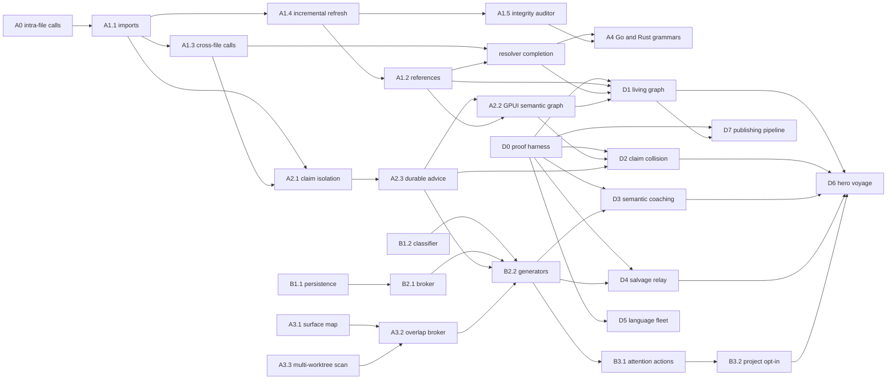

# AST and Suggestibility Program

Status: active canonical execution ledger

Roadmap parent: `ast-and-suggestibility-program-integration`

Primary decisions: [ADR-0039](../adr/0039-suggestibility-layer.md),
[ADR-0092](../adr/0092-suggestibility-ladder-and-cloud-coordination-federation.md),
and [ADR-0096](../adr/0096-signed-guidance-envelope-and-suggestibility-authority.md)

This is the dependency and evidence ledger for Port Daddy's AST-backed
coordination brain and semantic suggestibility system. The roadmap stores
operator priority and lifecycle; this document stores the richer program graph:
decisions, code boundaries, PR evidence, acceptance gates, and handoffs.

The committed roadmap snapshot is a projection, not a second authority. When
its status disagrees with merged code and PR evidence, this ledger records the
disagreement and the roadmap must be repaired. Do not create replacement slugs.

## Outcome

Port Daddy continuously maintains a trustworthy cross-file semantic graph,
uses it to prevent or explain conflicting work before edits land, renders that
truth in the Rust GPUI console, and offers bounded, attributable, opt-in
suggestions through the existing attention surface.

The operator experience is one causal map: select a symbol, see who owns it,
what calls or references it, what will break, which agent is affected, and the
safe next action. Agents claim functions rather than whole files, independent
work multiplexes safely, and related agents can be introduced before they
duplicate work or collide.

The program also ships its proof as a product surface. The same deterministic
voyages that test the graph, conflict gate, and suggestion ladder render through
the canonical Rust GPUI console as visually authored recordings that can be
shared in PRs, documentation, launch pages, talks, and social cuts. Marketing is
never a reenactment of behavior the test harness did not witness.

## Demo-as-test-as-marketing contract

Every remaining implementation task must declare a visual beat even when its
code is backend-only. Related beats are composed into a small set of substantial
voyages rather than twenty disconnected toy demos.

### One scenario, three witnesses

Each voyage is defined once under the planned `demos/ast-suggestibility/`
harness and consumed by three witnesses:

1. **Machine witness:** a deterministic runner seeds a named development
   daemon, executes typed actions, and asserts API, database, transcript, claim,
   and suggestion receipts. CI uses this path without requiring pixels.
2. **Operator witness:** the same scenario drives the real `pd-console` window.
   It uses the existing exact-window proof harness and writes dark/light stills,
   a motion master, `RECEIPT.md`, and `MANIFEST.md` under
   `core/pd-console/docs/artifacts/gpui/`.
3. **Audience witness:** a reproducible editorial step derives a concise product
   cut, captioned social cut, GIF, and poster frame from the verified motion
   master. It may shorten or annotate the run, but never fabricate an event,
   response, agent, claim, or outcome.

The scenario is the authority. A marketing cut that cannot point back to its
scenario ID, daemon identity, commit, run/agent IDs, transcript head, assertions,
and capture receipt does not ship.

### Planned harness package

| Artifact | Purpose | Ship gate |
| --- | --- | --- |
| `scenario.json` | Fixed actors, fixture repo, clock, actions, expected events, camera beats, and copy-safe labels | Schema-valid and deterministic on two runs |
| `seed/` | Tiny purpose-built multi-file and later multi-language project; no private operator code | Hash recorded in receipt |
| `scenario.test.ts` | Headless end-to-end assertions against a named binary daemon berth | Runs in CI and fails on missing, reordered, or fabricated causal events |
| GPUI proof bundle | Real-window dark/light PNGs and 30–60 fps motion master captured only from the proof-owned window | Existing `capture-proof.sh` and `verify-artifacts.mjs` pass |
| `MANIFEST.md` / `RECEIPT.md` | Commit, daemon provenance, source class (`live`, `fixture`, or `mock`), IDs, hashes, commands, limitations, and assertion results | No unlabeled fixture/mock; no broad desktop capture |
| Distribution package | 16:9 product MP4, short GIF, poster, captions, transcript, and optional 1:1/9:16 crops | Derived from verified master; captions and claims reviewed |

### Visual language

The aesthetic is **legible harbor telemetry**, not a dashboard grid with random
neon. The visual system uses semantic tokens, one primary accent, status colors,
and data-viz colors reserved for edge kinds. It must remain coherent in light and
dark modes and readable when desaturated.

- Symbols occupy a navigable chart; imports, calls, references, and ownership
  are distinct line grammars, not color alone.
- Causal threads grow from source to consequence as the corresponding daemon
  event arrives. Vello/custom paint is reserved for these anti-aliased paths,
  playheads, and radar-like sweeps; ordinary controls remain GPUI elements.
- Agent presence is a restrained breathing beacon. A claim wakes the relevant
  region; contention pulls the two wakes into a single `Conflicted` band.
- Time is visible. A voyage has a playhead, durable event markers, and before /
  intervention / after chapters so the operator sees a story rather than a
  frozen data model.
- One interruptible transition owner choreographs board, steer, graph focus,
  conflict expansion, suggestion action, and resolution. No transform-based
  imitation, runaway repeat loops, or layout thrash.
- Reduced motion retains the causal orientation with immediate final-state
  highlighting and fades. It does not delete feedback.

### Truth, privacy, and editorial rules

- The hero recording uses a named binary development daemon. Stable Homebrew
  state is not branch proof, and a source test is not runtime proof.
- Fixture runs are welcome and preferred for deterministic CI, but every frame
  carries a subtle `DEMO FIXTURE` provenance mark and the manifest says so.
- No private repositories, home-directory paths, secrets, raw chain-of-thought,
  unconsented transcripts, real operator messages, or hidden desktop windows may
  enter an artifact. Share only fixture or explicitly authored transcript text.
- Marketing copy names only behaviors asserted by the scenario. Latency,
  prevention, recovery, and language-support claims require measured receipts.
- Captions communicate the event and outcome without sound. Audio, if later
  added, is optional semantic reinforcement and requires an accessible silent
  cut.
- The full evidence take remains available beside every edited cut. Editors may
  trim dead time, reframe, add chapter cards, and normalize audio; they may not
  reorder causal events or splice success around a failure.

## Authority and status vocabulary

Every program task must have all of these before implementation:

1. One existing roadmap slug in harbor `port-daddy`.
2. One decision authority: ADR-0039, ADR-0092, or an explicitly cited adjacent
   Harbor Editor contract.
3. A narrow code/test boundary and named dependencies.
4. A PR trailer using that exact roadmap slug.
5. Acceptance evidence recorded in the PR and summarized here after merge.

Statuses in this ledger:

- **DONE**: merged to `main` with test evidence.
- **LANDING**: implementation exists in an open PR; not shipped.
- **READY**: dependencies are done and the task can start.
- **BLOCKED**: an explicit prerequisite or ownership conflict prevents work.
- **PARKED**: intentionally outside the current critical path.

“A worker was launched” is not a status. The :9886 GPUI and B2.2 workers from
2026-08-24 terminated without commits, remote branches, or PRs; those tasks are
therefore READY or BLOCKED, not in progress.

## Program dependency graph

## Exhaustive task ledger

### Track A: trustworthy semantic graph and conflict enforcement

| ID | Roadmap slug | Status | Depends on | Decision/docs | Code boundary | PR/evidence | Remaining acceptance |
| --- | --- | --- | --- | --- | --- | --- | --- |
| A0 | `ast-a0-intra-file-call-edges` | DONE | none | ADR-0092 graph substrate | `lib/symbol-index.ts`, focused tests | #544 | None. Intra-file `calls` edges are extracted and consumed by blast radius. |
| A1.1 | `ast-a1-1-cross-file-resolution` | DONE | A0 | ADR-0092 | import resolution in `lib/symbol-index.ts` | #576, hardening #593 | None. NodeNext `.js` to `.ts`, query stripping, boundary clamp, and safe filesystem probes are covered. |
| A1.2 | `ast-a1-2-references-edges` | READY | A1.4 | ADR-0092 | reference extraction and focused graph tests; do not alter GPUI buffer syntax | not started | Imported types, annotations, generic constraints, and identifier reads emit `references` without duplicating calls/extends/implements. |
| A1.3 | `ast-a1-3-cross-file-call-resolution` | DONE | A1.1 | ADR-0092 | call extraction/import map | #594 | Alias/namespace support belongs to resolver completion, not this closed slice. |
| A1.4 | `ast-a1-4-incremental-index-refresh` | DONE | A1.1 | ADR-0092 | dirty-file refresh in `lib/symbol-index.ts` | #9792, serialization hardening #9808 | Roadmap projection still says `now`; change it to `done`. |
| A1.5 | `ast-a1-5-graph-integrity-auditor` | DONE | schema + A1.4 contract | ADR-0092 | `lib/symbol-graph-integrity.ts`, focused tests | #9790 | Wire into doctor/health only in a separate operator-facing slice. Roadmap still says `now`. |
| AR | create a program child only when implementation starts | READY | A1.2, A1.3 | ADR-0092 | aliases, namespaces, re-exports, barrels, ambiguity diagnostics | not started | Resolve real definitions or emit explicit ambiguity; never fabricate an edge. Prefer one new roadmap child rather than overloading a closed A1 item. |
| A2.1 | `ast-a2-1-symbol-claim-isolation-validator` | DONE | A1.1, A1.3 | ADR-0092 local edit gate | claim preflight and `/conflicts/predict` | #983 | Roadmap projection says `merge`; update to `done`. |
| A2.2 | `ast-a2-2-symbol-graph-visualization` | READY | A1.2 for complete references; A2.3 for explanations | ADR-0092 plus Harbor Editor battle plan | canonical `core/pd-console` only; reuse Pane/Workspace/DaemonClient | conflict wedge #728 is partial; 2026-08-24 worker produced no commit | Navigable calls/imports/references/blast-radius graph, honest empty/error states, operator controls, dark/light screenshots, GIF or recording, macOS GPUI build. No web or SwiftUI duplicate. |
| A2.3 | `ast-a2-3-predict-conflicts-session-preflight` | DONE | A2.1 | ADR-0092 | claim/advice/attention integration | #9791 | Roadmap projection says `backlog`; update to `done`. |
| A3.1 | `ast-a3-1-surface-map` | DONE | symbol extraction | ADR-0092 | `lib/surface-map.ts` and diff-to-symbol tests | #425 | Roadmap projection says `backlog`; update to `done`. |
| A3.2 | `ast-a3-2-surface-overlap-broker` | DONE | A3.1, A3.3 | ADR-0039 + ADR-0092 | overlap detector/broker | #426 | Roadmap projection says `backlog`; update to `done`. |
| A3.3 | `ast-a3-3-surface-scan-multiworktree` | DONE | A3.1 | ADR-0092 | multi-worktree path resolution | #463 | Roadmap projection says `backlog`; update to `done`. |
| A4 | `ast-a4-1-go-rust-grammars` | PARKED | A1.2, AR, A1.5 operational gate | ADR-0092 normalized graph contract | language adapters and shared conformance fixtures | not started | Go and Rust files must emit the same symbol/dependency model; do not start before graph trust closes. |

### Track B: semantic, bounded, actionable suggestibility

| ID | Roadmap slug | Status | Depends on | Decision/docs | Code boundary | PR/evidence | Remaining acceptance |
| --- | --- | --- | --- | --- | --- | --- | --- |
| B1.1 | `suggest-b1-1-suggestions-table` | DONE | none | ADR-0039 | `lib/suggestions.ts`, migration and lifecycle tests | shipped before this program; lifecycle tests exist | Identify and add the historical PR number during roadmap sync. Roadmap incorrectly says `backlog`. |
| B1.2 | `suggest-b1-2-topical-classifier` | LANDING | shared MiniLM resolver | ADR-0039, ADR-0061 shared embedder policy | `lib/agent-context-classifier.ts` (not yet shipped; landing in #9793), focused tests | open #9793, all CI green except unresolved review-thread gate | Add exact tie, empty/whitespace input, and non-tautological normalization fixtures; decide and document whether injected embedders are test seams or production-authorized providers; resolve all six review threads; merge. |
| B2.1 | `suggest-b2-1-suggestion-broker` | DONE | B1.1 | ADR-0039 | `lib/suggestion-broker.ts`, cooldown/mute/budget tests | #392 plus review fixes | Add exact historical PR chain to roadmap summary. Roadmap incorrectly says `backlog`. |
| B2.2 | `suggest-b2-2-candidate-generators` | BLOCKED | B1.2 merge, B2.1, A2.3, A3.2 | ADR-0039 | extend broker/generator modules without a second matcher | 2026-08-24 worker produced no commit | Crafted positive/negative/cooldown/mute/attribution fixtures for group chat, prior art, overlap heads-up, and salvage. Semantic retrieval uses `createLocalEmbedder()` only; lexical-only fallback warns and points to doctor. |
| B3.1 | `suggest-b3-1-pd-suggestion-cli-attention` | DONE | B1.1, B2.1 | ADR-0039 | existing attention and suggestion actions | shipped before this program | Add historical PR evidence and update roadmap from `backlog` to `done`. Do not add a second notification surface. |
| B3.2 | `suggest-b3-2-fleet-yml-optin` | BLOCKED | B2.2 | ADR-0039, ADR-0092 control ladder | project config plus bounded scheduler/reactive hooks | not started | `suggestions.enabled` is project-scoped and default-off; bounded cadence, visible source/confidence, accept/decline/mute, no remote inference. |

### Track C: deterministic visual voyages

These are first-class roadmap children of
`ast-and-suggestibility-program-integration`. Their summaries carry the parent
and dependency links until the roadmap schema gains explicit parent edges.

| ID | Roadmap slug | Status | Depends on | Scenario and choreography | End-to-end assertions | Shareable outputs |
| --- | --- | --- | --- | --- | --- | --- |
| D0 | `ast-suggest-demo-harness` | READY | existing GPUI proof harness | Build the schema, fixture seeder, synthetic clock, action driver, camera-beat adapter, receipt writer, redaction scan, and editorial derivation commands once | Two runs produce the same event ordering and semantic screenshots; wrong daemon, missing receipt, mock mislabeled as live, private path, and broad capture fail closed | A tiny reference proof bundle showing the pipeline rather than a product claim |
| D1 | `ast-demo-living-graph` | BLOCKED | D0, A1.2, resolver completion | A small project opens as files, then blooms into a causal chart. Imports, calls, references, alias resolution, incremental refresh, deletion, ambiguity, and integrity status appear as timed layers | Assert exact normalized edges, refresh scope, deletion cleanup, ambiguity diagnostics, integrity counts, and selected-node details | 45–60s graph-bloom product cut, 10s loop, light/dark posters, full evidence take |
| D2 | `ast-demo-claim-collision` | BLOCKED | D0, A2.1, A2.2, A2.3, A3.1–A3.3 | Two named agent replicas approach adjacent functions across worktrees. The second edit illuminates callers, tightens into a conflict wedge, blocks before write, opens a parley, then clears after a handoff | Assert claim holders, overlap reason, severity/confidence, blocked write, untouched fixture hash, advice delivery, parley/handoff receipt, and successful retry | 60–75s “collision prevented” hero, 12s before/after loop, annotated causal-chain poster |
| D3 | `suggest-demo-coaching` | BLOCKED | D0, B1.2, B2.2, B3.1 | Three agents begin related work in separate lanes. Topic vectors converge as visible wakes; a group-chat suggestion arrives, reveals evidence/confidence, is accepted, and folds lanes into one channel. A second suggestion is declined, cooled down, and muted | Assert classifier provenance, semantic score, attribution, budget, cooldown, accept/decline/mute transitions, channel membership, and no repeated suggestion inside the window | 60s “the fleet notices overlap” cut, 15s convergence loop, captioned mobile crop |
| D4 | `ast-demo-salvage-relay` | BLOCKED | D0, B2.2 salvage generator, existing salvage substrate | An agent beacon stops mid-edit; its claim and causal context remain. A successor boards the work, replays durable evidence, inherits only authorized scope, and completes without losing provenance | Assert dead-run detection, immutable notes/transcript head, candidate attribution, accepted salvage receipt, claim transfer, preserved authorship, and completed test | 60–90s recovery story, 12s “signal lost → successor aboard” loop, provenance poster |
| D5 | `ast-demo-language-fleet` | PARKED | D0, A4 | TypeScript, Python, Go, and Rust implementations of one service enter from four chart quadrants and resolve into the same normalized semantic model; unsupported or ambiguous syntax stays visibly honest | Run one conformance suite across languages; assert equivalent symbols/edges and explicit unsupported/ambiguous diagnostics | 45s language-constellation cut, four-up poster, looping edge-normalization reveal |
| D6 | `ast-suggest-demo-hero-voyage` | BLOCKED | D1–D4, B3.2 | From the GPUI entrance, a human commissions a feature. Agents board in parallel, claim functions, stream progress, hit a predicted collision, accept a coaching suggestion, parley, hand off, recover a failed lane, pass tests, and present the final PR as one continuous voyage | Assert every chapter against durable IDs: commission, spawn, claims, conflict refusal, suggestion, parley, salvage, test result, PR receipt, and final graph integrity | 2–3m master, 75–90s launch film, 30s product cut, 10–15s social loop, still campaign set |
| D7 | `ast-suggest-demo-publishing-pipeline` | BLOCKED | D0, first verified voyage | Deterministically derive captions, poster, GIF, 16:9, 1:1, and 9:16 cuts without obscuring provenance or inventing motion | Verify media decodes, aspect/fps/length constraints, captions, provenance slate, redaction, hashes, and source-master linkage | Versioned campaign bundle usable by PRs, docs, website, launch posts, talks, and press demos |

## Visual coverage matrix

Every program item has a required on-screen payoff. A backend PR may land before
its voyage dependency is complete, but it must add or update the fixture and
assertion beat that the future voyage will consume.

| Program capability | Required voyage beat |
| --- | --- |
| A0 intra-file calls | D1: local caller thread appears before any cross-file layer |
| A1.1 imports | D1: import edges bridge file islands and survive NodeNext source mapping |
| A1.2 references | D1: type/annotation/read references use their own line grammar and filter |
| A1.3 cross-file calls | D1: selecting a callee illuminates callers in another file |
| A1.4 incremental refresh | D1: one edit pulses only the dirty subgraph while the rest remains stable |
| A1.5 integrity auditor | D1 and D6: trust gauge begins and ends green; a crafted corrupt edge produces an honest diagnostic |
| Resolver completion | D1: alias, namespace, re-export, and barrel routes resolve; ambiguity branches rather than guessing |
| A2.1 claim isolation | D2: conflicting function claim is denied before bytes change |
| A2.2 GPUI graph | D1, D2, and D6: chart navigation, filtering, causal explanation, keyboard focus, dark/light, and reduced-motion proof |
| A2.3 durable preflight advice | D2: warning explains holder, affected caller, reason, confidence, and safe action |
| A3.1 surface map | D2: a diff folds into exact symbol regions rather than whole-file ownership |
| A3.2 overlap broker | D2 and D3: overlapping intent creates a durable intervention, not merely a color change |
| A3.3 multi-worktree scan | D2: two worktrees remain visually distinct until the shared symbol conflict joins them |
| A4 Go/Rust adapters | D5: all supported languages satisfy one graph vocabulary and conformance suite |
| B1.1 persistence | D3 and D4: pending, acted-on, cooled-down, muted, and salvaged records survive restart |
| B1.2 classifier | D3: evidence accumulates into a topic match with visible provenance and confidence |
| B2.1 broker | D3: thresholds, budgets, and suppression are visible in an expandable “why now / why not” rail |
| B2.2 generators | D3 and D4: group chat, prior art, overlap, and salvage each produce one positive and one withheld candidate |
| B3.1 attention actions | D3: accept, decline, mute, open evidence, and create channel all close their feedback loops |
| B3.2 project opt-in | D6: suggestions remain absent before explicit enablement and bounded afterward |

## Voyage storyboards

### D1 — The Living Graph

1. **Chart the harbor:** source files settle as quiet islands; the selected
   symbol is the single focal point.
2. **Reveal causality:** imports draw first, then calls, then references. A
   playhead and event markers make the order legible.
3. **Touch one function:** a fixture edit lands; only the dirty subgraph wakes
   and callers downstream glow in sequence.
4. **Tell the hard truth:** a barrel creates two valid targets; the graph forks
   into an amber ambiguity instead of choosing one.
5. **Restore trust:** resolve the fixture ambiguity; the integrity gauge returns
   green and the chart settles to idle with no background re-render.

### D2 — Hold the Line

1. Two agent identities board separate worktrees and claim adjacent functions.
2. The operator focuses the second agent; its proposed target expands to show
   the first holder and every dependent caller.
3. The conflict wedge closes before the edit. The attempted write visibly stops
   and the source hash remains unchanged.
4. One action convenes a parley. The agents agree to a handoff; ownership moves
   with a durable receipt.
5. The edit succeeds, tests turn green, and the wedge relaxes into a resolved
   causal thread. The visual climax is prevention plus resolution, not a red X.

### D3 — The Fleet Notices

1. Three independent lanes begin with deliberately different wording but the
   same underlying topic.
2. Their semantic wakes gradually align; evidence chips show claims, notes, and
   prior art rather than exposing prompts or private reasoning.
3. The suggestion arrives as a quiet coach, not a modal interruption. Expanding
   “why” reveals score, source, confidence, budget, and authority.
4. Accepting creates the group channel and folds the lanes into a shared
   conversation. Declining a second candidate starts a visible cooldown; mute
   demonstrates operator control.
5. The end frame compares prevented duplicate effort with the bounded number of
   interventions, backed by receipts rather than an invented percentage.

### D4 — Salvage the Signal

1. An agent is mid-voyage with a claim, transcript markers, and unfinished test.
2. Its presence signal stops. The lane dims, but its evidence and claimed region
   remain; nothing is portrayed as magically complete.
3. A salvage suggestion identifies the exact recoverable work and why the new
   agent is relevant.
4. The successor boards, replays the evidence, accepts transferred scope, and
   continues from the last durable marker.
5. The final test passes with a visible provenance braid linking both actors.

### D5 — One Graph, Four Languages

1. Four small services enter from separate quadrants with their native syntax.
2. Their normalized symbols align into the same roles while language-specific
   details remain inspectable.
3. Equivalent calls and references connect across the common vocabulary.
4. One intentionally unsupported construct stays marked as unsupported; the
   film earns trust by showing the limit.

### D6 — The Hero Voyage

The hero film is a continuous operator story, not a montage of disconnected
panes: commission a feature in `pd-console`; watch agents board as peers; see
claims partition the work; follow real streamed activity on a shared timeline;
catch and resolve a dangerous collision; accept a useful group-chat or prior-art
suggestion; salvage one failed lane; watch tests and graph integrity settle; and
arrive at a reviewable PR with every event still inspectable. The camera stays
inside the canonical Rust app. Terminal commands may appear only as authored
fixture content inside the app, never as the operator interface.

## Ordered execution queue

### Wave 0: close the only landing slice and repair truth

- [ ] **B1.2 review closure:** address four new fleet review findings on #9793,
      resolve all six threads, confirm current-head CI, and merge.
- [ ] **Roadmap projection repair:** after the existing snapshot owners release
      `docs/roadmap/roadmap.snapshot.json`, update A1.4, A1.5, A2.1, A2.3,
      A3.1, A3.2, A3.3, B1.1, B2.1, and B3.1 to `done`; set B1.2 to
      `merge` until #9793 lands, then `done`; export and commit the snapshot.
- [ ] Add missing historical PR evidence for B1.1 and B3.1 rather than guessing.
- [ ] Mark the failed :9886 worker attempts as terminal execution evidence; do
      not call A2.2 or B2.2 active until a new session produces a commit.
- [ ] Create D0's roadmap receipt, scenario schema, fixture repository, and
      redaction/provenance gates before any voyage-specific capture code.

### Wave 1: parallel graph and suggestion work

- [ ] **A1.2 reference edges** — owns symbol-index extraction and focused tests.
- [ ] **A2.2 GPUI graph design/data-contract slice** — may proceed in parallel
      in `core/pd-console`, but complete `references` rendering waits for A1.2.
- [ ] **B2.2 candidate generators** — starts only after B1.2 merges; owns
      suggestion generator modules/tests and does not edit `symbol-index.ts` or
      GPUI.
- [ ] **D1/D2/D3 fixture beats** — add machine assertions alongside each
      backend slice; visual choreography may proceed without claiming that an
      unmerged capability is live.

### Wave 2: integration

- [ ] **Resolver completion** — aliases, namespaces, re-exports, barrels,
      explicit ambiguity. Sequence after A1.2 because both touch graph extraction.
- [ ] **A2.2 complete GPUI overlay** — integrate reference edges and durable
      conflict explanations; capture mandatory visual artifacts.
- [ ] **B3.2 opt-in activation** — wire generators into bounded project-level
      execution, default off.
- [ ] Capture D1, D2, and D3 evidence masters and derive their reviewed product
      cuts through D7.

### Wave 3: breadth and continuous trust

- [ ] Add Go and Rust grammar adapters and shared conformance fixtures.
- [ ] Wire the graph integrity report into doctor/health without adding mutation.
- [ ] Capture D4 and D5 once their underlying capabilities are real.
- [ ] Run the complete end-to-end story: two agents claim adjacent functions,
      one proposes a dependency-breaking edit, GPUI explains the chain, attention
      suggests the correct collaboration, and the operator can parley, hand off,
      decline, mute, or salvage with durable provenance.
- [ ] Capture D6 as the release-gate voyage and publish its D7 distribution
      package only after the full receipt passes.

## Parallel ownership rules

| Lane | Write boundary | Must not touch concurrently | Handoff |
| --- | --- | --- | --- |
| Graph extraction | `lib/symbol-index.ts` and focused graph tests | another graph-extraction lane | normalized edge fixtures and schema notes |
| GPUI graph | `core/pd-console` plus visual artifacts | web Fleet UI, Swift Control Center, Harbor buffer internals owned by P1 | daemon response fixtures, screenshots, recording |
| Suggestion generation | suggestion broker/generator modules and focused tests | graph extraction and GPUI | typed candidate fixtures and attribution contract |
| Demo harness | `demos/ast-suggestibility` scenario, seed, runner, assertions, and publishing scripts | product implementation modules except through public contracts | scenario ID, expected events, fixture hash, and capture beats |
| Visual direction | GPUI presentation state plus proof artifacts; one motion owner per voyage | web Fleet UI, Swift Control Center, daemon business logic | semantic tokens, storyboard, reduced-motion states, camera beats |
| Program steward | this document, roadmap records, review/merge evidence | generated snapshot while another session claims it | exact status/PR updates after each merge |

The Harbor P1 live buffer remains a separate layer: Rust `syntax.rs` beside the
Loro buffer owns edit-time syntax; TypeScript `lib/symbol-index.ts` and
`routes/symbols.ts` own the repository graph. A2.2 consumes both; it does not
collapse them into one implementation.

## Pause-point checklists

### Before implementation

- Confirm the roadmap slug exists in harbor `port-daddy` and is not duplicated.
- Confirm the task is not already shipped under another name.
- State dependencies, exact write boundary, and prohibited overlapping surfaces.
- Use an isolated worktree and symbol/region claims where available.
- Confirm no second embedder, matcher, conflict engine, or notification surface.
- Define negative, deletion, stale-state, and ambiguity tests before editing.
- Name the voyage beat, scenario assertion, source class, and intended audience
  artifact; backend-only is not an exemption from visual storytelling.

### Before PR

- Rebase on current `origin/main`; inspect active-file diff for erosion.
- Run focused tests, typecheck, parity, and compiled/runtime gates in scope.
- Use exactly one roadmap trailer and update this ledger if scope changed.
- GPUI changes include dark/light screenshots and a GIF or recording.
- Demo changes prove deterministic machine assertions and link every visual
  artifact to its scenario receipt; a pretty fixture with no assertion fails.
- Run Port Daddy fleet adversarial review; Copilot availability is irrelevant.

### Before merge

- Resolve every actionable review thread with code/test evidence or a reasoned rejection.
- Confirm required checks on the exact head and merge-group SHA.
- Rebuild/relaunch the selected daemon when runtime-serving code changed.
- Read back the roadmap update from the same daemon and committed snapshot.
- Record PR, commit, tests, runtime proof, and remaining handoff here.

### Before publication

- Confirm the source master is the exact-window GPUI recording named by the
  manifest and that its daemon/commit/run IDs read back successfully.
- Run secret, private-path, transcript-consent, broad-capture, and fixture-label
  checks; one failure stops publication.
- Watch the full evidence take at normal speed; verify no reordered event,
  hidden failure, stale label, runaway animation, cursor leak, or notification
  from an unrelated app.
- Check dark, light, reduced-motion, keyboard focus, captions, silent playback,
  and contrast before selecting the campaign poster.
- Verify MP4/GIF decode, duration, dimensions, frame cadence, captions, poster,
  hashes, and source-master linkage.
- Have a skeptical reviewer match every spoken or written product claim to a
  receipt assertion. Remove any claim that is merely plausible.

## Known organization debt

The program is organized, but the storage layers are not yet synchronized:

- The parent roadmap item now exists, while the original plan PR used a
  `Roadmap-Item: none` trailer because the item did not exist at that time.
- The committed snapshot has at least nine stale statuses listed in Wave 0.
- The snapshot is currently whole-file claimed by two unrelated active sessions,
  so this slice intentionally does not overwrite it.
- `pd roadmap show <slug> --json` returned an unfiltered collection in this
  audit, making precise read-back noisy. That is roadmap tooling debt.
- B1.1 and B3.1 are visibly shipped in code but their historical PR links are
  not yet captured in this ledger.
- The :9886 development berth retained neither worker output nor a durable remote
  branch for A2.2/B2.2; launch receipt alone was insufficient execution evidence.

These are reasons the answer is “not fully synchronized yet,” not reasons to
invent another planning system. The repair is to reconcile the existing roadmap,
this ledger, and PR evidence after each merge.

## Definition of program completion

The program is complete only when:

- edits refresh the graph incrementally and integrity is continuously auditable;
- imports, calls, and references resolve across supported files with explicit ambiguity;
- blocking symbol claims fail before writes and advice explains the causal chain;
- the canonical Rust GPUI console navigates the graph with visual evidence;
- suggestions are semantic, bounded, attributable, cooldown/mute-aware,
  project-opt-in, and actionable through attention;
- Go and Rust adapters pass the same normalized graph conformance suite;
- roadmap, this ledger, merged PRs, and live daemon behavior all agree;
- every A/B capability appears in at least one deterministic voyage assertion;
- D1–D6 have verified full evidence takes and D7-derived shareable packages;
- the hero voyage can be replayed from a clean fixture without manual repair,
  broad screen capture, private data, or unreceipted narrative edits; and
- the same recorded story passes as an end-to-end test and remains compelling
  with captions only, reduced motion, and either visual theme.
