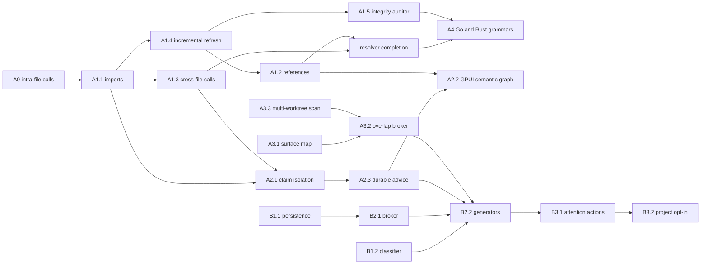

# AST and Suggestibility Program

Status: active canonical execution ledger

Roadmap parent: `ast-and-suggestibility-program-integration`

Primary decisions: [ADR-0039](../adr/0039-suggestibility-layer.md) and
[ADR-0092](../adr/0092-suggestibility-ladder-and-cloud-coordination-federation.md)

This is the dependency and evidence ledger for Port Daddy's AST-backed
coordination brain and semantic suggestibility system. The roadmap stores
operator priority and lifecycle; this document stores the richer program graph:
decisions, code boundaries, PR evidence, acceptance gates, and handoffs.

The committed roadmap snapshot is a projection, not a second authority. When
its status disagrees with merged code and PR evidence, this ledger records the
disagreement and the roadmap must be repaired. Do not create replacement slugs.

## Outcome

Port Daddy continuously maintains a trustworthy cross-file semantic graph,
uses it to prevent or explain conflicting work before edits land, renders that
truth in the Rust GPUI console, and offers bounded, attributable, opt-in
suggestions through the existing attention surface.

The operator experience is one causal map: select a symbol, see who owns it,
what calls or references it, what will break, which agent is affected, and the
safe next action. Agents claim functions rather than whole files, independent
work multiplexes safely, and related agents can be introduced before they
duplicate work or collide.

## Authority and status vocabulary

Every program task must have all of these before implementation:

1. One existing roadmap slug in harbor `port-daddy`.
2. One decision authority: ADR-0039, ADR-0092, or an explicitly cited adjacent
   Harbor Editor contract.
3. A narrow code/test boundary and named dependencies.
4. A PR trailer using that exact roadmap slug.
5. Acceptance evidence recorded in the PR and summarized here after merge.

Statuses in this ledger:

- **DONE**: merged to `main` with test evidence.
- **LANDING**: implementation exists in an open PR; not shipped.
- **READY**: dependencies are done and the task can start.
- **BLOCKED**: an explicit prerequisite or ownership conflict prevents work.
- **PARKED**: intentionally outside the current critical path.

“A worker was launched” is not a status. The :9886 GPUI and B2.2 workers from
2026-08-24 terminated without commits, remote branches, or PRs; those tasks are
therefore READY or BLOCKED, not in progress.

## Program dependency graph

## Exhaustive task ledger

### Track A: trustworthy semantic graph and conflict enforcement

| ID | Roadmap slug | Status | Depends on | Decision/docs | Code boundary | PR/evidence | Remaining acceptance |
| --- | --- | --- | --- | --- | --- | --- | --- |
| A0 | `ast-a0-intra-file-call-edges` | DONE | none | ADR-0092 graph substrate | `lib/symbol-index.ts`, focused tests | #544 | None. Intra-file `calls` edges are extracted and consumed by blast radius. |
| A1.1 | `ast-a1-1-cross-file-resolution` | DONE | A0 | ADR-0092 | import resolution in `lib/symbol-index.ts` | #576, hardening #593 | None. NodeNext `.js` to `.ts`, query stripping, boundary clamp, and safe filesystem probes are covered. |
| A1.2 | `ast-a1-2-references-edges` | READY | A1.4 | ADR-0092 | reference extraction and focused graph tests; do not alter GPUI buffer syntax | not started | Imported types, annotations, generic constraints, and identifier reads emit `references` without duplicating calls/extends/implements. |
| A1.3 | `ast-a1-3-cross-file-call-resolution` | DONE | A1.1 | ADR-0092 | call extraction/import map | #594 | Alias/namespace support belongs to resolver completion, not this closed slice. |
| A1.4 | `ast-a1-4-incremental-index-refresh` | DONE | A1.1 | ADR-0092 | dirty-file refresh in `lib/symbol-index.ts` | #9792, serialization hardening #9808 | Roadmap projection still says `now`; change it to `done`. |
| A1.5 | `ast-a1-5-graph-integrity-auditor` | DONE | schema + A1.4 contract | ADR-0092 | `lib/symbol-graph-integrity.ts`, focused tests | #9790 | Wire into doctor/health only in a separate operator-facing slice. Roadmap still says `now`. |
| AR | create a program child only when implementation starts | READY | A1.2, A1.3 | ADR-0092 | aliases, namespaces, re-exports, barrels, ambiguity diagnostics | not started | Resolve real definitions or emit explicit ambiguity; never fabricate an edge. Prefer one new roadmap child rather than overloading a closed A1 item. |
| A2.1 | `ast-a2-1-symbol-claim-isolation-validator` | DONE | A1.1, A1.3 | ADR-0092 local edit gate | claim preflight and `/conflicts/predict` | #983 | Roadmap projection says `merge`; update to `done`. |
| A2.2 | `ast-a2-2-symbol-graph-visualization` | READY | A1.2 for complete references; A2.3 for explanations | ADR-0092 plus Harbor Editor battle plan | canonical `core/pd-console` only; reuse Pane/Workspace/DaemonClient | conflict wedge #728 is partial; 2026-08-24 worker produced no commit | Navigable calls/imports/references/blast-radius graph, honest empty/error states, operator controls, dark/light screenshots, GIF or recording, macOS GPUI build. No web or SwiftUI duplicate. |
| A2.3 | `ast-a2-3-predict-conflicts-session-preflight` | DONE | A2.1 | ADR-0092 | claim/advice/attention integration | #9791 | Roadmap projection says `backlog`; update to `done`. |
| A3.1 | `ast-a3-1-surface-map` | DONE | symbol extraction | ADR-0092 | `lib/surface-map.ts` and diff-to-symbol tests | #425 | Roadmap projection says `backlog`; update to `done`. |
| A3.2 | `ast-a3-2-surface-overlap-broker` | DONE | A3.1, A3.3 | ADR-0039 + ADR-0092 | overlap detector/broker | #426 | Roadmap projection says `backlog`; update to `done`. |
| A3.3 | `ast-a3-3-surface-scan-multiworktree` | DONE | A3.1 | ADR-0092 | multi-worktree path resolution | #463 | Roadmap projection says `backlog`; update to `done`. |
| A4 | `ast-a4-1-go-rust-grammars` | PARKED | A1.2, AR, A1.5 operational gate | ADR-0092 normalized graph contract | language adapters and shared conformance fixtures | not started | Go and Rust files must emit the same symbol/dependency model; do not start before graph trust closes. |

### Track B: semantic, bounded, actionable suggestibility

| ID | Roadmap slug | Status | Depends on | Decision/docs | Code boundary | PR/evidence | Remaining acceptance |
| --- | --- | --- | --- | --- | --- | --- | --- |
| B1.1 | `suggest-b1-1-suggestions-table` | DONE | none | ADR-0039 | `lib/suggestions.ts`, migration and lifecycle tests | shipped before this program; lifecycle tests exist | Identify and add the historical PR number during roadmap sync. Roadmap incorrectly says `backlog`. |
| B1.2 | `suggest-b1-2-topical-classifier` | LANDING | shared MiniLM resolver | ADR-0039, ADR-0061 shared embedder policy | `lib/agent-context-classifier.ts`, focused tests | open #9793, all CI green except unresolved review-thread gate | Add exact tie, empty/whitespace input, and non-tautological normalization fixtures; decide and document whether injected embedders are test seams or production-authorized providers; resolve all six review threads; merge. |
| B2.1 | `suggest-b2-1-suggestion-broker` | DONE | B1.1 | ADR-0039 | `lib/suggestion-broker.ts`, cooldown/mute/budget tests | #392 plus review fixes | Add exact historical PR chain to roadmap summary. Roadmap incorrectly says `backlog`. |
| B2.2 | `suggest-b2-2-candidate-generators` | BLOCKED | B1.2 merge, B2.1, A2.3, A3.2 | ADR-0039 | extend broker/generator modules without a second matcher | 2026-08-24 worker produced no commit | Crafted positive/negative/cooldown/mute/attribution fixtures for group chat, prior art, overlap heads-up, and salvage. Semantic retrieval uses `createLocalEmbedder()` only; lexical-only fallback warns and points to doctor. |
| B3.1 | `suggest-b3-1-pd-suggestion-cli-attention` | DONE | B1.1, B2.1 | ADR-0039 | existing attention and suggestion actions | shipped before this program | Add historical PR evidence and update roadmap from `backlog` to `done`. Do not add a second notification surface. |
| B3.2 | `suggest-b3-2-fleet-yml-optin` | BLOCKED | B2.2 | ADR-0039, ADR-0092 control ladder | project config plus bounded scheduler/reactive hooks | not started | `suggestions.enabled` is project-scoped and default-off; bounded cadence, visible source/confidence, accept/decline/mute, no remote inference. |

## Ordered execution queue

### Wave 0: close the only landing slice and repair truth

- [ ] **B1.2 review closure:** address four new fleet review findings on #9793,
      resolve all six threads, confirm current-head CI, and merge.
- [ ] **Roadmap projection repair:** after the existing snapshot owners release
      `docs/roadmap/roadmap.snapshot.json`, update A1.4, A1.5, A2.1, A2.3,
      A3.1, A3.2, A3.3, B1.1, B2.1, and B3.1 to `done`; set B1.2 to
      `merge` until #9793 lands, then `done`; export and commit the snapshot.
- [ ] Add missing historical PR evidence for B1.1 and B3.1 rather than guessing.
- [ ] Mark the failed :9886 worker attempts as terminal execution evidence; do
      not call A2.2 or B2.2 active until a new session produces a commit.

### Wave 1: parallel graph and suggestion work

- [ ] **A1.2 reference edges** — owns symbol-index extraction and focused tests.
- [ ] **A2.2 GPUI graph design/data-contract slice** — may proceed in parallel
      in `core/pd-console`, but complete `references` rendering waits for A1.2.
- [ ] **B2.2 candidate generators** — starts only after B1.2 merges; owns
      suggestion generator modules/tests and does not edit `symbol-index.ts` or
      GPUI.

### Wave 2: integration

- [ ] **Resolver completion** — aliases, namespaces, re-exports, barrels,
      explicit ambiguity. Sequence after A1.2 because both touch graph extraction.
- [ ] **A2.2 complete GPUI overlay** — integrate reference edges and durable
      conflict explanations; capture mandatory visual artifacts.
- [ ] **B3.2 opt-in activation** — wire generators into bounded project-level
      execution, default off.

### Wave 3: breadth and continuous trust

- [ ] Add Go and Rust grammar adapters and shared conformance fixtures.
- [ ] Wire the graph integrity report into doctor/health without adding mutation.
- [ ] Run the complete end-to-end story: two agents claim adjacent functions,
      one proposes a dependency-breaking edit, GPUI explains the chain, attention
      suggests the correct collaboration, and the operator can parley, hand off,
      decline, mute, or salvage with durable provenance.

## Parallel ownership rules

| Lane | Write boundary | Must not touch concurrently | Handoff |
| --- | --- | --- | --- |
| Graph extraction | `lib/symbol-index.ts` and focused graph tests | another graph-extraction lane | normalized edge fixtures and schema notes |
| GPUI graph | `core/pd-console` plus visual artifacts | web Fleet UI, Swift Control Center, Harbor buffer internals owned by P1 | daemon response fixtures, screenshots, recording |
| Suggestion generation | suggestion broker/generator modules and focused tests | graph extraction and GPUI | typed candidate fixtures and attribution contract |
| Program steward | this document, roadmap records, review/merge evidence | generated snapshot while another session claims it | exact status/PR updates after each merge |

The Harbor P1 live buffer remains a separate layer: Rust `syntax.rs` beside the
Loro buffer owns edit-time syntax; TypeScript `lib/symbol-index.ts` and
`routes/symbols.ts` own the repository graph. A2.2 consumes both; it does not
collapse them into one implementation.

## Pause-point checklists

### Before implementation

- Confirm the roadmap slug exists in harbor `port-daddy` and is not duplicated.
- Confirm the task is not already shipped under another name.
- State dependencies, exact write boundary, and prohibited overlapping surfaces.
- Use an isolated worktree and symbol/region claims where available.
- Confirm no second embedder, matcher, conflict engine, or notification surface.
- Define negative, deletion, stale-state, and ambiguity tests before editing.

### Before PR

- Rebase on current `origin/main`; inspect active-file diff for erosion.
- Run focused tests, typecheck, parity, and compiled/runtime gates in scope.
- Use exactly one roadmap trailer and update this ledger if scope changed.
- GPUI changes include dark/light screenshots and a GIF or recording.
- Run Port Daddy fleet adversarial review; Copilot availability is irrelevant.

### Before merge

- Resolve every actionable review thread with code/test evidence or a reasoned rejection.
- Confirm required checks on the exact head and merge-group SHA.
- Rebuild/relaunch the selected daemon when runtime-serving code changed.
- Read back the roadmap update from the same daemon and committed snapshot.
- Record PR, commit, tests, runtime proof, and remaining handoff here.

## Known organization debt

The program is organized, but the storage layers are not yet synchronized:

- The parent roadmap item now exists, while the original plan PR used a
  `Roadmap-Item: none` trailer because the item did not exist at that time.
- The committed snapshot has at least nine stale statuses listed in Wave 0.
- The snapshot is currently whole-file claimed by two unrelated active sessions,
  so this slice intentionally does not overwrite it.
- `pd roadmap show <slug> --json` returned an unfiltered collection in this
  audit, making precise read-back noisy. That is roadmap tooling debt.
- B1.1 and B3.1 are visibly shipped in code but their historical PR links are
  not yet captured in this ledger.
- The :9886 development berth retained neither worker output nor a durable remote
  branch for A2.2/B2.2; launch receipt alone was insufficient execution evidence.

These are reasons the answer is “not fully synchronized yet,” not reasons to
invent another planning system. The repair is to reconcile the existing roadmap,
this ledger, and PR evidence after each merge.

## Definition of program completion

The program is complete only when:

- edits refresh the graph incrementally and integrity is continuously auditable;
- imports, calls, and references resolve across supported files with explicit ambiguity;
- blocking symbol claims fail before writes and advice explains the causal chain;
- the canonical Rust GPUI console navigates the graph with visual evidence;
- suggestions are semantic, bounded, attributable, cooldown/mute-aware,
  project-opt-in, and actionable through attention;
- Go and Rust adapters pass the same normalized graph conformance suite; and
- roadmap, this ledger, merged PRs, and live daemon behavior all agree.
