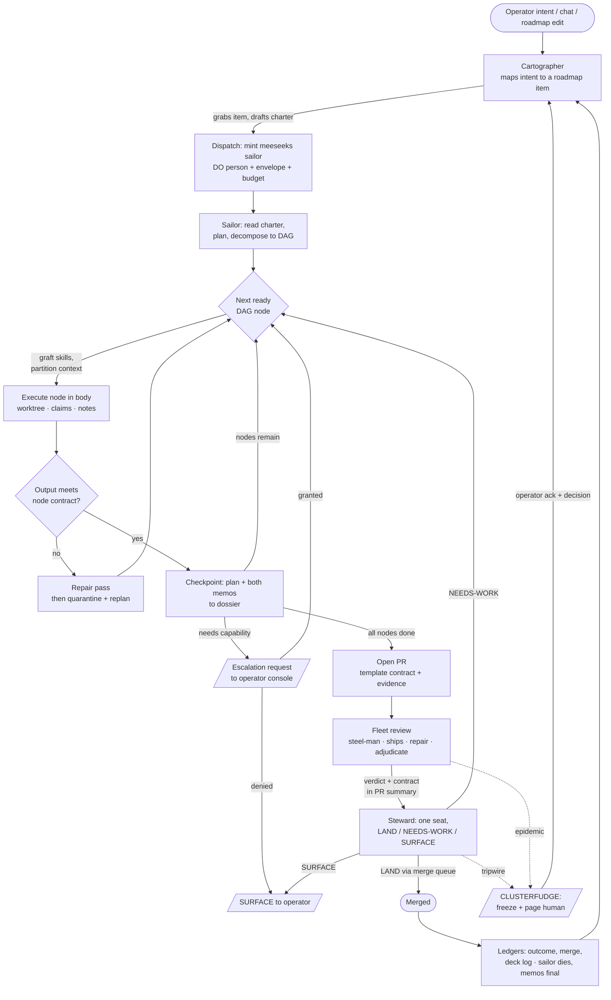

# The Full Wheel

**Port Daddy · Program Order · 2026-08-19**

The complete plan for Port Daddy's cloud agentic dev stack: a **durable Steward** who alone
decides what merges, a **Cartographer** who turns the roadmap into dispatched work,
**meeseeks sailors** — one solely-responsible agent per roadmap item — running real DAG
orchestration on Cloudflare, all of it legible and steerable from a per-repo console at
**portdaddy.dev**. Written against the repo's own canon: ADR-0109 (the Steward), the
Cartographer-as-Approver design (`docs/architecture/2026-06-03-cartographer-as-approver.md`),
the Agent Harbor technical binder (chapters 07, 10, 22), the seven whitepapers, and the
Mutual Assured Resurrection plan.

- **Shipped at time of writing:** gate integrity + repair + adjudication (#7322, #7610).
- **Status:** proposed — proof gates decide, not prose.
- **Published twin:** this document mirrors the operator-facing artifact "The Full Wheel";
  the repo copy is canonical from the moment it lands.

## Contents

1. [The captain's questions, answered](#1-the-captains-questions-answered)
2. [The cast and the authority map](#2-the-cast-and-the-authority-map)
3. [The runtime: Durable Objects in a think harness](#3-the-runtime-durable-objects-in-a-think-harness)
4. [Memory: what is durable, what dies with the job](#4-memory-what-is-durable-what-dies-with-the-job)
5. [The sanity protocol](#5-the-sanity-protocol)
6. [The meeseeks sailor lifecycle](#6-the-meeseeks-sailor-lifecycle)
7. [DAG orchestration and the transcript DAG](#7-dag-orchestration-and-the-transcript-dag)
8. [The flowchart, restored](#8-the-flowchart-restored)
9. [The clusterfudge protocol](#9-the-clusterfudge-protocol)
10. [The portdaddy.dev per-repo console](#10-the-portdaddydev-per-repo-console)
11. [Milestones, to the last step](#11-milestones-to-the-last-step)
12. [Test program, risks, and the honesty bar](#12-test-program-risks-and-the-honesty-bar)
13. [Roadmap-Spawns](#13-roadmap-spawns)

---

## 1. The captain's questions, answered

**Is there a durable agent who singly and linearly decides what gets merged? Does that person
exist? Is it Cartographer?**

Yes, and it is not Cartographer — it is the **Steward**, and the repo already ruled on this in
ADR-0109: *one fleet ship that is the sole owner of the PR lifecycle from open to merged*. The
Cartographer-as-Approver design (2026-06-03) drew the line that keeps both roles sane:
**Cartographer surfaces; the Steward ships.** Cartographer raises questions and may block; it
never merges. The Steward never raises a question; it lands. What does *not* exist yet is the
Steward as a **durable person** — today it is a cron-shaped ship contract in `pd-fleet.yml`
with no persistent body, no merge ledger, no seat. Phase 1 builds that seat. Linearity is
enforced twice: the Steward is a single-writer (one Durable Object per repo — the
Single-Writer Kernel whitepaper's rule applied to merge authority) and the merge queue
serializes what it approves. The land-to-main capability is a macaroon held by exactly one
seat, per ADR-0109 — auditable, attenuable, revocable.

**How do we run them? A Cloudflare AI agent in a think harness?**

Exactly that. Each durable role is a **Cloudflare Durable Object** (Agents SDK): the DO *is*
the identity — its storage is the role's ledgers, its alarm is the heartbeat, its inbox is the
wake queue. Model calls go through the think harness: wake → read ledgers → deliberate
(bounded) → act through typed tools (daemon, relay, GitHub App) → write ledgers → sleep. The
fleet-executor and relay Workers already live on this fabric; the DOs join them rather than
introducing a second platform.

**How does an infinitely running agent not go insane?**

By never actually running infinitely. The **identity** is permanent; the **context** never is.
Every wake is a fresh, bounded episode that reads curated ledgers — not a transcript that
grows forever. Insanity in long-lived agents is context rot: stale beliefs, self-referential
loops, goal drift. The full protocol is §5; the one-line version is *the DO holds state, never
conversation*.

**What do they write to long-term storage? What's job-specific?**

Split by one test: *would the next unrelated decision need this?* Durable: charter, merge
ledger, outcome/reputation ledger, standing operator preferences with provenance, the repo
map. Job-specific: per-PR dossiers, sortie plans, transcripts, worktrees — keyed to the item,
archived when it closes. The full table is §4.

**How do we keep tabs on such a beast?**

Total legibility or it doesn't ship (the Legible Swarm rule). Every wake writes a deck-log
entry — *ALL QUIET included*, borrowed from the officer-of-the-watch, because a silent agent
is indistinguishable from a dead one. The per-repo console (§10) renders the deck log, the
merge ledger, live budgets, the transcript DAG, and a health strip; the daemon-witnessed
attestation plane (not self-report) says whether the seat is actually alive.

**How does it decide which PRs it's going to handle?**

A published, deterministic priority function — never vibes: (1) operator direct requests;
(2) PRs one action from merge (approved + green — land them, per the standing order *"review
IS the gate"*); (3) red required checks on fleet-owned PRs; (4) review-complete PRs needing a
verdict; (5) staleness, oldest first. One PR at a time, to completion or explicit SURFACE —
that is what "linearly" means. The scoring is a pure function with unit tests, printed in
every deck-log entry so you can audit why it chose what it chose.

**When does it press pause and escalate that there's a total clusterfudge going on?**

On tripwires, not judgment calls — a panicking agent is the wrong entity to decide whether
it's panicking. §9 defines the CLUSTERFUDGE state: hard triggers (epidemic breakage,
land-fail loops, budget breach, contradictory instructions, evidence-plane divergence), an
automatic freeze of irreversible actions, one page to the operator with a decision menu, and
a human-ack gate out. The seed already shipped: the fleet's broken-ship adjudicator declares
fleet-wide faults, files one tracked issue, and pages once.

## 2. The cast and the authority map

Five durable persons, one disposable class, and the human above all of them. Every authority
is a macaroon: delegated downward, attenuated at every hop, never widened.

| Role | Kind | Owns | May never |
|---|---|---|---|
| Operator | Human | Everything; permission grants; clusterfudge acks; "ship it" on protected paths | Be bypassed |
| Steward | Durable DO, one per repo | Merge verdicts (LAND / NEEDS-WORK / SURFACE), landing, answering review bots, one background improvement when the queue is dry | Raise design questions; widen its own permissions; land over a real red |
| Cartographer | Durable DO, one per repo | The map: roadmap truth, Cartographer Questions, grabbing an item and dispatching a sailor for it | Merge anything; write code |
| Quartermaster | Daemon + Worker plane | Budgets, spawn envelopes, backend readiness, cost meters | Approve its own budget increase |
| Officer of the Watch | Durable DO, fleet-wide | Reading what nobody reads; the deck log; escalation tiers | Repair anything (reports only) |
| Fleet ships | Stateless per-run | Review verdicts, steel-man contracts, adversarial tests (now with repair + adjudication) | Merge; persist state between runs |
| Meeseeks sailor | One per roadmap item, dies with it | Its item, start to merged; its worktree; its subagent DAG | Outlive its item; touch another item's claims; exceed its envelope without a granted escalation |

The whitepapers each govern one seam: **Single-Writer Kernel** → one DO per authority;
**Legible Swarm** → every action leaves a human-readable trace; **Spawn to Person** → sailors
are registered persons with episodes, not anonymous processes; **Anchor Protocol** → identity
and capability survive process death; **Harbor Economy / Bonded Commons** → budgets and bonds
price the labor; **Federated Harbor** → the per-repo boundary that makes multi-repo tenancy
safe later.

## 3. The runtime: Durable Objects in a think harness

One platform, already ours: the GitHub App receiver, fleet-executor, and relay run on
Cloudflare today. The durable roles join them.

- **Identity & state** — one Durable Object per (repo × role):
  `steward:erichowens/port-daddy`. DO transactional storage holds the small hot ledgers; D1
  holds the append-only history (merge ledger, deck log, outcome ledger — extending the
  existing `fleet_runs`/`fleet_run_steps` fabric); R2 holds bulky artifacts (transcripts,
  dossiers, checkpoints).
- **Wakes, not loops** — events in (webhook deliveries via the existing receiver → queue →
  DO), plus a DO alarm as the heartbeat check-in. No infinite while-loop burning tokens
  between events; a role that has nothing to do costs nothing and cannot drift.
- **The think harness** — each wake: load charter + ledger heads (bounded context), deliberate
  with an explicit step budget, act only through typed tools (GitHub App, daemon HTTP, relay,
  dispatch), write results to ledgers, append the deck-log entry, sleep. Tool results are
  evidence; self-report never substitutes for a daemon-witnessed receipt (the attestation
  split-plane rule).
- **Sailors are hybrid** — the sailor's *person* (charter, episodes, checkpoints) lives in a
  DO; its *body* executes where the work needs hands: a Claude Code cloud session, the
  operator's dispatch worktree, or a Workers sandbox — spawned through `pd spawn`/dispatch so
  it is registered, budgeted, and salvageable. The DO survives every body; that asymmetry is
  what makes resume-after-days trivial (§6).
- **Model routing** — via the existing backend-preference machinery: capable models for
  verdict-grade deliberation, cheap tiers for mechanical steps, with the repair/escalation
  pattern shipped in #7610 as precedent.

## 4. Memory: what is durable, what dies with the job

The sorting test: *would the next unrelated decision need this?* Yes → durable ledger,
curated and provenance-stamped. No → job store, archived with the item. Notes remain
immutable evidence; ledgers are curated projections over them — the projection can be
rebuilt, the evidence can never be rewritten.

| Store | Contents | Written by | Lifetime |
|---|---|---|---|
| `charter` | Role mission, hard limits, escalation rules | Operator + PRs only | Permanent, versioned |
| `merge-ledger` | Every verdict: PR, decision, evidence links, who asked | Steward, append-only | Permanent |
| `deck-log` | One entry per wake, ALL QUIET included | Every durable role | Permanent, compacted after 90d |
| `outcome-ledger` | Per-agent / per-backend results: landed, reverted, salvaged — feeds reputation and routing | Steward + Quartermaster | Permanent |
| `preference-ledger` | Standing operator rulings ("review IS the gate"), each with provenance, scope, staleness date | Cartographer, from operator words only | Permanent, re-attested quarterly |
| `repo-map` | Cartographer's projection: items, states, claims, drift flags, open Questions | Cartographer | Permanent, rebuildable |
| `item dossier` | Sailor charter, plan, DAG, permission envelope + grants, checkpoints, both exit memos | The item's sailor | Item lifetime → archived to R2 |
| `transcripts` | Full turn-by-turn record of sailor + every subagent node | Harness, automatic | Item lifetime → archived, always openable |
| `worktree / branch` | The actual code in flight | Sailor bodies | Deleted only when merged AND clean |

**What is deliberately never stored:** raw conversation history as working memory. A durable
role that re-reads its own last thousand turns is how you get an agent arguing with its
former self. Episodes are summarized into ledgers at checkpoint time; the raw transcript
stays available for audit, not for the agent's own prompt.

## 5. The sanity protocol

Five mechanisms, all enforced by the harness rather than requested of the model:

1. **Episodic wakes.** Fresh bounded context per wake; the ledgers are the memory. Context
   rot cannot accumulate in a context that doesn't persist.
2. **Charter re-read + drift check.** Every wake begins by reloading the charter and ends
   with a one-line self-audit: *did anything this wake exceed the charter?* A yes is an
   automatic SURFACE, never a self-granted exception.
3. **The deck log as vital sign.** A wake that writes no entry is a failed wake. The Officer
   of the Watch reads every role's log on its own cycle — the watcher is a different mind
   than the watched.
4. **Compaction with provenance.** Ledgers are periodically compacted by a dedicated pass
   that must cite the entries it summarizes; uncited synthesis is rejected. Beliefs without
   provenance age out at their staleness date instead of calcifying into folklore.
5. **Tripwires over introspection.** The clusterfudge triggers (§9) are computed from ledger
   facts — counts, budgets, divergence — because the failure mode of an insane agent is
   precisely that it cannot tell. Externalized sanity is the only kind that survives.

## 6. The meeseeks sailor lifecycle

Existence is pain until the item lands. One sailor per roadmap item, solely responsible, born
from Cartographer's dispatch and dead the moment the Steward merges its work.

### Birth

Cartographer grabs an item (`roadmap-pop` claims the slug — its claim machinery already
exists), assembles the charter (item text, acceptance criteria, relevant map excerpts,
matched skills), and dispatches through the existing `pd dispatch` path: registered,
worktree-isolated under the scratch root, budgeted, salvageable. The sailor's DO is minted
with a **permission envelope** — the minimum macaroon set the operator pre-approved for this
repo (read, branch, push-to-own-branch, open-PR). **Start small**; everything else is an
escalation.

### Permission escalation

When the sailor needs more — a new dependency, a schema migration, an external API, touching
a protected path — it files an **escalation request**: capability asked, why, blast radius,
expiry. The request rides the existing interruptions channel and renders in the console (§10)
as an approve/deny card with the attenuation options exposed — grant once, grant for this
item, grant for this repo. Denied or expired means the sailor plans around it or SURFACEs; it
never retries the same ask in a loop.

### Work

Plan first, then DAG (§7), then execute in the worktree with the coordination rent every
agent pays: claims before edits, a note per commit, guard checks. The PR it opens carries the
full template contract, and the fleet — purser steel-man and all — reviews it like anyone
else's work. The Steward, not the sailor, decides landing.

### Checkpoints — the resurrection contract

At every checkpoint boundary (each DAG node completion, and at most every N tool-steps) the
harness — not the model's goodwill — persists to the dossier: the live plan with each node's
status, and **both exit memos in draft**: one written to its successor self (*where I am,
what I believe, what I'd do next, what I'd avoid*) and one to the operator (*what you'd want
to know if I vanished now*). Both are visible in the console at all times, not only after
death — per the Spawn to Person / Mutual Assured Resurrection doctrine.

**Pause and resume days later:** nothing special happens, and that is the design. The DO
person was never running; only bodies run. Resume = mint a fresh body, hand it the dossier
head (charter + plan + successor memo + last checkpoint), and it continues like nothing
happened — because for the person, nothing did.

**Garbage-collected mid-flight:** the body dies without ceremony — container reclaimed,
session killed, process OOMed. Handled gracefully because the contract assumed it: the last
checkpoint is at most one node stale; the memos exist in draft; the worktree is intact on
disk or salvaged by the existing salvage machinery (*no artifact means no reap*). The
Navigator's salvage sweep detects the heartbeat gap, marks the episode interrupted, and
Cartographer decides: auto-resume (default), reassign, or surface. An ungraceful death costs
at most one node of work and zero knowledge.

### Death

Item merged → the sailor finalizes both memos (now as facts, not drafts), writes its outcome
row, releases claims, and the DO archives. Its transcripts and DAG remain openable forever.
Meeseeks rule: it cannot be reassigned; a new item gets a new sailor with the old one's memo
in its briefing if Cartographer judges it kin.

## 7. DAG orchestration and the transcript DAG

Real DAG orchestration, not vibes-parallelism — the jury_rig discipline, productized per
binder chapter 22 ("multi-agent orchestration must be visible and opinionated, not a black
box"):

- **Decomposition** — the sailor's first act on a non-trivial item: decompose into typed
  nodes (research / design / implement / test / verify / synthesize) with explicit
  dependencies and per-node output contracts. Small items may be a single-node DAG; the
  structure is mandatory, the fan-out is not.
- **Context partitioning** — each node gets a budgeted context slice: its inputs are named
  upstream outputs plus targeted repo reads, never "the whole conversation". Partition
  boundaries follow the dependency cut, so no node needs what it wasn't given.
- **Skill grafting** — per node, the harness matches skills (the shipped skill-graft
  machinery, extended by seamanship's first-hop expansion) and splices them into the node
  prompt. Grafts are recorded on the node — visible in the viewer as part of the node's
  identity.
- **On-the-fly skill creation** — when a node's post-mortem says *a reusable capability would
  have made this cheaper* (pd-snipe already detects exactly this), the sailor may charter a
  skill-architect sub-node to author it — as its own PR, reviewed like any code, entering the
  catalog for every future sailor. The wheel teaches itself.
- **Output contracts enforced** — every node's output is validated against its declared
  contract before dependents run; a violation gets the repair pass (shipped in #7610), then
  quarantine + replan, never silent propagation.
- **Adversarial verification nodes** — verify/critique nodes are first-class in the graph,
  not an afterthought: findings must converge or the node escalates, the lesson of the pd-qa
  treadmill.

### The transcript DAG viewer

Every sailor renders as a live graph in the console: nodes colored by state (queued /
running / done / failed / quarantined / awaiting-permission), edges showing what fed what,
grafted skills badged on each node. Click any node → its full transcript. **Jump in**: send a
message into a running node's session, or take a node over — both recorded in the transcript
as operator turns. Data plane: the relay's transcript store extended with `node_id` /
`parent_node_id` / `dag_id` columns; the viewer builds on the fleet-run-page machinery
already rendering ship timelines.

## 8. The flowchart, restored

How a harnessed agent flows through solving a task — the loop that runs the whole wheel:

Every box is a surface you can open; every dotted edge is a page to your phone. Nothing on
this chart happens in the dark.

## 9. The clusterfudge protocol

**State: CLUSTERFUDGE — frozen pending human decision.** A per-repo circuit breaker. While
tripped: no merges, no new sailor spawns, no permission grants consumed. Read-only work
(review, mapping, checkpointing) continues. One page goes out — with a decision menu, not a
wall of logs. Only an operator ack releases it.

| Tripwire | Threshold (initial) | Page includes |
|---|---|---|
| Epidemic breakage | ≥2 ships fleet-adjudicated broken simultaneously, or 1 for >24h *(the #7610 adjudicator is the seed)* | The tracked issues; pause-ship / swap-model options |
| Land-fail loop | Same PR fails landing 3× for 3 distinct causes | The three causes; abandon / hand-to-human options |
| Budget breach | Repo daily spend >150% of cap, or any sailor >2× its envelope | Spend by agent; kill / raise-cap options |
| Contradiction | A standing preference and a live instruction conflict, or two Cartographer Questions block the same item | Both sources verbatim; pick-one buttons |
| Evidence divergence | Daemon-witnessed state disagrees with a role's ledger (attestation split) | Both records; the role is quarantined until reconciled |
| Salvage pile-up | ≥3 sailor bodies dead-without-memo in 24h | The salvage list; resume-all / triage options |

Escalation short of the full alarm uses the existing interruptions ladder (the purser's 403
page, the adjudicator's epidemic page) — single-issue asks that never freeze the repo. The
clusterfudge state is reserved for *systemic* wrongness, which is exactly when an agent must
stop trusting its own judgment.

## 10. The portdaddy.dev per-repo console

Signed in, per repo, one page with four panes — binder chapter 10's questions ("who is
working, what did they say, what needs my attention, how do I stop, steer, resume,
inspect?") answered without ever typing an ID into a terminal:

- **Roadmap** — items with real states (backlog / mapped / dispatched / in-review / landed),
  each showing its sailor, budget burn, and DAG thumbnail. Grab, edit, prioritize, or kick
  off any item from here.
- **Fleet review** — per-PR run timelines (the fleet-run-page, embedded), the broken-ship
  board with live adjudications, and the steel-man contract beside every PR.
- **Cartographer's chart** — current map, open Cartographer Questions as answerable cards,
  drift flags, the deck log.
- **The assistant** — a chat window held to the Claude/ChatGPT bar, wired to everything
  above.

### The assistant chat, corner cases included

Streaming tokens with visible, expandable tool calls; slash-commands for every console action
with typed autocomplete; threads that persist and resume across devices; optimistic sends
with retry-on-reconnect and an offline banner; interruptible generation; deep links into any
transcript node it cites; keyboard-first operation and full screen-reader labeling; mobile
layout that keeps the approve/deny cards one thumb away; explicit error states
(rate-limited, model down, permission denied) that say what to do next; and a hard rule
inherited from the fleet: the assistant reports daemon-witnessed truth, never its own
optimism.

### Every action exposed to the user

| Domain | Actions (each: button + slash-command + API) |
|---|---|
| Roadmap | create / edit / prioritize item · kick off (spawn sailor) · pause item · kill item (sailor writes memos first) |
| Sailors | open transcript DAG · jump into a node · send instruction · pause / resume · take over node · kill body (person survives) |
| Permissions | approve / deny escalation (once · item · repo) · view + revoke any live grant · edit the repo's starting envelope |
| Merges | "ship it" on protected paths · veto a pending land · re-request Steward verdict · view merge ledger |
| Fleet | re-run fleet on a PR · pause a ship · override an adjudication (declare / clear epidemic) · close a broken-ship issue |
| Budgets | set repo caps · set per-sailor envelopes · view burn by agent / model / day |
| Alarms | ack clusterfudge (with the decision) · view tripwire history · test-fire the page path |

## 11. Milestones, to the last step

Each phase lands as reviewable PRs with its own tests; each ends at a proof gate that is
demonstrated, not asserted. Nothing in a later phase is blocked on polish in an earlier one —
but no gate, no advance.

### P0 · SHIPPED — Gate integrity (2026-08-19 · #7322, #7610)

Broken-ship doctrine; in-run repair; epidemic adjudication with tracked issues and HITL
pages; steel-man contract maintained in every PR summary; purser testPaths fixed.

> **Proof gate — met.** 1,200 tests green across both Workers; the fleet run on its own fix
> PR healed, adjudicated, and narrated itself.

### P1 — The Steward takes the seat (≈2 weeks · 8 PRs)

> **STATUS 2026-08-26 — the seat is ALIVE.** PRs 1–4 merged; the seat was deployed,
> commissioned, and had never executed a single instruction. One operator `POST /wake` started
> it at 05:54:31 UTC and it immediately surveyed the repo and rendered a real verdict:
> `Wake: drained 1 event(s) [operator ×1]. Tick: NEEDS-WORK on #6419 — required checks red on
> head (tier 3)`. Both ledgers now hold that row, `degraded: false`, and the heartbeat is
> self-sustaining at 6h. What remains is PRs 5–8 below: making the first beat automatic,
> making the seat legible, and making its landing verb correct for this repo.

1. Steward DO scaffold: identity, storage schema (charter, merge-ledger, deck-log), alarm
   heartbeat, wake queue from the existing webhook receiver.
2. The tick: survey → priority function (pure, unit-tested) → one PR to completion → ledger +
   deck-log write. Verdicts LAND / NEEDS-WORK / SURFACE with evidence links.
3. Landing through the merge queue only; the land-to-main macaroon minted to this one seat;
   "ship it" gate for protected paths.
4. Clusterfudge state machine v1 (land-fail loop + budget tripwires), interruptions wiring,
   console-less fallback: the pinned Steward-log issue.
5. The pulse: a cron trigger and `/pulse` watchdog that arm the seat's first alarm and
   re-arm a lost one.

   **Why this PR exists, recorded rather than smoothed over.** PR 1's scope above says "wake
   queue from the existing webhook receiver" — the queue shipped, the receiver's dispatch did
   not, and nothing else ever posted a wake. A Durable Object alarm re-arms itself only
   *after* it has fired once, so the seat sat deployed and commissioned with its heartbeat
   never started: production `steward_deck_log` held **zero rows** across PRs 1–4. Every one
   of those PRs was green, and none of them was wrong about what it built; the gap was
   between them, in the assumption that something upstream would knock. §5.3 already names
   the remedy — the deck log is the vital sign, and *nobody read it*. The lesson is cheap and
   general: a component that cannot start itself needs an owner for its first beat, and
   "deployed" is not "alive" until the vital sign says so.

6. **The console page** (`/account/steward` in `apps/relay`): read-only render of both
   ledgers plus seat vitals, session-gated, authz'd per repo through `userCanReadRepo`.
   Read paths shared via `apps/shared/steward-ledgers.ts` so one SELECT has one definition.

   **Why this is P1 and not P4.** §10 scopes the full console — auth, per-repo shell, chat,
   actions — four weeks away. This is the 5% of it that makes the seat legible, and P1's own
   incident is the argument: the vital sign existed, held zero rows for four PRs, and reading
   it required a terminal, Cloudflare credentials and knowledge of the schema. A vital sign no
   operator can read is not a vital sign; it is a file. Shipping merge authority whose only
   audit surface is `wrangler d1 execute` reproduces the failure at a higher level.

7. **The landing verb — SHIPPED.** `landPr()` used to issue
   `PUT /repos/{owner}/{repo}/pulls/{n}/merge` with `merge_method: squash` — a *direct
   merge*. This repo lands through a required merge queue (proven: a direct merge returns
   `405 Pull Request is in the merge queue`, and the queue's `gh-readonly-queue/main/pr-*`
   branches are in the Actions history), so an armed seat would have been rejected or, worse,
   would have bypassed the protection it exists to obey. It now calls GraphQL
   `enqueuePullRequest`, verified against GitHub's published schema rather than recalled.

   Two properties came out of reading that schema. **`expectedHeadOid` is passed always**,
   though the API marks it optional: the tick judges a specific head, and between verdict and
   enqueue the author can push — the guard makes GitHub refuse a commit the seat never
   reviewed, turning a race into a logged failure. And **a LAND verdict now means "accepted
   into the queue", not "merged"**; the queue lands it later on its own clock, and the deck
   log says so rather than implying the PR is already on main.

8. **Episodic wakes — SHIPPED.** The other half of PR 1's unbuilt assumption, now built: the
   relay's webhook receiver POSTs `/wake` on the eight events that can change a merge verdict,
   so the seat reacts in seconds rather than at heartbeat cadence. Dedupe was already at the
   door (`deliveryId`), and the seat's 5s drain debounce collapses a burst into one tick.

   **The wiring is a cross-script Durable Object binding, not an HTTPS call, and that is the
   whole design.** The obvious version — `fetch('https://pd-steward.../wake')` with a bearer —
   requires `STEWARD_ADMIN_TOKEN`, the same credential that authorizes `/ship-it`, `/charter`
   and `/clusterfudge/ack`. Giving the relay full merge authority so it can say "something
   happened" is a bad trade, and minting a narrower second token only moves a secret into a
   second Worker to guard a boundary that does not exist: a DO namespace is not publicly
   addressable, so `{ name = "STEWARD", class_name = "StewardDO", script_name = "pd-steward" }`
   reaches the seat *inside* the trust boundary with no credential at all. Identical argument
   to PR 5's cron — `fetch` authenticates the outside world, and this is not the outside world.

   Two consequences worth stating. **The filter is an allow-list of eight events**, and its
   exclusions carry as much weight as its inclusions: no `check_run` (≈28 per push here versus
   a handful of suites, collapsing to the same single tick), no `edited`/`labeled`/`assigned`
   (description churn cannot change a verdict, and a deck log full of noise is a vital sign
   nobody reads). **And the seat is an accelerant, never a dependency** — every failure path
   is absorbed into a `steward_wake_failed` audit row and a 204, because a 503 here would make
   GitHub retry a delivery whose fleet enqueue already succeeded, turning a lost wake into
   duplicate spend. A dropped wake costs latency until the next 6h beat; nothing more.

#### How the seat is actually used

Recorded here because a capability nobody knows how to reach is the read-poverty
failure wearing a different hat. Two audiences, two surfaces, deliberately not the same one.

**An operator, in a browser.** `https://relay.portdaddy.dev/account/steward` — session-gated by
the existing GitHub login, authz'd per repo through `userCanReadRepo`. It answers the three
questions chapter 10 says come first, in order: is this seat alive (a badge: beating / stopped
beating / never woken), what has it done lately (the deck log, newest first), and why did it
decide that (the merge ledger, every verdict with its evidence). No terminal, no credential, no
schema knowledge. This is the surface that did not exist for the four PRs when the seat was dead
and nobody could tell.

**An agent or an operator with `curl`,** against `https://<steward-worker>/steward/{owner}/{repo}/<action>`,
bearer `STEWARD_ADMIN_TOKEN` on every route:

| Verb | Route | What it is for |
|---|---|---|
| `GET` | `/status` | The whole seat in one response: `commissioned`, `pendingWakes`, `lastWakeAt`, `alarmAt`, `degraded`, `landing: armed\|unarmed`, `shipItGrants`, the breaker, the rendered clusterfudge page, and the tripwire inventory. `alarmAt: null` is the signature of a stopped pulse. |
| `POST` | `/charter` | Commission the seat, or amend its charter. Until this runs every route answers 503. |
| `POST` | `/wake` | Hand it a stimulus. Body `{kind, deliveryId, prNumber?, detail?}`; deduped on `deliveryId`. This is what the relay's webhook now calls on its own (PR 8) — an operator calls it to force a tick *now*. |
| `POST` | `/pulse` | Arm a cold seat's first alarm, or re-arm a lost one. A no-op on a healthy seat, which is why the cron can run hourly against a 6h heartbeat. |
| `POST` | `/ship-it/{prNumber}` | Grant this one PR permission to land despite touching a protected path. Per-PR, never standing. |
| `POST` | `/clusterfudge/ack` | Release a freeze. Body `{ackedBy, decision}` — both recorded, because a freeze released by nobody in particular is not a decision. |

**Nothing else may write.** ADR-0109's single-writer rule means the seat alone appends to
`steward_deck_log` and `steward_merge_ledger`; every other reader — the console page, the
`/status` route, an operator with `wrangler d1 execute` — goes through
`apps/shared/steward-ledgers.ts`, which is read-only by construction.

> **Proof gate.** Seven days unattended on this repo: every open PR reaches merged or an
> explicit SURFACE with a reason; zero un-charted merges; deck log complete for every wake;
> one injected land-fail loop trips the freeze and pages.
>
> **Deployment state, measured 2026-08-26 via the Cloudflare API** (`workers/scripts/pd-steward/versions`).
> The live seat is **version 9, uploaded 2026-08-23 10:39 UTC by `wrangler` from a workstation
> — not by CI**; `deploy-steward.yml` has never produced the running build. Its declared
> handlers are `["fetch"]` alone and its cron schedule list is empty, so PR 5's `scheduled`
> handler is genuinely not live yet: the single deck-log row is the operator's manual wake and
> nothing else could have written one. Bindings are `DB`, `STEWARD`, `STEWARD_ADMIN_TOKEN`,
> `STEWARD_GITHUB_TOKEN` — no `STEWARD_LAND_TOKEN`, which is why `/status` reports
> `landing: unarmed`. That version postdates PR 4 by three days, so `recentDeckLog` and
> `clusterfudgePage` *are* in the running bundle; the `null null` a live `/status` returned for
> them is not a version skew and is most consistent with the request having lost its bearer
> (an `{"error":"unauthorized"}` body yields exactly two nulls under that `jq` filter).
>
> **Verification still owed before the gate can start:** confirm the cron fires by finding an
> `all-quiet` entry written with no operator wake — impossible until a deploy carries the
> `scheduled` handler, which the version metadata above now gives us a direct way to check
> (`handlers` gains `"scheduled"`, `schedules` stops being empty).

### P2 — Cartographer dispatches; sailors are born (≈3 weeks · 5 PRs)

1. Cartographer DO: event-driven detectors + `cartographer_questions` (the 2026-06-03
   design, built as specced — its 5-PR migration is this phase's spine).
2. Item-grab → charter assembly → dispatch integration: `pd dispatch` minting a sailor DO
   person bound to the run.
3. Permission envelopes + escalation API: macaroon attenuation, request/grant/revoke
   records, expiry.
4. Checkpoint contract in the harness: plan + dual memos persisted per node boundary,
   enforced not requested.
5. Salvage integration: heartbeat-gap detection → interrupted episode → auto-resume default.

> **Proof gate.** One real roadmap item goes intent → Cartographer → sailor → PR → fleet →
> Steward → merged with zero human terminal commands; mid-run, the sailor's body is
> force-killed and a resumed body finishes from the last checkpoint; an escalation is
> requested, granted from the (interim) issue card, and consumed.

### P3 — The transcript DAG, visible and enterable (≈2 weeks · 3 PRs)

1. Transcript schema grows node/DAG identity; harness tags every subagent turn.
2. Viewer on the relay (fleet-run-page lineage): live graph, node states, graft badges,
   click-through transcripts.
3. Jump-in: message-into-node and takeover, both recorded as operator turns.

> **Proof gate.** Open a live sailor's DAG, watch a node flip states in real time, jump into
> it, redirect it, and see the redirection in the transcript and the final PR.

### P4 — The console at portdaddy.dev (≈4 weeks · 6 PRs)

1. Auth + per-repo shell (existing account/billing plumbing on the relay).
2. Roadmap pane; Fleet pane (embed + broken-ship board); Chart pane (Questions as cards,
   deck log).
3. Permission cards + budget controls + alarm surface — every action in the §10 table, each
   with button, slash-command, and API form.
4. The assistant chat, built to the corner-case list in §10 and E2E-tested against it.
5. Mobile + accessibility pass; visual artifacts per the repo's own UI-diff law.

> **Proof gate.** A full P2-style item run end-to-end from a phone: kicked off, escalation
> approved, DAG watched, "ship it" granted — browser only. Playwright suite covers every
> exposed action in both themes.

### P5 — Full DAG orchestration (≈3 weeks · 4 PRs)

1. Decomposition + node output contracts in the sailor harness; enforcement + repair +
   quarantine/replan.
2. Context partitioning per the dependency cut; per-node budgets.
3. Skill grafting per node (seamanship selector); graft records in the viewer.
4. On-the-fly skill creation: snipe-triggered skill-architect sub-nodes producing catalog
   PRs.

> **Proof gate.** A deliberately over-sized item completes only via decomposition; one
> node's contract violation visibly repairs-or-quarantines; one run authors a new skill that
> a later run grafts.

### P6 — Hardening: the wheel holds (≈2 weeks + standing)

1. Chaos drills: kill DOs mid-wake, drop webhooks, poison a ledger entry — every drill must
   end in a tripped tripwire or a clean recovery, never silence.
2. Cost governance: outcome-ledger-driven model routing; monthly spend report in the
   console.
3. Second-repo tenancy behind the Federated Harbor boundary; consent flags per tenant.
4. Canon reconciliation: whitepapers, binder chapters 07/10/22, and ADR-0109 updated to
   describe what now exists; drift becomes a Lookout finding.

> **Proof gate — the definition of perfectly finished.**
>
> - [ ] 30 consecutive days: every merge to this repo decided by the Steward or an explicit
>   human override, all ledgered.
> - [ ] ≥10 roadmap items shipped intent-to-merged with no human terminal use.
> - [ ] Every sailor death in the period left both memos; zero knowledge-loss salvage
>   events.
> - [ ] Every clusterfudge drill paged within 60s and froze correctly; zero false-quiet
>   incidents.
> - [ ] The console answers all eight binder-ch.10 questions for a cold visitor in under a
>   minute — user-tested, not asserted.
> - [ ] A second repo onboards using only the console and public docs.

## 12. Test program, risks, and the honesty bar

### Standing test program

- **Contract tests per seam** — priority function, verdict aggregation (extending the
  #7322/#7610 suites), checkpoint round-trip, macaroon attenuation, memo generation, DAG
  contract enforcement: pure units, no network.
- **Pipeline tests** — the harness-fake pattern proven in the fleet-executor suite (aiStub,
  memoryD1, GitHub fake) extended with DO fakes: every phase's flows exercised end-to-end in
  vitest before any deploy.
- **Live-fire drills, scheduled** — GC-kill during a run, forced epidemic, forced land-fail
  loop, escalation grant/deny — run monthly against the real stack on this repo, results in
  the deck log.
- **UI E2E** — Playwright over every exposed action, both themes, mobile viewport,
  screen-reader tree snapshots.

### Risks, named

- **Steward capture** — one seat means one seat to corrupt. Mitigation: the seat holds a
  macaroon, not root; the ledger is append-only; the operator veto is structural.
- **Cheap-model flake at scale** — the 2026-08-19 incident, permanently. Mitigation: repair +
  adjudication (shipped), outcome-ledger routing (P6), and the tripwires.
- **Ledger folklore** — compaction inventing beliefs. Mitigation: citation-required
  compaction, staleness dates, quarterly re-attestation.
- **Console scope creep** — P4 is the phase most likely to eat the program. Mitigation: the
  §10 action table is the whole scope; anything else is a roadmap item for a sailor.

### The honesty bar

Inherited from the 2026-08-19 incident and non-negotiable: no Potemkin features — a pane
ships live or labeled *needs-your-hands*, never faked; every "done" carries evidence a
stranger can check; broken machinery goes red and gets adjudicated, never shrugged; and the
chronology of what a thing should be — steel-man, charter, memo — always lives on the
artifact itself, maintained by an agent, where the next reader will actually look.

## 13. Roadmap-Spawns

One slug per phase; Cartographer promotes each to a roadmap item and, once P2 lands, each
item gets its meeseeks sailor. Until then, the slugs are the handles operators and agents use
in `Roadmap-Item:` trailers and `pd roadmap touch`.

| Slug | Phase | First PR |
|---|---|---|
| `steward-takes-the-seat` | P1 — The Steward takes the seat | Steward DO scaffold (`apps/steward`) |
| `cartographer-dispatches-sailors` | P2 — Cartographer dispatches; sailors are born | Cartographer DO + detectors |
| `transcript-dag-viewer` | P3 — The transcript DAG, visible and enterable | Transcript schema node/DAG identity |
| `portdaddy-console` | P4 — The console at portdaddy.dev | Auth + per-repo shell |
| `full-dag-orchestration` | P5 — Full DAG orchestration | Decomposition + node output contracts |
| `hardening-the-wheel-holds` | P6 — Hardening: the wheel holds | Chaos drill harness |
