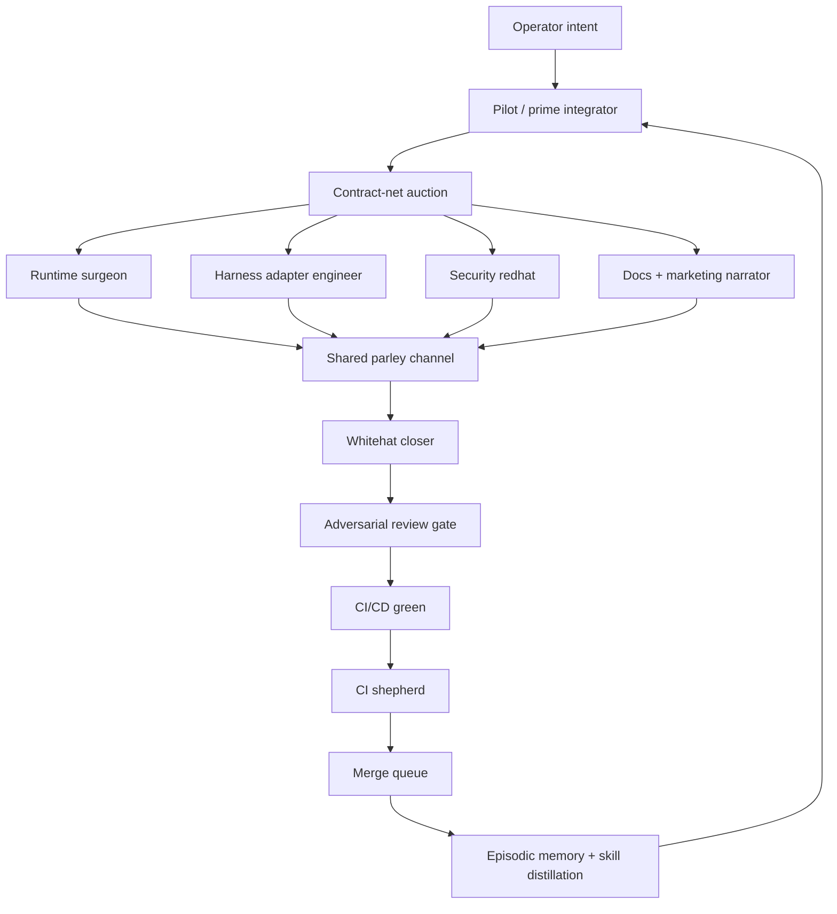
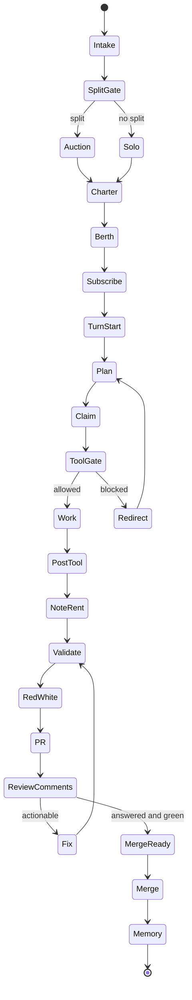

# Articles of Agreement Harness Roadmap

Status: draft execution plan, 2026-06-27

Related roads:

- ADR-0051, `docs/adr/0051-port-daddy-harness.md`: the hook binding for the eight harness capabilities.
- ADR-0039, `docs/adr/0039-suggestibility-layer.md`: topical coaching, group-chat proposals, prior-art surfacing.
- ADR-0050, Coast Guard: OS sandboxing, secret scrubbing, compulsion rent.
- ADR-0037, git access control: destructive-git refusals and corrective alternatives.
- ADR-0047, conversation protocol: FIPA-ish parley envelope and termination.
- `website-v2/src/pages/HarnessPage.tsx`: current marketing surface for the harness.
- `whitepaper/research/program/archive/north-star/strategy/dossier-landscape.md`: competitive landscape and the "neutral local coordination layer" thesis.

This document should not replace those roads. It is the route plan that ties
them together into one agent operating harness.

## Current Answer

Port Daddy can make many model backends act under one contract harness, but the
contract binds to the **agent runtime**, not directly to the model weights.

That distinction matters:

- Claude Code with Claude as the backend is the most natural path. Claude Code
  exposes official hook events, settings, MCP, skills, subagents, and model
  configuration, so the Articles can be enforced around the actual tool loop.
- Claude Code with another backend is plausible through an Anthropic Messages
  compatible gateway. Official Claude Code docs describe routing requests with
  `ANTHROPIC_BASE_URL` and credentials, and note that model selection is
  configured separately from the base URL.
- Codex behind Claude Code is plausible through `pd squid bridge`, but it is an
  unofficial compatibility layer. Claude-shaped orchestration is in front;
  `codex exec` is behind it. The bridge must keep provenance honest.
- Ollama, Gemma, Llama, Qwen, DeepSeek, and GPT-style backends are feasible when
  they are served behind an Anthropic-compatible gateway or adapter with good
  tool calling. vLLM documents this exact pattern for Claude Code and notes that
  the model needs strong tool calling support.
- Cloudflare Agents are not just "another model." They are a remote durable
  agent runtime with state, routing, WebSockets, scheduling, observability, MCP,
  and Workflows. They should be a Port Daddy remote harbor, not merely a local
  model provider.

Hard enforcement follows the runtime:

| Runtime | Model backends | Hard hooks today | Port Daddy stance |
|---|---|---:|---|
| Claude Code | Claude, Anthropic gateway, Bedrock, Vertex, Foundry, Anthropic-compatible custom backends | yes, verified for Claude path | Prime harness target |
| Claude Code + `pd squid bridge` | Codex CLI auth, OpenAI/Codex models | partial bridge verified; hook hardening still Claude runtime | Unofficial but useful compatibility lane |
| Codex CLI native | OpenAI/Codex models | mapped, not fully verified here | Validate hook parity before promising |
| Gemini CLI native | Gemini models | mapped, not fully verified here | Validate hook parity before promising |
| vLLM gateway | open-weight tool-call models | Claude Code hooks if client is Claude Code | Good local/open-weight lane |
| Ollama gateway | Gemma/Llama/Qwen/etc | adapter-dependent | Needs tool-call and streaming conformance tests |
| Cloudflare Agents | Workers AI, Anthropic, OpenAI, Google, Mistral, others | Cloudflare runtime controls, not local CLI hooks | Remote durable harbor plus relay bridge |

Claude Pro/Max/Team subscription nuance: Claude Code docs say a gateway
credential or API key replaces subscription usage for that session. Setting only
`ANTHROPIC_BASE_URL` can still use a saved Claude login if the gateway supports
the required OAuth forwarding, but `pd squid bridge` deliberately sets a local
auth token to protect its localhost endpoint, so it is not an official
"use Claude subscription to pay another backend" mode.

## When To Split Work Into Many Agents

Split when the coordination benefit beats the context and merge overhead.

Use one agent when:

- One invariant dominates the whole change.
- The work touches one hot file or one fragile migration.
- The next correct step depends on the previous step's exact result.
- The problem is mostly taste, product judgment, or debugging one live process.
- The validation cycle is short enough that parallelism only creates churn.

Use many agents when at least three are true:

- The work decomposes into independent artifacts with clear acceptance tests.
- Context is too large for one model to keep without losing sharpness.
- Different skills are genuinely needed: runtime triage, docs, UX, security,
  CI, test design, research, release management.
- The blast radius can be isolated by worktree, route, module, symbol, or doc.
- Multiple candidate approaches need fast red/white exploration.
- The merge surface is narrow and can be judged by a single integrator.
- A contract-net bid can identify a better specialist than the prime agent.

Never split merely because "more agents feels more agentic." Every split pays:
worktree setup, briefing, claims, channel noise, duplicate research, and merge
review. Resource-bounded planning means the pilot should ask: what decision or
artifact becomes better because another agent exists?

## Agent Topology

Use a hypertree, not a flat swarm:



Roles:

- Pilot: owns the user goal, split/no-split decision, final integration, and PR
  body truth. Never delegates accountability.
- Contract-net auctioneer: creates work packages, asks for bids, scores them by
  skill fit, risk, cost, and available context.
- Specialists: own bounded surfaces and report in artifacts, not vibes.
- Redhat: breaks the plan, smells the risks, writes precise failing probes.
- Whitehat: closes or contests redhat findings with tests and evidence.
- CI shepherd: reads bot comments, logs, and review threads; turns them into
  commits or explicit deferrals.
- Memory distiller: converts high-signal failures and wins into episodic memory
  entries, skill patches, and roadmap items.

## Work Package Shape

Every subagent receives a packet, not a wish:

```yaml
work_package:
  goal: one outcome that can be tested
  scope:
    files_or_symbols: []
    forbidden_surfaces: []
  context_budget:
    must_read: []
    may_read: []
    do_not_read: []
  skills:
    required: []
    optional: []
  contract:
    claims_required: true
    worktree_required: true
    note_before_edit: true
    max_spend_usd: 5
    max_wall_time_minutes: 90
  deliverables:
    artifact_paths: []
    validation_commands: []
    pr_comment_summary: true
  stop_conditions:
    - invariant_conflict
    - red_ci_without_path_to_fix
    - claim_conflict_with_active_agent
```

This is the practical merge of agent-context partitioning and Contract Net:
the pilot advertises a packet, specialists bid with capability and risk, the
pilot awards the packet, and the harness enforces the packet.

## Articles Of Agreement State Machine



State contracts:

- Intake: `pd attention`, `pd status`, `pd briefing`, salvage, live daemon
  truth, current PR list.
- SplitGate: decide solo vs many; if many, publish the package to a parley
  channel and run a contract-net bid.
- Charter: write the work package and the Articles: budget, scope, claims,
  sandbox, validation, handoff rules.
- Berth: linked git worktree plus Coast Guard sandbox. Apple `container` is a
  candidate macOS 26 Apple Silicon VM/OCI lane for stronger isolation when the
  agent does not need the operator's live GUI or keychain.
- Subscribe: auto-subscribe agent to project channel, own inbox, package
  channel, PR channel, CI verdict channel.
- TurnStart: inject attention digest, nearby claims, conflict predictions,
  similar-agent hints, recent landed diffs, and relevant prior art.
- ToolGate: block destructive Bash, secret reads, main-worktree edits, budget
  violations, and claim conflicts. Redirect with a safe action.
- PostTool: append file heat, pheromones, telemetry, transcript event, and
  changed-surface hints.
- NoteRent: require a concrete note before commit; every commit pays rent.
- RedWhite: at least one redhat and one whitehat pass per risky slice; three
  rounds for bridges, auth, sandboxes, and launchers.
- PR: draft PR body with real summary, test plan, roadmap trailer, and visual
  artifacts for UI surfaces.
- ReviewComments: answer every bot/human thread as fixed, deferred with a
  destination, or contested with evidence.
- Memory: post-process transcripts into episodic memory, lessons, skill
  updates, and roadmap items.

## Suggestibility Layer

Inject only what changes the next decision. Flooding context is a harness bug.

Turn-start envelope, sorted by actionability:

1. Blocking facts: daemon unhealthy, stale cache, active lock conflict, budget
   cap, missing session, forbidden worktree.
2. Nearby agents: same topic, overlapping files, same PR, same failing check.
3. Recent diffs: last merged changes touching the same symbols.
4. Prior art: ADRs, skills, recovery notes, whitepapers, examples.
5. Invitations: parley turn, bid request, review request.
6. Memory hints: "we failed this before because X."

Pre-tool gate:

- Enforce: destructive command, protected branch push, main-worktree edit,
  secret read, over-budget expensive tool, hard file lock.
- Warn: soft claim, stale daemon, high semantic conflict probability, missing
  note, unclaimed risky file.
- Redirect: name the safe command or workflow. Never just say "no."

Post-tool and post-batch:

- Record transcript event, tool args summary, result class, changed files,
  duration, cost estimate, sandbox decision, and whether the tool moved the
  task closer to done.
- Feed file heat and semantic conflict prediction.
- If the agent touched a new surface, suggest a claim/note immediately.

Stop:

- Require validation evidence or a precise blocker.
- Offer skill creation when the agent learned a reusable procedure that was not
  already represented in a skill.

## Logging And Episodic Memory

The harness should emit append-only events that can be reduced into memory:

```typescript
type HarnessEvent =
  | { kind: 'turn.start'; sessionId: string; injectedFacts: string[]; stale?: boolean }
  | { kind: 'tool.pre'; tool: string; decision: 'allow' | 'warn' | 'deny'; reasons: string[] }
  | { kind: 'tool.post'; tool: string; result: 'ok' | 'error'; files: string[]; durationMs: number }
  | { kind: 'claim'; path: string; symbolPath?: string; action: 'add' | 'release' }
  | { kind: 'parley'; conversationId: string; performative: string; turn?: string }
  | { kind: 'ci'; branch: string; check: string; status: string; url?: string }
  | { kind: 'review'; pr: number; actor: string; verdict: string; findingIds: string[] }
  | { kind: 'memory.candidate'; trigger: string; transcriptRefs: string[] }
```

Post-processing pipeline:

1. Redact secrets, auth tokens, private user text, and model-private thinking.
2. Segment by episode: goal, plan, tools, blockers, validation, outcome.
3. Extract decision points and cues using cognitive task analysis: what did the
   agent notice, what options did it consider, what ruled options out?
4. Score the episode: conflict avoided, conflict caused, tests added, CI
   result, review findings, time to green, cost, revert risk.
5. Emit three artifacts:
   - `episodic_memory` row for retrieval.
   - skill-candidate note when a procedure repeats or a failure mode is novel.
   - simulation fixture when the episode can become a benchmark problem.

Skill creation trigger:

- Same failure recurs twice across agents.
- A redhat smell needs a repeatable probe.
- A specialist invents a useful checklist or decision table.
- A tool integration has non-obvious setup or teardown.
- A successful rescue depended on a subtle live-runtime distinction.

Do not create a skill for one-off facts, stale local commands, or instructions
that belong in `AGENTS.md`, an ADR, or operator docs.

## Sandboxes And Berths

Sandbox ladder:

1. Linked git worktree: default for all code work.
2. Coast Guard sandbox: default process boundary for spawned commands.
3. Per-agent env scrub: managed secrets removed unless explicitly leased.
4. Apple `container`: candidate high-isolation lane on Apple Silicon macOS 26,
   using OCI images as lightweight VMs. Best for tool-heavy agents that can work
   headless and do not need host GUI/keychain access.
5. Linux bwrap/Landlock: equivalent for Linux runners.
6. Cloudflare Agent: remote durable lane for long-lived cloud responsibilities,
   webhook fan-in, scheduled tasks, and global relay participation.

Berth contract:

- One worktree, one branch, one session id, one budget, one channel.
- Explicit project root and daemon URL.
- A lease for every scarce resource: port, file region, credential, cloud
  environment, PR number.
- Salvage recipe: how to find the worktree, branch, notes, logs, and pending
  claims if the agent dies.

## MCP And Tools

MCP is the response path, not the whole harness.

Use hooks for:

- Attention delivery.
- Pre-tool vetoes.
- File heat and telemetry.
- Worktree redirects.
- Budget and rent gates.

Use MCP tools for:

- Notes, claims, locks, tuples, tube messages.
- Accepting/declining suggestions.
- Creating parleys and replying with performatives.
- Reading swarm awareness and coordination preflight.
- Spawning agents through Port Daddy.

Expose the Articles through MCP as a compact tool group:

- `pd_contract_preflight(package)`
- `pd_contract_bid(package)`
- `pd_contract_accept(packageId)`
- `pd_contract_checkpoint(status)`
- `pd_contract_review(verdict)`
- `pd_contract_memory_candidate(refs)`

## Cloud And GitHub Agents

Cloudflare Agents should integrate as remote actors:

- Each Cloudflare Agent gets a Harbor Card identity and a project/channel
  subscription.
- Its durable state mirrors a Port Daddy session id and capability lease.
- Workflows provide retry/checkpoint semantics for long-running cloud tasks.
- Relay carries events back to local Port Daddy: PR opened, CI red, approval
  needed, budget threshold, task complete.
- Local Port Daddy remains the coordination authority for this machine's repo
  state, file claims, and operator UX.

GitHub-native or cloud agents should never push directly to main. They open PRs,
attach evidence, answer review comments, and wait for the same adversarial gate
as local agents.

## Simulation Program

Topologies to compare:

- Prime and dupes: one pilot forks many near-identical workers with different
  context packets.
- Heterogeneous guild: specialists with distinct skills and tools.
- Stigmergic field: agents coordinate mostly via notes, file heat, claims, and
  pheromones, little direct chat.
- Contract-net market: packages are advertised, agents bid, pilot awards.
- Wave-by-wave parley: brainstorming, criticism, synthesis, and converged plan.

Benchmark problems:

- Contended file edit with overlapping symbol claims.
- Flapping daemon plus stale source truth.
- PR with three bot comments, one false positive, one real bug, one missing
  test.
- UI change requiring screenshots/GIF and review body artifacts.
- Backend bridge with tool-loop and streaming parity.
- Cloud webhook that must become a local PR action without leaking secrets.
- Skill drift: broken metadata and a stale runtime claim.

Scoring:

- Time to first correct diagnosis.
- Time to green CI.
- Number of conflicts created vs avoided.
- Review findings per KLOC, and whether high-confidence findings were fixed.
- Cost per accepted artifact.
- Human interventions needed.
- Notes/claims completeness.
- Memory usefulness on next retrieval.
- Merge quality: no revert within seven days.

Data for QLoRA or other fine-tuning should be curated only after redaction and
outcome scoring. Keep positive and negative examples: the model needs to learn
what bad coordination looks like, not only polished final transcripts.

## Roadmap

Phase 0: stabilize the harness floor.

- Ship the fleet boot fix: scheduled ships arm on start; `run_on_start` is
  explicit.
- Keep `PORT_DADDY_NO_FLEET=1` as a temporary live mitigation until the fixed
  daemon is promoted.
- Reconcile dangling ADR-0091 references to ADR-0051.
- Update `/harness` copy to mention Claude native, Codex bridge, vLLM/open-weight
  lane, and Cloudflare remote harbor.

Phase 1: make Claude Code Prime fully enforceable.

- Widen PreToolUse matcher to `Bash`.
- Port ADR-0037 destructive-command deny-list into the tentacle.
- Add worktree redirect gate.
- Add turn-start suggestibility envelope sourced from `pd attention` plus claim
  and CI projections.
- Add tests with synthetic hook payloads.

Phase 2: prove the bridge contract.

- Keep `/v1/messages`, streaming, token-count, model alias, thinking, and
  tool-loop tests green.
- Add router fixtures for vLLM-style Anthropic compatibility and Ollama/Gemma
  via adapter.
- Add transcript/provenance snapshots for Codex, Claude, and local model lanes.
- Run redhat/whitehat on auth, tool provenance, body limits, session metadata,
  and resumed-session semantics.

Phase 3: Port Daddy contract-net dispatch.

- Implement bid packets and `pd contract bid/award`.
- Package worktree, claims, budget, required skills, and validation in the
  awarded berth.
- Emit a shared parley channel for every multi-agent campaign.
- Add dashboard/FleetBar surface for "why did the pilot split this work?"

Phase 4: memory and skill distillation.

- Append hook/tool/review/CI events into transcript storage.
- Add episode reducer and skill-candidate queue.
- Teach Cartographer/Lookout to promote repeated lessons into skills or docs.
- Add simulation fixtures from real failure episodes.

Phase 5: remote harbors.

- Cloudflare Agents as durable actors with Relay.
- Apple `container` sandbox lane for headless local agents on macOS 26.
- GitHub PR shepherding bot that uses the same Articles: notes, evidence,
  comment replies, adversarial verdict, CI green.

## Existing PRs To Shepherd

- #556: session coordination hardening. Likely fixes `pd begin`/resolver hang.
  Needs roadmap slug repair and integration-test triage before merge.
- #607: doctor health severity. Useful detection for flapping daemons, not the
  boot-storm fix. Needs Fleet QA comments addressed.
- #569: backend spawning for Claude Code/Codex/Gemini-ish paths. Useful for
  harness breadth, but not the daemon issue.
- #545: ADR-0091 Giant Squid Harness. Reconcile with ADR-0051 rather than
  inventing another harness doctrine.
- #462: per-agent stream. Relevant to transcript/event projection and memory.
- #322: Fleet Tender/Shipwright/suggestibility data layer. Relevant to
  suggestibility and long-lived responsibility avatars.

The immediate merge sequence should be: land the daemon boot fix, then rebase
and shepherd #556/#607/#569 according to dependency and CI health. Do not merge
detect-only PRs as a substitute for the runtime fix.

## Marketing Site Spec

Extend `/harness` with one new section: "Same Articles, many brains."

Examples to show:

- Claude Code native: full hook enforcement and MCP response path.
- Claude Code through `pd squid bridge`: Claude-shaped client, Codex backend,
  provenance object showing `backend_model`.
- vLLM/Open-weight: Anthropic-compatible gateway with tool-calling model.
- Ollama/Gemma: adapter lane, marked experimental until tool-loop tests pass.
- Cloudflare Agent: remote durable actor, relay-backed, PR shepherd duties.

Figures:

- Contract topology: agent runtime, hook layer, MCP response path, daemon truth,
  model backend.
- Backend matrix: Claude, Codex, vLLM, Ollama/Gemma, Cloudflare.
- State machine: Articles from intake to memory.
- PR that reviews itself: redhat, whitehat, CI, bot comments, merge gate.

Dark-mode variants should be either real image pairs or CSS-colored SVG
diagrams with semantic tokens. Avoid abstract hero art; every figure should show
a real operational path and name the systems involved.

## Sources Checked 2026-06-27

- Claude Code LLM gateway docs: `ANTHROPIC_BASE_URL` routes API traffic through
  a gateway, model selection remains separate, and gateway credentials replace
  subscription usage for that session.
- Claude Code environment variables docs: `ANTHROPIC_AUTH_TOKEN`,
  `ANTHROPIC_MODEL`, default tier model variables, effort, and settings env.
- Claude Code hooks docs: hook events include `UserPromptSubmit`, `PreToolUse`,
  `PostToolUse`, `SessionStart`, subagent events, and worktree events; PreToolUse
  can block Bash with a deny decision.
- vLLM Claude Code integration docs: serving an Anthropic Messages-compatible
  endpoint lets Claude Code use open-weight models that support tool calling.
- Apple `container`: macOS 26 Apple Silicon tool for OCI-compatible Linux
  containers as lightweight VMs.
- Cloudflare Agents docs: Agents SDK runtime has durable identity, state,
  sessions, routing, WebSockets, scheduling, observability, MCP tools, and
  Workflows integration.
