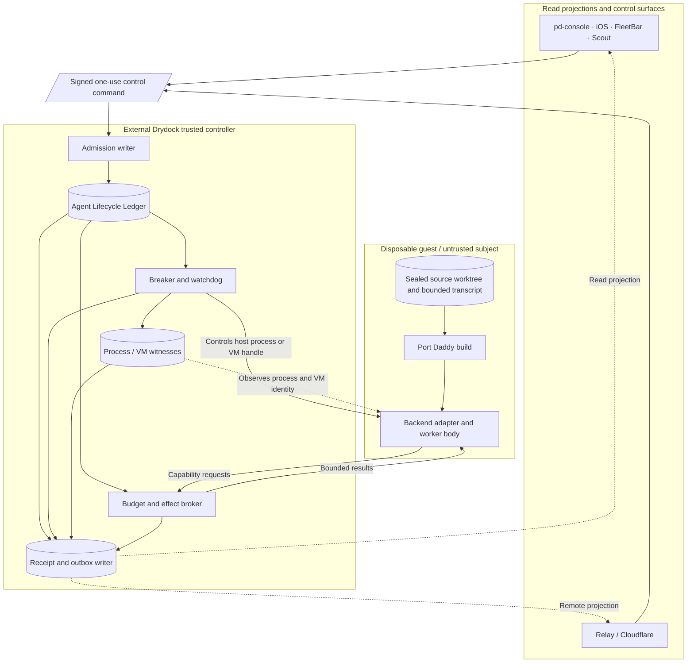
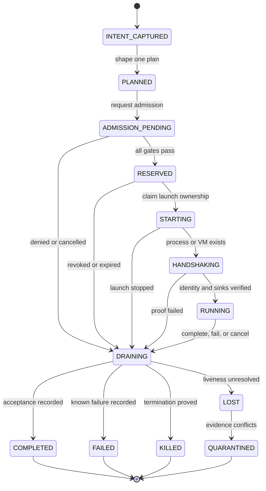

# Drydock Agent Lifecycle and Operator Control

> One durable worker identity, replaceable execution bodies, globally conserved
> authority, and an operator-visible stop path outside the system being controlled.

**Status:** PROPOSED / STATIC DESIGN ONLY / PORT DADDY REMAINS HALTED

**Parent roadmap:** `port-daddy-unified-product-hypertree`

**Companions:**

- [Drydock: Controlled Port Daddy Execution and Agent Simulation](./drydock-controlled-agent-simulation.md)
- [Drydock Resurrection, Capacity, and Context Control](./drydock-resurrection-capacity-and-context-control.md)
- [Drydock execution hypertree](./drydock-resurrection-hypertree.json)
- [Drydock operator journey storyboard](../design/drydock-operator-journeys/index.html)
- [The Grand Harbor Atlas](./grand-harbor-product-atlas.md)
- [ADR-0093: Event Spawn Trust Substrate](../adr/0093-event-spawn-trust-substrate.md)
- [ADR-0121: Durable Agent Roster](../adr/0121-durable-agent-roster.md)

**Prepared:** 2026-09-08

**Source snapshot:** `curiositech/port-daddy@ea797e6244ca5153bcf0faed926a53ac306d5b26`

**Execution note:** This design was produced from inert source, ADR, and official
platform-documentation inspection. No Port Daddy CLI, daemon, Fleet process,
agent backend, pd-console, FleetBar, hook, repository test, or provider operation
was launched.

---

## 0. The decision

Port Daddy needs one closed lifecycle system between an operator saying “start
work” and every possible terminal outcome of that work. Today, useful parts of
that system exist in separate modules and plans. They do not yet form one atomic,
globally accounted spawn contract.

Build the missing join as the **Agent Lifecycle Ledger** in Drydock's external
trusted controller. Its operator projection is the **Muster**: a calm, truthful
list of every logical worker, execution attempt, live body, backend session,
process witness, capability envelope, transcript, budget reservation, and
terminal receipt. The Muster is a projection, not another authority.

The governing rules are:

1. A PID is never an agent identity.
2. An agent is one durable `AgentNode`; a process or backend session is one
   replaceable, generation-fenced body.
3. No process starts before one transaction reserves capacity, attempts,
   resources, effects, and worst-case spend.
4. A process is not `RUNNING` until the controller witnesses its launch nonce,
   process identity, sandbox/VM identity, backend session, and transcript sink.
5. On controller or host restart, new admission stays closed until every prior
   nonterminal row is reconciled.
6. Ambiguity quarantines authority. It never causes an automatic replacement.
7. The first implementation retries agent birth zero times automatically.
8. A crash storm opens a durable breaker that time, midnight, or another UI
   client cannot silently clear.
9. Moving to another backend creates a new body generation for the same durable
   worker. It does not copy a bearer, pretend two bodies are one process, or
   transfer ambient authority.
10. pd-console, FleetBar, Scout, iOS, and Relay consume typed projections and
    submit narrowly signed commands. None can mint execution authority.

This is the spawn plan. It is deliberately a companion to the broader Drydock
containment plan because containment without lifecycle accounting still permits
orphaned processes and recursive spending, while lifecycle accounting without an
external containment boundary can still be bypassed by the subject.

---

## 1. What exists, and where the join is missing

The current plan is distributed across these source surfaces:

| Concern | Current source truth | Missing system property |
|---|---|---|
| Work shaping | `14-work-intake-and-node-shaping.md` defines `WorkIntent -> WorkPlan -> AgentNode -> AgentRun` and defaults to one node | One admission transaction does not yet reserve all global capacity and execution authority before process creation |
| Surface routing | `25-agent-harbor-runtime-refactor-alignment.md` says every start, attach, resume, import, and automation should pass through the same work pipeline | The rule is architectural intent, not an independently enforced spawn gate |
| Operator control | `official-agent-control-plane-synthesis.md` joins durable node, body, session, worktree, transcript, control, budget, and receipt concepts | No single durable launch/recovery state machine currently proves the join |
| Generic spawning | `lib/spawner.ts` tracks `AgentRecord`s in an in-process map, applies a process-local running ceiling, and attaches a PID after launch | The count happens before asynchronous admission and insertion, so concurrent requests can pass together; a controller crash loses the map and child handles |
| Admission paths | Conductor has a durable-looking admission transaction, while `/spawn` performs its own preflight and invokes the spawner; Fleet calls `/spawn` directly | “One conductor” is not structurally true while a direct spawn path bypasses it; global admission and idempotency cannot be proven |
| Cost | `lib/budget-guard.ts`, `lib/cost-tracker.ts`, and the bonds ledger contain useful policy and accounting | Static callsite inspection found no production use of `budgetGuard.canSpawn()`; caller estimates and post-hoc telemetry are not a pre-spawn, provider-custodied loss ceiling |
| Dispatch | `lib/dispatch/queue.ts` persists dispatch rows and `lib/dispatch/runner.ts` owns dispatch retries and successors | Dispatch rows are not yet one atomic ledger with body leases, process witnesses, capabilities, and aggregate reservations |
| Durable person | ADR-0022, ADR-0040, ADR-0118, ADR-0121, and ADR-0136 separate actor, body, session, backend, and continuation | There is not yet an authoritative `AgentNode <-> actor soul` binding or implemented body-lease transfer that preserves one principal across backends |
| Continuations | `lib/continuation-runtime.ts` provides durable idempotency, lease expiry, generation fencing, and startup orphaning; `lib/handoff-capsule.ts` creates a sanitized handoff | Current continuation preserves sanitized context/lineage but managed spawn mints a new actor/runtime identity; the capsule hash proves integrity, not signer authority or one-time redemption |
| PID recovery | `lib/watcher-pid-registry.ts` demonstrates command-line verification before killing a possibly reused watcher PID | The safer witness pattern is specialized to watchers rather than generalized to every agent body |
| Event-spawn trust | ADR-0093 implements an L1 trust gate and proposes an L2 durable queue, concurrency, and spillover control | The durable admission, global breaker, and crash-storm controls remain proposed |
| Mobile and live chat | ADR-0125 defines a passkey-backed, human-in-the-loop iOS surface; Relay and agent streams provide transport ideas | Remote UI must join an existing authoritative session without becoming spawn or process authority |
| Console controls | pd-console has a substantive cross-daemon session directory and source for controls | The control UI posts to a route not present on this snapshot; the existing interrupt path reports advisory delivery rather than host-observed execution |

The immediate defect is not a lack of nouns. It is the absence of a single
write boundary that makes the nouns agree before and after every crash seam.
Current backend continuation preserves useful bounded context and lineage, but it
does not yet preserve one authoritative principal across the handoff.

---

## 2. System boundary

The lifecycle authority belongs beside the Drydock controller and effect broker,
outside the Port Daddy guest.



Port Daddy may request a spawn inside a permitted test tier. It cannot commit the
reservation, choose a higher limit, clear a breaker, write the process witness,
or certify that its child is alive. A guest-visible API only submits a proposal.

For production after eventual promotion, the same lifecycle invariants can be
implemented by a separately installed local broker. They must not be weakened
just because the subject is no longer a test build.

---

## 3. Identity is a stack, not a string

The ledger keeps these identities separate:

| Identity | Meaning | Lifetime | May authorize work? |
|---|---|---|---|
| `principalId` | Human or institution funding/requesting work | durable | only through explicit consent and policy |
| `workIntentId` | Desired outcome, repository provenance, constraints, and acceptance | durable | no; it is intent evidence |
| `workPlanId` | Reviewed decomposition and aggregate envelope | versioned | no; admission consumes it |
| `agentNodeId` | Durable logical worker/person in the roster | durable across bodies | policy subject, never a bearer |
| `agentRunId` | One admitted attempt to satisfy a plan node | one terminal attempt | only through its current body lease |
| `bodyLeaseId` | One incarnation of the worker in one runtime/backend | expiring, generation-fenced | yes, within exact capabilities |
| `backendSessionId` | Native provider/harness conversation handle | backend-specific | no; link evidence only |
| `processWitnessId` | Host-observed process or VM identity | one OS process/VM | no; liveness evidence only |
| `transcriptId` | Append-only conversation/event lineage | durable | no |
| `capabilitySetId` | Content-addressed allowed effects and environment | versioned, expiring | defines the maximum lease authority |

An alias, model name, PID, worktree path, conversation ID, or copied context file
cannot stand in for this stack.

### 3.1 One person, replaceable bodies

The invariant is:

```text
authoritativeBodies(agentNodeId, workIntentId) <= 1
```

The current body has a monotonically increasing `generation`. Every tool call,
effect request, transcript append, checkpoint, settlement, and control command
binds `agentNodeId + agentRunId + bodyLeaseId + generation`. A stale generation
is denied even when its native backend session remains technically reachable.

Same-family resume may reuse a native session only after the adapter proves the
session belongs to the exact predecessor and admitted repository state.
Cross-family continuation always creates a sanitized successor capsule and a new
native session. The worker's lineage continues; the old process does not.

### 3.2 PID is a witness, never continuity

A process witness includes at least:

```text
hostId
hostBootId
pid
processStartIdentity
parentControllerEpoch
launchNonceHash
executableDigest
sandboxOrVmId
controlChannelId
observedAt
```

On systems that expose a stable process start time or kernel process handle, use
it. A matching integer PID without the same boot, start identity, parent epoch,
launch nonce, executable, and sandbox is unrelated. The controller never signals
or adopts a PID on number alone.

---

## 4. The Agent Lifecycle Ledger

### 4.1 Durable location and writer discipline

The canonical ledger lives at one environment-pinned path outside package-manager
directories, repository worktrees, guest disks, and temporary directories. It
uses SQLite with WAL mode, an explicit busy timeout, transactional migrations,
startup integrity probes, and one serialized writer. Readers may be concurrent;
all authority transitions pass through that writer.

If budgets or receipts remain in another database, the lifecycle ledger uses a
durable transactional outbox and treats the reservation as unavailable until the
other authority acknowledges it. A best-effort dual write is forbidden.

Database lock, migration uncertainty, corruption, missing durable storage, or
writer loss keeps admission closed. Availability never wins over conservation.

### 4.2 Minimum durable records

| Record | Required contents |
|---|---|
| `work_intents` | principal, repository tuple, objective, acceptance, forbidden effects, source-trust class, created/expiry times |
| `work_plans` | exact intent version, nodes, dependencies, aggregate limits, reviewer/operator consent |
| `agent_nodes` | durable identity, lineage, principal attribution, status, creation receipt |
| `agent_runs` | plan node, attempt number, idempotency key hash, lifecycle state, owner generation, absolute deadline, terminal class |
| `body_leases` | run, backend family, generation, capability set, issue/expiry/revoke times, heartbeat contract |
| `spawn_reservations` | installation, harbor, repository, intent-tree, backend, process, resource, request, token, and money units reserved |
| `process_witnesses` | host boot/process identity tuple, VM/sandbox, launch nonce, controller epoch, observations |
| `backend_sessions` | provider/harness family, opaque native ID hash, provenance evidence, resume class, last verified time |
| `transcripts` | append-only stream identity, cursor, retention class, redaction policy, content digest chain |
| `capability_sets` | signed manifest digest for tools, MCPs, skills, prompts, hooks, filesystem, network, Git, provider, and control rights |
| `control_commands` | signed command, target tuple, `jti`, authority epoch, expiry, state, acknowledgement evidence |
| `breaker_states` | scope, state, reason, incident counters, opened receipt, reset preconditions, reset receipt |
| `event_outbox` | monotonically ordered projection events and delivery cursors |

Rows are append-only where feasible. Mutating state always leaves a transition
record. Deleting terminal history is retention work, not runtime cleanup.

### 4.3 Conservation vector

Here, **global** first means every launch path on one installation and every
resource that installation can spend. It does not mean a magical worldwide
database. When another machine or harbor owns resources, the parent authority
escrows and leases it a finite slice. The operator may see one aggregated Muster,
but each resource owner remains the writer for its own capacity and settlement.

Admission reserves one vector before process creation:

```text
R = {
  liveBodies,
  startingBodies,
  attempts,
  descendants,
  cpuMillis,
  memoryByteSeconds,
  diskBytes,
  pids,
  wallMillis,
  providerRequests,
  inputTokens,
  outputTokens,
  brokerExposureMicrounits,
  providerCustodiedLossMicrounits
}
```

Every dimension is checked at every applicable scope:

```text
installation -> operator/principal -> harbor -> repository
             -> work-intent ancestry -> agent node -> run
             -> backend/provider -> rolling time window
```

The allowed amount is the minimum remaining authority across the chain. A child
carves authority from the parent's already-reserved envelope; it does not add a
new budget. Remote execution receives a signed, expiring slice of an existing
reservation and cannot mint more.

The invariant is:

```text
available + reserved + settled + held + externallyWithdrawn
  = authorizedFunding + authorizedCredits
```

Resource counts obey the analogous conservation rule. Terminal transitions
release each reservation exactly once through an idempotent settlement key.

### 4.4 Initial fail-cheap defaults

The first T1/T2 implementation starts deliberately small:

| Limit | Initial default |
|---|---:|
| globally running worker bodies | 1 |
| globally starting worker bodies | 1 |
| automatic agent-birth retries | 0 |
| attempts per work intent without new consent | 1 |
| child spawn depth | 0 |
| external provider requests | 0 |
| provider spend | $0 |
| production Git remotes/credentials | 0 |
| pending intent queue | bounded and operator-visible |
| absolute run deadline | required, never infinite |

Higher values are separate capability-tier promotions backed by adversarial
proof. A default is not a hidden configuration knob the guest may override.

---

## 5. Lifecycle state machine



Every transition is a compare-and-swap over `state + ownerGeneration`. The
controller records an intent before planning and a reservation before launching.

### 5.1 State meanings

| State | Exact meaning |
|---|---|
| `INTENT_CAPTURED` | Durable operator/request evidence exists; no resources reserved |
| `PLANNED` | One reviewed plan version and aggregate envelope exist |
| `ADMISSION_PENDING` | Policy, source trust, provenance, breaker, and capacity checks are underway; no process may exist |
| `RESERVED` | All required local resources/effects/budgets are atomically reserved; no child exists yet |
| `STARTING` | Controller owns a launch operation and an expiring start lease |
| `HANDSHAKING` | A process/VM exists but has not proved the launch nonce and required sinks |
| `RUNNING` | Controller has a complete process witness, backend session proof, transcript sink, capability channel, and live lease |
| `DRAINING` | New effects denied; checkpoint/transcript/settlement and process stop are bounded by a deadline |
| `COMPLETED` | Acceptance outcome recorded and resources settled exactly once |
| `FAILED` | Known failure class and evidence recorded; no authority remains |
| `KILLED` | Host proved termination following control action; no authority remains |
| `LOST` | Expected body cannot be proven alive or dead; all effects revoked |
| `QUARANTINED` | Conflicting or incomplete evidence requires operator/recovery adjudication; no spawn or effect authority |

No UI may collapse `STARTING`, `HANDSHAKING`, `LOST`, or `QUARANTINED` into
“active.” Those distinctions are the difference between a slow launch and a
hundred replacements for a body that was merely hard to observe.

### 5.2 Exactly one launch owner

The launch transaction:

1. inserts or finds the idempotent `agent_run`;
2. checks every breaker and source-trust gate;
3. reserves the full conservation vector;
4. advances the run to `RESERVED` with a fresh owner generation;
5. commits;
6. invokes the platform adapter with one launch nonce and absolute deadline;
7. writes the process witness from host observation;
8. requires the child to return the launch nonce through the dedicated control
   channel and prove its sealed environment manifest;
9. binds the verified backend session and transcript sink; and
10. advances to `RUNNING` only if every identity still matches.

Replaying the same launch idempotency key returns the existing run and current
state. It cannot allocate a second reservation or process.

---

## 6. Crash and restart recovery

### 6.1 Closed-before-recovery boot

Every controller boot begins in `ADMISSION_CLOSED_RECOVERING`. Before accepting a
new start request, the new controller epoch must:

1. verify the canonical database path, schema, integrity, and writer ownership;
2. load durable global breakers and halt state;
3. obtain the host boot identity;
4. enumerate every nonterminal run and unexpired reservation;
5. query platform-owned VM/process handles without trusting guest state;
6. compare boot, process-start identity, launch nonce, executable digest,
   sandbox/VM identity, and controller parentage;
7. reattach only an exact owned body whose lease/capabilities remain valid;
8. revoke effects before classifying ambiguous evidence;
9. settle known-dead attempts or move them to `LOST`/`QUARANTINED`; and
10. prove all aggregate counters equal their durable rows before reopening.

If this pass cannot finish, the product remains safely unavailable and shows the
exact recovery blocker. It does not try to become helpful by spawning replacements.

### 6.2 Crash seam outcomes

| Crash seam | Recovery rule |
|---|---|
| Before reservation commit | no run authority exists; retrying the intent may plan again |
| After reservation, before platform launch | reservation remains; run fails or waits for explicit operator retry; no automatic child |
| After process creation, before witness commit | platform adapter/reaper owns the launch nonce and kills the uncommitted body |
| After witness, before handshake | start deadline expires; effects remain unavailable; body is killed and attempt fails |
| After handshake, before `RUNNING` commit | generation and nonce permit exact reconciliation; otherwise quarantine |
| While running | exact process/VM may reattach; stale boot/PID or missing capability channel becomes `LOST` |
| During backend handoff | old body stays authoritative until fenced; a reserved successor cannot run concurrently |
| During drain/settlement | idempotent terminal and settlement keys converge without double release |

### 6.3 Host reboot and PID reuse

A host boot change invalidates every old process witness. The controller may use a
backend's durable native conversation as continuation evidence, but never as proof
that the old local process still exists. Resume creates a new body generation after
the old generation is revoked.

The specialized watcher behavior in `lib/watcher-pid-registry.ts` is the minimum
pattern to generalize: verify process identity before signalling. Drydock adds
boot identity, launch nonce, executable and sandbox identity, generation fencing,
and a controller-owned platform handle.

---

## 7. The crash-plus-spawn-times-1000 defense

This incident class is controlled at several independent layers. No single
counter, prompt, or daily budget is trusted to stop it.

### 7.1 Retry ownership

One layer owns retries for each effect:

| Effect | Retry owner | Initial policy |
|---|---|---|
| Agent birth | Agent Lifecycle controller | zero automatic retries |
| Backend request | Effect broker | only operations proven idempotent; bounded attempts under same reservation |
| Projection delivery | Durable outbox consumer | idempotent by event ID; no execution authority |
| Remote control delivery | command recipient | one-use `jti`; duplicate returns prior acknowledgement |
| Receipt upload | receipt publisher | content digest idempotency; never blocks local terminal state |

Nested retries are forbidden. A backend adapter may report retry advice; it does
not autonomously create another agent run.

### 7.2 Durable circuit breakers

Breakers exist at installation, repository, work-intent ancestry, backend,
provider, and remote-ingress scopes. States are `CLOSED`, `OPEN`,
`HALF_OPEN_PROBE`, and `FORCED_OPEN`.

Agent birth enters `FORCED_OPEN` when any of these occur:

- the external halt is active;
- ledger conservation fails;
- database/writer identity is uncertain;
- a process exists without a committed launch witness;
- a run loses its body or capability channel unexpectedly;
- repeated starts fail before handshake within the configured incident window;
- recursive or duplicate requests exceed the intent-tree envelope;
- a caller submits many distinct intents with equivalent signed content to evade
  idempotency;
- broker and provider custody disagree;
- resource or spend observation exceeds its reservation; or
- the controller restarts too often to establish stable recovery.

An open safety breaker:

- denies new reservations before process creation;
- revokes or drains the affected scope according to policy;
- persists across process restart, host reboot, calendar-day reset, deployment,
  and UI reconnect;
- emits one incident receipt and one calm operator alert rather than one alert per
  denied child; and
- requires explicit reset preconditions and an operator-authenticated reset.

Time alone may move an ordinary availability breaker to a single half-open probe.
Time never clears a safety or spend-integrity breaker.

### 7.3 Admission rate and ancestry limits

Idempotency handles exact duplicates. A durable token bucket and bounded queue
handle unique floods. Content-equivalence detection may group suspiciously similar
intents for operator review, but semantic matching is never the enforcement
boundary; hard aggregate limits are.

Every run carries `rootIntentId`, `parentRunId`, and `spawnDepth`. The first safe
worker tier sets `spawnDepth = 0`. Later child spawning requires:

- an operator-approved plan that declared children before the parent launched;
- a child count and depth inside the parent reservation;
- no new provider or filesystem capability;
- a unique child idempotency key derived from the admitted plan edge; and
- an atomic transfer from parent-reserved capacity to child-reserved capacity.

A worker cannot create 1,000 new roots. It can only propose work back to the
controller; the proposal queue is bounded and carries no execution authority.

### 7.4 Deadlines, backoff, and jitter

Every start, handshake, run, drain, external request, and control command has an
absolute deadline. If a later tier permits retry, it uses capped exponential
backoff with full jitter, a maximum attempt count, and the original absolute
deadline. Backoff is not a safety boundary; the durable reservation and breaker
remain the boundary.

The answer to “what slows down spawn x1000?” is therefore stronger than delay:
999 requests never obtain a reservation or process. A delay only prevents a
permitted bounded retry from synchronizing with other bounded retries.

---

## 8. Cross-backend continuation without identity loss

### 8.1 Same worker, new incarnation

“Continue with another backend” performs a controlled handoff:

1. stop admitting new effects to the current body;
2. request a bounded checkpoint, but do not wait past the drain deadline;
3. persist transcript and artifact cursors externally;
4. create a sanitized, content-addressed handoff capsule;
5. revoke and fence the old body generation;
6. show the operator an environment compatibility diff;
7. reserve a new run/body envelope or transfer the remaining authorized envelope
   through one transaction;
8. start a new backend session with a higher body generation; and
9. append the successor edge to the same `AgentNode` lineage.

At no point are two bodies authoritative. If the old backend later emits output,
its stale generation cannot call a tool, write a transcript segment as current,
publish an artifact, or settle work.

### 8.2 Same-family versus cross-family

| Continuation | Allowed mechanism |
|---|---|
| Same adapter and verified native session | native resume, after ownership and provenance revalidation |
| Same backend family but unverifiable native session | sanitized successor capsule, new native session |
| Different backend family | sanitized successor capsule, new native session |
| Different host | sanitized capsule plus separately leased remote capacity; no bearer transfer |
| Missing source/worktree provenance | blocked |
| Destination cannot enforce required capability | blocked or operator-approved narrowed mode; never silent downgrade |

Raw backend transcripts are not copied across providers. The capsule contains
bounded operator turns, objective, decisions, source tuple, worktree diff metadata,
artifacts, open claims, test evidence, blockers, and explicit uncertainty. The
external transcript lineage keeps the complete audit trail.

---

## 9. Environment and capability continuity

Durable identity does not mean ambient machine state follows a worker. The new
body receives an **Environment Capsule** whose content is inspectable and hashed.

### 9.1 Capsule manifest

```text
EnvironmentCapsule
  identity: agentNodeId, runId, generation
  source: repository remote, base/head, worktree policy
  model: backend family, model policy, reasoning limits
  prompts: ordered digests and provenance
  skills: package digests, provenance, license, activation scope
  mcpServers: manifest digests and trust decisions
  tools: typed verbs, targets, quotas, expiries
  filesystem: allowed roots and modes
  network: typed destinations and operations
  secrets: broker references only, never values
  hooks: signed/allowlisted digests and lifecycle points
  budget: resource/effect/spend reservation IDs
  transcript: sink and cursor
  receipt: controller/policy/build identities
```

Prompts and skills are inert inputs until the destination verifies their digests.
Hooks are executable and therefore default-denied; an allowed hook executes only
inside the guest with its own limits. Provider and repository credentials remain
in an external broker or OS credential store and are re-authorized as narrow
capabilities. They are never serialized into the capsule.

### 9.2 MCP trust contract

Every MCP integration must expose:

1. a manifest;
2. verified provenance;
3. explicit read/write/side-effect permission labels;
4. health that distinguishes unavailable from denied;
5. disable, repair, and uninstall paths; and
6. per-call usage/effect traces.

An MCP package begins quarantined. It leaves quarantine only after signature or
provenance verification, sandbox smoke testing, least-privilege review, and team
policy acceptance. Runtime write calls route through the external policy/effect
broker. Declared permissions are documentation until the broker enforces them.

### 9.3 Compatibility compilation

Before handoff, the destination adapter compiles the capsule into:

| Result | Meaning |
|---|---|
| `SUPPORTED` | destination can enforce the exact required contract |
| `NARROWED` | destination can enforce a strict subset; operator sees what is removed |
| `EMULATED` | an external trusted adapter supplies equivalent semantics, with separate proof |
| `QUARANTINED` | package or capability lacks trust evidence |
| `BLOCKED` | a required capability cannot be safely represented |

There is no `BEST_EFFORT` permission transfer. Losing a hook, MCP, skill,
constraint, transcript sink, or spend limit is a visible handoff failure.

---

## 10. pd-console: the operator experience

The operator should not have to choose between “spawn,” “dispatch,” “sortie,”
“fleet,” or “resume” before describing the work. Those are implementation modes.

### 10.1 One primary action: Start work

pd-console's primary action is **Start work**. It opens a compact work card:

1. choose a repository;
2. describe the outcome;
3. optionally choose a source preset:
   - **Roadmap item**: imports a canonical item and acceptance evidence;
   - **Prototype**: defaults to disposable source, no remote write, and a shorter
     lease;
   - **Ad hoc**: captures the operator's current request; or
   - **Let the planner recommend**: proposes one of the above without launching;
4. review the exact source/worktree tuple;
5. review one recommended backend plus alternatives;
6. review maximum time, process/resource use, requests, tokens, dollars, tools,
   network, Git, and proof expected; and
7. deliberately start exactly one agent.

The default plan contains one `AgentNode`. If analysis suggests parallel work,
the card says why and proposes a later split. No hidden fan-out occurs. Approving
one worker cannot imply a crew.

### 10.2 Conversation room

After launch, the work card becomes a conversation room bound to
`workIntentId + agentNodeId`, not to one backend's chat ID.

It shows:

- the live transcript and durable history;
- current body/backend and generation;
- source repository, worktree, branch, base, and head;
- present step and last meaningful event;
- claimed files/symbols and bounded diff motion;
- current command/test with output link;
- resource and spend reservation, actual use, and maximum remaining exposure;
- capability/MCP/skill/hook manifest;
- heartbeat freshness and process-witness status;
- blocker or terminal outcome; and
- **Pause**, **Stop**, **Inspect**, **Checkpoint**, and **Continue with…** controls.

Every summary reaches the underlying transcript segment, diff, command output,
claim, capability, reservation, or receipt in at most two actions.

### 10.3 Session switcher

The left rail is a durable conversation directory grouped by outcome or project,
not a process monitor. Selecting another item changes the active room without
stopping either bounded worker. Labels distinguish:

- live and witnessed;
- quiet but leased;
- waiting on a named dependency;
- paused;
- stale heartbeat;
- recovering;
- lost/quarantined;
- completed/failed/killed; and
- remote projection offline.

Toggling sessions never changes execution authority. A separate, deliberate
control changes a worker state.

### 10.4 Continue with another backend

**Continue with…** shows:

- the current and proposed backend;
- whether native resume or sanitized continuation will be used;
- exact context retained, summarized, omitted, or unsupported;
- MCP, skill, prompt, hook, tool, and permission compatibility;
- new maximum spend/time and any remaining transferred reservation;
- the old generation's fence point; and
- the receipt that will join both bodies to one AgentNode.

The action is disabled unless the old body can be fenced or forcibly terminated.
“Backend switched” is shown only after the new body reaches `RUNNING`; before that
the UI says `HANDOFF_STARTING`, `HANDOFF_BLOCKED`, or `HANDOFF_FAILED`.

---

## 11. iOS, Relay, and Cloudflare

### 11.1 Secure join from iOS

The iOS app joins the same conversation room. It does not host the canonical
runtime or hold a provider bearer. Following ADR-0125, the device uses a
passkey-backed device card and step-up authentication for consequential actions.

A remote control command binds:

```text
operatorId + deviceId + workIntentId + agentNodeId + agentRunId
+ targetGeneration + verb + argumentsDigest + authorityEpoch + jti + expiry
```

The local Drydock/control broker rechecks the command against current halt,
breaker, generation, capability, and budget state before redemption. Each `jti`
is one-use. An expired, replayed, stale-generation, or stale-epoch command is
denied and receipted.

The first mobile authority tier should support read, chat, bounded steering,
pause, stop, and approval of an already prepared action. Starting new paid work
from iOS remains disabled until the complete Drydock lifecycle passes its gates.

### 11.2 Cloudflare as rendezvous and projection, not spawn authority

Cloudflare Durable Objects and Agents can supply a useful per-session remote
read model and hibernating WebSocket rendezvous. Official guidance describes
Durable Objects as per-entity stateful coordination with persistent storage and
warns against a single global object; the WebSocket Hibernation API can preserve
connections while compute sleeps. Agent state can persist in per-agent SQLite
and synchronize to clients. Workflows can hold durable multi-step waits.

Use those capabilities for:

- per-operator or per-conversation encrypted projection state;
- bounded transcript/event cursors;
- WebSocket fan-out to desktop and iOS;
- durable acknowledgement of remote command delivery; and
- human approval waits that do not poll.

Do not use them to:

- decide whether a local process exists;
- reserve global local-machine process or provider capacity;
- mint a Port Daddy body lease;
- clear a local safety breaker;
- store raw provider/Git credentials; or
- replace the local receipt/authority ledger.

Durable in-memory values can disappear across hibernation or restart, so command
IDs, cursors, epochs, and acknowledgement state live in persistent storage. There
is no repeating heartbeat alarm merely to animate presence. The local authority
publishes meaningful transitions; idle connections hibernate.

Do not create one global census Durable Object. Shard by the atom that requires
serialization, such as operator/harbor or conversation. Global spend and process
conservation remains in the authority that owns those resources; remote cells
receive bounded leases from it.

Official references:

- [Cloudflare Durable Objects: rules and sharding](https://developers.cloudflare.com/durable-objects/best-practices/rules-of-durable-objects/)
- [Cloudflare Durable Objects: WebSocket hibernation](https://developers.cloudflare.com/durable-objects/best-practices/websockets/)
- [Cloudflare Agents: persistent synchronized state](https://developers.cloudflare.com/agents/runtime/lifecycle/state/)
- [Cloudflare Agents with Workflows](https://developers.cloudflare.com/agents/concepts/workflows/)

---

## 12. Scout, Porthole, and the recorder

The operator's intuition is directionally right, but the current source uses the
names at different architectural layers.

### 12.1 Current truth

- **Scout today** is primarily the browser-side visual intake surface. It captures
  bounded page context into a visual work intent. Its existing contract explicitly
  avoids ambient screen recording and broad shell/repository authority.
- **Porthole today** is the visual/temporal evidence and stage-capture lineage.
  The native prototype uses ScreenCaptureKit with explicit source selection and
  recording lifecycle, but it is not yet a generally released recorder.
- **pd-console / Bridge** is the deep local operator surface for conversation,
  sessions, source truth, controls, and evidence inspection.
- **iOS** is an accepted human-in-the-loop design direction, not yet a full remote
  spawning or editing surface.

### 12.2 Target boundary

Use **Scout** as the roaming observation and work-intake product family: browser
today, mobile later. Scout can ask Porthole to capture an explicitly selected
source and can display Porthole evidence. It should not become a second evidence
ledger or silently record the operator's environment.

Use **Porthole** as the shared capture, replay, redaction, and evidence protocol
plus platform-specific recorder components. The same Porthole bundle can be
viewed from Scout, pd-console, FleetBar, a PR, or Trial Basin. Its recorder is a
bounded sensor; the external Logbook/receipt chain remains the authority for what
was captured, under which consent, and how it maps to a run.

So: Scout may become the place from which a person invokes and watches Porthole,
including on iOS where platform policy permits it. Scout should not *be* the
recorder protocol, and Porthole should not become the agent identity or control
plane. Keeping those layers separate makes consent, retention, redaction, and
cross-platform implementation legible.

---

## 13. Typed projections and presence

The Agent Lifecycle Ledger emits an ordered outbox. A shared `AgentPresence`
projector combines only verified event types:

```text
agent identity and current body generation
lifecycle state and heartbeat freshness
current step and bounded transcript cursor
claimed paths/symbols
diff metadata and artifact digests
test/command state and evidence link
blocker/dependency
resource/spend reservation and observed use
control-command acknowledgement
```

pd-console, FleetBar, Scout, iOS, and remote web surfaces consume that projection.
They do not infer identity from substrings, poll a prose briefing as state, or
manufacture “thinking” from network activity.

Meaningful new activity causes one gentle edge/card glow. It settles into a calm
persistent state and never throbs. Reduced-motion mode uses a static border, icon,
timestamp, and color change. Stale, offline, unknown, recovering, and quarantined
are first-class states.

---

## 14. New Drydock adversarial gates

These gates extend the canonical matrix in the companion Drydock proposal.

| Gate ID | Attack or failure | Required observation |
|---|---|---|
| `DRY-33` | 1,000 simultaneous launch requests reuse one idempotency key | one run, one reservation, at most one body; duplicates return the same receipt |
| `DRY-34` | Controller crashes after reservation and before process creation | durable reservation remains; no process appears; admission stays closed until reconciliation |
| `DRY-35` | Controller crashes after process/VM creation and before witness or handshake commit | platform reaper revokes effects and terminates the uncommitted body; no automatic replacement |
| `DRY-36` | PID is reused or the host reboots while a run is nonterminal | stale witness cannot attach, signal, or authorize the new process; run becomes lost/quarantined or resumes as a new generation |
| `DRY-37` | Crash-triggered, recursively generated, or semantically varied requests attempt 1,000 births through every ingress | hard aggregate reservation admits only the configured maximum; durable breaker opens; queue remains bounded; no calendar reset clears it |
| `DRY-38` | Fenced old body calls a tool, appends current transcript, writes output, or settles work | every stale-generation operation is denied and linked to the handoff receipt |
| `DRY-39` | Same-family and cross-family backend handoffs race old-body output and new-body startup | at most one authoritative body; AgentNode and transcript lineage remain intact; unsupported context is explicit |
| `DRY-40` | Destination lacks or changes an MCP, skill, prompt, hook, permission, or policy digest | compatibility is narrowed, quarantined, or blocked before launch; no secret or ambient permission is copied |
| `DRY-41` | iOS/Relay command is replayed, expired, targets an old generation, or uses an old authority epoch | local authority denies it exactly once and preserves a zoomable receipt |
| `DRY-42` | Cloudflare session hibernates, restarts, disconnects, reorders, or redelivers events | projection reconstructs from durable cursor; no duplicated control or spawn effect occurs |
| `DRY-43` | Lifecycle SQLite is locked, corrupt, missing, or partially migrated | admission remains closed; no fallback database or spawn loop starts; exact repair evidence is shown |
| `DRY-44` | Concurrent local and remote cells try to spend or spawn from one aggregate envelope | leased slices conserve the global vector; disconnected cells fail closed and cannot double spend |

The 1,000-request tests use deterministic fake providers and inert specimens. They
prove bounded denial and recovery at zero provider cost. A test that spends money
to prove the spend breaker is not fail-cheap enough.

---

## 15. Implementation work packages

These are proposed roadmap children, not live registry mutations while Port Daddy
is halted.

| Proposed slug | Outcome | Priority | Estimate | Dependencies | Acceptance evidence |
|---|---|---:|---:|---|---|
| `drydock-agent-lifecycle-ledger` | External single-writer schema, state machine, generations, reservations, process witnesses, outbox, and recovery latch | P0 | 8 | `drydock-safety-model` | DRY-33–38 and DRY-43 |
| `drydock-spawn-storm-breakers` | Durable scoped breakers, bounded queue, ancestry limits, deadlines, zero-retry birth policy, and manual reset receipts | P0 | 5 | lifecycle ledger; budget/effect broker | DRY-33, DRY-34, DRY-35, DRY-37 |
| `drydock-capability-capsules` | Content-addressed MCP/skill/prompt/hook/tool environment plus compatibility compiler and quarantine | P1 | 8 | lifecycle ledger; MCP trust broker | DRY-38–40 |
| `drydock-cross-backend-continuation` | Same-family resume and cross-family successor handoff under one durable AgentNode | P1 | 8 | lifecycle ledger; capability capsules | DRY-36, DRY-38, DRY-39 |
| `drydock-control-room-single-worker` | pd-console Start work, conversation room, session switcher, process truth, controls, and backend handoff | P1 | 8 | lifecycle ledger; Control Room | two-action evidence zoom plus DRY-39 |
| `drydock-mobile-session-join` | Passkey-backed iOS/Relay join, chat, steering, pause/stop, and one-use command receipts | P2 | 8 | lifecycle ledger; typed presence; remote auth | DRY-41–42 |
| `porthole-shared-evidence-protocol` | Explicit Scout/Porthole boundary, consent, capture, redaction, replay, and shared evidence bundle | P2 | 8 | Logbook; visual evidence manifest; Drydock | cross-surface bundle reconstruction and consent proof |
| `drydock-federated-capacity-leases` | Bounded remote slices of aggregate resource/effect/spend authority | deferred | 13 | single-worker and crew gates; remote custody | DRY-44 and adversarial partition proof |

The P0 implementation order is ledger, then breaker, then inert crash seams. No UI
or backend adapter can safely outrun those foundations.

---

## 16. Rollout and proof order

1. **Static model:** schema, transition function, invariants, breaker policy,
   platform process-witness contract, and deterministic test vectors.
2. **Inert controller:** one external controller launches a nonce-printing VM or
   process specimen with zero network, provider, Git, or Port Daddy code.
3. **Crash seams:** force every boundary between reserve, create, witness,
   handshake, run, drain, and settlement.
4. **Flood:** submit exact and varied 1,000-request fixtures and prove the process
   count remains at the configured maximum.
5. **Capability compilation:** move an inert conversation between fake backend
   adapters while changing one capability at a time.
6. **Projection:** render the Muster and conversation room entirely from receipts;
   kill the UI and rebuild it without losing truth.
7. **Remote join:** exercise signed fake-device commands through a local recorded
   transport, then a separately authorized Cloudflare test environment.
8. **Port Daddy components:** admit pure modules only after the external lifecycle
   gates pass.
9. **Port Daddy daemon:** only inside the no-network disposable guest under the
   broader Drydock restart doctrine.
10. **One real worker:** only after containment, provenance, lifecycle, breaker,
    capability, and spend-custody gates independently pass.

No step automatically promotes the next one.

---

## 17. Explicitly rejected shortcuts

Reject:

- an in-memory map as the global roster or spawn ceiling;
- a PID file as durable identity;
- checking process count and inserting the new record in separate steps;
- “restart it if the heartbeat is stale” without process and generation proof;
- a daily budget reset that also clears an incident breaker;
- retries in both controller and backend adapter;
- unlimited unique intents because idempotency only catches exact duplicates;
- recursive child spawning that obtains fresh root budget;
- one global Durable Object as the worldwide spawn lock;
- using Relay, D1, a WebSocket, a transcript, or a provider session as local
  process authority;
- copying context directories, bearers, provider secrets, or another backend's
  raw transcript during handoff;
- calling declared MCP permissions enforcement;
- executing transferred hooks on the host;
- showing `active` before process, handshake, transcript, capability, and budget
  witnesses agree;
- replacing an ambiguous body automatically;
- making Scout an ambient recorder;
- making Porthole a second identity or control authority; and
- adding UI launch controls before the external stop and recovery paths work.

---

## 18. Source map

Primary repository sources inspected for this plan:

- `docs/architecture/agent-harbor-technical-binder/14-work-intake-and-node-shaping.md`
- `docs/architecture/agent-harbor-technical-binder/25-agent-harbor-runtime-refactor-alignment.md`
- `docs/architecture/agent-harbor-technical-binder/work-packets/official-agent-control-plane-synthesis.md`
- `docs/architecture/agent-harbor-technical-binder/19-operator-surface-triad.md`
- `docs/adr/0022-durable-actor-souls-and-body-leases.md`
- `docs/adr/0028-actor-fleet-agent-session-three-layers.md`
- `docs/adr/0040-non-forgeable-actor-identity.md`
- `docs/adr/0093-event-spawn-trust-substrate.md`
- `docs/adr/0095-agent-run-saga-and-backend-authority.md`
- `docs/adr/0118-harness-adapter-contract.md`
- `docs/adr/0121-durable-agent-roster.md`
- `docs/adr/0125-ios-operator-surface.md`
- `docs/adr/0134-control-command-ingress-and-consent-transport.md`
- `docs/adr/0136-cross-runtime-execution-envelope.md`
- `docs/adr/0137-identity-retirement-is-final-unless-resurrected.md`
- `lib/spawner.ts`
- `lib/budget-guard.ts`
- `lib/dispatch/queue.ts`
- `lib/dispatch/runner.ts`
- `lib/continuation-runtime.ts`
- `lib/durable-agent-roster.ts`
- `lib/handoff-capsule.ts`
- `lib/session-liveness.ts`
- `lib/watcher-pid-registry.ts`
- `apps/pd-scout-extension/README.md`
- `apps/porthole-stage-capture/README.md`
- `core/pd-console/README.md`
- `core/pd-console/src/sessions_pane.rs`

This plan changes no shipped-state claim. Its purpose is to make the eventual
implementation impossible to mistake for the current one.
