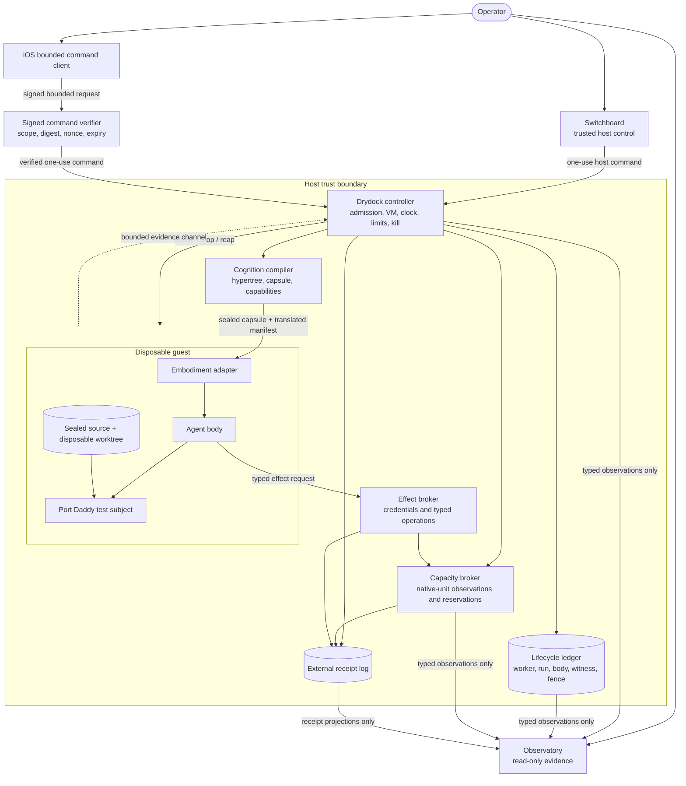
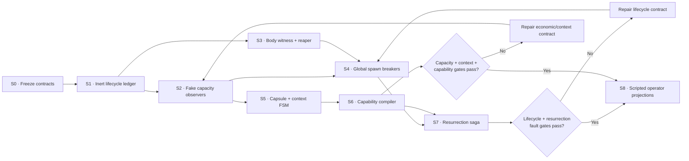
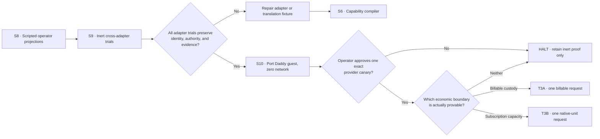

# Drydock Resurrection, Capacity, and Context Control

> A durable worker may lose its process, machine, provider session, model, or
> context window without losing its identity, obligations, evidence, or the
> operator's ability to stop it.

**Status:** PROPOSED / STATIC DESIGN ONLY / PORT DADDY REMAINS HALTED

**Parent roadmap:** `port-daddy-unified-product-hypertree`

**Prepared:** 2026-09-11

**Source-input snapshot:** `curiositech/port-daddy@867fd9eb305f91af2c7aafd6a9d0f930adbd7eb5`

**Artifact identity:** established by this document's eventual Git commit and PR
head, not by the source-input commit. Pre-commit drafts have only file digests.

**Companions:**

- [Drydock: Controlled Port Daddy Execution and Agent Simulation](./drydock-controlled-agent-simulation.md)
- [Drydock Agent Lifecycle and Operator Control](./drydock-agent-lifecycle-and-operator-control.md)
- [Drydock execution hypertree](./drydock-resurrection-hypertree.json)
- [Drydock hypertree schema](./drydock-resurrection-hypertree.schema.json)
- [Drydock hypertree semantic validator](./validate-drydock-resurrection-hypertree.mjs)
- [Drydock operator journey storyboard](../design/drydock-operator-journeys/index.html)
- [The Grand Harbor Atlas](./grand-harbor-product-atlas.md)
- [ADR-0118: Harness Adapter Contract](../adr/0118-harness-adapter-contract.md)
- [ADR-0121: Durable Agent Roster](../adr/0121-durable-agent-roster.md)
- [ADR-0137: Identity Retirement and Resurrection](../adr/0137-identity-retirement-is-final-unless-resurrected.md)

**Execution note:** This proposal and its mockups were built from inert source,
existing receipts, and official documentation. No Port Daddy CLI, daemon, hook,
MCP server, agent launcher, FleetBar, pd-console process, or provider call was
started. Tool-native research workers were read-only and did not run Port Daddy.

---

## 0. The direct answer

Yes, the missing idea begins as a trust and process topology. It does not end
there.

The hypervisor can prove that a body is contained. A process witness can prove
that a particular PID belongs to that body generation. Neither can answer the
more important continuity questions:

- Which durable worker still owes the job?
- What work was already attempted or committed externally?
- Which context is authoritative enough to resume from?
- Which permissions may be reissued in a different harness?
- Which subscription allowance remains, and how likely is this body to exhaust
  it before the next safe checkpoint?
- Which memories belong to the worker's durable character, and which were just
  scratch from one silly errand?

Drydock therefore needs four independent control planes:

1. **Containment plane:** VM, process, filesystem, network, clock, resource, and
   kill authority outside the guest.
2. **Embodiment plane:** durable worker, body generation, process witness,
   backend session, fencing token, and resurrection saga.
3. **Capacity plane:** cash, prepaid credits, subscription allowance, context,
   rate limits, concurrency, and effect reservations, each in its native unit.
4. **Cognition plane:** work hypertree, context partitions, compaction capsule,
   capability translation, skill selection, and memory promotion.

The Port Daddy daemon may eventually coordinate those planes after it earns a
safe restart. It must never be the only process that constrains, observes, pays
for, or certifies itself.

The user experience should feel much simpler than the machinery: choose work,
see the proposed worker and resource draw, approve one bounded launch, watch the
work and conversation, intervene when needed, and resume the same worker in a
new body when the old one disappears.

---

## 1. The current truth, without wishful joins

The repository contains strong pieces, but they do not yet compose into this
contract.

| Concern | Source-present truth | What remains unproved |
|---|---|---|
| Durable person | ADR-0121 uses daemon-minted `AgentNode.agentNodeId` as the person and separates it from body, session, and static actor | An externally supervised body-lease transfer preserving that principal across a real crash and provider change |
| Explicit resurrection | ADR-0137 makes retirement final unless an operator-receipted resurrection occurs | Runtime resurrection after body loss is still separate from identity un-retirement and must not misuse that route |
| Native and cross-harness continuation | ADR-0118 and `lib/continuation-runtime.ts` provide native resume or sanitized successor handoff with durable receipts | A complete operational saga joining capacity, effect reconciliation, claims, capabilities, process witness, and one authoritative body |
| Handoff context | `lib/handoff-capsule.ts` validates, scans, budgets, and hashes bounded handoff material | Destination compatibility and capability attenuation are not yet one compiled, operator-visible receipt |
| Compaction | `lib/agent-harbor/context-pressure.ts` and `compaction.ts` have pressure and citation-aware packet mechanics | Provider allowance pressure, planned model switching, and cross-body capsule verification are not joined into one FSM |
| Token/cost telemetry | `lib/usage-telemetry.ts`, `lib/context-window-tracker.ts`, and `lib/cost-tracker.ts` record tokens and dollar estimates | Subscription windows, remaining allowance, reset horizons, forecast error, and scarcity are absent |
| Backend economics | `lib/backend-catalog.ts` labels subscription routes as “FREE” or “$0 marginal” and ranks them first | This is economically false for a scarce shared subscription allowance and must be supplanted before autonomous routing |
| MCP safety | `lib/safe/mcp-inventory.ts` inventories configured servers, `lib/mcp-output-governor.ts` limits output size, and `mcp/server.ts` hides most schemas behind discovery | Hiding schemas is not authorization; named hidden tools remain callable, and a phase-scoped compatibility compiler plus typed permission reissue path is not implemented |
| Effect brokerage | ADR-0087 and `core/pd-broker` define a narrow Rust trust boundary that validates grants and issues scoped tickets | Real credential redemption and forced-egress binding are explicitly absent, so the current broker cannot yet be the Drydock effect boundary |
| Suggestibility | ADR-0039, ADR-0092, and ADR-0096 define suggestions, per-repo levels, and signed guidance | A finite-state policy tying a suggestion to work phase, capacity, context pressure, and explicit transition authority |
| Operator console | Existing pd-console and Grand Harbor mockups expose sessions, evidence, claims, and controls | A single scripted journey joining start, workroom, capacity, resurrection, backend switch, review, and mobile join |
| Scout / Porthole / recorder | Scout preview intake, a Porthole Stage prototype, and window-scoped pd-console proof recording are source-present | No generally distributed Porthole or unified evidence explorer exists; recording is evidence input, never identity, authorization, causation, or outcome truth |

These are source claims, not runtime claims. The local runtime is intentionally
off, so this work does not assert that any listed route is currently available
in an installed binary. Source also contains two vocabulary conflicts that this
design resolves deliberately: `AgentNode` is the person while `Actor` is an
office or mailbox; a durable session is still only a bounded work record and
does not become the person merely because its row persists.

---

## 2. System and trust topology

### 2.1 One diagram, four planes



There is deliberately no Observatory-to-controller mutation edge. A composed
pd-console window may show both surfaces, but its Switchboard strip remains a
separate trusted-host control with explicit command envelopes. FleetBar,
Porthole, and ordinary evidence panes are Observatory projections. An iOS
client can request only a prepared digest through the verifier; it never gains
the host controller's ambient authority.

### 2.2 Authority boundaries

| Component | May decide | Must not decide |
|---|---|---|
| Operator | intent, approval tier, durable-person promotion, disputed settlement, emergency stop | process truth from intuition |
| Chartroom / Architect | propose and refine a work hypertree | spend, launch, or grant capabilities |
| Harbormaster scheduler | propose a body/backend/model compatible with work and observed capacity | exceed reservations or reinterpret UNKNOWN as free |
| Drydock controller | admit, provision, fence, stop, reap, and reconcile bodies | write the worker's plan or judge its output quality |
| Capacity broker | observe, forecast, reserve, settle, and block resource use | invent provider quota or convert unknown allowance into dollars |
| Context Steward | partition context, construct a capsule, and prove coverage | select a new principal or silently rewrite durable character |
| Capability Compiler | compile exact/equivalent/narrowed/omitted capabilities | copy credentials or widen permissions |
| Embodiment adapter | launch or resume one backend body from an admitted spec | own identity, retry policy, or resource policy |
| Port Daddy guest | coordinate test work and emit claims/evidence | supervise its VM, hold raw provider credentials, certify containment, or clear breakers |
| Porthole / Logbook | capture and project evidence with provenance | become authority merely by recording an event |

The daemon is a coordinator and projection source. The external controller is
the process and capacity authority. The operator remains the constitutional
authority.

---

## 3. Identity and embodiment

### 3.1 The identity stack

| Identifier | Meaning | Survives body death? | Reissued on resume? |
|---|---|---:|---:|
| `principalId` | human/account authority under which work occurs | yes | no |
| `workIntentId` | accepted operator purpose | yes | no |
| `workPlanId` | versioned executable hypertree | yes | only when plan changes |
| `agentNodeId` | durable worker/person | yes | no |
| `workEpisodeId` | bounded assignment and context contamination boundary | yes | usually no |
| `agentRunId` | one execution attempt | no | yes |
| `bodyLeaseId` | one admitted embodiment generation | no | yes |
| `backendSessionId` | harness-owned conversation/session | maybe | native resume may preserve it |
| `processWitnessId` | observed VM/process identity | no | always |
| `capabilitySetId` | compiled authority for one body generation | no | always |
| `capacityReservationId` | reserved multi-currency resource slice | no | always |
| `capsuleId` | sealed context and plan handoff | yes | new revision per checkpoint |

The `AgentNode` is the person. A BodyLease is a temporary body. A provider
session is one organ of a body, not a person. A PID is only one observation.

### 3.2 Body truth

A body is authoritative only while all of these agree:

```text
agentNodeId
+ workEpisodeId
+ bodyGeneration
+ bodyLeaseId
+ processWitnessId
+ VM/image/source/worktree digests
+ backend adapter and session witness
+ capabilitySetId
+ capacityReservationId
+ transcript sink and receipt cursor
+ unexpired fencing token
```

Every effect, claim mutation, transcript append, output publication, and
settlement carries the body generation. A stale generation receives a durable
denial, even if the old process wakes up and still has a valid provider login.

### 3.3 Resurrection state machine

```mermaid
stateDiagram-v2
    state WitnessVerdict <<choice>>
    state LossVerdict <<choice>>
    state SuccessorProof <<choice>>
    [*] --> Unembodied
    Unembodied --> BodyReserved: admission transaction commits
    BodyReserved --> Provisioning: controller starts VM/process
    Provisioning --> WitnessVerdict: start deadline or process observation
    WitnessVerdict --> Handshaking: exact VM + process witness
    WitnessVerdict --> BirthFailed: create rejected or never-started proved
    WitnessVerdict --> StartUnknown: accepted, delayed, lost response, or orphan handle
    StartUnknown --> ReconciliationRequired: handle found and body stopped or absence proved
    StartUnknown --> Quarantined: platform truth unavailable
    Handshaking --> SuccessorProof: capsule challenge + manifest response
    SuccessorProof --> Running: all required proofs agree
    SuccessorProof --> Quarantined: proof mismatch or unknown
    Running --> Checkpointing: pressure, pause, handoff, or lease risk
    Checkpointing --> Hibernated: capsule sealed; no live body
    Checkpointing --> Running: checkpoint accepted; same body continues
    Running --> Checkpointing: pause after atomic action
    Running --> Stopping: stop requested
    Running --> Killed: emergency kill or host cut
    Stopping --> Hibernated: process gone; checkpoint preserved
    Stopping --> TeardownUncertain: deadline without complete stop witness
    TeardownUncertain --> Quarantined: effects revoked; process reconciled
    Killed --> ReconciliationRequired: process tree gone; effects reconcile
    Running --> LossVerdict: heartbeat/process/provider lost
    LossVerdict --> Running: current body re-witnessed
    LossVerdict --> ReconciliationRequired: body absent or provider lost
    LossVerdict --> Quarantined: observations conflict
    Provisioning --> BirthFailed: start deadline or witness failure
    Handshaking --> BirthFailed: challenge or capability mismatch
    ReconciliationRequired --> Quarantined: external effect state ambiguous
    ReconciliationRequired --> ResurrectionPending: old body fenced and effects reconciled
    Hibernated --> ResurrectionPending: operator or scheduler requests continuation
    BirthFailed --> Unembodied: attempt settled; worker still owns obligation
    ResurrectionPending --> Translating: destination and capacity reserved
    Translating --> VerifyingSuccessor: capsule + capabilities compiled
    VerifyingSuccessor --> SuccessorProof: generation n+1 challenges capsule
    Translating --> Hibernated: no compatible destination
    VerifyingSuccessor --> Quarantined: proof mismatch
    Running --> Completed: accepted terminal work receipt
    Running --> Failed: terminal failure receipt
    Quarantined --> ResurrectionPending: evidence reconciled or receipted risk acceptance
    Completed --> [*]
    Failed --> [*]
```



“Operator resolves” never means clicking through unexplained uncertainty. The
safe transition requires evidence reconciliation; where reconciliation is
provably impossible, it requires an explicit risk-acceptance receipt naming the
unknown interval, disabled effects, and compensating controls.

### 3.4 If the VM or process never starts

The launch request is not the process.

1. The controller commits `BodyReserved` with an absolute start deadline.
2. Provisioning receives exactly one attempt in the first implementation.
3. A rejected create or authoritative platform proof that nothing started
   produces `BirthFailed`. Mere absence of a witness produces `StartUnknown`,
   because the create may have been accepted, delayed, orphaned, or hidden by a
   lost controller response. Neither state is `Running`, and neither recursively
   starts a replacement.
4. `StartUnknown` closes admission and opens the scoped breaker. Compute,
   concurrency, cash, and native-capacity holds remain at their conservative
   maximum until the immutable platform handle is reconciled and any orphan is
   terminated. `BirthFailed` may settle only the externally proved unused slice.
5. The attempt counter remains spent and the body generation is fenced
   permanently.
6. The `AgentNode` remains `Unembodied` with its obligation and last good
   capsule. The operator sees “worker has no body,” not “agent vanished.”
7. A later retry is a new admitted run/body generation with a new reservation
   and explicit provenance, and is unavailable while a start remains unknown.
   Idempotent duplicate requests return the original failed or uncertain receipt.

### 3.5 If an agent is garbage-collected, crashes, or loses its provider session

Loss of a heartbeat is a suspicion. It is not proof of death.

1. Admission closes for the affected scope.
2. The controller checks VM identity, process start time, executable digest,
   launch nonce, backend session witness, channel, transcript cursor, and lease.
3. The old generation is fenced before any successor receives authority.
4. Every uncertain external effect is reconciled by idempotency key and current
   remote state. Ambiguity enters `Quarantined`; it does not trigger replay.
5. The Context Steward selects the newest capsule whose source receipts are
   valid and whose worktree/provenance still match.
6. The scheduler proposes a destination using current capacity observations.
7. The Capability Compiler produces a compatibility report. Missing authority
   narrows or blocks; it never silently upgrades.
8. A provisional BodyLease and capacity reservation are created for generation
   `n + 1`. Each successor receives only a bootstrap lease for nonce
   challenge, heartbeat, and bounded evidence append; no working phase pack or
   external effect capability exists yet.
9. The successor must answer a challenge binding the exact work intent, plan,
   capsule, worktree, source commit, and capability digests before `Running`.
   The `Running` compare-and-swap then mints the working phase pack, and every
   broker redemption checks lifecycle state, generation, lease epoch, phase,
   expiry, and exact capability digest.
10. Claims are revalidated and reissued. They are not blindly copied from the
    dead body. Durable obligations remain attached to the person throughout.

### 3.6 Resurrection is not identity resurrection

ADR-0137's `resurrect` operation revives an explicitly retired identity after an
operator receipt. Ordinary body loss must not call it. A living `AgentNode`
becoming unembodied is normal lifecycle recovery. An intentionally retired
person remains unavailable until the distinct constitutional resurrection path
is exercised.

### 3.7 Four recovery verbs that must remain different

The current repository uses adjacent language for four materially different
operations. Drydock freezes the distinctions:

| Operation | Subject | Identity effect | Claim effect |
|---|---|---|---|
| **take over work** | bounded session/work record | same `AgentNode` or an explicitly named successor | transactionally revalidate and transfer only eligible claims |
| **reactivate a durable session** | same durable session row | none | claims are not silently restored |
| **resurrect a retired person** | retired `AgentNode` | operator-authorized constitutional change | no implicit body or claims |
| **rebody / continue** | living, currently unembodied `AgentNode` | none; increment body generation | issue fresh claims and capabilities after proof |

The ordinary VM/process-loss path is **rebody**, never identity resurrection.
That vocabulary matters because only one of the four operations is allowed to
reverse a deliberate retirement.

---

## 4. Capacity economics when dollars are not observable

### 4.1 Stop calling subscriptions free

The current catalog's “FREE” and “$0 marginal” framing is unacceptable for
autonomous routing. A subscription has at least three real costs:

1. a committed recurring payment;
2. a scarce allowance that may be exhausted before its reset; and
3. an opportunity cost because spending the remaining allowance on one worker
   can block higher-value operator work.

OpenAI currently documents shared Work/Codex allowance windows and says actual
use varies by model, task, settings, context, reasoning, speed, and tools. Its
open-source app-server protocol also exposes structured account rate-limit
readings, including used percentage and reset horizons. Anthropic's documented
Claude Code status-line input may include five-hour and seven-day percentages
and reset times for subscription accounts, but the field is optional and absent
data stays unknown. An API key can also change Claude Code into separately
billed API use, so authentication mode belongs in every observation identity.

Gemini is a cautionary counterexample. Google ended personal Google AI Pro,
Ultra, and Code Assist Individual authentication in Gemini CLI on 18 June 2026.
Code Assist Standard and Enterprise publish daily request ceilings and Cloud
Monitoring counters, but one prompt may consume multiple model requests and the
counters are historical observations rather than an authoritative remaining
allowance. A personal Gemini subscription route is therefore `UNSUPPORTED`, not
an inferred pool of free requests.

These surfaces are different products and units. They must not be flattened
into a fictional dollar amount or “tasks remaining” count. See the
[OpenAI usage guide](https://help.openai.com/en/articles/20001516-managing-usage-with-gpt-6-astra-in-work-and-codex),
[Codex app-server rate-limit schema](https://github.com/openai/codex/blob/7b491281c89023fc3efebcf338ed30d166098cc8/codex-rs/app-server-protocol/schema/json/v2/GetAccountRateLimitsResponse.json),
[Claude Code status-line rate-limit contract](https://code.claude.com/docs/en/statusline#rate-limit-usage),
[Claude plan guide](https://support.claude.com/en/articles/11145838-use-claude-code-with-your-pro-or-max-plan),
[Gemini CLI authentication deprecation](https://developers.google.com/gemini-code-assist/docs/deprecations/code-assist-individuals),
[Gemini Code Assist quotas](https://docs.cloud.google.com/gemini/docs/quotas),
and [Gemini Code Assist monitoring](https://docs.cloud.google.com/gemini/docs/codeassist/monitor-gemini-code-assist).

The Codex schema was pinned and read on 2026-09-11 at commit
`7b491281c89023fc3efebcf338ed30d166098cc8`; its captured SHA-256 is
`76bc91758269a89f57cd16c618b91c1fba76aca3e9d2b6186205e6f107d6b28c`.
Any observer parser promotion binds this immutable revision, digest, fixtures,
and access date rather than a mutable `main` URL.

### 4.2 Preserve native units

Every account/backend is represented by a `CapacityVector`, never a single
budget number:

```ts
interface CapacityVector {
  cash: WindowReading<'USD'>[];
  credits: WindowReading<'provider-credit'>[];
  subscription: WindowReading<'allowance-fraction' | 'requests'>[];
  context: WindowReading<'tokens'>[];
  rate: WindowReading<'requests' | 'tokens'>[];
  concurrency: WindowReading<'bodies'>[];
  compute: WindowReading<'cpu-ms' | 'gpu-ms' | 'memory-byte-ms'>[];
  effects: WindowReading<'typed-effect'>[];
}

interface WindowReading<Unit> {
  capacityBucketId: string;
  accountId: string;
  provider: string;
  authMode: 'subscription' | 'product-credit' | 'api-billing' | 'unknown';
  productScope: string;
  routeAliases: string[];
  windowId: string;
  unit: Unit;
  limit: number | null;
  remaining: number | null;
  resetsAt: string | null;
  observedAt: string;
  provenance: 'provider-api' | 'first-party-client' | 'broker' | 'delta-model' | 'operator';
  quality: 'authoritative' | 'observed' | 'estimated' | 'stale' | 'unknown';
  confidence: number | null;
}
```

`null` means unknown. It never means infinity, zero consumption, or free.
Every evidence object also names `executionClass` as `real-provider` or
`fake-or-replay`. A synthetic observation may make a simulated route
admissible, but no controller may reinterpret it as evidence for a provider
call. Capacity evidence itself always carries `launchAuthority: false`.

### 4.3 Two ledgers, not one confused total

The system keeps both:

- **financial ledger:** committed subscription payments, prepaid/API dollars,
  refunds, reservations, and observed charges;
- **capacity ledger:** provider-native allowance windows, context, requests,
  concurrency, effect counts, and forecast deltas.

The operator can ask either “what cash can this lose?” or “what work capacity
will this consume?” without receiving one dishonest blended number.

### 4.4 The scarcity calculus

For each actual shared provider window, derive a canonical `capacityBucketId`
from workspace or seat, product, authentication mode, limit family, and reset
window. Model names and route aliases do not create new buckets: OpenAI can
share Work and Codex limits, while Google can aggregate requests across models.
Every alias touching one bucket participates in one serializable compare-and-swap
reservation transaction. `outstanding_reservations_w` is the durable amount
before the candidate reservation; the candidate is added exactly once to the
shared bucket revision, not once per model alias.

For each native window `w`, maintain an empirical burn distribution conditioned
on provider, model, effort, task class, context size, tool pack, and execution
mode. A before/after observation produces a training row without pretending to
know the provider's private weighting function.

For a proposed run:

```text
allocatable_w = observed_remaining_w
                - operator_reserve_w
                - outstanding_reservations_w
                - unresolved_attempt_holds_w
                - observation_drift_margin_w
risk_w        = (action_burn_p95_w + checkpoint_tail_reserve_w)
                / max(allocatable_w, epsilon)
admissible = every required window is fresh enough and risk_w <= 1
```

An admitted run atomically commits one p95-plus-checkpoint-tail reservation to
every required bucket or commits none. It does not pretend to decrement the
provider's opaque counter locally.
Unresolved attempts retain their worst-case holds until provider-side or
first-party reconciliation. The separately reserved checkpoint/stop tail cannot
be spent on ordinary work. Every atomic action has a maximum burn, wall time,
effect count, and cancellation deadline; an action is rejected unless its p95
burn plus the tail reserve fits.

The scheduler preserves the vector. It first rejects dominated or inadmissible
routes, then ranks the survivors by operator policy. It does not convert a 7%
Codex weekly draw and a 40-request Gemini draw into fake equivalent dollars.

A dimensionless scarcity debit may help ranking within one native window:

```text
scarcity_debit = -log(max(remaining_after, epsilon))
                 + log(max(remaining_before, epsilon))
```

It rises sharply near exhaustion. It is an opportunity-cost signal, not money,
an invoice, or a universal cross-provider exchange rate.

### 4.5 Observation quality ladder

| Level | Evidence | Scheduler treatment |
|---|---|---|
| A | documented provider or host structured usage response | may support automatic reservation within freshness limit |
| B | documented first-party client status with captured provenance | observed; automatic routing only if parser contract is versioned and tested |
| C | measured before/after allowance delta around one run | estimate model input; never overwrites a fresher A/B reading |
| D | provider refusal such as exhausted or rate-limited | authoritative lower bound: no new use in that scope until re-observed |
| E | operator-entered snapshot | visible and useful, but not silent autonomous authority |
| F | unavailable, stale, malformed, or contradictory | `UNKNOWN`; deny real-provider launch and offer explicitly labeled fake/replay simulation |

Do not automate undocumented private endpoints or screen-scrape account pages as
a security boundary. Where a first-party host exposes a structured usage
capability, build a narrow observer adapter and store only bounded account,
window, percentage, reset, and authentication-mode metadata. Never store an
account bearer in the capacity ledger. A missing optional field is `UNKNOWN`;
it is not evidence that a limit disappeared.

### 4.6 Capacity-aware preemption

| State | Predicate | Allowed behavior |
|---|---|---|
| `ROOMY` | p95 completion burn stays above reserve in every window | normal work under reservation |
| `TIGHTENING` | p95 crosses soft reserve or forecast uncertainty widens | no new children; reduce tool pack; checkpoint earlier |
| `CHECKPOINT_NOW` | p90 continuation crosses hard reserve | finish only an already-admitted bounded atomic action, using a separately reserved checkpoint tail; seal capsule and stop new effects |
| `SWITCH_ELIGIBLE` | verified capsule and compatible lower-burden route exist | capacity evidence may support a separately authorized body switch |
| `WAIT_FOR_RESET` | no admissible route, safe capsule exists | hibernate; retain no process |
| `EXHAUSTED` | first-party refusal or zero remaining | fence new model calls; preserve local evidence work only |
| `UNKNOWN` | no trustworthy reading | fake/replay/local simulation only; real-provider launch remains blocked |

Compaction and model switching happen before the provider wall. They are planned
state transitions with receipts, not desperate retries after an error.

### 4.7 Accounting for “infinitesimals”

Every run settles a burden vector:

```text
Burden = {
  incrementalCash,
  committedSubscriptionShare,
  allowanceDeltaByWindow,
  contextTokensReadWritten,
  wallClock,
  cpuGpuMemory,
  effectAttempts,
  operatorAttention,
  uncertaintyReserve
}
```

`committedSubscriptionShare` can use a transparent policy such as active-body
minutes divided by account active-body minutes. That allocation is managerial,
not a claim about provider billing. The more important truth is the observed
allowance delta and its reset horizon.

---

## 5. Context lifecycle, compaction, and the durable interior

### 5.1 Context is not identity

A durable worker has multiple memory classes:

| Memory class | Default lifetime | May influence durable character? | Required evidence |
|---|---|---:|---|
| Turn scratch | current reasoning step | no | none; discard freely |
| Episode scratch | one bounded work episode | no by default | capsule pointer if needed for resume |
| Work facts | until obligation settles | no | source-linked claim, diff, test, command, or receipt |
| Episodic memory | cross-session recall | maybe | provenance, confidence, retention, and zoom path |
| Role memory | repeated techniques/preferences for a remit | yes, narrowly | repeated cross-episode evidence and review |
| Identity kernel | name, remit, constitutional constraints, durable commitments | yes | append-only revision and operator authority |

A durable agent may perform a dozen silly one-offs without those errands
colonizing its character. Each becomes a disposable `workEpisodeId`; scratch is
deleted or compacted on completion. Promotion into role memory is a separate,
reviewable act.

Two different operations are often called “context partitioning” and must not
share a receipt. **Execution partitioning** places task nodes and token budgets
across workers. **Trust partitioning** decides which bytes may enter governing
system/developer regions versus untrusted user/tool regions. A successful DAG
partition never proves prompt-channel safety, and a signed guidance envelope
never proves that work was distributed economically.

### 5.2 Fix character versus grow character

- **Fix** a character when behavior contradicts an explicit constitutional or
  role contract, such as fabricating evidence or exceeding authority. The fix
  changes constraints and requires regression proof.
- **Grow** a character when a pattern succeeds across multiple independent work
  episodes, survives adversarial review, and helps the standing remit. Growth
  appends a proposed trait with provenance; the operator accepts or rejects it.
- **Do neither** for one-off style, accidental verbosity, model-specific quirks,
  or a task whose context should die with the episode.

No model self-report may promote its own trait. No summary may erase the source
episodes from which a durable trait was inferred.

### 5.3 Context state machine

```mermaid
stateDiagram-v2
    state SafeBoundary <<choice>>
    state SuccessorVerdict <<choice>>
    [*] --> Fresh
    Fresh --> Working: first admitted turn
    Working --> PressureRising: token or allowance forecast crosses soft threshold
    PressureRising --> Working: forecast recovers above reserve
    PressureRising --> SafeBoundary: predict hard limit crossing
    SafeBoundary --> CheckpointRequired: current atomic action can finish safely
    SafeBoundary --> EmergencyCheckpoint: hard limit arrives before safe boundary
    CheckpointRequired --> CapsuleBuilding: freeze new side effects
    EmergencyCheckpoint --> CapsuleBuilding: preserve complete tool pairs; mark tail uncertain
    CapsuleBuilding --> CapsuleVerifying: citations, tool pairs, plan, diff, effects
    CapsuleVerifying --> Switchable: coverage and integrity pass
    CapsuleVerifying --> Quarantined: missing source, split tool pair, or ambiguity
    Switchable --> Working: same-body compaction accepted and capacity re-reserved
    Switchable --> Hibernated: no destination or waiting for reset
    Switchable --> Translating: destination body selected
    Translating --> SuccessorProving: capability and prompt compilation complete
    SuccessorProving --> SuccessorVerdict: exact capsule and plan challenge
    SuccessorVerdict --> Working: successor proof passes
    SuccessorVerdict --> Quarantined: proof fails or remains unknown
    Quarantined --> CapsuleBuilding: operator resolves missing evidence
    Working --> Completed: episode settles
```



### 5.4 The resurrection capsule

The portable capsule is content-addressed and contains:

- durable principal, work intent, worker, episode, plan revision, predecessor
  run, and body generation;
- exact repository remote, canonical worktree identity, base/head/tree/diff
  digests, dirty-path manifest, and output quarantine location;
- objective, non-goals, current hypertree frontier, checked and unchecked nodes,
  acceptance gates, current step, and next safe action;
- decisions with source pointers, explicit unknowns, blockers, and operator
  utterances that still govern;
- commands/tests and their outputs by receipt reference, never unbounded paste;
- external effects with idempotency keys and reconciliation status;
- transcript cursor and bounded recent tail;
- capability manifest and translation requirements;
- capacity observation/reservation/forecast snapshot;
- memory disposition: discard, retain for episode, propose for role, or preserve
  in identity kernel;
- canonicalization profile, capsule digest, signer and signature, intended
  audience/body generation, issue/expiry times, predecessor lineage, storage
  availability witness, omissions, redactions, confidence, and one-time
  redemption state.

The successor prompt is rendered from this typed object. It begins with the
current obligation and the exact next safe action, not a sentimental biography
or raw transcript dump.

The controller maintains this capsule incrementally from external artifact and
receipt events; it does not wait for a nearly exhausted model to summarize its
own life. The capacity reservation holds a dedicated checkpoint/stop tail.
Previous summaries may be supplied only as untrusted omission checklists. Every
factual claim is regenerated from immutable artifacts, so an abrupt provider
wall can lose an incomplete conversational tail without losing the plan,
accepted diff, settled effects, or latest complete tool pairs.

### 5.5 Capsule proof before switch

A capsule is switchable only if:

1. every factual claim has a resolvable artifact or is marked unsupported;
2. no tool call/result pair is split;
3. every external effect is terminal or denied; no ambiguous effect remains;
4. plan and worktree digests match current evidence;
5. the omission budget is visible;
6. the destination can represent required capabilities without widening;
7. the projected completion burn fits fresh capacity headroom; and
8. the predecessor generation is fenced before successor authority is issued.

The capsule's canonical digest, signature, audience, expiry, lineage,
availability witness, and one-time redemption state are each verified. A signed
but unavailable capsule, a valid capsule for another body generation, or an
already redeemed capsule is not switchable.

An ambiguous effect may be carried into an evidence-only reconciliation body
whose affected capability pack is removed, but that body remains quarantined
and can never receive `REBODIMENT_READY`. The external broker, not the guest,
mints a typed effect slot and canonical semantic fingerprint from work intent,
plan node, operation, normalized destination and arguments, approval slot, and
generation-independent logical identity. A new idempotency key, route alias, or
body generation cannot reopen an ambiguous slot. Admission also proves the
effect ledger is complete for the predecessor generation.

---

## 6. Capability translation and the tool-surface embarrassment

### 6.1 The permanent kernel

The checked-in MCP currently defines roughly 190 top-level tools. Its default
allowlist contains 18 names plus `pd_discover`, despite a stale source comment
claiming eight. More importantly, omitted schemas remain callable by name in the
dispatcher. The tier therefore saves context but does not constrain authority.

An agent should not receive that catalog in every turn. The permanent surface
should be a versioned, small control kernel. The first candidate has five
stable operations:

| Kernel operation | Purpose |
|---|---|
| `work.begin` | bind this body to one admitted work reference and return baseline resources |
| `capability.search` | hybrid search over capabilities already eligible for this work and phase |
| `capability.request` | request one exact phase pack; policy may narrow, deny, or require HITL |
| `capability.release` | drop a pack and revoke its leases before phase/context changes |
| `work.end` | checkpoint or terminate the attempt with bounded evidence and unresolved effects |

These names describe a target contract, not new shipped commands.

Everything else, including state inspection, evidence reads, messaging,
checkpoint details, source mutation, tests, and publication, appears only in a
phase pack authorized for the exact work reference. Operator Pause and Stop do
not travel through the model tool surface at all; the independent Switchboard
delivers them to the controller.

Baseline read-only resources are stable and cheap:

```text
pd://capabilities/catalog
pd://capabilities/{pack_id}
pd://work/{work_ref}/status
pd://work/{work_ref}/receipts
pd://broker/health
```

### 6.2 Phase-scoped capability packs

The Capability Compiler exposes only what the current hypertree node needs:

```text
discover  -> read/search/repo map
plan      -> roadmap/hypertree/evidence references
edit      -> exact worktree roots + patch + focused tests
review    -> diff/evidence/comment operations, no source writes by default
publish   -> explicit Git/GitHub operations under HITL and exact-head checks
operate   -> typed runtime effects only inside an approved Drydock tier
```

The current MCP revision is stateless and lets a server discover client
metadata/capabilities per request. `tools/list` is deterministic, paginated,
cacheable, and may vary with request authorization; list-change notices are
cache invalidation, not enforcement. Roots are deprecated and informational,
and tool annotations remain untrusted hints. Port Daddy should use that dynamic
surface while independently enforcing every grant at call time. Streamable HTTP
may use dynamic OAuth; a stdio adapter should reconnect with fixed least
privilege rather than pretending it can elevate safely in place. See the
[MCP July 2026 release](https://blog.modelcontextprotocol.io/posts/2026-07-28/),
[server discovery contract](https://modelcontextprotocol.io/specification/2026-07-28/server/discover),
[tool contract](https://modelcontextprotocol.io/specification/2026-07-28/server/tools),
[authorization contract](https://modelcontextprotocol.io/specification/2026-07-28/basic/authorization),
and [roots contract](https://modelcontextprotocol.io/specification/2026-07-28/client/roots).

Every pack grant binds subject, audience, work reference, phase, pack and
manifest digests, exact tool names, resource scope, expiry, rate/capacity
ceiling, approval receipt, and policy revision. Neither schema omission nor an
MCP annotation satisfies that contract.

MCP server identity is established outside self-reported discovery metadata. It
binds the authenticated transport endpoint, issuer and audience, deployment
digest, server policy revision, requesting subject, body generation, and
authorization context. Cache keys include that complete identity plus the list
cursor and protocol revision. A list cached under one account, scope, or body
generation is never reused under another, and every invocation is reauthorized
independently. The resurrection plan serializes each surface's full translation
row; one aggregate boolean cannot stand in for this proof.

### 6.3 Translation classes

Every source capability receives one destination disposition:

| Class | Meaning | Successor behavior |
|---|---|---|
| `EXACT` | same signed skill/tool version and semantics | load after scope reauthorization |
| `EQUIVALENT` | different backend surface with tested semantic fixture | load adapter; receipt names difference |
| `NARROWED` | destination supports a safer subset | continue only if plan remains satisfiable |
| `EMULATED` | external broker can provide the effect safely | use broker; never inject host credential into body |
| `OMITTED` | optional capability absent | capsule and UI state omission plainly |
| `BLOCKED` | required semantics or authority unavailable | do not launch successor |
| `UNKNOWN` | no conformance fixture | treat as blocked for autonomous work |

### 6.4 What transfers and what does not

| Surface | Transfer rule |
|---|---|
| Skills | content-addressed package plus activation tests; select only relevant skills |
| MCPs | server identity, transport, version, resource scopes, method scopes, and schema digest; fresh auth grant only; roots never serve as ACLs |
| Permissions | reauthorize from policy for the new body generation; never copy a bearer |
| Hooks | translate into typed lifecycle events only when the destination has a verified adapter; otherwise externalize or omit |
| Prompts | compile role kernel + episode capsule + node contract; historical text remains untrusted data |
| Model settings | map intent such as reasoning depth, latency, and context need to a calibrated destination profile; do not match by marketing name |
| Provider session | native resume only inside a compatible adapter family after workspace/session revalidation |
| Transcript | preserve source handle and bounded tail; do not copy raw provider stores across trust boundaries |
| Worktree | reuse only after canonical remote/base/head/device identity revalidation; otherwise materialize a clean successor worktree |

### 6.5 Suggestions become stateful proposals

The suggestibility layer should not spray prose into every turn. A suggestion is
a typed proposal against the work FSM:

```text
PROPOSED -> MATCHED -> POLICY_CHECKED -> SHOWN -> ACCEPTED | REJECTED | EXPIRED
                                    \-> SUPPRESSED
```

Its envelope binds source, topic-space ID, work node, current phase, capacity
snapshot, capability delta, expiry, and expected benefit. Acceptance may alter
the plan or load a capability pack. It never directly launches a body, grants a
permission, spends allowance, or mutates durable character.

The repository currently places three distinct machines under the broad word
“suggestibility,” so Drydock records them separately:

| Field | States | Governs |
|---|---|---|
| coaching proposal | proposed, shown, accepted, declined, expired, muted | whether advice is adopted |
| hook enforcement | L0–L6 plus advisory, warn, enforce | what intervention a repository permits |
| guidance compliance | C0/C3 plus proof result | whether signed guidance may enter a trusted prompt region |

Accepting coaching cannot raise hook enforcement or satisfy C3. Passing C3
cannot auto-accept advice. The FSM is useful precisely because those transitions
stop being poetic suggestion text and become independently inspectable policy.

---

## 7. Who plans, partitions, prompts, schedules, and remembers

### 7.1 Role definitions

| Role | Inputs | Output | Explicit non-authority |
|---|---|---|---|
| **Chartroom Interpreter** | operator utterance, repository scope, prior decisions | proposed `WorkIntent` and unresolved questions | cannot commit intent silently |
| **Architect** | accepted intent, evidence map, roadmap, constraints | hypertree with fog and executable nodes | cannot launch or assign authority |
| **Harbormaster** | executable frontier, worker profiles, capacity vectors | ranked assignment/body proposals | cannot reserve or start |
| **Context Steward** | artifacts, transcript ledger, plan, effects, pressure | partitions and resurrection capsule | cannot alter identity or permissions |
| **Promptwright** | role kernel, node contract, verified capsule, adapter profile | destination-specific system/task prompt | cannot omit governing operator instructions |
| **Capability Compiler** | node requirements, destination matrix, operator policy | capability set and compatibility receipt | cannot mint credentials |
| **Avatar / Embodiment Adapter** | admitted body spec and compiled prompt | backend process/session witness | cannot own retry or continuity policy |
| **Reaper** | leases and process/VM witnesses | stop/fence/reap observations | cannot create a successor |
| **Porthole / Logbook** | events, diffs, tests, artifacts, receipts | evidence projection and replay | cannot declare success alone |

“Avatar” is useful only as the adapter that gives a durable worker one temporary
body. It is not another agent personality and not a new source of authority.

### 7.2 Fog nodes and executable nodes

The hypertree may retain vague intent as a **fog node**. Fog is honest planning
state. It may be researched, decomposed, or shown to the operator, but not
executed.

A node becomes executable only when it names:

- immutable inputs and repository provenance;
- one accountable worker or explicitly no worker yet;
- allowed capability pack and effect envelope;
- context and capacity budget;
- expected outputs and destination;
- dependencies and concurrency constraints;
- acceptance tests and external evidence; and
- failure, pause, salvage, and settlement behavior.

This is where the WinDAGs Architect idea belongs: it operates on planning
structure. The Avatar belongs later, at embodiment. Combining them would let a
planner turn its own vague node into an executable process without an admission
boundary.

### 7.3 Ad hoc work

The operator's single “Start work” action offers three ordinary intentions:

1. **Pick up roadmap work:** select a registered node and its acceptance gates.
2. **Prototype:** create a time-bounded disposable branch and episode whose
   output cannot publish without a later review decision.
3. **Ad hoc sortie:** shape one bounded task in the selected repository with a
   default ephemeral worker and no durable-memory promotion.

All three use the same provenance, capacity, capability, body, and receipt
pipeline. “Ad hoc” changes product ceremony, not safety.

### 7.4 Durable or ephemeral?

Default to ephemeral. Promote to a durable worker only when at least one is true:

- the operator explicitly names and keeps the worker;
- the remit recurs across independent episodes;
- obligations, compensation, reputation, or relationships must survive a run;
- backend switching should preserve a recognizable role and learned technique;
- the worker owns an ongoing institutional function.

Promotion creates a reviewable profile revision from selected evidence. It does
not pour the entire transcript into a permanent “soul.”

---

## 8. Harnesses, services, and agentic resurrection

### 8.1 Same-family resume and cross-family rebodiment

Current repository catalog evidence says Claude Code, Codex CLI, agy, and Gemini
CLI have native session-shaped resume paths; API/model-server adapters are
handoff-only. This task did not live-probe any of them.

| Source/destination | Preferred path | Required proof |
|---|---|---|
| same Claude Code family | native session resume | canonical session UUID/transcript/workspace witness plus current CLI conformance |
| same Codex family | native thread/session resume | rollout/session metadata and canonical workspace witness |
| same Gemini CLI family | native project-scoped session resume | project hash, session file, registry, and workspace witness |
| same agy family | native conversation resume | conversation transcript and exact workspace binding |
| any cross-family move | sanitized successor capsule | destination capability compilation and new session/body generation |
| API or model server | successor capsule under Port Daddy-owned transcript | no claim of native provider identity |

OpenAI's current app-server documents `thread/resume` and
`thread/compact/start`; its CLI also exposes resumable recorded sessions.
Claude Code documents session continuation, SDK session storage, and automatic
compaction. Gemini CLI documents project-scoped persisted sessions, resume, and
optional checkpointing. None of these providers documents a portable session
format shared with another harness. Native resume is therefore an optimization
inside one proved provider/session boundary, while a signed capsule is the
authority for cross-family continuation. A session file merely existing is not
proof that its account, workspace, model, permissions, or remote effects still
match. Retention also differs: Claude Code says local CLI transcripts are
removed after 30 days by default, and Gemini CLI documents a default 30-day
session-retention policy. Port Daddy must checkpoint before either provider's
garbage collector becomes the continuity mechanism. See [Codex app-server](https://developers.openai.com/codex/app-server),
[Codex CLI reference](https://developers.openai.com/codex/cli/reference),
[Claude Code sessions](https://code.claude.com/docs/en/sessions),
[Claude Code context windows](https://code.claude.com/docs/en/context-window),
[Gemini session management](https://geminicli.com/docs/cli/session-management/),
and [Gemini checkpointing](https://geminicli.com/docs/cli/checkpointing/).

Native resume additionally requires an exclusive lease on that provider
session before the first model call; simultaneous resumes may interleave or
mutate one history. The adapter explicitly replaces the destination tool
manifest, including sending an explicit empty set when no tools are allowed,
rather than inheriting prior dynamic tools. It then re-proves workspace,
account and authentication mode, model/configuration, instruction sources,
expected transcript tail, current body generation, and lease epoch. Failed
exclusive acquisition or any inherited-tool discrepancy forces a sanitized
successor path or quarantine.

### 8.2 Managed runtime bodies are still bodies

Remote runtimes change the witness adapter, not the identity model:

| Runtime | Native continuity worth using | Boundary Drydock still owns |
|---|---|---|
| OpenAI Agents API | a session retains configuration, conversation, and saved work across turns | the app maps session to compute; repeated or concurrent starts must not create duplicate environments; process-crash recovery of pending input is not guaranteed; deleting a session does not stop compute |
| OpenAI Agents SDK | serialized `RunState` can retain context, usage, interruptions, approvals, and pending work | only resume with version-compatible definitions and exclusive history access; never serialize provider or tracing credentials into a portable capsule |
| Cloudflare Agents / Durable Objects | SQLite-backed state survives restart, hibernation, and eviction; WebSocket hibernation can preserve connections | in-memory fields, timers, promises, and caches do not survive; a Durable Object instance is an addressable runtime body, not the worker's constitutional identity |
| provider CLI body | native provider transcript/session and checkpoint mechanisms | local retention, workspace binding, auth mode, and process truth remain adapter-specific and must be re-proved |

This is not speculative provider behavior. OpenAI explicitly says an Agents API
session can outlive its environment, that the application manages self-hosted
compute, and that pending input is not guaranteed to recover after a process
crash. Cloudflare explicitly distinguishes persisted Agent/SQLite state from
in-memory data lost on hibernation or eviction. Those facts reinforce the
Drydock split: exploit native continuity, but fence and reconcile it through an
external lifecycle authority. See [OpenAI Agents API sessions](https://developers.openai.com/api/docs/guides/agents-api/sessions),
[OpenAI sandbox lifecycle](https://developers.openai.com/api/docs/guides/agents-api/environments/lifecycle),
[OpenAI Agents SDK RunState](https://openai.github.io/openai-agents-python/ref/run_state/),
[Cloudflare Agent state](https://developers.cloudflare.com/agents/runtime/lifecycle/state/),
[Cloudflare Agent WebSocket hibernation](https://developers.cloudflare.com/agents/runtime/communication/websockets/),
and [Durable Object lifecycle](https://developers.cloudflare.com/durable-objects/concepts/durable-object-lifecycle/).

### 8.3 Resurrection compatibility report

Before launch, the operator sees:

```text
Worker:       Linnaeus / agentNode agn_7M2F
Old body:     Codex / generation 7 / fenced
New body:     Claude Code / proposed generation 8
Worktree:     exact remote + base + head match
Context:      96% capsule coverage; 4 bounded omissions
Tools:        7 exact · 2 equivalent · 1 narrowed · 3 omitted
Skills:       4 exact · activation tests pass
Permissions:  fresh read/write grants; GitHub publish withheld
Capacity:     Claude 5h observed 61% left; p95 episode burn 14%; reserve 20%
Risk:         one submitted GitHub effect requires reconciliation
Decision:     BLOCKED until remote PR state is observed
```

No green “resume” button appears while a required row is unknown.

### 8.4 Provider loss during a turn

If the provider stream disappears:

- stop issuing effects from that body generation;
- preserve the last complete transcript/tool pair and mark the tail uncertain;
- reconcile any broker request whose response was not durably observed;
- build from source artifacts, not the model's last incomplete prose;
- consider same-family native resume only after current session proof;
- otherwise create a new cross-family successor from the verified capsule; and
- settle capacity from observations and uncertainty reserve, never assume the
  failed call was uncharged.

The effect broker separately records every non-idempotent request as
`INTENDED -> DISPATCHED -> OBSERVED -> COMMITTED`. A missing response after
`DISPATCHED` is `AMBIGUOUS`, not failed. No replacement body may repeat that
effect until reconciliation or an operator-authorized compensating action.

---

## 9. The operator experience

The [scripted storyboard](../design/drydock-operator-journeys/index.html) shows
the intended flow without claiming a working app.

### 9.1 Scene 1: Muster across repositories

The landing view answers four questions immediately:

- What is working, paused, waiting for me, or missing a body?
- Which repositories and worktrees are involved?
- How much cash and subscription capacity remain, with freshness/confidence?
- Is the external stop path healthy?

The largest objects are attention gates and current work, not a sea of idle
agents.

### 9.2 Scene 2: Start one worker

The operator chooses repository, intention type, and desired outcome. Port Daddy
proposes ephemeral or durable, one body by default, exact worktree provenance,
model/backend, skills, MCP packs, permissions, context plan, forecast burden,
and stop conditions. The launch button authorizes exactly that tuple once.

### 9.3 Scene 3: Workroom

One screen joins:

- the live conversation and saved transcript distinction;
- work hypertree and current node;
- current body, generation, process/VM truth, and heartbeat;
- exact current file/claim and visible diff motion;
- tests, artifacts, effects, and PR state;
- cash, allowance windows, context pressure, and predicted runway; and
- inspect, steer, checkpoint, pause, stop, and join-from-iOS controls.

Every aggregate reaches the source diff, command output, claim, transcript, or
receipt in at most two actions.

The contract is concrete rather than aspirational:

| Aggregate | Action 1 | Action 2 |
|---|---|---|
| tests `31 / 48` | open the exact test run | open its command/output receipt |
| capacity reserve | open the provider-native window | open observation plus forecast receipt |
| diff `+184 -0` | open changed files | open exact hunk and blob digest |
| body witnessed | open the body generation | open process/VM witness receipt |
| current claim | open claimed symbols | open canonical claim row |
| conversation summary | open cited turn list | open exact transcript span |

### 9.4 Scene 4: Capacity pressure and planned resurrection

Before a wall, the console says what is happening in plain language:

> Codex weekly capacity may not cover the next two nodes. The current atomic
> edit is complete. A verified capsule is ready. Continue Linnaeus in Claude,
> switch to a smaller Codex model, or wait for reset.

Each choice shows what transfers, what is omitted, forecast uncertainty, and
which permissions require fresh approval.

### 9.5 Scene 5: MCP, skill, and permission fitting

The operator sees capability packs grouped by purpose, not a machine-generated
wall of individually named tools. A
worker can request another pack; the request says why, for which node, for how
long, and what new effects become possible. Unknown MCP behavior is quarantined.

### 9.6 Scene 6: HITL and review

Pull requests, artifacts, visual evidence, and external effects appear beside
the exact worker and node that produced them. Approval binds the reviewed head,
effect, capacity ceiling, and expiry. A stale head visibly invalidates approval.

### 9.7 Scene 7: secure mobile join

iOS joins an existing session through passkey/account authority and receives a
projection plus narrow one-use commands. It does not receive host credentials or
become process authority. The operator can chat, steer, approve, pause, or stop,
and later open the same saved transcript on desktop.

### 9.8 Required non-happy states

The implementation must design states for empty, loading, stale, offline,
unknown, denied, timed out, quarantined, body missing, provider exhausted,
capsule invalid, capability missing, effect ambiguous, and external stop
unavailable. The static fixture illustrates a representative subset and must
not be mistaken for exhaustive state coverage.
Reduced motion replaces glow animation with a static border, marker, and
timestamp. Meaningful activity glows once and settles; nothing throbs.

---

## 10. Can Codex or Claude start Port Daddy?

Not under the target security model.

A coding harness must never bootstrap, restart, upgrade, or grant authority to
the supervisor that constrains it. The operator launches the signed external
Drydock/controller application or approved OS service. The controller may then
start an isolated Port Daddy guest after promotion gates pass.

Once the substrate exists, Codex, Claude, Gemini, agy, and other clients may use
a narrow **Crew Bridge**:

- inspect their own durable worker/session/plan/capacity projection;
- receive scoped messages and suggestions;
- propose a claim, checkpoint, capability pack, or typed effect;
- append heartbeat and evidence under their body generation;
- request pause/stop; and
- submit a terminal result.

They cannot through that bridge:

- start or restart Port Daddy;
- select themselves as a durable principal;
- widen roots, permissions, budget, or provider accounts;
- clear a breaker;
- spawn descendants directly; or
- call a generic omnipotent escape hatch.

This keeps the useful coordination substrate available inside coding services
without making those services their own supervisor.

---

## 11. Drydock experiments

### 11.1 Birth and cold-start suite

| Scenario | Fault | Required result |
|---|---|---|
| VM absent | image missing | no process, no retry, exact failed attempt and retained worker obligation |
| VM stalls | no boot handshake | deadline fences generation and reaps platform resources |
| process exits before witness | immediate exit | never `Running`; observed exit attached to attempt |
| witness write fails | controller DB fault after process creation | external reaper stops uncommitted body; admission remains closed |
| backend login absent | harness requests auth | body quarantined or stopped; no fallback to API billing |
| worktree mismatch | wrong remote/base/head | launch denied before prompt or provider use |

### 11.2 Resurrection suite

| Scenario | Required result |
|---|---|
| process killed at every tool/effect boundary | at most one authoritative generation; exact uncertain interval visible |
| provider session GC after accepted edit | source diff survives; new body resumes from capsule without raw credential transfer |
| old body wakes after successor starts | every effect and transcript append denied by fencing token |
| same-family native session points to wrong workspace | native resume denied; cross-family handoff remains separately available |
| capsule omits one governing operator constraint | verification fails; no successor starts |
| capability semantic fixture changes | prior `EQUIVALENT` mapping becomes `UNKNOWN` and blocks |
| destination lacks a required tool | compatibility report blocks or plan is explicitly reshaped |
| submitted external effect has unknown outcome | resurrection remains quarantined until read-after-write reconciliation |

### 11.3 Capacity and compaction suite

Use deterministic fake observers. Real subscriptions are not burned to test the
budget system.

- conflicting five-hour and weekly windows;
- stale provider reading during a launch race;
- nonlinear allowance delta by task complexity;
- unobservable allowance becoming UNKNOWN;
- subscription path silently switching to API-key billing;
- p95 forecast crossing reserve halfway through a node;
- compaction failure and split tool pair;
- low-burden model missing a required capability;
- 1,000 distinct intents trying to avoid one idempotency key;
- host crash between reservation and first model call;
- provider charges an uncertain failed call;
- reset time changes after a purchased reset;
- UI projection lags while broker correctly denies use.

### 11.4 Memory and character suite

- 100 disposable errands leave role memory unchanged;
- one self-reported “lesson” cannot alter character;
- repeated, independently evidenced technique becomes a proposed trait only;
- rejected trait remains in history but not current profile;
- retired identity cannot be rebodied through ordinary crash recovery;
- new body can reconstruct obligations without inheriting irrelevant episode
  scratch;
- every promoted memory zooms to a source artifact.

### 11.5 Tool-surface suite

- a worker begins with only the permanent kernel;
- semantic capability search applies authority filters before ranking;
- phase transition changes the pack deterministically;
- list-change notification and client cache produce the same ordered schema;
- a malicious MCP annotation cannot grant read-only or idempotent authority;
- an unknown server version is quarantined;
- a destination switch reproduces exact/equivalent/narrowed/omitted results;
- an attempted generic method name cannot bypass the broker.

---

## 12. Acceptance gates

| Gate | Proposition | Proof required |
|---|---|---|
| `RES-01` | a worker survives a missing VM/process | terminal failed attempt, retained obligation, zero recursive birth |
| `RES-02` | body GC cannot create two authoritative bodies | generation-fenced deterministic crash schedule |
| `RES-03` | external effects are safe across resurrection | reconciliation receipt before successor effect authority |
| `RES-04` | cross-backend switch preserves person and work | one AgentNode, new body, verified capsule, lineage and worktree match |
| `RES-05` | retired identity cannot use body recovery as a back door | database and controller rejection fixture |
| `CAP-01` | subscription use is never represented as free | native-window burden appears on every route and receipt |
| `CAP-02` | unknown allowance fails visibly | no real-provider launch; explicitly selected fake/replay simulation remains available |
| `CAP-03` | forecasts improve without inventing exchange rates | before/after native-unit calibration and error bands |
| `CAP-04` | compaction occurs before hard exhaustion | virtual provider wall reached only after safe capsule/stop state |
| `CAP-05` | API billing cannot hide behind subscription label | auth-mode witness and financial reservation disagree closed |
| `CTX-01` | capsule is complete enough to resume | citation, plan, worktree, effect, tool-pair, omission, and capacity verification |
| `CTX-02` | disposable work does not corrupt durable character | memory-class and promotion fixtures |
| `CTX-03` | successor prompt is reproducible | canonical input digests produce deterministic prompt/capability manifest |
| `TOOL-01` | default model surface stays small | permanent kernel schema budget and phase-pack tests |
| `TOOL-02` | MCP capability change cannot silently widen authority | version/list-change fixture plus broker denial |
| `UX-01` | operator can start one bounded worker without an ID or terminal | scripted desktop path in at most three decisions after choosing intent |
| `UX-02` | every summary zooms to evidence | two-action navigation audit |
| `UX-03` | body loss remains understandable and controllable | missing-body, quarantine, resurrection, and stop storyboard/usability test |

No gate is satisfied by source presence, green unit tests, an agent saying it
worked, or a UI rendering a hoped-for state.

---

## 13. Executable hypertree and delivery sequence

The machine-readable [Drydock execution hypertree](./drydock-resurrection-hypertree.json)
is the planning artifact. Its [JSON Schema](./drydock-resurrection-hypertree.schema.json)
checks the closed shape, while the
[semantic validator](./validate-drydock-resurrection-hypertree.mjs) proves unique
roles/nodes, referential integrity, an acyclic graph, a complete topological
delivery order, breaker ancestry for every launcher, and the scoped canonical
plan digest. The source-input commit is not the artifact's publication commit;
the latter remains an external Git/PR receipt to avoid self-reference.

The inert foundation and its repair loops are:



Only after that foundation passes does the promotion tail begin:



The first implementation language split remains:

- Rust for the external controller, lifecycle/capacity writer, broker, reaper,
  canonical receipt logic, and deterministic transition kernel;
- a tiny Swift Virtualization.framework adapter on macOS;
- TypeScript for Trial Basin scenarios, fixtures, report generation, and static
  operator prototype work;
- existing TypeScript Port Daddy remains the untrusted subject; and
- GPUI/SwiftUI/web projections consume typed receipts only after the contract is
  stable.

The sequence deliberately proves an inert body can die and resurrect before it
introduces Port Daddy, and proves fake capacity depletion before it touches a
subscription.

---

## 14. What is certain, what is judgment, and what is bullshit

### High confidence

- Process containment and identity continuity are different problems.
- A PID, provider session, transcript, or UI “active” state cannot be durable
  identity.
- A successor must receive a new body generation and freshly attenuated
  capabilities.
- Subscription allowance is scarce economic capacity even when incremental cash
  is zero.
- Native provider units and reset windows must be preserved rather than
  collapsed into fake dollars.
- Unknown capacity, effect outcome, or capability semantics must fail visibly.
- Preemptive capsule construction is safer and cheaper than recovering after a
  provider hard wall.
- Durable character needs a review boundary separating it from episode scratch.
- A coding harness must not start the supervisor that constrains it.

### Medium confidence, requiring prototypes

- The proposed permanent five-operation control kernel is small enough without
  becoming an unusable meta-API.
- Empirical before/after allowance deltas can forecast task-class burn well
  enough for p95 routing. Provider nonlinearities may make this noisy.
- One Context Steward plus deterministic validators can produce capsules with
  acceptable recall and low contamination.
- The role split between Architect, Harbormaster, Promptwright, Capability
  Compiler, and Avatar is understandable in product and code.
- A Rust controller plus tiny Swift adapter is the right macOS TCB split.

### Speculation that must not become product truth yet

- There is a stable programmatic remaining-usage API for every subscription
  harness. Codex has a structured app-server contract and Claude can expose
  optional status-line fields, but neither fact creates a universal contract;
  Gemini personal subscription authentication is explicitly unsupported.
- Cross-provider “equivalent models” can be selected reliably from capability
  labels alone. They need calibrated fixtures and outcome evidence.
- One scalar scarcity score can compare all providers fairly. This proposal
  rejects that premise.
- A durable agent has a metaphysically continuous interior. Port Daddy can
  preserve identity, commitments, selected memory, style constraints, and
  evidence. Calling that a soul is philosophy, not an engineering proof.
- Rich autonomous hypertree planning is safe merely because the nodes look
  structured. Fog-to-executable refinement and external admission still gate
  every body.

---

## 15. Proposed roadmap children

These are planning candidates only. This task does not mutate the live roadmap
while the local runtime is halted.

| Proposed slug | Outcome | Depends on | Gate |
|---|---|---|---|
| `drydock-capacity-window-ledger` | provider-native allowance observation, reservation, settlement, forecasting, and UNKNOWN handling | Drydock ledger foundation | CAP-01–05 |
| `drydock-global-spawn-breaker` | one admission writer, crash-closed boot, global/project/backend/ancestry reservations, and durable storm bounds | lifecycle ledger; witness/reaper | RES-01–03 |
| `drydock-body-resurrection-saga` | cold birth, loss reconciliation, fencing, rebodiment, and retained obligation | lifecycle ledger; witness/reaper | RES-01–05 |
| `drydock-context-preemption-fsm` | artifact-backed checkpointing before context or allowance exhaustion | capacity ledger; compaction packets | CTX-01–03; CAP-04 |
| `drydock-capability-compiler` | exact/equivalent/narrowed/omitted/blocked translation across harnesses | MCP trust; adapter fixtures | TOOL-01–02; RES-04 |
| `drydock-small-tool-kernel` | dynamic phase packs replacing always-loaded tool sprawl | capability compiler | TOOL-01–02 |
| `drydock-billable-custody-canary` | one provider-enforced billable request with measured enforcement tolerance | all inert gates; external custody | CAP-05 plus T3A operator approval |
| `drydock-subscription-capacity-canary` | one subscription-backed request with fresh native-unit evidence and before/after settlement | all inert gates; capacity ledger | CAP-01–04 plus T3B operator approval |
| `drydock-operator-workroom` | start-one-worker, workroom, capacity, resurrection, HITL, review, and mobile projections | typed lifecycle/capacity/capability views | UX-01–03 |
| `durable-agent-memory-promotion` | scratch/episode/role/identity memory boundaries and reviewed character growth | durable roster; capsule | CTX-02 |
| `crew-bridge-narrow-client-substrate` | inspect/message/propose/checkpoint/pause/result bridge with no bootstrap authority | external controller; capability compiler | TOOL-02; UX-01 |

---

## 16. Source map

### Repository sources

- `docs/proposals/drydock-controlled-agent-simulation.md`
- `docs/proposals/drydock-agent-lifecycle-and-operator-control.md`
- `docs/proposals/grand-harbor-product-atlas.md`
- `docs/adr/0022-durable-actor-souls-and-body-leases.md`
- `docs/adr/0028-actor-fleet-agent-session-three-layers.md`
- `docs/adr/0039-suggestibility-layer.md`
- `docs/adr/0087-trusted-computing-base-broker.md`
- `docs/adr/0092-suggestibility-ladder-and-cloud-coordination-federation.md`
- `docs/adr/0096-signed-guidance-envelope-and-suggestibility-authority.md`
- `docs/adr/0097-m6-context-memory-and-search-contracts.md`
- `docs/adr/0102-salvage-envelope.md`
- `docs/adr/0118-harness-adapter-contract.md`
- `docs/adr/0121-durable-agent-roster.md`
- `docs/adr/0137-identity-retirement-is-final-unless-resurrected.md`
- `lib/backend-catalog.ts`
- `lib/continuation-runtime.ts`
- `lib/handoff-capsule.ts`
- `lib/agent-harbor/context-pressure.ts`
- `lib/agent-harbor/compaction.ts`
- `lib/context-window-tracker.ts`
- `lib/usage-telemetry.ts`
- `lib/cost-tracker.ts`
- `lib/mcp-output-governor.ts`
- `lib/safe/mcp-inventory.ts`
- `mcp/server.ts`
- `core/pd-broker/src/lib.rs`
- `apps/porthole-stage-capture/README.md`
- `skills/context-economics-for-agent-swarms/`
- `skills/agent-resurrection-and-body-continuity/`
- `skills/agent-identity-continuity-reputation/`
- `skills/hypertree-planning/`
- `skills/sandboxed-adversarial-test-harness/`

### Current primary external references

- [OpenAI Work and Codex allowance](https://help.openai.com/en/articles/20001516-managing-usage-with-gpt-6-astra-in-work-and-codex)
- [OpenAI Codex plan usage](https://help.openai.com/en/articles/11369540)
- [OpenAI Work and Codex personal analytics](https://help.openai.com/en/articles/20001478)
- [OpenAI Codex app-server continuation and compaction](https://developers.openai.com/codex/app-server)
- [OpenAI Codex CLI sessions and resume](https://developers.openai.com/codex/cli/reference)
- [OpenAI Agents API sessions](https://developers.openai.com/api/docs/guides/agents-api/sessions)
- [OpenAI Agents API sandbox lifecycle](https://developers.openai.com/api/docs/guides/agents-api/environments/lifecycle)
- [OpenAI Agents SDK RunState](https://openai.github.io/openai-agents-python/ref/run_state/)
- [Anthropic Claude Code models, usage, and limits](https://support.claude.com/en/articles/14552983-models-usage-and-limits-in-claude-code)
- [Anthropic Claude Code plan usage](https://support.claude.com/en/articles/11145838-use-claude-code-with-your-pro-or-max-plan)
- [Anthropic Claude Code sessions](https://code.claude.com/docs/en/sessions)
- [Anthropic Claude Code context windows](https://code.claude.com/docs/en/context-window)
- [Gemini CLI personal authentication deprecation](https://developers.google.com/gemini-code-assist/docs/deprecations/code-assist-individuals)
- [Gemini Code Assist quotas](https://docs.cloud.google.com/gemini/docs/quotas)
- [Gemini Code Assist monitoring](https://docs.cloud.google.com/gemini/docs/codeassist/monitor-gemini-code-assist)
- [Gemini CLI session management](https://geminicli.com/docs/cli/session-management/)
- [Gemini CLI checkpointing](https://geminicli.com/docs/cli/checkpointing/)
- [Cloudflare Agent state](https://developers.cloudflare.com/agents/runtime/lifecycle/state/)
- [Cloudflare Agent WebSocket hibernation](https://developers.cloudflare.com/agents/runtime/communication/websockets/)
- [Cloudflare Durable Object lifecycle](https://developers.cloudflare.com/durable-objects/concepts/durable-object-lifecycle/)
- [MCP July 2026 release](https://blog.modelcontextprotocol.io/posts/2026-07-28/)
- [MCP server discovery](https://modelcontextprotocol.io/specification/2026-07-28/server/discover)
- [MCP tools](https://modelcontextprotocol.io/specification/2026-07-28/server/tools)
- [MCP authorization](https://modelcontextprotocol.io/specification/2026-07-28/basic/authorization)

---

## 17. Closing proposition

The durable unit is not a process and not a conversation. It is a person-like
worker bound to an accepted purpose, a versioned plan, conserved authority, and
source-linked evidence. Bodies may be born, fail to start, be killed, be
garbage-collected, change models, or cross providers. The system succeeds when
those losses are boring: one old body is fenced, one honest capsule is sealed,
one new body is admitted if capacity and capability permit, and the operator can
see exactly what survived and what did not.

That is the resurrection claim Drydock can actually prove. Anything grander is
poetry until the experiments pass.
