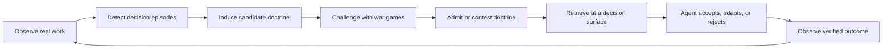
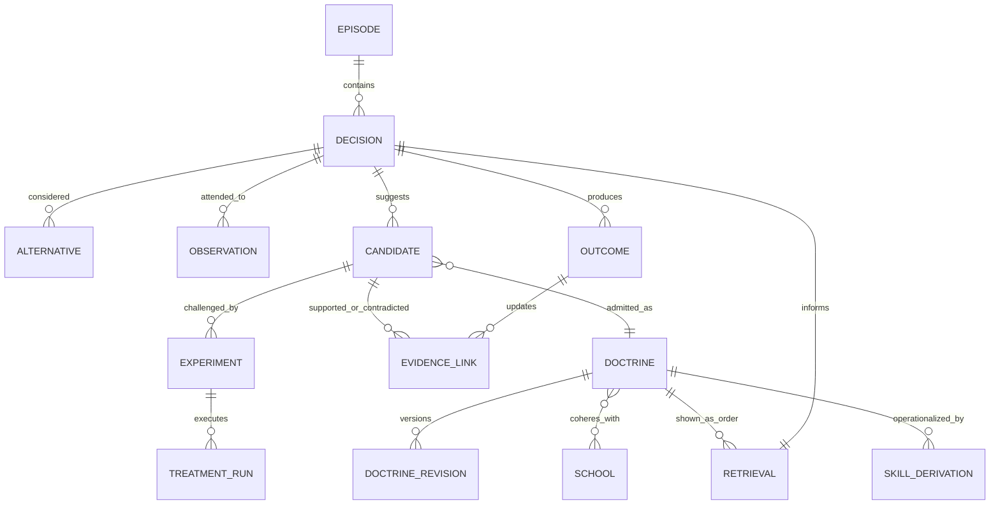
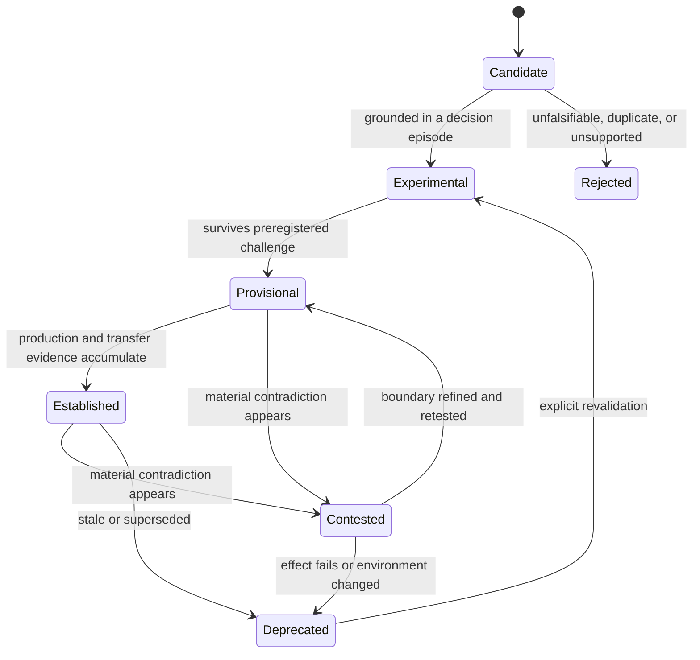
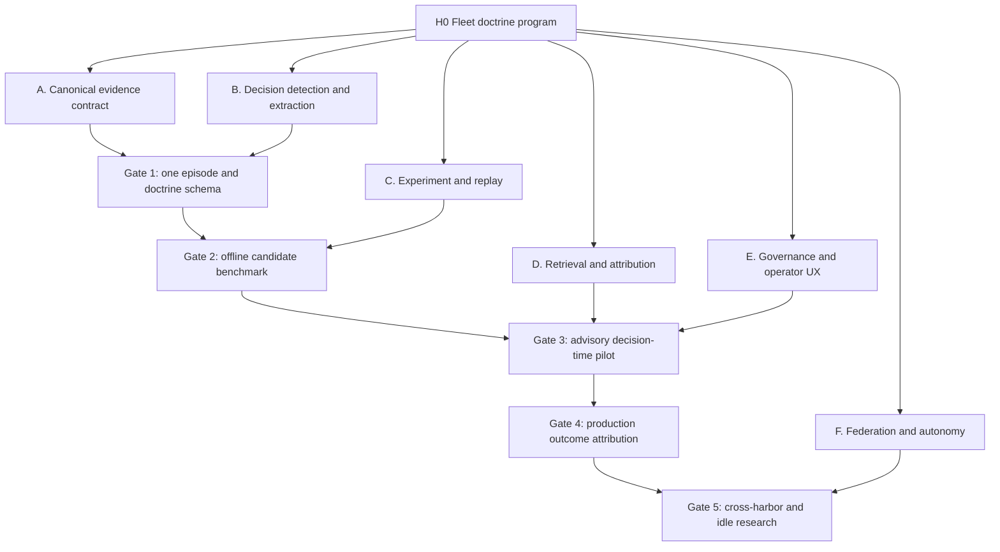

# Empirically Earned Fleet Doctrine

**Status:** Proposed founding architecture

**Roadmap item:** `empirically-earned-fleet-doctrine-architecture`

**Scope:** Port Daddy-wide institutional learning, including transcripts, agent-to-agent deliberation, skills, memory, experiments, dispatch, and decision-time guidance
**Decision:** Build one evidence-bearing doctrine loop that absorbs the useful parts of ADR-0052 and the closed agent-downtime RFC, while retaining transcripts, notes, tuples, episodic memory, semantic graph, Parley, and skills as specialized projections rather than rival memories.

## Abstract

Port Daddy already records a remarkable amount of work: harness transcripts, tool calls, notes, claims, diffs, tests, reviews, CI, Parley turns, salvage events, dispatch receipts, and operator decisions. The missing capability is not storage. It is institutional learning.

This proposal introduces **fleet doctrine**: persistent, falsifiable operating beliefs learned from real development episodes, qualified by the conditions under which they helped, linked to contrary evidence, challenged through controlled replay, retrieved at the moment of a similar decision, and revised after the resulting outcome is known.

A doctrine is not an agent personality, a summary, a skill, or a rule generated from one successful transcript. Its canonical form is:

> **When** observable conditions C hold, **prefer** action A over alternatives B because mechanism M is expected, **unless** boundary E applies. Evidence set S currently supports the claim; contradiction set X limits it; experiment set W estimates causal effects; status Q states how much confidence the fleet should place in it.

The central invariant is:

> **No doctrine without provenance. No guidance without retrieval. No retrieval without outcome attribution. No outcome without returning to the evidence ledger.**

That invariant turns Port Daddy's many persistence mechanisms into a closed loop:



## 1. Why doctrine, not more memory

### 1.1 The useful abstraction

Five artifacts must remain distinct:

| Artifact | Meaning | Canonical example | What validates it |
| --- | --- | --- | --- |
| Fact | An observation about a specific environment | “This fork API omitted command items.” | Direct receipt, source, or reproduction |
| Technique | A reusable method | “Use Launch Services registration before screenshot discovery.” | Successful execution under stated prerequisites |
| Heuristic | A bounded choice rule | “When the app is built but undiscoverable, register it before debugging capture permissions.” | Cases, contrast cases, and falsifiable exceptions |
| Doctrine | A coherent set of heuristics for a decision domain | “Verification burden scales with expected loss and reversibility.” | Cross-case support, interventions, contradiction handling, outcomes |
| School | A coherent, competing family of doctrines | “Closure,” “evidence,” and “expected-loss” schools of integration | Repeated divergent predictions with empirical support |

“Steward is cautious” is personality. It cannot be falsified and does not tell another agent what evidence to inspect. “For irreversible integration decisions, unresolved independent technical evidence receives blocking weight; unresolved administrative state alone does not” is doctrine. It predicts behavior, names a mechanism, and can lose.

Schools are organized by **decision domain**, never by temperament or model brand. Candidate domains include integration, verification, implementation, exploration, coordination, recovery, dependency, maintenance, security, and operator interruption. An agent may use different schools in different domains. A school is a hypothesis about effective engineering, not a character class.

### 1.2 Why existing memory does not close the loop

Current Port Daddy surfaces are useful but incomplete as an institutional-learning system:

- `lib/transcripts.ts` and the transcript event stream preserve execution evidence.
- `session_notes` capture explicit progress, decisions, blockers, and handoffs.
- `lib/episodic-memory.ts` promotes notes and handoffs into durable episodes and projects them into tuples and graph edges.
- `lib/knowledge-custodian.ts` harvests and expires episodes.
- `lib/briefing.ts` composes session state, notes, and salvage, including a context-budget-aware compressed form.
- `lib/parley.ts` and `lib/quorum.ts` preserve structured disagreement and collective decisions.
- `lib/graph-edges.ts` stores relationships.
- `lib/shipwright/skill-index.ts` exposes procedural artifacts for retrieval.
- ADR-0052 proposes a trajectory exporter, outcome labels, benchmarks, and policy optimization.

These mechanisms answer “what happened?”, “what should survive?”, “who disagreed?”, or “what procedure might apply?” None makes the full claim “the organization believes A is preferable to B under C, because of evidence S and interventions W; this agent saw that belief before acting; outcome O should now update it.”

The distinction matters because an automatically populated store can be healthy on writes and still inert in practice. A memory that is never presented at a decision surface is an archive. Guidance that is presented but not attributed to the later outcome is folklore.

## 2. Research basis

### 2.1 Cognitive Task Analysis and Critical Decision Method

CTA warns that procedural expertise is often inaccessible to abstract self-report. Experts reconstruct clean explanations that omit fast cue recognition and context-sensitive workarounds. CDM therefore starts with one difficult incident, reconstructs its timeline, deepens specific decision points, and uses contrastive and counterfactual probes to expose discrimination knowledge.

Port Daddy should preserve this structure but improve the evidence. A narrated answer to “why did you do that?” remains a fallible source. A forked replay in which the suspected cue is actually removed is an intervention. The right doctrine harvester uses both:

1. the behavioral transcript to establish what happened;
2. CDM-style structure to locate decision points, cues, rejected alternatives, and boundary conditions;
3. counterfactual replay to test whether a hypothesized cue changes the outcome distribution;
4. later production outcomes to determine whether the guidance helped outside the replay laboratory.

The local `cdm-interviewer` and `windags-skill-cdm-elicitation` protocols contribute the required shape: a specific case, timeline, decision cues, expectancies, counterfactuals, novice traps, workarounds, and falsifiable “when/because/do/unless” heuristics. They do not grant a candidate doctrine status merely because an interview was articulate.

### 2.2 LLM self-explanation is insufficient

Turpin et al. showed that chain-of-thought explanations can rationalize answers influenced by hidden biasing features without naming those features. That result does not prove every reflection is useless; it proves narrated reasoning cannot be treated as a causal trace. [Turpin et al., 2023](https://arxiv.org/abs/2305.04388)

This is the line between conventional transcript distillation and fleet doctrine. Agent Workflow Memory induces reusable workflows from past trajectories and reports strong benchmark gains, but a reusable workflow is still a procedural artifact rather than a causally tested organizational belief. [Wang et al., 2024](https://arxiv.org/abs/2409.07429)

The field is moving toward richer procedural memory. A 2026 benchmark reports that skills evolved from diverse multi-model traces transfer better than skills from any one model source. This supports cross-model evidence as a quality dimension, while also showing that some skills remain role-specific and lose effectiveness under transfer. [Belikova et al., 2026](https://arxiv.org/abs/2606.23127)

### 2.3 Counterfactual replay and causal attribution

Causal Agent Replay models an agent run as a structural causal model, intervenes on a step, re-executes the downstream trajectory, and reports confidence intervals; it also uses a budget-bounded Monte Carlo Shapley estimator for interacting steps. [Shah, 2026](https://arxiv.org/abs/2606.08275)

Contextual Counterfactual Credit Assignment applies a related idea to multi-agent collaboration: freeze transcript-derived context, compare context-matched message alternatives with fixed-continuation replay, and estimate each message's marginal contribution. This is directly relevant to Parley and hackathon transcripts, where the causal unit may be a message, objection, tool result, or role handoff rather than one agent's whole run. [C3, 2026](https://arxiv.org/abs/2603.06859)

Knowledge-Based Zero-Replay Debugging addresses the opposite cost regime: long multi-agent traces contain few decisive events, so candidate ranking should precede expensive replay. That supports a two-stage Admiralty: cheap structural/semantic detection first, controlled replay only where expected information gain justifies it. [Zero-Replay Debugging, 2026](https://arxiv.org/abs/2606.14805)

### 2.4 Organizational and military learning

The military analogy is useful because mature lessons-learned systems distinguish collection, analysis, dissemination, training, and doctrine. The Center for Army Lessons Learned was created to collect and analyze observations, insights, lessons, AARs, experiments, and operational records, then disseminate them for future readiness. [NDU, “Lessons about Lessons”](https://ndupress.ndu.edu/Joint-Force-Quarterly/Joint-Force-Quarterly-79/Article/621147/lessons-about-lessons-growing-the-joint-lessons-learned-program/)

The warning is equally important. AAR systems can remain at the level of correcting performance against a plan without testing whether the plan itself was sound; merely sending reports elsewhere does not force abstraction or synthesis. [Australian Defence design-thinking study](https://www.defence.gov.au/sites/default/files/research-publication/2019/JSPS_3_Design_Thinking.pdf)

Post-flight reviews in fighter squadrons show organizational learning as more than error correction: retrospective sense-making, social comparison, social control, socialization, and bonding all occur at individual, unit, and force levels. [Ron, Lipshitz, and Popper, 2006](https://journals.sagepub.com/doi/10.1177/0170840606064567)

The red-team lesson is that organizations always learn something, but not necessarily something true or beneficial. A doctrine system must make support, contradiction, recency, transfer, and retirement visible. [U.S. Army, “Future Proof”](https://www.armyupress.army.mil/Journals/Military-Review/Online-Exclusive/2024-OLE/Future-Proof/Journals/Military-Review/MR-War-Poetry-Submission-Guide/)

## 3. Architectural decision

### 3.1 One canonical evidence ledger, several projections

The canonical model is a normalized, append-only **doctrine evidence ledger** in local SQLite, projected into the existing semantic graph and federated through Relay. Do not make `doctrine.md`, a vector index, or a model-generated summary canonical.



Every canonical record carries:

- stable ID and schema version;
- project, repository, worktree, harness, model, model version, and environment provenance;
- source receipt pointers and redaction/tombstone state;
- valid-time and observed-time timestamps;
- producing actor and accountable reviewing actor;
- confidence dimensions, not one confidence scalar;
- retention policy and authority scope;
- links to supporting, contradicting, and superseding records.

### 3.2 Doctrine schema

A doctrine revision contains at least:

```yaml
id: doctrine:integration:expected-loss:v3
domain: integration.merge
proposition:
  when: change is high-blast-radius or difficult to reverse
  attend_to:
    - independent technical objections
    - evidence provenance
    - reversibility
  prefer: investigate substantive evidence before integration
  over: treating administrative review state as sufficient evidence
  because: false integration has asymmetric downstream cost
  unless:
    - the objection is disproven by a stronger independent receipt
status: provisional
support:
  observational: [episode:12, episode:81]
  counterfactual: [experiment:184]
contradictions: [episode:103]
confidence:
  observational_support: 0.72
  counterfactual_support: 0.64
  cross_model_robustness: 0.41
  cross_project_robustness: 0.18
  production_outcome_support: 0.55
  recency: 0.91
authority:
  mode: advisory
  scope: [project:port-daddy]
last_challenged_at: 2026-08-23T00:00:00Z
```

These scores are calibrated summaries with links to the observations that generated them. They never replace sample counts, intervals, or raw outcomes.

### 3.3 Lifecycle and admission



Admission requirements:

1. **Candidate:** one concrete decision episode, observable cue, action contrast, mechanism hypothesis, and falsifiable exception.
2. **Experimental:** provenance complete; no train/test leakage; outcome taxonomy fixed before replay.
3. **Provisional:** at least one preregistered challenge with baseline and treatment arms; effect and uncertainty reported; no unresolved high-severity red-team finding.
4. **Established:** evidence from real work and at least two model or project strata; no single model family contributes a majority of effective sample weight; last challenge within the domain's staleness window.
5. **Contested:** automatically entered when a high-quality contradictory episode, failed transfer, or material environment change arrives.
6. **Deprecated:** remains queryable with rationale and descendants; it is excluded from default guidance.

No doctrine directly becomes an enforced policy. Enforcement requires a separate ADR naming authority, operator control, safety analysis, and rollback. Doctrine is advisory by default.

## 4. The doctrine cycle

### 4.1 Logbook: automatic evidence capture

The Logbook is not a new transcript store. It is the canonical episode view over existing receipts:

- harness-native and Port Daddy-owned transcript events;
- tool calls and outputs;
- notes, claims, locks, tuples, inboxes, and channels;
- Parley and quorum turns and outcomes;
- diffs, commits, reviews, CI, merge queue, deploy, and later incident evidence;
- dispatch, salvage, resurrection, retry, and interruption events;
- produced artifacts and their visual/test verification.

ADR-0118 remains the harness boundary: raw provider transcripts are evidence inputs, not the interchange format. The Logbook accepts T0–T5 fidelity but marks which causal questions each level can support. A T2 final-output capture cannot support turn-level cue removal. A T5 resumable transcript may.

Decision episodes are detected with structural and hybrid retrieval, never lexical-only rules. Candidate signals include:

- tool failure followed by a changed action;
- rejected alternative followed by verified success;
- reversal after new evidence;
- disagreement followed by a durable outcome;
- surprising success using a rare skill or technique;
- confident failure contradicted by later receipts;
- resurrection or fork that diverges from its parent;
- doctrine shown then explicitly rejected;
- multiple agents reaching different choices from comparable states.

The detector emits a ranked candidate with source spans. It does not write doctrine.

### 4.2 Admiralty: induction and CDM extraction

The Admiralty is an offline, budgeted analysis service. It performs four passes:

1. **Ground:** lock one episode and its outcome receipts.
2. **Timeline:** reconstruct events without interpretation.
3. **Decision deepening:** identify observed cues, alternatives, expected outcomes, confidence, and skill use.
4. **Contrast:** identify novice errors, absent-cue counterfactuals, boundary cases, and falsifiers.

Candidate induction then clusters only structurally comparable decisions. Similar text is not enough. The cluster must share a decision class, available actions, and outcome semantics. Parley disagreement is especially valuable because it supplies naturally occurring competing policies, but participants are not independent samples when they shared context or model lineage.

### 4.3 War Games: controlled intervention

Expensive replay is reserved for candidates with high expected value of information:

```text
priority = recurrence × decision_stakes × uncertainty × disagreement × replay_fidelity
           -------------------------------------------------------------------------
                              expected_experiment_cost
```

Each experiment records hypothesis, source checkpoint, eligibility, exclusions, treatments, models, temperatures, seeds when supported, outcome rubric, sample-size rule, stopping rule, and analysis code before execution.

Minimum design:

- factual A/A replays establish stochastic baseline variance;
- treatment arms change one hypothesized cause at a time;
- positive controls change a factor expected to matter;
- negative controls change irrelevant presentation state;
- replay uses the original model/harness when available, then tests transfer separately;
- no replay writes to the source session;
- all arms fork from the same immutable checkpoint;
- graders are blinded to arm labels where feasible;
- primary endpoints are externally observable actions or verified artifacts, not narrated agreement;
- effect sizes and intervals accompany significance tests;
- sequential stopping is permitted only when preregistered.

For binary outcomes, use paired randomization or an exact test when pairing is lost; report risk difference and interval. For multi-class actions, report the full transition matrix and an omnibus randomization test before pairwise claims. For interacting cues, use factorial designs or Shapley-style allocation with an explicit compute budget. “Twenty runs” is not a universal rule: pilot variance informs power, and inconclusive results remain inconclusive.

Repeated forks from one checkpoint estimate **within-checkpoint model variance**. They do not create twenty independent engineering cases and cannot establish fleet-wide generality. Every report therefore separates checkpoint count, replay count, model lineage, project count, and effective sample size. Generalization claims require replication across independently sourced decisions, projects, and model families. Where agents exchange messages or share retrieved doctrine, the no-interference assumption is false; assignment and analysis must occur at the conversation, team, worktree, or project cluster rather than pretending each agent is an independent unit.

### 4.4 Sailing Orders: progressive disclosure at decision time

Doctrine only lives if it is retrieved automatically at a relevant decision surface. Initial decision classes:

- `integration.merge`
- `verification.close`
- `implementation.patch_or_redesign`
- `exploration.familiar_or_research`
- `coordination.local_delegate_parley`
- `recovery.retry_replan_fork_salvage`
- `dependency.build_adopt_vendor`
- `maintenance.compatibility_or_supplant`
- `security.allow_block_escalate`

The packet is small:

```text
Relevant fleet doctrine

Expected-loss school · provisional · production support 0.55
For hard-to-reverse changes, investigate independent technical evidence before integration.
Administrative review state alone is not evidence.

Material disagreement: Evidence school predicts a lower burden when receipts already disprove the objection.
[Open 2 supporting episodes] [Open experiment] [Dismiss for this decision]
```

Retrieval uses the repository's shared hybrid search policy: structured filters plus BM25 and the canonical local embedder, fused and reranked. Every returned ID is validated against the candidate set. Below the confidence floor, Port Daddy says it has no relevant doctrine.

Every packet emits a `doctrine_retrieval` receipt linking doctrine revision, decision ID, rank, score components, disclosure depth, and agent-visible text. The agent may follow, adapt, reject, or ignore it. The choice is recorded without moral language.

### 4.5 Sea Trials and After-Action Board

A retrieval starts an attribution window. The resulting decision, code, tests, review, CI, merge, deployment, and delayed incidents become a new episode. Four cohorts matter:

- doctrine retrieved and followed;
- doctrine retrieved and adapted;
- doctrine retrieved and rejected;
- doctrine eligible but withheld as a control.

Observational comparisons among those cohorts are not causal because retrieval and compliance are selected. Production rollouts therefore use stepped-wedge or randomized encouragement designs where safe: vary whether an advisory packet is shown, never whether a safety gate applies. Measure decision quality, time, cost, reversals, defects, and operator burden.

Doctrine is also part of the treatment environment. Showing a rule changes action, which changes the evidence later available to revise that rule. This performative feedback loop can manufacture apparent confirmation even when every receipt is authentic. The pilot therefore reserves clean holdout clusters, labels every episode by prior doctrine exposure, prevents treatment-derived episodes from entering control-era evaluation sets, and periodically re-estimates effects on fresh projects. A small exploration reserve receives no doctrine or receives a competing doctrine when safety permits. The system must be able to learn that its own guidance caused convergence, not merely observe that convergence occurred.

An agent that rejects doctrine and succeeds with stronger evidence creates a high-priority contradiction candidate. Correct disobedience is one of the fleet's richest learning events.

## 5. Multi-agent chatter as expertise

Multi-agent interaction is not merely several individual transcripts concatenated. The unit of expertise may be an interaction pattern:

- an objection that changes another agent's search;
- a minority report later vindicated by CI;
- a handoff that introduces the missing cue;
- a proposal/critique/revision sequence that creates a solution no participant initially held;
- duplicated work revealing failed discovery;
- rapid consensus revealing correlated models rather than independent support.

The closest methodological pieces are distributed across fields:

- Interactive Team Cognition treats interaction itself as the cognitive process, not merely a window into private mental models.
- IBIS-style issue/position/argument structures map naturally onto Parley's typed turns.
- software-engineering rationale mining shows that development chat contains extractable decision rationale;
- multi-agent debate research generally optimizes a final answer and discards the interaction as reusable knowledge;
- C3 supplies a direct counterfactual method for estimating the marginal contribution of messages in LLM collaboration.

Port Daddy should therefore derive **interaction episodes** with:

- participants, base actor lineage, model family, role, and information boundary;
- shared context hash and per-participant private context hash;
- typed turn graph (`propose`, `critique`, `revise`, `agree`, `refuse`, `inform`);
- claim and evidence references made by each turn;
- belief/action transition after each turn;
- final joint decision and durable outcome;
- dependence markers for shared prompts, shared model, or leaked in-progress state.

Do not count five personas of one base model as five independent experts. Preserve both **nominal N** and **effective N** based on lineage, context overlap, and correlated choices. Minority positions remain first-class evidence.

## 6. Always-on research, pilots, and hackathons

The closed PR #4071 contains a valuable product ambition: during genuine downtime, project pilots should research their field, refine skills and docs, form forceful evidence-backed views, and sometimes return with prototypes or presentations. This proposal absorbs that ambition but changes its governing unit from “self-originated dispatch” to **doctrine-governed research charter**.

### 6.1 Creativity that accrues rather than performs

Agents can influence future human and agent creativity by:

- introducing unfamiliar techniques at the right moment;
- preserving rejected-but-interesting ideas;
- connecting distant episodes;
- challenging a doctrine with a concrete prototype;
- making a minority school legible enough to test;
- generating artifacts that change what operators consider possible.

The system must not pretend this is spontaneous personhood. It is cumulative institutional creativity: durable ideas, evidence, and artifacts alter later option spaces. A forceful view is earned by accurate predictions, useful prototypes, and survived challenges, not by tone.

### 6.2 Research charters

An idle pilot may propose research only when:

- no operator work or higher-priority roadmap obligation is waiting;
- the daemon proves an isolated worktree, spend cap, time cap, and egress policy;
- the proposal cites a concrete anomaly, open doctrine question, skill gap, or rejected-but-interesting idea;
- expected information gain exceeds cost;
- the requested autonomy tier permits the output;
- all external effects remain operator-gated.

Allowed outputs by default: evidence memo, experiment design, local prototype, skill amendment, documentation patch, visual demo, or pitch. Disallowed without explicit approval: deployment, credential changes, public messages, purchases, destructive migration, enforcement-policy changes, or merging the agent's own experiment.

### 6.3 Hackathons

Hackathons are deliberate fleet exercises, not cheap parallel sampling.

1. The operator or Admiralty publishes a bounded challenge and budget.
2. Agents independently brainwrite proposals before seeing others.
3. A directory query forms teams based on complementary demonstrated capability, not self-description alone.
4. Personas receive separate worktrees, budgets, private contexts, and outcome ledgers; shared base lineage remains visible.
5. Teams build demonstrable artifacts.
6. A Parley-style expo records pitch, critique, revision, minority report, and vote.
7. External judges evaluate blinded artifacts against criteria fixed before judging.
8. The After-Action Board mines both product results and interaction mechanisms.

The same base agent may join several teams, but those teams are not independent evidence. Persona outcomes roll up to the base actor; a fresh label cannot erase a poor record. Live actor-soul registration and clean-exit graduation are prerequisites, not future polish.

## 7. Storage and federation

### 7.1 Local authority

Local SQLite remains authoritative for single-harbor doctrine because it already hosts the evidence-producing tables and supports transactional joins. The doctrine ledger writes atomically, then projects to graph and search indexes. Raw transcripts stay in their existing stores; the ledger holds stable references, hashes, and redaction state.

### 7.2 Cloud coordination

Relay carries signed doctrine events and evidence references across harbors. A Cloudflare Durable Object is appropriate only as a **per-doctrine or per-experiment coordination atom** where serialized admission, review, or scheduling is required. Cloudflare recommends designing one object per logical coordination unit rather than a global singleton, using SQLite-backed storage and RPC methods. Durable Object storage is strongly consistent and serializable within one object, and SQLite-backed objects support point-in-time recovery. [Cloudflare Durable Objects](https://developers.cloudflare.com/durable-objects/) [Storage guidance](https://developers.cloudflare.com/durable-objects/best-practices/access-durable-objects-storage/)

Do not put the global doctrine corpus in one Durable Object. Proposed atoms:

- `DoctrineReviewDO(doctrineId)` serializes revision proposals, votes, and admission state;
- `ExperimentDO(experimentId)` owns preregistration, arm allocation, budget, and stopping state;
- `HackathonDO(eventId)` owns team roster, private-round boundaries, deadlines, and expo receipts.

Large artifacts live in R2; queryable federated projections live in D1; transport uses Relay. Local truth remains usable offline. Remote events are merged by immutable IDs and signed provenance, not last-writer-wins summaries.

## 8. Supplant and compose ledger

| Existing ambition or surface | Decision | Result |
| --- | --- | --- |
| ADR-0052 trajectory export and RL loop | **Absorb and supersede as an implementation program** | Keep episode schema, honest outcome labels, synthetic harbor, Goodhart audits, and consumer-agnostic export. Replace reward-first policy optimization as the organizing architecture with evidence → doctrine → retrieval → outcome. Training becomes one downstream consumer, never the canonical learner. |
| Closed PR #4071 downtime R&D and hackathons RFC | **Absorb and supersede** | Retain self-originated research, pitch output, opportunity Parley, persona isolation, HITL budgets, and roster promotion. Replace unsupported autonomy and personality framing with research charters, evidence-backed schools, and doctrine experiments. |
| Episodic memory | **Retain as an evidence projection** | Episodes remain durable observations. Add decision/experiment/doctrine linkage and decision-time retrieval; do not expand `episodic_memory` into the doctrine ledger. |
| Semantic graph | **Retain and wire** | Project canonical ledger relationships into graph edges. Graph is a lens, not authority. |
| Briefings and sitrep | **Supplant fragmented memory summaries with a shared context composer** | The composer may include recent notes, salvage, episodic recall, and relevant doctrine under a token budget. Remove duplicate ranking logic once the shared composer ships. |
| Notes | **Retain** | Immutable human/agent assertions and handoffs remain evidence. They never establish causality alone. |
| Tuples | **Retain for coordination** | Use for live signals and machine-readable invitations, not permanent doctrine truth. |
| Parley and quorum | **Retain and extend** | Preserve typed disagreement; emit interaction episodes and doctrine evidence. Quorum does not convert popularity into truth. |
| Skills | **Retain as executable procedural projections** | A doctrine may derive or revise a skill. Skills cite doctrine/evidence IDs; successful skill use feeds the ledger. |
| Actor souls and reputation | **Complete before persona experiments** | Wire live registration and clean-exit graduation; bind personas to base actors; use demonstrated outcomes in discovery. |
| Pheromones/file heat | **Narrow** | Keep ephemeral contention signals. Do not use them as doctrinal evidence without durable source receipts. |
| FleetBar/dashboard | **Make the operator surface** | Doctrine inbox, evidence explorer, experiment approvals, contest/deprecate controls, and hackathon expo belong here. No routine operator CLI. |

This program targets the accepted Agent Harbor creation chain: `WorkIntent → WorkPlan → AgentNode → AnodeAdapter`. It does not add a second launch or identity path. Canonical doctrine, experiment, retrieval, and outcome facts append to the existing `harbor_events` ledger; doctrine tables, episodic memory, graph edges, briefings, and search indexes are rebuildable projections. The `schemas/agent-harbor/v0` freeze is amended once, in its owning binder wave, rather than independently by this program. Rust remains limited to security primitives under ADR-0120; doctrine product logic stays in TypeScript.

## 9. Hypertree implementation plan

The work is a hypertree because independent child sets can proceed in parallel, while explicit join gates prevent partial architecture from masquerading as completion.



### Wave 0 — constitutional contract

- [ ] Accept or reject this RFC as the binder's owning doctrine chapter.
- [ ] Mark ADR-0052 superseded-by this architecture while preserving its implementation evidence.
- [ ] Mark PR #4071's branch as absorbed, with an ambition ledger for every retained/rejected idea.
- [ ] Define authority: doctrine advisory; policy/enforcement requires a separate ADR.
- [ ] Publish privacy, retention, redaction, and deletion semantics.
- [ ] Freeze vocabulary for episode, decision, candidate, experiment, doctrine, school, retrieval, application, and outcome.

**Gate:** Architect of Record audit passes: every capability has owner, acceptance gate, and evidence link; all three binder coverage axes are complete.

### Wave 1 — evidence plane

Parallel branches:

**A1. Episode contract**

- [ ] Extend ADR-0052's exporter into canonical `DecisionEpisode/v1` records.
- [ ] Merge transcript, note, claim, Parley, artifact, cost, review, CI, and outcome chronology.
- [ ] Emit fidelity and missingness declarations.
- [ ] Enforce referential integrity to source receipts and tombstones.

**A2. Doctrine ledger**

- [ ] Add doctrine event kinds to the existing append-only `harbor_events` contract and normalized rebuildable projections for candidates, revisions, experiments, evidence links, retrievals, applications, outcomes, and schools.
- [ ] Make all changes append-only revisions with explicit supersession.
- [ ] Project relationships into `graph_edges` after commit.
- [ ] Bind every runtime action to the accepted `WorkIntent → WorkPlan → AgentNode → AnodeAdapter` path; add no direct `spawn`, raw launch-intent, or private event-bus path.

**A3. Shared context composer**

- [ ] Replace separate briefing/sitrep/memory ranking paths with one token-budgeted composer.
- [ ] Include salvage, recent notes, episodic recall, and doctrine as typed sections.
- [ ] Preserve source links and exclusion reasons.

**Gate:** one real historical session round-trips from raw receipts to a decision episode and back; deleting a derived projection does not delete source truth.

### Wave 2 — detection and induction

- [ ] Build structural decision-point detectors for failures, reversals, alternative rejection, disagreement, forks, and verified artifacts.
- [ ] Add hybrid semantic ranking using the shared embedder and BM25/RRF.
- [ ] Create an annotation gallery from real Claude, Codex, Agy, Gemini, and Port Daddy-owned transcripts.
- [ ] Add interaction-episode extraction for Parley, inbox, tube, and multi-agent transcript sources.
- [ ] Implement CDM four-sweep candidate extraction with explicit cue/alternative/exception fields.
- [ ] Establish a blinded human/operator benchmark: candidate-worthy, decision boundary, cue, alternative, outcome.

**Gate:** detector precision and recall meet preregistered thresholds on held-out projects; no provider-specific parser is treated as the canonical model.

### Wave 3 — war-game laboratory

- [ ] Implement immutable point-in-time fork adapters, starting with Codex `thread/fork`, then each harness's truthful capability.
- [ ] Support prompt/item masking, tool-result substitution, fact removal, role/message removal, and alternative-action steering.
- [ ] Add A/A baseline, positive/negative controls, factorial arms, blinded grading, power planning, and exact/randomization analysis.
- [ ] Report checkpoint N separately from replay N; prohibit fleet-generalization claims from repeated samples of one checkpoint.
- [ ] Add replay-fidelity checks that compare the factual arm to historical behavior before interpreting treatments.
- [ ] Persist preregistration and every treatment receipt.
- [ ] Build a synthetic planted-cause suite and at least three real ambiguous cases.

**Gate:** recover planted causes with calibrated intervals; refuse causal claims when factual replay fidelity fails.

### Wave 4 — doctrine admission and decision-time pilot

- [ ] Build candidate review in FleetBar: evidence, contradiction, experiment, boundary, and status.
- [ ] Admit only provisional advisory doctrine.
- [ ] Add decision-class detection at selected hooks.
- [ ] Retrieve a maximum three doctrines with disagreement preserved.
- [ ] Emit retrieval and agent-response receipts.
- [ ] Run a safe randomized-encouragement pilot on non-security, reversible decisions.
- [ ] Randomize at a non-interfering cluster boundary and reserve clean holdout clusters protected from treatment-derived evidence contamination.

**Gate:** doctrine exposure improves a preregistered quality metric without increasing operator corrections, cost, or cycle time beyond limits; all effects include uncertainty.

### Wave 5 — continuous revision and skills

- [ ] Attribute production outcomes across followed/adapted/rejected/withheld cohorts.
- [ ] Open contradiction candidates automatically for failed applications.
- [ ] Add recency and model/environment change alarms.
- [ ] Derive skill amendments with doctrine and evidence citations.
- [ ] Measure whether the skill improves held-out tasks before promotion.
- [ ] Retire duplicate skill-harvest and memory-retrieval paths once the shared loop proves parity.

**Gate:** at least one doctrine is strengthened, one boundary is narrowed, and one doctrine is deprecated from real feedback; no status change lacks source evidence.

### Wave 6 — multi-agent expertise, downtime R&D, and hackathons

- [ ] Complete live actor-soul registration and clean-exit graduation.
- [ ] Add demonstrated-capability discovery with independence/effective-N metadata.
- [ ] Ship bounded research-charter proposals and operator approvals in FleetBar.
- [ ] Run independent brainwriting before team formation.
- [ ] Isolate personas by worktree, budget, context, and receipts; roll outcomes to base actors.
- [ ] Run one internal hackathon with externally judged artifacts.
- [ ] Mine interaction episodes and replay at least one message-level causal hypothesis.

**Gate:** no external side effect without operator approval; no persona launders identity; useful artifact rate and operator value exceed cost; disabling the program stops all autonomous work immediately.

### Wave 7 — federation and scheduled fleet exercises

- [ ] Federate signed doctrine revisions and evidence references through Relay.
- [ ] Use per-doctrine/per-experiment Durable Objects only where serialization is required.
- [ ] Keep large artifacts in R2 and searchable projections in D1.
- [ ] Add cross-harbor scope, consent, provenance, and deletion propagation.
- [ ] Schedule revalidation across model versions and projects.

**Gate:** two harbors reproduce a doctrine experiment from shared provenance without sharing disallowed raw content; deletion/tombstone propagation passes.

## 10. White, blue, and red positions

### White-team strongest case

Port Daddy has already paid the expensive cost of instrumentation. The marginal architecture needed to turn exhaust into institutional knowledge is now smaller than the continued cost of repeated rediscovery. Doctrine can make skills safer, memory useful, agent disagreement cumulative, and autonomy measurable. The strongest version does not replace judgment; it gives judgment traceable priors and a way to learn when those priors fail.

### Blue-team reconciliation

The architecture succeeds only if it is an organizing contract over existing primitives. ADR-0118 owns harness truth. ADR-0052 supplies much of the episode and evaluation machinery. Episodic memory remains a projection. Parley remains the disagreement protocol. Skills remain executable doctrine projections. FleetBar remains the operator surface. Relay remains transport. Rust remains the security boundary per ADR-0120. Any implementation that creates parallel transcript, memory, search, identity, or approval systems violates the design.

### Red-team strongest case

The system risks converting correlated model behavior into institutional dogma, laundering self-generated evidence through synthetic replays, rewarding agents for producing harvestable drama, leaking sensitive transcripts, and creating autonomous busywork whose polished artifacts overwhelm operator attention. Model and harness changes can invalidate old effects. Replay may perturb state more than the hypothesized cue. “Schools” can become mythology. Retrieval can anchor decisions and reduce exploration. A ranking system will be gamed.

Its most dangerous failure is performative: guidance changes behavior, behavior becomes evidence, and the resulting evidence appears to validate the guidance. A second statistical failure is pseudoreplication: thousands of stochastic continuations from a handful of checkpoints can produce narrow intervals around a fact that does not transfer beyond those checkpoints. A third is interference: agents that talk, share a codebase, or read the same doctrine contaminate one another's treatment assignment.

The red team permits a pilot only if:

- doctrine is advisory and easy to disable;
- raw evidence and contrary cases remain inspectable;
- production effects are separated from synthetic effects;
- source and evaluator model lineages are visible;
- factual replay fidelity is measured;
- admission and stopping rules are preregistered;
- privacy and deletion are enforced transitively;
- autonomous research is isolated, budgeted, reversible, and operator-gated;
- the first pilot withholds doctrine from a safe control cohort;
- randomization occurs at the smallest credible non-interfering cluster;
- replay N, checkpoint N, project N, and effective N are reported separately;
- control evaluation data cannot be trained on treatment-derived episodes;
- kill criteria are automatic.

Kill the pilot if doctrine exposure increases defect rate, operator correction burden, ungrounded confidence, security exceptions, or spend beyond the preregistered bound; if source deletion cannot propagate; if independence metadata are missing; or if the system cannot explain why a doctrine was shown.

## 11. Rejected but interesting alternatives

1. **Write doctrine directly into `SKILL.md`.** Rejected because a skill is an execution artifact and cannot represent competing beliefs, experiments, contradictions, or production attribution. Revisit only as a generated projection.
2. **Train the behavior into model weights.** Rejected as the canonical layer because weights obscure provenance, make deletion difficult, and conflate organization-specific beliefs with a model. Retain as an ADR-0052 downstream consumer after the doctrine loop is proven.
3. **One global cloud doctrine service.** Rejected because it creates a trust, privacy, latency, and availability choke point. Federate signed local authority.
4. **Agent personalities as schools.** Rejected because tone is not expertise. Preserve evidence-backed domain schools and let personas be presentation/coordination identities only.
5. **Always retrieve the winning doctrine.** Rejected because disagreement and boundary conditions are often the most decision-relevant information. Retrieve material dissent.
6. **Replay every candidate.** Rejected on cost and multiple-testing grounds. Rank by expected information gain and preserve an untested status.

## 12. Proof checklist

- [ ] Every doctrine revision links supporting and contradicting evidence.
- [ ] Every causal claim links a preregistered experiment and factual-fidelity result.
- [ ] Every decision-time packet emits an agent-visible retrieval receipt.
- [ ] Every attributed outcome links to the decision and retrieval that preceded it.
- [ ] Synthetic, observational, and production evidence remain separate dimensions.
- [ ] Model, harness, prompt, tool, project, and environment provenance are queryable.
- [ ] Multi-agent effective N is reported alongside nominal N.
- [ ] Replay count is never presented as independent-case count.
- [ ] Doctrine exposure and cross-agent contamination are queryable for every evaluation episode.
- [ ] Fresh holdout clusters remain outside the doctrine-generated evidence loop.
- [ ] Minority reports survive consolidation.
- [ ] Source deletion creates transitive tombstones in derived doctrine and skills.
- [ ] Retrieval refuses low-confidence matches.
- [ ] Doctrine is advisory unless a separate accepted ADR grants enforcement authority.
- [ ] FleetBar exposes review, contest, deprecate, approve, and kill controls.
- [ ] No autonomous research starts without proven isolation, budget, and operator policy.
- [ ] A complete cold-start path works with zero doctrine.
- [ ] The system can be disabled without disabling transcripts, notes, or ordinary Port Daddy coordination.

## 13. References

- Miles Turpin et al., [“Language Models Don't Always Say What They Think”](https://arxiv.org/abs/2305.04388), 2023.
- Zora Zhiruo Wang et al., [“Agent Workflow Memory”](https://arxiv.org/abs/2409.07429), 2024.
- Jaineet Shah, [“Causal Agent Replay”](https://arxiv.org/abs/2606.08275), 2026.
- [“Contextual Counterfactual Credit Assignment for Multi-Agent Reinforcement Learning in LLM Collaboration”](https://arxiv.org/abs/2603.06859), 2026.
- [“Knowledge-Based Zero-Replay Debugging of Multi-Agent LLM Traces”](https://arxiv.org/abs/2606.14805), 2026.
- Julia Belikova et al., [“Managing Procedural Memory in LLM Agents”](https://arxiv.org/abs/2606.23127), 2026.
- Juan Perdomo et al., [“Performative Prediction”](https://proceedings.mlr.press/v119/perdomo20a.html), ICML 2020. Predictions used for decisions can change the distribution they purport to predict; doctrine retrieval has the same feedback shape.
- Dean Eckles, Brian Karrer, and Johan Ugander, [“Design and Analysis of Experiments in Networks”](https://web.stanford.edu/~jugander/papers/jci17-designanalysis.pdf), 2017. Agent communication creates interference, motivating cluster-level assignment and analysis.
- Ilia Shumailov et al., [“AI models collapse when trained on recursively generated data”](https://www.nature.com/articles/s41586-024-07566-y), *Nature* 631, 2024. The setting differs from doctrine retrieval, but its recursive-data warning supports preserving external and human-origin evidence as a distinct stratum.
- Neta Ron, Raanan Lipshitz, and Micha Popper, [“How Organizations Learn: Post-flight Reviews in an F-16 Fighter Squadron”](https://journals.sagepub.com/doi/10.1177/0170840606064567), 2006.
- National Defense University Press, [“Lessons about Lessons: Growing the Joint Lessons Learned Program”](https://ndupress.ndu.edu/Joint-Force-Quarterly/Joint-Force-Quarterly-79/Article/621147/lessons-about-lessons-growing-the-joint-lessons-learned-program/), 2015.
- Cloudflare, [Durable Objects documentation](https://developers.cloudflare.com/durable-objects/) and [SQLite storage guidance](https://developers.cloudflare.com/durable-objects/best-practices/access-durable-objects-storage/).
- Port Daddy, [`docs/adr/0052-trajectory-export-and-rl-loop.md`](../adr/0052-trajectory-export-and-rl-loop.md).
- Port Daddy, [`docs/adr/0118-harness-adapter-contract.md`](../adr/0118-harness-adapter-contract.md).
- Port Daddy, [`docs/architecture/agent-harbor-technical-binder/15-recursive-critical-synthesis.md`](../architecture/agent-harbor-technical-binder/15-recursive-critical-synthesis.md).
- Port Daddy, [`docs/research/offline-counterfactual-cdm-for-agent-transcripts.html`](../research/offline-counterfactual-cdm-for-agent-transcripts.html).

## 14. Binder Architect-of-Record ledger

### Coverage matrix

| Axis | Covered now | Remaining proof owner |
| --- | --- | --- |
| Customer/deployment | Single developer, local harbor, multi-harbor federation, offline operation, model-server-backed agents | Product owner must validate FleetBar workflows with a real operator study |
| Technical contingency | Missing transcript fidelity, replay failure, model drift, privacy deletion, stale doctrine, low-confidence retrieval, cloud outage, budget exhaustion | Each implementation wave owns fault-injection tests before its gate |
| Architecture consistency | Harness boundary, SQLite authority, graph projection, Relay transport, Durable Object atoms, FleetBar operator surface, Rust security boundary | Architect of Record must reconcile every implementation PR against this RFC and ADR-0120 |

### Ambition archaeology

| Ambition | Classification | Destination |
| --- | --- | --- |
| Trajectory export and RL loop | Superseded as top-level architecture; absorbed as downstream implementation | Waves 1, 3, and 5 |
| Agent downtime research and hackathons | Superseded as standalone RFC; absorbed with stricter charter | Wave 6 |
| Session intelligence / eureka mining | Absorbed | Waves 2 and 5 |
| Episodic memory as long-term context | Narrowed to evidence projection | Waves 1 and 4 |
| Agent personalities with forceful views | Rejected as epistemic unit; translated into evidence-backed schools | Sections 1 and 6 |
| Multi-agent debate as consensus | Narrowed; disagreement and interaction causality preserved | Section 5 |
| Reputation-based discovery | Deferred until live actor identity is complete | Wave 6 |

`binder-aor-log: 2026-08-23 confidence=0.82 finding=founding architecture complete at proposal level; implementation evidence absent gates_changed=ADR-0052 and closed PR-4071 classified for supersession handover=Wave-0 authority and schema review`
