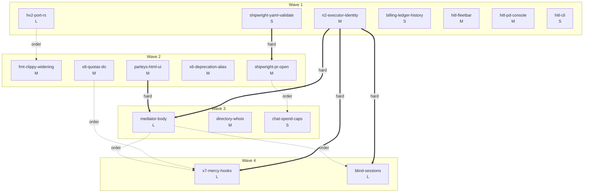

# Grand-Plan Execution DAG — the remaining work as skillful agent nodes

**Status:** Proposal — 2026-08-04.
**Method:** `jury_rig-architect` + `dag-planner` + `skillful-node-prompt` (all three
loaded and followed).
**Inputs:** `docs/proposals/relay-grand-plan.md`, `docs/adr/0120-rust-kernel-boundary.md`,
`docs/hitl-interruptions.md`, and the in-code deferred-scope headers of
`apps/relay/src/parleys.ts`, `presence.ts`, `harbors.ts`, `shipwright.ts`,
`billing-page.ts` (verified in-tree at planning time).

**Shipped and therefore NOT planned here:** X2 remote harbors, X3 presence + helm v1,
X4 parleys v1, Shipwright chat MVP, billing FE MVP, Mercy v1 (`mercy.ts` +
`2026-08-04-mercy-health.sql`), HITL interruptions server side
(`interruptions.ts` + nag engine + `/account/interruptions`).

**ALREADY IN FLIGHT elsewhere (other agents own these — no node, do not double-plan):**
XO editor/triage ship, the role library, the website design pass.

**Baseline skills for every node** (not repeated per node): `port-daddy-internal-dev`
(contributor manual — actors, release ceremony, repo conventions) and
`agent-pr-authoring` (how to land the PR). Each node below lists only its
*specialist* skills on top of that baseline.

## Judgment calls (named, per doctrine "no silent reconciliation")

1. **Label mapping.** The task list's "X1 whois/talent/skill-search" is the grand
   plan's **§X5 directory + whois** (plan §X1 is provenance tiers, a different
   feature). The task's "X5 private/blind sessions" is the plan's **§L2 blind room**,
   narrowed to a first slice. Nodes below carry capability names with both labels
   recorded, so the orchestrator and the plan doc never disagree silently.
2. **One node added beyond the given list: `n2-executor-identity`.** Verified in-tree:
   `apps/fleet-executor/src/squid-events.ts` states the executor "holds no harbor
   card and no Ed25519 identity." The mediator body ("summonses ride the hash chain,"
   plan §X4), blind-session receipts (§L2), and X7's run-concluded reconciliation all
   *hard-depend* on plan §N2. Planning them without it would violate doctrine D2
   ("attest the bottom first"). It is small and unblocks three nodes.
3. **Hard edges vs ordering edges.** Edges are typed. `hard` = semantically blocked
   (executing early produces a wrong or doctrine-violating artifact). `order` =
   resource/merge-conflict avoidance or "instrumentation lands after the thing it
   measures" — an orchestrator MAY violate `order` edges under pressure, never `hard`
   ones.
4. **`fmt-clippy-widening` runs after the hv:2 port**, not before: the port is the
   top-priority kernel item (ADR-0120), both touch `core/harbor-card-rs` (resource
   conflict → different waves per dag-planner), and sequencing the sweep second means
   clippy gates the newly ported code too.
5. **Shipwright chain is serialized** (`yaml-validate → pr-open → spend-caps`): the
   first edge is hard (the server must never open a PR containing YAML it cannot
   validate); the second is an `order` edge only (all three edit `shipwright.ts`).

---

## 1. The DAG



Solid double arrows are **hard** dependencies; dotted arrows are **ordering**
(resource-conflict or measure-after) edges. Kahn-checked: acyclic; every wave's
nodes depend only on strictly earlier waves.

---

## 2. Nodes

### n2-executor-identity  *(plan §N2 — added enabling node; see judgment call 2)*

Give the fleet executor an Ed25519 keypair in Worker secrets and make it speak the
full `/v1/publish` dialect: sender `fleet-executor@<deployment>`, per-run channel
`<relayFp>:fleet-cloud:<runId>` (monotonic `seq` per invocation, no outbox, no
durable seq state), envelope tagged `schema: 'squid/1'`, identity row
`proof_method='operator-provisioned'` with capability
`{op:'pub', channel:'<relayFp>:fleet-cloud:*', rate_per_min:120}`. The bearer-publish
route is **never built** (plan ground-truth #3: the stream is greenfield).
Fire-and-forget survives for telemetry; this node only gives it a name and a chain.

- **Depends on:** nothing.
- **Unblocks (hard):** `mediator-body`, `blind-sessions`, `x7-mercy-hooks`.
- **Surfaces:** `apps/fleet-executor/src/squid-events.ts`, `env.ts`;
  `apps/relay/src/handlers.ts` (identity row path); wrangler secrets.
- **Skills:** `pd-relay-zero-trust`, `fleet-event-spawn-trust`,
  `agentic-zero-trust-security`, `cloudflare-worker-dev`.
- **Size:** M.
- **Gate:** unit tests signing/verifying a `squid/1` envelope end-to-end against the
  relay's chain verification; a test proving a second writer on a concluded run's
  channel is detected (chain-head anomaly); revoke-by-issuer rotation test;
  `unattested_publish_attempts == 0` by construction (no bearer route exists to hit).
- **Human clicks:** **FLAG** — staging secrets self-provision in CI (per the
  relay-staging pipeline), but *production* `wrangler secret put` of the executor
  private key needs an operator with prod credentials once. Everything else: none.

### hv2-port-rs  *(ADR-0120's named top kernel item)*

Port hv:2 harbor-card verification into `core/harbor-card-rs` behind a shared parity
fixture. Today the crate verifies a **different, legacy format** (raw
`header.payload` bytes; `cap: Vec<String>`) while the live wire format is hv:2
(EdDSA over the SHA-256 hex digest, structured `cap: {op, channel, rate, bytes}[]`,
minted by `lib/harbor-tokens.ts`, verified by `apps/relay/src/auth.ts`). Implement
hv:2 verify + structured-capability subset matching in Rust as the canonical
implementation, generate `tests/fixtures/harbor-card-hv2-parity-vectors.json` from
it, and assert the fixture from **both** the cargo suite and the TS suites (relay
`auth.ts` path and `lib/harbor-tokens.ts`), on the model of the macaroon fixtures.
D1 JTI revocation stays in the relay (it is stateful policy, not primitive). The
legacy `verify()` is either deleted or explicitly quarantined as non-wire-format.

- **Depends on:** nothing.
- **Unblocks (order):** `fmt-clippy-widening`.
- **Surfaces:** `core/harbor-card-rs/src/lib.rs`, `tests/fixtures/`,
  `apps/relay/src/auth.ts` tests, `lib/harbor-tokens.ts` tests, `lib/arbiter.ts` FFI.
- **Skills:** `rust-kernel-ffi`, `advanced-rust-patterns`, `rust-code-testing`,
  `macaroon-capability-credentials` (the fixture-parity model to copy),
  `rust-with-claude-code`.
- **Size:** L.
- **Gate:** the shared fixture asserted green in `cargo test` AND both TS suites in
  the same PR (ADR-0120 rule 1: "no fixture, no second implementation"); negative
  vectors (tampered sig, capability escalation, wrong digest scheme) included;
  existing `rust-harbor-card` CI job stays green.
- **Human clicks:** none.

### fmt-clippy-widening  *(ADR-0120 "mechanical cleanup PR")*

Widen the `cargo fmt`/`clippy` CI gate from `harbor-card-rs` alone to the core
workspace: `core/kernel/pd-anchor`, `core/pd-broker`, `core/harbor-card-rs` (the
`pd-*-proto` crates stay excluded from the workspace on purpose; `pd-console` gets
fmt but clippy only if the warning count is tractable — otherwise land
`#![allow]`-free fmt now and file the console clippy burn-down as its own follow-up
rather than blocking this node on 40k LOC of GPU code). Fix what the widened gates
surface; no behavior changes.

- **Depends on (order):** `hv2-port-rs` (same crate; sweep covers the new code).
- **Surfaces:** `core/**/*.rs`, `.github/workflows/` (rust jobs).
- **Skills:** `rust-with-claude-code`, `rust-performance-and-idioms`,
  `github-actions-matrix-patterns`.
- **Size:** M.
- **Gate:** `cargo fmt --check` and `cargo clippy -- -D warnings` green across the
  widened set in CI; `cargo test` at `core/` still green (the `rust-broker` job).
- **Human clicks:** none.

### shipwright-yaml-validate

Server-side validation of the Shipwright's emitted `pd-fleet.yml`. The chat already
emits a fenced YAML block it claims is "a full, valid file"; nothing checks that.
Parse every emitted fenced block through the same schema logic the executor trusts
(`apps/relay/src/fleet-parser.ts`), annotate the SSE stream / stored message with a
validation verdict, and render pass/fail (with the first error, pointed at the line)
on `shipwright-page.ts`. Invalid YAML never gets a copy/download affordance without
a loud warning. This is the safety substrate for PR-opening.

- **Depends on:** nothing.
- **Unblocks (hard):** `shipwright-pr-open`.
- **Surfaces:** `apps/relay/src/shipwright.ts`, `shipwright-page.ts`,
  `fleet-parser.ts` (reuse, maybe export), `apps/relay/tests/shipwright.test.ts`.
- **Skills:** `output-contract-enforcer`, `typescript-narrowing-expert`.
- **Size:** S.
- **Gate:** unit tests: valid roster passes; missing `fleet:` key, unquoted `@cf/`
  model id, budget-less limits each fail with a pointed error; page snapshot shows
  the verdict; no validation ⇒ no silent green (fail-closed on parser throw).
- **Human clicks:** none.

### shipwright-pr-open

Wire the Shipwright's honest-MVP gap: after a *validated* YAML block exists, offer
"Open PR" — routed through the existing zero-trust mutation path
(`handleFleetSave` in `fleet-control.ts`, the ONLY fleet mutation path), bound to
the signed-in session's own installation (the `billing-page.ts` tenancy idiom: the
server enumerates the user's installations; the user never supplies an id the
server didn't offer). The PR body carries the chat provenance. Update the system
prompt + page copy: the Shipwright's hands are no longer tied, and it says exactly
what it can now do. The click itself is the product feature (user-initiated
action), not an approval gate — no new permission-ask (ADR-0109 / D11 respected).

- **Depends on (hard):** `shipwright-yaml-validate`.
- **Unblocks (order):** `chat-spend-caps` (same file).
- **Surfaces:** `apps/relay/src/shipwright.ts`, `shipwright-page.ts`,
  `fleet-control.ts`, `auth-github.ts` (installation enumeration),
  `apps/relay/tests/`.
- **Skills:** `fleet-event-spawn-trust`, `agent-pr-authoring`,
  `human-gate-designer` (the click's placement — before the irreversible action
  only), `cloudflare-worker-dev`.
- **Size:** M.
- **Gate:** integration test opening a PR against the CI-provisioned staging repo
  (the staging self-provisioning pipeline already exists); tenancy test: session A
  can never target session B's installation; invalid-YAML test: the PR route 400s
  even if the client lies about validation.
- **Human clicks:** none for verification (staging App installation is
  CI-provisioned). The production feature intentionally contains a user click —
  that is the product, flagged here so nobody "automates" it away.

### chat-spend-caps

Per-user spend caps on Shipwright chat. Today the only bounds are per-message chars
and a 40-message history window — a looping client can burn Workers AI quota
indefinitely. Add a per-user daily budget (messages + estimated tokens) in D1,
checked before the model call, refusing with 429 + `Retry-After` + an honest
on-page notice (D12: degrade with reasons). Budget constants server-owned;
override via env var, not caller input. Per-harbor X8 machinery is NOT reused —
chat is user-scoped, a plain D1 counter row suffices; say so in the header.

- **Depends on (order):** `shipwright-pr-open` (same file, `shipwright.ts`).
- **Surfaces:** `apps/relay/src/shipwright.ts`, `db.ts`, one migration,
  `retention-sweep.ts` (counter pruning), `shipwright-page.ts` (notice).
- **Skills:** `rate-limiting-strategy`, `agent-labor-pricing-function`,
  `cost-accrual-tracker`.
- **Size:** S.
- **Gate:** unit tests: cap enforcement at boundary, reset at window rollover,
  429 carries `Retry-After`, user message is NOT persisted when refused (no
  half-spent turns); sweep prunes aged counters.
- **Human clicks:** none.

### billing-ledger-history

Ledger-history table on `/account/billing`: per installation, render the recent
`credit_ledger` rows (timestamp, delta, reason — purchases, refunds,
`fleet:spend` mirrors) under the existing balance card, newest first, capped
(e.g. 50) with an honest "older rows exist" note. Same tenancy boundary as the
page (installations come only from `listUserInstallations`), same script-free CSP,
same degrade-with-reasons on GitHub/D1 unavailability. No schema change — the
ledger table already exists.

- **Depends on:** nothing.
- **Surfaces:** `apps/relay/src/billing-page.ts`, `billing.ts` or `db.ts`
  (read query), tests.
- **Skills:** `swiss-modern-website-design`, `content-security-policy-headers`.
- **Size:** S.
- **Gate:** unit tests for the query cap + tenancy (A never sees B's rows);
  rendered-page test asserting esc()'d hostile reason strings; screenshot pair
  (empty ledger / populated ledger) via the automated capture path with a
  provenance manifest (`agent-visual-evidence-manifest`).
- **Human clicks:** none.

### parleys-html-ui

Server-rendered HTML surface for X4 parleys under `/account` (script-free CSP,
shared `TOKENS` linework, plain no-JS forms — the `billing-page.ts` idiom): list a
harbor's parleys with state badges (open/agreed/lapsed), detail view showing every
position + signature timestamps + the reserved pd-mediator observer seat, and a
respond form (accept/reject) for named parties, POSTing to the existing
member-gated JSON routes' logic. 404-parity preserved (no existence oracle).
This page is also the surface the mediator's human approve-gate will later render
on — which is why `mediator-body` hard-depends on it.

- **Depends on:** nothing (X4 v1 routes are shipped).
- **Unblocks (hard):** `mediator-body`.
- **Surfaces:** new `apps/relay/src/parleys-page.ts`, `index.ts` (route),
  `account-page.ts` (nav link), tests.
- **Skills:** `swiss-modern-website-design`, `content-security-policy-headers`,
  `htmx-progressive-enhancement` (no-JS form discipline),
  `agent-visual-evidence-manifest`.
- **Size:** M.
- **Gate:** route tests (member-gated, 404-parity, CSRF same-origin on POST);
  rendered snapshots for all three states + the signed-position write-once error;
  screenshots with provenance manifests; zero `<script>` tags asserted.
- **Human clicks:** none.

### mediator-body  *(plan §X4 second half; the deferred list in `parleys.ts`)*

Give the reserved `pd-mediator` seat its real body, in the executor, under the N2
harbor card. Four coupled slices: (1) **conflict prediction** — symbol-level
analysis across open PR pairs (tree-sitter in the executor container, capped ≤50
pairs, recency-prioritized), posting neutral check runs and auto-convening a
parley at ≥0.7 confidence, one open parley per PR pair; (2) **summons with
delivery acknowledgment** riding the hash chain (never fire-and-forget squid),
agent-first: the convener parleys with the counterparty's daemon/standing
instructions first, and only a daemon `refuse`/`escalate` wakes the human (D11);
(3) the **human approve gate** before irreversible actions only
(merge/revert/force-push): Approve/Modify/Reject rendered on the parleys HTML UI,
with Modify's free text re-injected into the losing agent's re-execution;
(4) **helm-configured expiry defaults** — deadline lapse triggers the helm's
default outcome (first claimant proceeds, second rebases) instead of v1's plain
lapse. Ships behind a `kill-mediator` flag; verdict buttons gray out when the
fleet is paused.

- **Depends on (hard):** `n2-executor-identity` (card-signed, acknowledged
  summonses), `parleys-html-ui` (the gate's surface).
- **Unblocks (order):** `x7-mercy-hooks` (summons-ack SLO), `blind-sessions`
  (fleet-executor resource conflict).
- **Surfaces:** `apps/fleet-executor/src/` (new mediator module + tree-sitter dep),
  `apps/relay/src/parleys.ts` (summons/ack rows, gate state, expiry defaults),
  `presence.ts`/helm read, `parleys-page.ts` (gate panel), migration, tests both
  workers.
- **Skills:** `semantic-conflict-prediction`, `wave-by-wave-parley`,
  `human-gate-designer`, `operator-surface-authority-designer`,
  `fleet-event-spawn-trust`, `destructive-action-policy-matrix` (which actions
  count as irreversible).
- **Size:** L.
- **Gate:** fixture repo pair with a known symbol collision → prediction fires at
  the right confidence and NOT below the floor; summons→ack round-trip test over
  the chain; gate state machine tests (Approve/Modify/Reject + Modify
  re-injection payload); expiry test showing the helm default applied; kill-flag
  test (mediator inert when flagged). The human gate is *verified with simulated
  answers* — no human in the test loop.
- **Human clicks:** none for build/verify. The gate itself is a production human
  feature by design (D11-compliant: irreversible actions only).

### hitl-fleetbar  *(docs/hitl-interruptions.md §4, surface 1)*

FleetBar implements the mandatory HITL UI contract: poll
`GET /v1/interruptions?state=open` with the operator's `pdu_` token (≤30s,
full jitter), surface within 60s (badge count + item list: title, urgency,
source agent, age; red for high/critical), refuse to start NEW dependent work
while a `critical` ask is open (spawn actions disabled with the ask's title as
the reason), deep-link answer/ack to `/account/interruptions` (never in-app —
bearer tokens must not silence escalations), honest empty state, "unknown" on
failed poll (never "all clear").

- **Depends on:** nothing (server side shipped).
- **Surfaces:** `apps/FleetBar/`.
- **Skills:** `native-app-designer`, `circuit-breakers-and-retries` (the doc's
  poll/backoff/4xx rules are exactly this skill's material),
  `agent-visual-evidence-manifest`.
- **Size:** M.
- **Gate:** unit tests against a stubbed relay for all five contract clauses,
  including the blocked-spawn path and the failed-poll "unknown" render;
  screenshots (empty / open-normal / open-critical-blocking) captured
  non-interruptively with provenance manifests.
- **Human clicks:** none.

### hitl-pd-console  *(§4, surface 2)*

pd-console implements the same contract in GPUI: an interruptions banner/pane
(count + list, loud red for critical), polling with jitter through the daemon's
existing relay session or a `pdu_` token, blocking fleet-dispatch actions the
console offers while a critical ask is open, deep-linking to the web answer
surface, honest empty/unknown states.

- **Depends on:** nothing.
- **Surfaces:** `core/pd-console/`.
- **Skills:** `gpui-rust-console`, `rust-with-claude-code`,
  `circuit-breakers-and-retries`, `agent-visual-evidence-manifest`.
- **Size:** M.
- **Gate:** Rust unit tests for poll-state machine (jitter bounds, 4xx park,
  breaker open after 3 failures) against a mock server; render tests / screenshots
  for the three states with provenance manifests.
- **Human clicks:** none.

### hitl-cli  *(§4, surface 3)*

`pd interruptions` command: non-empty listing with exit-worthy notice when open
asks exist (title, urgency, source agent, age; red ANSI for high/critical),
`--json` for scripts; fleet-dispatching commands (`pd fleet …`, dispatch paths)
gain a pre-flight check that refuses new dependent work on an open `critical`
ask, printing why and the `/account/interruptions` deep link. Answer/ack stays
web-only by design.

- **Depends on:** nothing.
- **Surfaces:** `cli/commands/` (new `interruptions.ts` + pre-flight hook in
  dispatch/fleet commands), daemon client lib for the poll.
- **Skills:** `beautiful-cli-design`, `circuit-breakers-and-retries`.
- **Size:** S.
- **Gate:** CLI tests against a stubbed relay: listing renders, exit codes,
  critical-blocks-dispatch path, failed-poll prints "unknown"; golden-file output
  snapshots.
- **Human clicks:** none.

### directory-whois  *(task label "X1"; plan §X5 directory + whois — see judgment call 1)*

Consent-first talent/skill search over harbors: `PUT /v1/harbor/card` (signed
self-report of declared capabilities), `GET /v1/harbor/directory`,
`GET /v1/harbor/whois?q=` ranking declared (TF-IDF) + demonstrated
(recency-decayed, derived from chain heads and run verdicts) signals, with a
refuse-to-route confidence floor and graceful `{results: [], reason}` at cold
start — never 404. D3 enforced as code: derivation begins only at listing
consent, covers only post-consent events, is retention-bounded, and rows are
**dropped on delist** — `capability_index` rows for unlisted operators do not
exist. Listing is a private→public scope crossing: the ADR-0101 consent screen
via the existing `scope-ladder.ts` machinery. Ranking-weight changes are written
to the audit log.

- **Depends on:** nothing hard (chains + run verdicts already exist; scheduled
  wave 3 purely to spread relay merge pressure).
- **Surfaces:** new `apps/relay/src/directory.ts`, `db.ts`, migration,
  `scope-ladder.ts` (consent), `retention-sweep.ts` (delist-drop + retention),
  `index.ts` routes, tests.
- **Skills:** `derived-index-consent-boundary` (authored for exactly this node),
  `agent-discovery-directories-guilds`, `local-first-tenancy-boundary`,
  `pd-relay-zero-trust`, `d1-and-supabase-migrations`, `db-retention-and-compaction`.
- **Size:** M.
- **Gate:** CI-checkable invariant test: after delist, zero derived rows survive
  the sweep; no-consent ⇒ no derivation (not merely no read); cold-start returns
  `{results: [], reason}`; ranking-weight change appears in audit log; staging D1
  migration soak.
- **Human clicks:** none.

### blind-sessions  *(task label "X5"; plan §L2 blind room, first slice — see judgment call 1)*

Private/blind execution sessions, narrowed to the substrate slice: a borrower
invokes a lender's sealed skill without either side seeing the other's material.
Lender publishes the skill as E2E ciphertext sealed to the executor sandbox's
per-run ephemeral key; borrower holds an execute-only capability token
(ADR-0101 HMAC style, caveats `{skill_id, harbor, max_runs, exp}`); outputs are
constrained by an output schema (output-contract as redaction); both sides get
signed per-run receipts `{run_id, skill_id, verdict_hash, tokens_used, iat}`
under the executor's N2 card. Sold honestly per D8: mutual blindness is
**policy on a named TCB** (the executor sandbox), cost-raising not
math-guaranteed; the crypto/policy/unbuilt table ships on the trust page in the
same PR. Egress lockdown is the stage kill switch. Marketplace mechanics
(royalties, sea-trials, arbitration) stay in L1/L2 proper — out of scope here.

- **Depends on (hard):** `n2-executor-identity` (receipt signing, per-run
  channels). **(order):** `mediator-body` (fleet-executor resource conflict).
- **Surfaces:** `apps/fleet-executor/src/` (sandbox key handling, receipt
  emission), `apps/relay/src/` (capability mint/verify routes, receipt storage),
  `core/kernel/pd-anchor` if the capability envelope needs a kernel primitive
  (then: fixture per ADR-0120 rule 1), migration, trust page.
- **Skills:** `sandboxed-adversarial-test-harness` (THE shipping gate),
  `macaroon-capability-credentials`, `agentic-zero-trust-security`,
  `pd-relay-zero-trust`, `agent-work-receipt-designer` (receipt body schema).
- **Size:** L.
- **Gate:** the adversarial harness IS the gate and becomes a permanent CI
  corpus: an active adversary node attempts skill-text exfiltration via outputs,
  egress, and capability replay — all contained; capability caveat tests
  (max_runs, exp, wrong harbor all refused); receipt parity test (both sides'
  receipts match the run); no `latest`→`prod` until the harness passes.
- **Human clicks:** none.

### x6-deprecation-alias  *(plan §X6)*

RFC 9745/8594 deprecation machinery with teeth: a `deprecations` D1 table;
middleware emitting `Deprecation`, `Sunset`, and `Link` headers; `/auth/*` and
`/billing/*` moved under `/v1/` with the old paths kept as deprecated aliases
(pure route aliasing — handlers untouched). Sightings made cheap: last-seen per
(fingerprint, protocol, endpoint) buffered in KV/DO, flushed to D1 by the
retention sweep, cardinality-capped — never a hot-path D1 write. Deletion of any
surface requires "zero identities seen in 30 days" *as a query*; CI fails 7 days
pre-sunset without the 410 tombstone or an extension commit. The structured 410
tombstone renderer ships client-side in the same stage (D9).

- **Depends on:** nothing.
- **Surfaces:** `apps/relay/src/index.ts` (router aliases + middleware),
  new `deprecations.ts`, migration, `retention-sweep.ts`, CI workflow, daemon/CLI
  tombstone renderer, tests.
- **Skills:** `api-versioning-strategy` (including its own don't-overbuild
  threshold — the transformer chain stays deferred per §N5),
  `d1-and-supabase-migrations`, `db-retention-and-compaction`.
- **Size:** M.
- **Gate:** header emission tests per deprecated route; alias-equivalence tests
  (old and new paths byte-identical responses); sightings flush test with
  cardinality cap; the zero-in-30-days query has a test; CI pre-sunset check
  demonstrated on a synthetic sunset; staging D1 soak.
- **Human clicks:** none.

### x7-mercy-hooks  *(plan §X7 + the "Mercy hook" fields every shipped feature deferred)*

Per-feature observability made real. Three slices: (1) **the deferred hooks of
shipped features** — parley summons-ack SLO + fatigue metric, X3 stale-helm
`warn` + contention signals, X2 `remote_harbors` verdict + invite-replay events,
X8 exhaustion/shadow-delta, interruptions counts (already partial on `/mercy`);
(2) **run-concluded reconciliation** — the executor reports per-run event totals
under its N2 card; the relay compares received vs claimed; gaps become a metric
without breaking fire-and-forget; (3) **full requestId threading** across the
~20 relay modules + SLO burn windows, completing what Mercy v1 deliberately cut.
Daemon vitals-reports (opt-in, k≥5 aggregate) ship only if time allows —
explicitly severable into a follow-up node.

- **Depends on (hard):** `n2-executor-identity` (reconciliation needs the card).
  **(order):** `x8-quotas-do`, `mediator-body` (instruments both; measuring
  before they exist is a no-op).
- **Surfaces:** `apps/relay/src/mercy.ts`, `handlers.ts` + top handlers
  (requestId), `parleys.ts`, `presence.ts`, `harbors.ts` (hook emission),
  `apps/fleet-executor/src/squid-events.ts` (run totals), migration
  (slo_windows extensions), the split-plane Mercy reader worker.
- **Skills:** `observability-absences-audit` (the method: what was declared and
  never emitted), `status-attestation-split-plane`, `structured-logging-design`,
  `self-monitoring-resource-alarms`, `distributed-tracing-w3c-context`
  (requestId threading discipline).
- **Size:** L.
- **Gate:** every hook in the plan's §4 table for shipped features either emits
  in a test or is listed as consciously deferred in the PR body (no silent
  gaps — the absences-audit applied to itself); reconciliation test: dropped
  event produces a nonzero gap metric; requestId asserted present on error
  envelopes across threaded modules; three-valued verdicts everywhere
  (`unknown` never renders green).
- **Human clicks:** none.

### x8-quotas-do  *(plan §X8)*

Per-harbor daily event/byte budgets on a durable footing: a small aggregating
Durable Object per harbor using `state.storage` (replacing the in-memory `Map`
limiter in `HarborChannel` that resets on eviction and splits per channel).
Batched, alarm-flushed writes to keep publish latency flat. Budget exhaustion
degrades to 429 + `Retry-After` + a ledger pointer — never silent drop. Billing
reads the credit ledger asynchronously (cached balance, eventual enforcement) so
ledger reads stay off the publish hot path. Ships in shadow mode (count, don't
enforce) with the shadow-vs-enforce delta published before the flip.

- **Depends on:** nothing. **Unblocks (order):** `x7-mercy-hooks`.
- **Surfaces:** `apps/relay/src/harbor-channel.ts`, new aggregating DO,
  `wrangler.toml` (DO binding + migration), `billing.ts` (async balance read),
  migration, tests.
- **Skills:** `rate-limiting-strategy`, `cloudflare-worker-dev`,
  `cloudflare-workers-debugging`, `d1-and-supabase-migrations`.
- **Size:** M.
- **Gate:** DO tests: counters survive simulated eviction; budget boundary →
  429 with `Retry-After` and ledger pointer; shadow mode provably non-enforcing;
  publish-latency delta measured in test (batching works); staging soak before
  any enforce flip.
- **Human clicks:** none.

---

## 3. Execution waves

Ordering respects every hard edge, serializes resource conflicts
(`core/harbor-card-rs`, `apps/relay/src/shipwright.ts`, `apps/fleet-executor`),
and spreads `apps/relay/src/db.ts`/`index.ts`/migration churn so parallel agents
don't merge-fight. Within a wave, all nodes are safe to run in parallel worktrees.

| Wave | Nodes (parallel) | Notes |
|---|---|---|
| 1 | `n2-executor-identity`, `hv2-port-rs`, `shipwright-yaml-validate`, `billing-ledger-history`, `hitl-fleetbar`, `hitl-pd-console`, `hitl-cli` | 7 nodes, near-zero surface overlap: executor+identity row / Rust crate / shipwright.ts / billing-page.ts / three disjoint client codebases. |
| 2 | `fmt-clippy-widening`, `shipwright-pr-open`, `parleys-html-ui`, `x6-deprecation-alias`, `x8-quotas-do` | `index.ts` route additions from three nodes — small, mechanical conflicts; rebase order: x6 (router middleware) lands last. |
| 3 | `mediator-body`, `directory-whois`, `chat-spend-caps` | mediator owns `apps/fleet-executor` + `parleys.ts`; directory owns its new module; spend-caps owns `shipwright.ts`. |
| 4 | `x7-mercy-hooks`, `blind-sessions` | x7 threads requestId widely — deliberately last so it instruments everything above; blind-sessions takes the executor after the mediator vacates it. |

An orchestrator under pressure may promote `directory-whois` or
`chat-spend-caps` into wave 2 (their wave-3 placement is resource-spreading, not
dependency) and may NOT promote `mediator-body`, `blind-sessions`, `x7-mercy-hooks`,
or `shipwright-pr-open` past their hard edges.

## 4. Global gates and the human-click audit

- Every relay node lands its migration through the staging-D1 soak lane
  (ADR-0119 machinery) — no direct-to-prod DDL.
- Every UI node's screenshots are captured non-interruptively and carry
  provenance manifests (`agent-visual-evidence-manifest`); no reused or
  fixture-mislabeled evidence.
- Any node adding a security primitive obeys ADR-0120 rule 1: Rust-canonical,
  fixture-gated TS twin, fixtures in `tests/fixtures/*-parity-vectors.json`.
- **Human clicks across the whole DAG: exactly one**, flagged loudly in
  `n2-executor-identity` — provisioning the production executor signing key
  (`wrangler secret put` with prod credentials). Everything else builds and
  verifies with zero human action. (The Shipwright "Open PR" button and the
  mediator approve-gate are production *features* containing clicks; their
  build-and-verify loops use CI-provisioned staging and simulated answers.)

---

## 5. Machine-readable plan

```json
{
  "version": 1,
  "generated": "2026-08-04",
  "source": "docs/proposals/grand-plan-dag.md",
  "excluded_in_flight": ["xo-editor-triage-ship", "role-library", "website-design-pass"],
  "nodes": [
    {"id": "n2-executor-identity", "plan_ref": "grand-plan §N2", "size": "M", "wave": 1,
     "skills": ["pd-relay-zero-trust", "fleet-event-spawn-trust", "agentic-zero-trust-security", "cloudflare-worker-dev"],
     "surfaces": ["apps/fleet-executor/src", "apps/relay/src/handlers.ts"],
     "gate": "squid/1 sign-verify e2e test; second-writer anomaly test; revoke-rotation test",
     "human": "prod signing-key provisioning (wrangler secret put) — the DAG's only human action"},
    {"id": "hv2-port-rs", "plan_ref": "ADR-0120 top NEXT item", "size": "L", "wave": 1,
     "skills": ["rust-kernel-ffi", "advanced-rust-patterns", "rust-code-testing", "macaroon-capability-credentials", "rust-with-claude-code"],
     "surfaces": ["core/harbor-card-rs", "tests/fixtures", "apps/relay/src/auth.ts", "lib/harbor-tokens.ts"],
     "gate": "shared harbor-card-hv2 parity fixture green in cargo + both TS suites, same PR; negative vectors",
     "human": "none"},
    {"id": "shipwright-yaml-validate", "plan_ref": "shipwright.ts deferred scope", "size": "S", "wave": 1,
     "skills": ["output-contract-enforcer", "typescript-narrowing-expert"],
     "surfaces": ["apps/relay/src/shipwright.ts", "apps/relay/src/shipwright-page.ts", "apps/relay/src/fleet-parser.ts"],
     "gate": "schema pass/fail unit tests; fail-closed on parser throw; page verdict snapshot",
     "human": "none"},
    {"id": "billing-ledger-history", "plan_ref": "billing-page.ts next slice", "size": "S", "wave": 1,
     "skills": ["swiss-modern-website-design", "content-security-policy-headers"],
     "surfaces": ["apps/relay/src/billing-page.ts", "apps/relay/src/db.ts"],
     "gate": "tenancy + cap query tests; XSS-escape test; screenshots with provenance manifests",
     "human": "none"},
    {"id": "hitl-fleetbar", "plan_ref": "docs/hitl-interruptions.md §4", "size": "M", "wave": 1,
     "skills": ["native-app-designer", "circuit-breakers-and-retries", "agent-visual-evidence-manifest"],
     "surfaces": ["apps/FleetBar"],
     "gate": "five UI-contract clauses tested vs stub relay; three-state screenshots with manifests",
     "human": "none"},
    {"id": "hitl-pd-console", "plan_ref": "docs/hitl-interruptions.md §4", "size": "M", "wave": 1,
     "skills": ["gpui-rust-console", "rust-with-claude-code", "circuit-breakers-and-retries", "agent-visual-evidence-manifest"],
     "surfaces": ["core/pd-console"],
     "gate": "poll state-machine unit tests (jitter, 4xx park, breaker); three-state renders",
     "human": "none"},
    {"id": "hitl-cli", "plan_ref": "docs/hitl-interruptions.md §4", "size": "S", "wave": 1,
     "skills": ["beautiful-cli-design", "circuit-breakers-and-retries"],
     "surfaces": ["cli/commands"],
     "gate": "listing/exit-code/critical-blocks-dispatch tests; golden output snapshots",
     "human": "none"},
    {"id": "fmt-clippy-widening", "plan_ref": "ADR-0120 build gates", "size": "M", "wave": 2,
     "skills": ["rust-with-claude-code", "rust-performance-and-idioms", "github-actions-matrix-patterns"],
     "surfaces": ["core", ".github/workflows"],
     "gate": "fmt --check + clippy -D warnings green across widened set; core tests green",
     "human": "none"},
    {"id": "shipwright-pr-open", "plan_ref": "shipwright.ts honest-MVP gap", "size": "M", "wave": 2,
     "skills": ["fleet-event-spawn-trust", "agent-pr-authoring", "human-gate-designer", "cloudflare-worker-dev"],
     "surfaces": ["apps/relay/src/shipwright.ts", "apps/relay/src/shipwright-page.ts", "apps/relay/src/fleet-control.ts"],
     "gate": "staging-repo PR-open integration test; cross-tenant refusal test; invalid-YAML 400 test",
     "human": "none (production click is the feature, not a build gate)"},
    {"id": "parleys-html-ui", "plan_ref": "grand-plan §X4 UI", "size": "M", "wave": 2,
     "skills": ["swiss-modern-website-design", "content-security-policy-headers", "htmx-progressive-enhancement", "agent-visual-evidence-manifest"],
     "surfaces": ["apps/relay/src/parleys-page.ts", "apps/relay/src/index.ts", "apps/relay/src/account-page.ts"],
     "gate": "member-gate/404-parity/CSRF tests; three-state snapshots; zero script tags",
     "human": "none"},
    {"id": "x6-deprecation-alias", "plan_ref": "grand-plan §X6", "size": "M", "wave": 2,
     "skills": ["api-versioning-strategy", "d1-and-supabase-migrations", "db-retention-and-compaction"],
     "surfaces": ["apps/relay/src/index.ts", "apps/relay/src/deprecations.ts", "apps/relay/migrations", "apps/relay/src/retention-sweep.ts"],
     "gate": "alias byte-equivalence tests; header emission tests; sightings cardinality cap test; synthetic-sunset CI check",
     "human": "none"},
    {"id": "x8-quotas-do", "plan_ref": "grand-plan §X8", "size": "M", "wave": 2,
     "skills": ["rate-limiting-strategy", "cloudflare-worker-dev", "cloudflare-workers-debugging", "d1-and-supabase-migrations"],
     "surfaces": ["apps/relay/src/harbor-channel.ts", "apps/relay/wrangler.toml", "apps/relay/src/billing.ts"],
     "gate": "eviction-survival test; 429+Retry-After+ledger-pointer test; shadow-mode non-enforcement test",
     "human": "none"},
    {"id": "mediator-body", "plan_ref": "grand-plan §X4; parleys.ts deferred scope", "size": "L", "wave": 3,
     "skills": ["semantic-conflict-prediction", "wave-by-wave-parley", "human-gate-designer", "operator-surface-authority-designer", "fleet-event-spawn-trust", "destructive-action-policy-matrix"],
     "surfaces": ["apps/fleet-executor/src", "apps/relay/src/parleys.ts", "apps/relay/src/parleys-page.ts", "apps/relay/migrations"],
     "gate": "collision-fixture prediction test with confidence floor; summons ack round-trip; gate state machine incl. Modify re-injection; helm-default expiry; kill-flag inertness",
     "human": "none (gate verified with simulated answers)"},
    {"id": "directory-whois", "plan_ref": "task label X1 = grand-plan §X5", "size": "M", "wave": 3,
     "skills": ["derived-index-consent-boundary", "agent-discovery-directories-guilds", "local-first-tenancy-boundary", "pd-relay-zero-trust", "d1-and-supabase-migrations", "db-retention-and-compaction"],
     "surfaces": ["apps/relay/src/directory.ts", "apps/relay/src/db.ts", "apps/relay/src/scope-ladder.ts", "apps/relay/src/retention-sweep.ts", "apps/relay/migrations"],
     "gate": "delist-drops-derived-rows CI invariant; no-consent-no-derivation test; cold-start {results:[],reason}; weight-change audit row",
     "human": "none"},
    {"id": "chat-spend-caps", "plan_ref": "shipwright chat hardening", "size": "S", "wave": 3,
     "skills": ["rate-limiting-strategy", "agent-labor-pricing-function", "cost-accrual-tracker"],
     "surfaces": ["apps/relay/src/shipwright.ts", "apps/relay/src/db.ts", "apps/relay/migrations", "apps/relay/src/retention-sweep.ts"],
     "gate": "cap boundary + window rollover + Retry-After tests; refused message not persisted; sweep prunes counters",
     "human": "none"},
    {"id": "x7-mercy-hooks", "plan_ref": "task label X7 = grand-plan §X7 + §4 hook table", "size": "L", "wave": 4,
     "skills": ["observability-absences-audit", "status-attestation-split-plane", "structured-logging-design", "self-monitoring-resource-alarms", "distributed-tracing-w3c-context"],
     "surfaces": ["apps/relay/src/mercy.ts", "apps/relay/src/handlers.ts", "apps/relay/src/parleys.ts", "apps/relay/src/presence.ts", "apps/relay/src/harbors.ts", "apps/fleet-executor/src/squid-events.ts"],
     "gate": "every §4 hook for shipped features emits-in-test or is named deferred; reconciliation gap metric test; requestId on error envelopes; unknown never renders green",
     "human": "none"},
    {"id": "blind-sessions", "plan_ref": "task label X5 = grand-plan §L2 first slice", "size": "L", "wave": 4,
     "skills": ["sandboxed-adversarial-test-harness", "macaroon-capability-credentials", "agentic-zero-trust-security", "pd-relay-zero-trust", "agent-work-receipt-designer"],
     "surfaces": ["apps/fleet-executor/src", "apps/relay/src", "core/kernel/pd-anchor", "apps/relay/migrations"],
     "gate": "adversarial harness (exfil via outputs/egress/replay contained) as permanent CI corpus; caveat refusal tests; receipt parity; no prod until harness green",
     "human": "none"}
  ],
  "edges": [
    {"from": "n2-executor-identity", "to": "mediator-body", "type": "hard", "why": "summonses ride the hash chain under the executor's card"},
    {"from": "n2-executor-identity", "to": "blind-sessions", "type": "hard", "why": "receipts signed under the executor's card; per-run channels"},
    {"from": "n2-executor-identity", "to": "x7-mercy-hooks", "type": "hard", "why": "run-concluded reconciliation needs the named publisher"},
    {"from": "shipwright-yaml-validate", "to": "shipwright-pr-open", "type": "hard", "why": "never open a PR containing unvalidated YAML"},
    {"from": "parleys-html-ui", "to": "mediator-body", "type": "hard", "why": "the human approve gate renders on this surface"},
    {"from": "hv2-port-rs", "to": "fmt-clippy-widening", "type": "order", "why": "same crate; sweep should gate the newly ported code"},
    {"from": "shipwright-pr-open", "to": "chat-spend-caps", "type": "order", "why": "both edit shipwright.ts; serialize to avoid merge conflict"},
    {"from": "mediator-body", "to": "blind-sessions", "type": "order", "why": "both own apps/fleet-executor; serialize"},
    {"from": "x8-quotas-do", "to": "x7-mercy-hooks", "type": "order", "why": "x7 instruments the shadow-vs-enforce delta"},
    {"from": "mediator-body", "to": "x7-mercy-hooks", "type": "order", "why": "x7 instruments summons-ack SLO and fatigue metric"}
  ],
  "waves": [
    ["n2-executor-identity", "hv2-port-rs", "shipwright-yaml-validate", "billing-ledger-history", "hitl-fleetbar", "hitl-pd-console", "hitl-cli"],
    ["fmt-clippy-widening", "shipwright-pr-open", "parleys-html-ui", "x6-deprecation-alias", "x8-quotas-do"],
    ["mediator-body", "directory-whois", "chat-spend-caps"],
    ["x7-mercy-hooks", "blind-sessions"]
  ],
  "baseline_skills": ["port-daddy-internal-dev", "agent-pr-authoring"],
  "global_gates": [
    "relay migrations go through the staging-D1 soak lane",
    "UI evidence carries provenance manifests (agent-visual-evidence-manifest)",
    "new security primitives follow ADR-0120 rule 1 (Rust canonical + parity fixture)",
    "exactly one human action in the whole DAG: prod executor signing-key provisioning (n2-executor-identity)"
  ]
}
```
