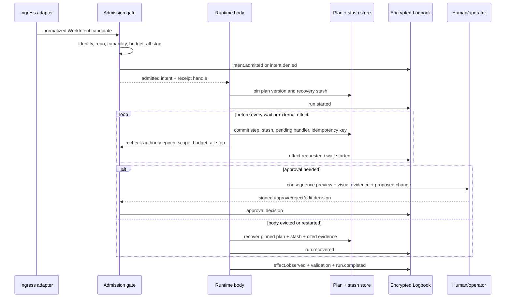
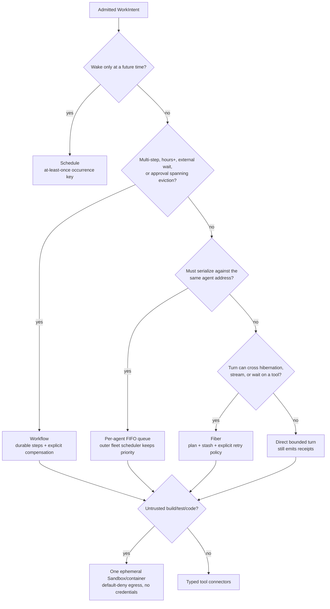
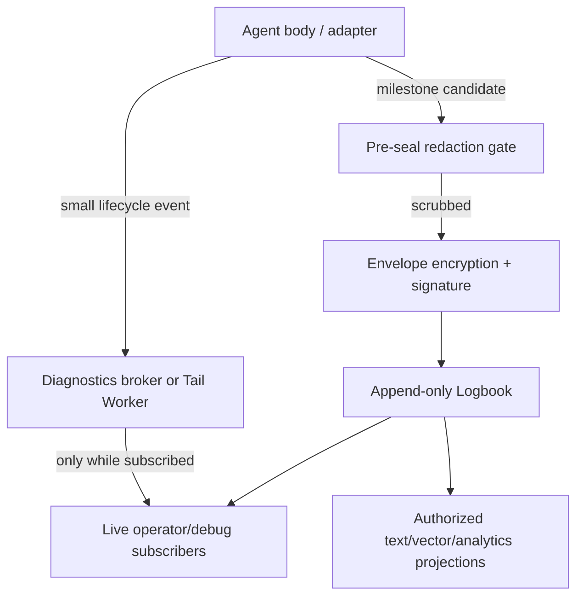
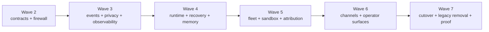

# Harbor Agent Runtime

> **Status:** architecture proposal; no behavior in this document is shipped by
> virtue of being described here.  
> **Roadmap authority:** `research-durable-agents-landscape`.  
> **Research basis:** [Cloudflare Agents runtime study](../research/cloudflare-agents-runtime-study-2026.md).  
> **Scope:** the provider-neutral execution, recovery, memory, event, identity,
> privacy, cost, and operator contract for every durable Port Daddy agent body.

## Decision

Port Daddy will define one **Harbor Agent Runtime** contract above Cloudflare,
local processes, vendor harnesses, remote harbors, mobile clients, and future
providers. Existing Agent Harbor schemas remain the vocabulary of authority.
Provider adapters implement the vocabulary; they do not replace it.

The first-class adapter set is intentionally broader than Cloudflare: Codex,
Claude Code, agy, Gemini, local processes/containers, and future providers all
target this same contract. Cloudflare is one durable execution backend, not the
constitutional agent model or the source of identity, authority, plans, memory,
receipts, or history.

An agent is a durable `AgentNode`. A runtime process, Durable Object, Think
instance, Codex task, Claude session, Sandbox, container, or mobile foreground
session is one replaceable body. Every body receives a scoped `WorkIntent`,
commits recovery state before it yields, emits attributable receipts, and can be
stopped at an authority boundary that survives body loss.

This proposal also divides events into two explicit planes:

- **Diagnostics** are ephemeral, payload-minimized lifecycle signals. They are
  cheap when no subscriber is listening and useful for live debugging.
- **Logbook** is the encrypted, append-only, redacted milestone and receipt
  history. It is durable even when no one watches and is the evidence plane for
  search, timelines, provenance, reconciliation, and recovery.

Neither plane is a substitute for the authoritative roadmap/plan graph. Plans
say what should happen. Logbook records what was authorized and observed.
Diagnostics show what appears to be happening now.

## Non-negotiable invariants

1. **Identity outlives bodies.** A provider session ID may locate a body but can
   never become the durable person key.
2. **Scope is explicit and closed.** Every read, write, search, message, lock,
   memory, transcript, cost, artifact, and event carries account, harbor,
   project/repo, agent, and work identity. Missing or mismatched scope is a hard
   denial, not a global fallback.
3. **Address is not authority.** Knowing an agent URL, name, channel, or runtime
   object ID grants nothing.
4. **Admission precedes execution.** A body cannot infer permission from a chat
   request, transport signature, parent agent, installed tool, or model output.
5. **Plans survive context.** A durable plan version and a compact continuation
   stash are committed before every hibernation, wait, approval, or external
   effect boundary.
6. **Compaction never destroys evidence.** Summaries are overlays. Original
   messages remain available under retention and authorization policy, and
   tool-call/result pairs are never separated.
7. **Redact before seal.** No raw secret-bearing content is encrypted for remote
   retention and “fixed later.” Unknown redaction state fails closed.
8. **Telemetry is not evidence.** Sampled traces, Tail events, console streams,
   and AI Gateway logs may aid diagnosis but never establish a complete history.
9. **Every effect is attributable.** The responsible agent, delegating agent,
   human/capability authority, repo/head, plan step, tool, cost, and result are
   joinable from a receipt without exposing private payloads publicly.
10. **All-stop is durable and hierarchical.** Stop policy is checked at
    admission, before each external effect, on recovery, and before publication.
11. **No ambient credentials in execution bodies.** Containers, Sandbox, Code
    Mode, and generated code receive capabilities, not reusable secrets.
12. **Supplant legacy paths.** `matrix.env` and any other overlapping ambient
    identity path are removed in the cutover wave without a compatibility mode,
    fallback reader, downgrade flag, or shadow writer.

## Relationship to existing Agent Harbor contracts

This proposal does not introduce a parallel agent model. It gives runtime
semantics to the existing schemas:

| Existing contract | Runtime responsibility |
| --- | --- |
| `AgentNode` | Durable person, role, harbor membership, plan/intent linkage, and provider-neutral identity. |
| `AgentRun` | One admitted body execution, including backend, predecessor/successor, budget, state, and terminal reason. |
| `WorkReceipt` | Attributable statement of admission, effects, evidence, validation, spend, and outcome. |
| `ContextEnvelope` | Bounded reconstruction inputs and context-pressure state. |
| `CompactionPacket` | Cited, portable continuation material; it is not the message overlay itself. |
| `MemoryEpisode` | Provenance-bearing long-term memory projection, separately authorized from the transcript. |

Later schema work should extend these contracts with the fields below, preserve
one lineage, and use tolerant readers only for stored historical versions. It
must not create `CloudflareAgent`, `ThinkAgent`, or `SandboxAgent` as competing
authoritative identities.

## Address and work contracts

### `AgentAddress`

`AgentAddress` is a stable locator, not a credential:

```ts
type AgentAddress = {
  version: "harbor-agent-address.v1";
  accountId: string;
  harborId: string;
  projectId: string;
  repoId: string | null;
  agentNodeId: string;
  roleSlug: string;
};
```

The canonical machine form is an opaque, signed identifier over those fields.
The readable product route may be:

```text
relay.portdaddy.dev/{accountSlug}/{harborSlug}/{projectSlug}/agents/{agentSlug}
```

The slug route resolves to the opaque address only after authorization. Renames
change presentation, not identity. HTTP, RPC, WebSocket, and SSE endpoints all
resolve the same address and enforce the same repo/capability boundary.

### `WorkIntent`

Every wake is normalized into a `WorkIntent` before the agent sees it:

```ts
type WorkIntent = {
  version: "work-intent.v1";
  intentId: string;
  idempotencyKey: string;
  address: AgentAddress;
  trigger: {
    kind: "operator" | "agent" | "github" | "queue" | "schedule" |
          "webhook" | "email" | "slack" | "rpc" | "workflow";
    sourceId: string;
    receivedAt: string;
    authenticatedPrincipal: string | null;
    untrustedPayloadRef: string | null;
  };
  authority: {
    grantId: string;
    grantedBy: string;
    capabilitySet: string[];
    scopeHash: string;
    authorityEpoch: number;
    expiresAt: string;
  };
  repo: {
    repoId: string;
    canonicalUrl: string;
    headSha: string;
    baseSha: string | null;
    worktreeId: string | null;
  } | null;
  plan: {
    planId: string;
    planVersion: string;
    stepId: string;
    reconciliationId: string | null;
  };
  budget: {
    reservationId: string;
    moneyMicros: number;
    tokenCeiling: number | null;
    wallClockMs: number;
    toolCalls: number | null;
  };
  privacy: {
    retentionClass: string;
    payloadCapture: "off" | "explicit-grant";
    redactionPolicyId: string;
    keyEpoch: number;
  };
  parentIntentId: string | null;
  requestedOutcome: string;
};
```

The trigger's authenticated principal proves who sent an event. It does not
grant the capabilities in `authority`. An agent delegation creates a child
intent with a subset of the parent's remaining capabilities and budget. Parent
identity is provenance, not automatic authorization.

### `WorkReceipt`

Receipts are append-only projections over Logbook events. A receipt contains:

- intent, run, agent node, body/backend, parent and delegation lineage;
- account/harbor/project/repo/head and resource-scope hashes;
- plan version, step, reconciliation, and any operator consequence preview;
- authority grant, capability use, approval decisions, and authority epoch;
- every external effect's idempotency key, tool/connector, target, status, and
  reversible/compensating action reference;
- validation and evidence references, including Porthole artifacts when a
  visual surface changed;
- measured/provider-reported tokens, money, wall time, and partial cost on
  abort/failure;
- trace/diagnostic correlation IDs explicitly marked non-authoritative;
- redaction state, retention class, key epoch, event-chain range, signature,
  terminal state, and predecessor/successor.

Admission returns a receipt handle before work starts. Ambiguous admission is
resolved by reading that handle with the same idempotency key; it never falls
back to a second backend after acceptance.

## Repo and resource firewall

Repository isolation is a data-model rule, not a UI filter. Every storage key,
query predicate, vector namespace, object prefix, channel, cache, lock, and
provider object binds the normalized scope tuple:

```text
(accountId, harborId, projectId, repoId, resourceKind, resourceId)
```

Rules:

- there is no null-to-global coercion for project or repo data;
- a user-global preference store is physically and logically distinct from
  project/repo data and cannot contain transcripts, plans, code, or memories;
- a multi-repo work intent enumerates each repo and receives a separate grant
  per repo; it cannot broaden a single repo token;
- vector retrieval, transcript search, and memory retrieval filter scope before
  candidate generation, not after ranking;
- Relay channel names include opaque account/harbor/project scope and the server
  validates the signed scope instead of trusting the string;
- cache keys include authority epoch and scope hash; revocation invalidates them;
- every adapter must pass the same hostile cross-repo contract suite, including
  swapped IDs, guessed slugs, stale grants, cache poisoning, search leakage,
  object-prefix traversal, and parent-agent delegation.

## Lifecycle and recovery



### Plan plus stash

The runtime commits a compact stash synchronously before every boundary at
which the body can disappear or a side effect can occur. The stash contains:

- immutable plan ID/version and current step;
- the operator's active outcome, constraints, and latest signed amendment;
- pending operation, handler name, idempotency key, and expected result type;
- completed effect receipt references and unresolved risks;
- live repo/head/worktree/claim/lock facts with observation timestamps;
- relevant message, memory, artifact, and evidence references;
- next safe action and the conditions that would make it unsafe.

Large tool outputs and transcripts are stored by content-addressed reference,
not copied into the stash. Recovery checks the plan, repo head, authority epoch,
claims/locks, budget, and all-stop before constructing a focused prompt. Full
conversation replay is an explicit diagnostic mode, not the normal resume path.

### Execution primitive decision tree



The primitives can compose, but each owns one concern. A queue transports and
serializes; it is not a plan. A Workflow durably orchestrates; it is not an
agent identity. A Sandbox isolates execution; it is not memory. A fiber keeps a
turn recoverable; it does not silently retry failed effects.

## Retained subagents

A retained subagent receives its own `AgentNode`, `AgentAddress`, memory scope,
budget ledger, and plan step. Delegation emits a child `WorkIntent` and an
expected return contract. The parent may wait, continue independently, or end;
the child does not disappear when the parent context compacts.

Return handling is idempotent. The child's final receipt is delivered as an
event keyed by `(parentIntentId, childIntentId, resultVersion)`. Recovery uses
the parent's plan and stash to decide how that result advances the plan. A
subagent cannot inherit broader repo access, publication rights, secrets, or
spend merely because it was spawned by a trusted parent.

## Memory and compaction

### Writable short-term memory

Each agent/project pair has a small, versioned working-memory document intended
for current hypotheses, constraints, pending questions, and references. Writes
are compare-and-swap, attributable, bounded, and expire or are promoted through
a named process. Short-term memory is not an audit log and cannot overwrite
plan or receipt truth.

### Searchable long-term memory

Long-term memory is a provenance-bearing projection over durable source events.
Retrieval is hybrid: lexical and semantic candidates are generated *within the
authorized scope* and fused before reranking. The agent runtime calls the shared
indexing service; it never chooses an ad hoc embedder. Embedding profile,
dimension, model/version, normalization, source hash, redaction policy, and
index epoch are stored with every vector so a centrally governed model upgrade
can rebuild and compare indexes without mixing vector spaces.

Search results include source references, validity/staleness, scope,
confidence, contradiction state, and why the result matched. Memory is a claim
with provenance, not a permission or canonical plan amendment.

### Non-destructive overlays

Conversation history is append-only under retention policy. Macro-compaction
stores an overlay keyed by an exact inclusive message range and the previous
overlay version. Read-time assembly substitutes the newest authorized summary
while leaving original messages untouched. Boundaries expand to keep assistant
tool calls, tool results, approval proposals, and approval decisions together.

Micro-compaction truncates oversized or old tool outputs only at read time and
keeps a content-addressed pointer, media type, byte count, digest, redaction
state, and preview. Head messages and a configurable recent tail remain intact.
Compaction also proposes candidate memory episodes; promotion requires the
memory policy and never deletes source messages.

Required compaction properties:

- iterative summaries receive the prior summary and newly covered originals;
- the summarizer records citations to exact message/event IDs;
- a summary cannot cross repo, authority, branch, or conversation fork scope;
- forks apply overlays independently without mutating shared originals;
- operator decisions, approvals, rejections, constraints, and plan amendments
  are protected facts, not optional prose;
- any orphaned tool/result or approval pair fails the compaction write.

## Human in the loop and consequence previews

Approval is a durable state transition, not a chat affirmation. The proposal
shown to the operator contains:

- the exact action, target, agent, repo/head, capability, and expiry;
- reserved and worst-case spend/time/tool count;
- the affected roadmap items, plans, claims, PRs, jobs, automations, people, and
  downstream dependencies;
- which prior plan edges or deliverables would be undone, superseded, delayed,
  or made contradictory;
- a proposed reconciliation and the shallower/deeper result it would create;
- visual artifacts: current screenshots/mockups/evidence and a sketch or static
  prototype of the proposed outcome when the decision changes a human-visible
  product;
- reversible actions and explicit non-reversible effects;
- approve, reject, edit/scope-down, ask-agent, and Parley options.

The operator's decision is signed, time-bounded, bound to the displayed
proposal hash, and invalidated when the repo head, plan version, cost, scope, or
effect set changes materially. A resumed action rechecks that hash. Approval of
one effect does not authorize preceding or subsequent effects in a replayed
Code Mode program.

## Stable communication surfaces

Every runtime adapter exposes a common logical surface, whether implemented by
HTTP, RPC, WebSocket, or SSE:

| Operation | Semantics |
| --- | --- |
| `POST intents` | Idempotent admission; returns receipt/status addresses before execution. |
| `GET state` | Authorized current projection: body, plan step, wait, budget, all-stop. |
| `GET history` | Paginated authorized Logbook projection with stable cursors. |
| `GET stream` | Hot SSE/WebSocket diagnostics and newly sealed milestones; gaps are explicit. |
| `POST messages` | Untrusted conversational input; never an implicit capability grant. |
| `POST approvals` | Signed decision bound to a proposal hash and recent step-up. |
| `POST interrupt` | Typed steer/pause/cancel/all-stop request with receipt. |
| `POST rpc/:method` | Typed agent-to-agent call admitted as a child work intent. |

Slack, email, GitHub, Jira, calendar, browser extension, IDE, mobile, voice, SMS,
and webhook adapters translate into the same ingress envelope. Each adapter
verifies the raw transport first, maps a human/service principal, stores raw
content as a quarantined reference, and then requests admission. No adapter has
a private bypass into agent tools.

## Signed identity and public attribution

GitHub and other third-party comments should be posted by the Port Daddy GitHub
App, not by the operator's personal account. The platform account is transport
identity; the responsible agent remains explicit in a signed footer:

```text
Port Daddy agent: Admiral / agentNode:…
Work: intent:… · run:… · roadmap:… · repo/head:…
Evidence: relay.portdaddy.dev/…  Signature: ed25519:…
```

Public footers contain opaque, non-secret IDs and a public-safe evidence URL.
The signed envelope covers the exact comment digest, agent node, delegated-by
chain, intent/run, repo/head, roadmap/plan step, timestamp, and key epoch. The
evidence page reveals only what the current viewer is authorized to see.

## Budget, cost, and all-stop

### Cost

Admission reserves money, tokens, wall time, tool calls, provider concurrency,
and Sandbox resources. Each inference/tool/connector reports measured or
provider-reported usage to the append-only accrual ledger. Unknown usage is
`unknown`, never zero. Partial cost survives abort, timeout, body loss, and
provider ambiguity.

Budgets nest: account → harbor → project/repo → agent → intent → child intent →
tool execution. A child can spend only a reservation carved from its parent.
Backoff and retries draw from the same reservation. The operator surface shows
reserved, accrued, projected worst case, and which automated wake source is
responsible.

### All-stop

All-stop records a signed stop policy with scope, reason, principal, authority
epoch, timestamp, and optional expiry. Scope can be account, harbor, project,
repo, agent, intent/run, provider, capability, connector, or ingress channel.
Policy propagates through Relay and local harbors and is cached only with its
epoch.

Checks occur:

1. before work admission;
2. before model/tool/Sandbox/connector calls;
3. after every recovery or long wait;
4. before publishing comments, code, artifacts, or plan mutations; and
5. when an open stream or socket accepts a consequential client command.

Already-running model calls may not be preemptible. Their results are discarded
from consequential continuation after stop, cost is still recorded, and the
receipt says what could and could not be interrupted. Cancelling a Workflow or
Code Mode execution does not imply rollback; compensation is explicit.

## Two event planes



### Ephemeral diagnostics

Diagnostics use colon-delimited names and a small common envelope:

```ts
type DiagnosticEvent = {
  type: string;
  name: string;
  timestamp: string;
  addressHash: string;
  intentId: string | null;
  runId: string | null;
  traceId: string | null;
  severity: "debug" | "info" | "warn" | "error";
  payload: Record<string, boolean | number | string | null>;
};
```

Initial channel vocabulary:

- `agent:lifecycle:admitted|started|hibernating|woke|recovered|completed|failed`
- `agent:turn:started|streaming|waiting|completed`
- `agent:tool:requested|approved|started|completed|failed`
- `agent:memory:searched|written|compacted`
- `agent:budget:reserved|warning|exhausted`
- `agent:subagent:started|returned|failed`
- `chat:recovery:overflow|compaction|resume`
- `sandbox:lifecycle:created|sleeping|restored|destroyed`
- `work:queue:admitted|delivered|retrying|dead-lettered`

Payloads contain IDs, counts, durations, classifications, and digests, not
prompts, messages, code, secrets, raw tool arguments/results, or screenshots.
Zero subscribers means no durable diagnostic write. A subscriber can request a
time-bounded local capture, which is still not retroactive evidence.

### Durable encrypted Logbook

Logbook stores milestones such as:

- intent proposed/admitted/denied/amended/superseded;
- run/body start, recovery, handoff, wait, interruption, and terminal state;
- plan pin, step transition, contradiction, and reconciliation;
- capability/approval decision and authority-epoch change;
- external effect requested/observed/compensated;
- cost accrual/finalization;
- transcript segment/compaction overlay/memory projection/artifact sealed;
- all-stop raised/acknowledged/cleared;
- receipt finalized and GitHub/publication evidence read back.

Every event has an idempotency key, monotonic per-stream sequence, previous
event hash, scope tuple, producer agent/body, authority epoch, redaction state,
retention class, key epoch, ciphertext digest, signature, and timestamp. Raw
content is redacted locally, then encrypted to the intended account/team/project
readers. Search and warehouse projections are derived, separately authorized,
rebuildable, and never allowed to become the source ledger.

### Derived indexes, lineage, and warehouse

The Logbook event is the root of a projection lineage, not a row copied into an
anonymous data lake:

```text
source event -> redaction receipt -> sealed segment -> authorized decoder
             -> text/semantic/media index -> query result citation
             -> scrubbed aggregate fact -> warehouse/report
```

Every projection row records source event range and hashes, projection code and
schema version, embedding/index profile, authorization policy version, redaction
policy, generation timestamp, and superseded projection IDs. Rebuilding an
index creates a new epoch and compares coverage before promotion; it never
silently mixes embeddings from different models or dimensions.

The retrieval plane maintains separate, scope-bound indexes for message text,
code/tool artifacts, plan/decision facts, and explicitly approved Porthole
evidence. Porthole indexing may derive OCR, accessibility/DOM targets, selected
object metadata, time ranges, and visual embeddings only from an approved
source lease. It does not ingest unapproved windows, background media, audio,
or frames outside the lease. Query results cite the exact approved evidence
range and its redaction state.

The analytics warehouse receives scrubbed facts such as lifecycle duration,
provider/model tokens and cost, retries, recovery counts, tool categories,
approval latency, completion state, and plan progress. It does not receive raw
prompts, messages, code, screenshots, audio, tool arguments, or secrets. Facts
retain the agent/run/intent/plan join keys as scoped pseudonymous identifiers so
an authorized operator can drill from an aggregate to Logbook evidence without
making the warehouse an alternate transcript store.

Storage cost is controlled by policy rather than evidence loss: small envelopes
and indexes stay in the transactional tier; sealed bulk transcript/media
segments move to object storage; compaction overlays reduce read-time context;
old segments move to colder retention classes; expired encryption keys provide
cryptographic erasure with a deletion receipt. Diagnostics are never retained
merely to make an observability chart look complete.

## Cloudflare adapter decisions

| Surface | Adopt | Do not adopt |
| --- | --- | --- |
| Agents SDK | Durable Object lifecycle, SQL, routing, scheduling, RPC, WebSocket/SSE adapters. | Cloudflare class/name as canonical identity; provider types in Agent Harbor schemas. |
| Think | Conversational/planning bodies, `runTurn`, lifecycle hooks, actions, retained Facets, plan/stash recovery, compaction semantics. | Default-full authorization, Think-only history, or dependence for local/vendor bodies. |
| Fibers | One resumable turn, durable admission/status/cancel, synchronous stash and recovery hook. | Hidden retry, closure replay assumptions, or callbacks as durable state. |
| Workflows | Long multi-step work, external waits, months-long approvals, explicit compensation. | Every short agent turn or identity/state authority. |
| Queues | Delivery, outer fleet fan-in, and per-address FIFO serialization. | Priority scheduling, plan semantics, or exactly-once effects. |
| Schedules | Durable future wake with occurrence id. | Silent backfill or unbudgeted recurring work. |
| Code Mode | Experimental pilot for reviewed typed API/MCP/OpenAPI connectors with bounded executions and explicit approval steps. | Arbitrary repository coding, approval-free tool broadening, transactional rollback claims, Porthole/browser control, or a required production path. |
| Sandbox | One isolated execution body per work intent; default-deny egress; external credential broker; artifact manifest; cleanup. | Durable memory, shared hostile tenants, ambient secrets, unrestricted internet, or token-bearing Git URLs. |
| Browser Agent | Narrow experiments. | Cooperative arbitrary-GUI embodiment, retained authenticated browser state, or evidence authority. |
| Tracing | Enable spans/metrics/tokens/cost correlation on every Cloudflare agent and AI call, with payload capture off. | Transcript, receipt, or audit-log claims. |
| AI Gateway | Route supported inference through it for provider observability and cost metadata; send `cf-aig-collect-log-payload:false`. | Payload collection by default or sole cost authority. |

The current stable Sandbox dependency and Cloudflare's preview documentation
must be evaluated in an isolated compatibility spike. No production migration
occurs merely to chase a preview version.

## Privacy and threat boundaries

1. **Trace loss:** sampling, truncation, missing media, wrapper gaps, or backend
   failures can omit spans. Receipts never infer an unobserved effect from a
   trace.
2. **Payload capture:** Think/AI SDK/custom Workers have different trace paths.
   Every path has a test that payload bodies remain absent. AI Gateway uses
   metadata-only headers and configuration.
3. **Pre-seal redaction:** plaintext is scrubbed on the originating trusted
   machine/Worker boundary before envelope encryption. `unknown`, `failed`, or
   `unverified` redaction state cannot leave that boundary.
4. **Sandbox secrets:** credentials live only in a capability broker/outbound
   handler. Generated code, shell environment, files, backups, logs, and model
   context never receive reusable credentials.
5. **Operator socket auth:** local consequential commands bind to the
   authenticated Port Daddy socket/session and recent operator step-up. Remote
   control uses signed short-lived grants; no bearer query parameters.
6. **Cross-repo leakage:** all candidate generation and storage selection is
   scoped before data access. A post-query UI filter is insufficient.
7. **Readable addresses:** slugs do not reveal existence or metadata to an
   unauthorized caller; rate limits and opaque IDs resist enumeration.
8. **Background media:** Porthole capture, audio, screenshots, and GUI evidence
   are separately approved sources. Agent/runtime observability cannot turn
   background media capture on.
9. **Retention and deletion:** immutable evidence can be cryptographically
   erased by key destruction and tombstoned projections where policy requires;
   deletion receipts preserve that a deletion occurred without preserving the
   deleted content.

## Implementation DAG: Waves 2–7

Wave 1 is this research/proposal slice. Each later wave is sequential at the
program level; independent nodes inside a wave may run in parallel after their
dependencies are green. No wave can claim completion from source tests alone:
it needs built artifacts, deployed/runtime readback where applicable, and
operator-visible proof.



### Wave 2: freeze contracts and prove the firewall

Deliverables:

- additive Agent Harbor schema revisions for `AgentAddress`, `WorkIntent`,
  receipt correlation, plan/stash, event scope, authority epoch, and all-stop;
- one runtime-adapter interface with capability and receipt boundaries;
- one repo/resource-scope function used by stores, routes, search, messaging,
  locks, attention, roster, cost, transcripts, memory, and artifacts;
- schema fixtures and SDK/API representations in every supported language;
- migration inventory for existing node/run/receipt rows without a second
  authority store.

Acceptance tests:

- `harbor-agent-address.contract.test.ts`: rename stability, opaque resolution,
  unauthorized non-enumeration, and cross-provider equality;
- `work-intent-receipt-saga.contract.test.ts`: idempotent admission, ambiguous
  readback, child capability/budget subset, predecessor/successor, partial cost;
- `repo-firewall-hostile.e2e.test.ts`: swapped repo/project IDs, guessed slugs,
  stale grants, cache keys, vector search, transcript/object prefixes, channel
  injection, lock/attention/memory leakage all fail closed;
- `all-stop-policy.contract.test.ts`: hierarchical scope and authority epochs
  serialize identically across daemon/Relay adapters;
- generated schema fixtures validate in TypeScript, Rust, Swift, Python, and the
  public SDK language set chosen by that wave.

### Wave 3: two event planes, privacy, and Cloudflare observability

Deliverables:

- typed diagnostic vocabulary and Tail/Relay/local subscribers with no durable
  write when nobody subscribes;
- encrypted append-only Logbook event store, redaction verifier, hash chain,
  signatures, key epochs, retention/deletion receipts, and rebuildable indexes;
- lifecycle instrumentation for every Fleet Executor, Relay, and Steward AI/tool
  path;
- `[observability.traces]` deployment configuration where supported, with
  payload capture off;
- AI Gateway metadata-only policy on every inference path and token/cost joins
  into the append-only accrual ledger.

Acceptance tests:

- `diagnostics-zero-subscriber.integration.test.ts`: zero durable writes and no
  prompt/tool payload fields without subscribers; subscribed order/gap markers;
- `logbook-redact-seal.e2e.test.ts`: seeded secrets are stripped before
  ciphertext creation, unknown redaction refuses egress, chain/signature/key
  rotation verify, and projection rebuild produces identical authorized rows;
- `trace-loss-is-not-ledger.test.ts`: dropped/sampled/truncated spans never mark
  a receipt complete;
- `cloudflare-observability-config.test.ts`: every deployed agent Worker enables
  intended traces and correlates run/intent without payload bodies;
- `ai-gateway-metadata-only.e2e.test.ts`: request/response bodies absent while
  provider, model, tokens, latency, cost, run, and agent remain joinable;
- `cost-abort-survival.e2e.test.ts`: body loss, timeout, and all-stop retain
  partial spend and never report unknown as zero.

### Wave 4: provider-neutral runtime, recovery, memory, and compaction

Deliverables:

- local/reference runtime adapter and Cloudflare Agents/Think adapter;
- fiber/direct/queue/schedule/Workflow selection policy and explicit retry
  classifier;
- atomic plan-and-stash boundary and retained subagent return protocol;
- writable bounded short-term memory and scoped hybrid long-term retrieval;
- non-destructive boundary-aware macro/micro compaction overlays;
- provider contract harness reusable by Codex, Claude, Antigravity, Cloudflare,
  local containers, and future bodies.

Acceptance tests:

- `fiber-plan-stash-recovery.e2e.test.ts`: kill the body at every yield/effect
  boundary; recovery resumes the pinned step once, rechecks head/authority/stop,
  and never duplicates an external effect;
- `workflow-approval-month-boundary.test.ts`: simulated long wait/restart retains
  proposal hash, rejects stale approval, and completes after a fresh decision;
- `schedule-at-least-once-idempotency.test.ts`: duplicate occurrence delivers
  one effect and explicit catch-up semantics;
- `retained-subagent-return.contract.test.ts`: parent compaction/body death does
  not orphan child identity, budget, or idempotent result delivery;
- `memory-scope-hybrid-search.hostile.test.ts`: lexical and semantic candidate
  generation cannot observe another repo/account; citations/staleness/index
  model metadata survive reranking;
- `compaction-overlay-boundary.test.ts`: originals unchanged, iterative overlay,
  protected head/tail, forks independent, no split tool/result or
  proposal/decision pair across five compactions;
- the same recovery fixture passes unchanged against every adapter supported in
  the wave.

### Wave 5: Fleet, Sandbox, Code Mode pilot, and GitHub identity

Deliverables:

- Fleet Executor reviewer/Purser/execution ships conform to WorkIntent, runtime
  selection, plan/stash, Logbook, cost, and all-stop without losing current head
  invalidation, retry, checkpoint, or GitHub check guarantees;
- one sandbox per work intent, default-deny egress, credential broker, resource
  limits, artifact manifest, cleanup, and backup policy;
- bounded Code Mode pilot for reviewed MCP/OpenAPI/API connectors only;
- GitHub App posting for all agent-authored comments with signed responsible
  agent/run/roadmap/head attribution and authorized evidence page;
- current-vs-new equivalence report for every Cloudflare-backed reviewer path.

Acceptance tests:

- `fleet-executor-runtime-equivalence.e2e.test.ts`: exact-head admission,
  supersession, delivery retry, checkpoint reuse, map/reduce/Purser gates,
  publication readback, and spend behavior match or improve current fixtures;
- `sandbox-credential-blind.e2e.test.ts`: environment/files/process/log/backups
  contain no reusable secret; denied host cannot egress; allowed request receives
  one short-lived scoped credential only in the outbound broker;
- `sandbox-cross-intent-isolation.e2e.test.ts`: filesystem/process/network state
  does not cross intent or repo boundaries and cleanup survives failure;
- `codemode-approval-replay.e2e.test.ts`: same call order/args replay once,
  nondeterminism uses explicit steps, rejection cannot publish, cancellation is
  not labeled rollback, connector compensation is receipted;
- `github-bot-agent-attribution.e2e.test.ts`: comment author is the App, footer
  signature covers content/agent/run/head/roadmap, tampering fails, private
  evidence remains private;
- `fleet-all-stop-race.e2e.test.ts`: stop between model result and GitHub publish
  prevents publication and records unavoidable accrued cost.

### Wave 6: ingress adapters and operator workbench

Deliverables:

- verified GitHub, webhook, Slack, email, schedule, RPC, SSE, and WebSocket
  adapters; later Jira/calendar/SMS/IDE/browser/mobile adapters use the same
  contract;
- readable authorized agent pages under `relay.portdaddy.dev` with opaque IDs;
- pd-console/FleetBar panes for live diagnostics, durable history, plan/stash,
  recovery, subagents, cost, receipts, tools, approvals, all-stop, and evidence;
- transcript search and Porthole evidence joins by agent node/intent/run/plan;
- consequence-preview UI with affected roadmap graph and visual before/after
  artifacts; operator can edit/scope down or convene a Parley.

Acceptance tests:

- `channel-ingress-auth.hostile.test.ts`: raw signature before parse, replay and
  timestamp defense, address derived from signed payload, content remains
  untrusted, no private capability bypass;
- `agent-route-auth.e2e.test.ts`: HTTP/RPC/WS/SSE share authorization, readable
  slugs cannot enumerate, token-in-query rejected, read-only observer cannot
  cause side effects;
- `console-runtime-timeline.visual.test`: offscreen + native proof shows a live
  turn, recovery, compaction, tool approval, subagent, spend, receipt, and gap;
- `operator-consequence-preview.visual.test`: changing plan authority shows
  affected nodes/artifacts, cost, proposed reconciliation, stale-hash rejection,
  and scope-down flow;
- `porthole-evidence-join.e2e.test.ts`: approved capture links to the exact
  agent/run/plan step without exposing an unapproved window or background media;
- accessibility, zoom, keyboard, reduced-motion, privacy, and background-operation
  proofs accompany the operator surfaces.

### Wave 7: cutover, legacy removal, and whole-system proof

Deliverables:

- switch every supported body and ingress to the Harbor Agent Runtime contract;
- remove legacy identity, ambient authority, transcript, retry, and event paths
  made redundant by the new runtime;
- delete `matrix.env` readers/writers/generators/tests/prompts/skill guidance and
  stored compatibility logic; historical ADR text remains as superseded history,
  not executable instruction;
- update affected ADRs, SDKs, CLI/MCP/OpenAPI, skills, hooks for every harness,
  README/docs/website, deployment manifests, and operator UI;
- deployment receipts for Fleet Executor, Relay, Steward, daemon, pd-console,
  GitHub App, and remote harbors;
- migration and rollback plan uses data snapshots and forward repair, not a
  live compatibility path back to ambient identity.

Acceptance tests:

- `matrix-env-runtime-absence.test.ts`: no runtime, hook, CLI, MCP, SDK, skill,
  prompt, or active test references `matrix.env`; setting it changes nothing;
- `all-adapters-contract-suite`: Codex, Claude, Antigravity, Cloudflare, local,
  container, and supported remote bodies pass the same scope/recovery/receipt/
  stop suite;
- `three-account-three-repo-firewall.e2e.test.ts`: hostile reads/writes/search/
  messages/artifacts/locks/cost/transcripts fail across every pair;
- `crash-recovery-chaos.e2e.test.ts`: kill daemon/Worker/body/network/storage
  between every lifecycle milestone; no admitted intent is lost, no effect is
  duplicated, and ambiguity is visible;
- `observability-lineage-warehouse.e2e.test.ts`: sampled diagnostics, Logbook,
  transcript, cost, artifact, plan, and public attribution join correctly while
  raw private payloads never enter analytics;
- Porthole-recorded product proof demonstrates end-to-end operator admission,
  background work, intervention, recovery, all-stop, evidence search, and signed
  GitHub attribution on deployed builds.

## ADR reconciliation required after the contract is accepted

This proposal does not edit existing ADRs. The implementation program must
issue one explicit reconciliation that updates status/changelog and names the
superseding sections; contradictory accepted instructions cannot be left active.

| ADR | Sections to amend or supersede |
| --- | --- |
| [ADR-0049 Relay](../adr/0049-relay-architecture.md) | Identity/Auth, Namespacing, End-to-End Payload Encryption, Storage, HTTP Surface, capability enforcement: distinguish agent addressing, hot diagnostics, encrypted Logbook, and channel transport. |
| [ADR-0058 durable transcript retention](../adr/0058-durable-transcript-retention.md) | Decision and mutation-authority boundary: append streaming segments/milestones, pre-seal redaction, scope tuple, key epoch, Logbook join, and partial unfinished capture. |
| [ADR-0091 Giant Squid](../adr/0091-giant-squid-harness.md) | Supersede “POSIX Stigmergic Matrix / `matrix.env`” completely; revise hook topography, adapter, steering, roadmap, and success criteria to use authenticated runtime projections. No compatibility path. |
| [ADR-0092 suggestibility/federation](../adr/0092-suggestibility-ladder-and-cloud-coordination-federation.md) | Per-repo dial, cloud peer, capability precondition, and rollout: bind suggestion, delegation, and remote wakes to WorkIntent/scope/authority epochs. |
| [ADR-0095 Agent Run Saga](../adr/0095-agent-run-saga-and-backend-authority.md) | Contract set, saga, backend authority, command/query/event boundary, migration list, and compliance invariant: add address/admission/stash/event-plane/all-stop semantics without creating a second saga. |
| [ADR-0097 context/memory/search](../adr/0097-m6-context-memory-and-search-contracts.md) | Add writable bounded short memory, scoped hybrid long memory, non-destructive overlays, boundary rules, index/model epochs, and retrieval privacy tests; revisit the read-only blackboard limit deliberately. |
| [ADR-0098 Cloud Fleet operator surface](../adr/0098-cloud-fleet-operator-surface.md) | Decision and implementation matrix: unified runtime timeline, consequence preview, recovery, live diagnostics vs Logbook, cost, attribution, and all-stop. |
| [ADR-0108 Port Daddy Harness](../adr/0108-port-daddy-harness.md) | Architecture, eight capabilities, portability matrix, rollout, failure modes, and security: require the same plan/stash/recovery/events/receipt/stop contract for Codex, Claude, Antigravity, and the rest. |
| [ADR-0109 Steward](../adr/0109-the-steward-single-approver.md) | Lifecycle, guardrails, and phasing: deterministic per-repo address, WorkIntent admission, signed decisions, Logbook, scoped operator auth, and all-stop. |
| [ADR-0116 monetization](../adr/0116-fleet-monetization-pricing-and-stripe.md) | Funding, routing, transparency, build order: nested reservations, partial cost, trigger attribution, retry/backoff budget, unknown-not-zero, and operator projections. |
| [ADR-0117 Fleet v2](../adr/0117-fleet-v2-execution-adversarial-testing-ai-gateway.md) | AI Gateway, Sandbox, remediation, sequencing: metadata-only logging, tracing limitations, credential broker, one-sandbox-per-intent, Code Mode pilot/non-adoptions, and runtime equivalence gate. |
| [ADR-0120 Rust boundary](../adr/0120-rust-kernel-boundary.md) | Preserve the three-plane decision: Rust owns canonical crypto/signature/capability primitives; Cloudflare/runtime adapters remain TypeScript product-plane code; pd-console remains Rust for UI. |
| [ADR-0121 durable roster](../adr/0121-durable-agent-roster.md) | AgentNode identity, profile facts, promotion, continuation, and surface contract: add AgentAddress, retained subagent, body lineage, recovery, and public attribution joins. The redirect-only ADR-0119 must not be treated as a second authority. |
| [ADR-0123 Cloud Vault/KMS](../adr/0123-cloud-vault-account-kms.md) | Key hierarchy, custody, rotation, N1 wire rule: define Logbook event encryption/readers, key epochs, cryptographic erasure, and Sandbox credential-broker boundaries. |
| [ADR-0124 transcript redaction](../adr/0124-transcript-redaction.md) | Keep fail-closed states and redact-before-seal normative; extend the verifier to Logbook milestones, compaction overlays, memory projections, artifacts, traces, and analytics. |

## Non-goals

- Rewriting all agent bodies on Cloudflare.
- Treating Think, Code Mode, Sandbox, Durable Objects, or Workflows as Port
  Daddy's canonical identity/roadmap/history store.
- Persisting every diagnostic event or every token stream forever.
- Letting semantic indexes or warehouse tables become primary evidence.
- Giving an agent more authority because it is retained, famous, parented by a
  trusted agent, or reachable at a readable URL.
- Calling sampled traces, UI streams, best-effort transcript flushes, Code Mode
  replay, or Sandbox backups “append-only history.”
- Using Cloudflare Browser Agent as a substitute for Porthole's cooperative,
  consented arbitrary-GUI stage.
- Keeping `matrix.env` as a hidden fallback after cutover.

## Acceptance of this proposal

Acceptance authorizes the implementation DAG, not a claim that the runtime
exists. Before Wave 2 begins, the roadmap authority must record dependencies,
owners, current conflicting plans, affected ADRs, and the expected operator
artifacts. Each wave attaches PRs and deployed receipts to those graph nodes and
checks them off only after manager review and the stated acceptance proofs.
