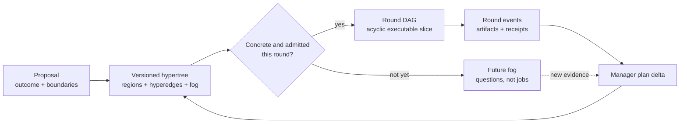
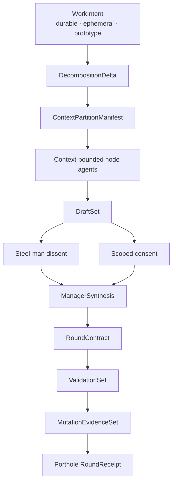
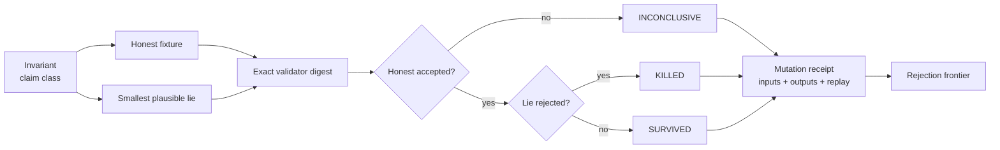
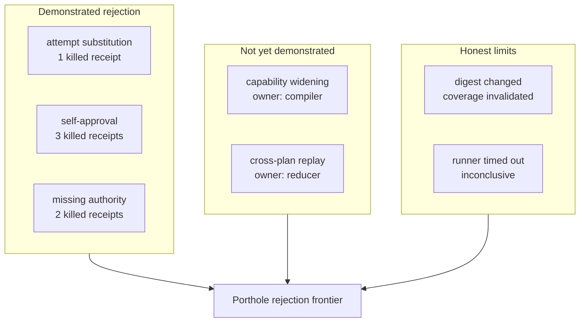
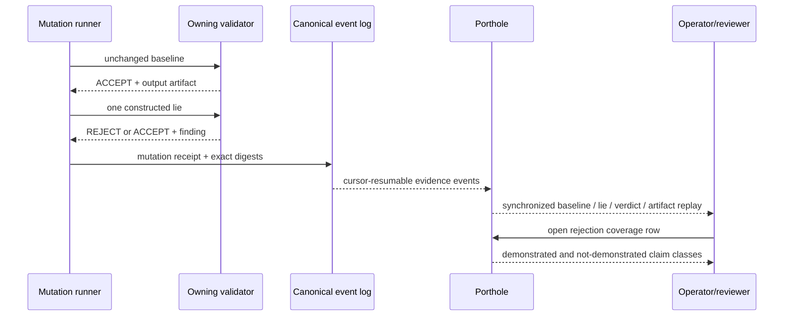
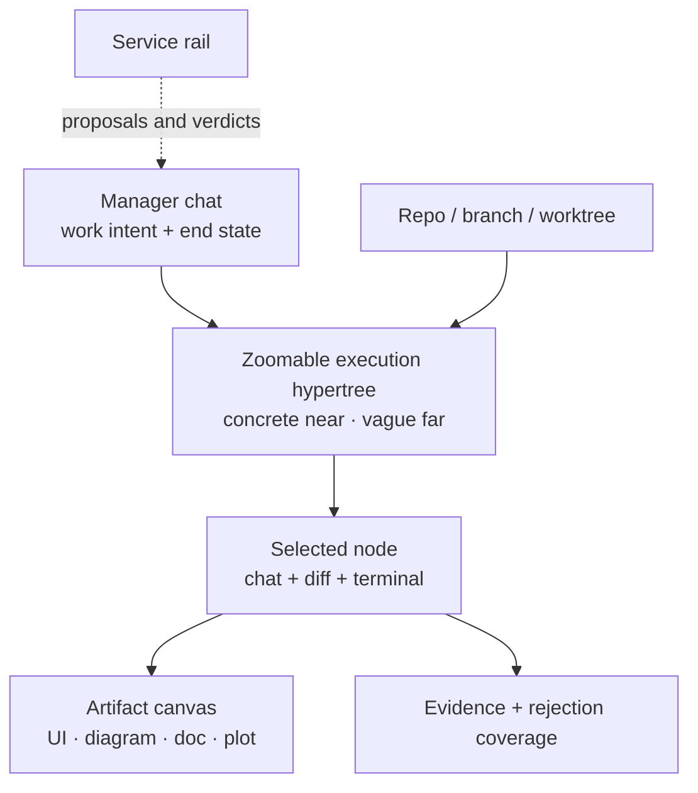

# Whitepaper contribution: adversarial proof hypertrees

**State:** early contribution draft / T0 design

**Claim boundary:** this document proposes a research and product thesis. The
schemas and fixtures referenced below are static contracts. They do not prove a
live manager runtime, mutation runner, GPUI application, or Porthole ingestion.

## Working thesis

Reliable agentic systems should publish a **rejection frontier**, not only a
success story. For every important invariant, the system should name at least
one deliberately constructed lie, the validator expected to reject it, the
observed verdict, and the replayable evidence. It should also list important
claim classes whose rejection has not yet been demonstrated.

Port Daddy's coordination thesis then becomes:

> Turn intent into a versioned hypertree; compile each knowable frontier into a
> bounded DAG; require independent dissent, synthesis, typed artifacts, and
> validators at every consequential join; attack those validators with explicit
> lies; preserve the results as replayable Porthole receipts.

This joins three ideas that are usually separated:

1. planning under partial knowledge;
2. multi-agent review and bounded authority;
3. empirical evidence that the verification machinery can reject plausible
   falsehoods.

## DAG versus hypertree

The distinction is substantive.

| Object | Question answered | Shape | Authority |
|---|---|---|---|
| Proposal | What outcome and boundary does the operator want? | prose plus typed intent | none |
| Hypertree | How is the problem currently understood, grouped, joined, and left uncertain? | nested regions, hyperedges, alternatives, rounds, fog | planning only |
| Round DAG | Which concrete nodes are eligible in this round? | acyclic dependency graph | eligibility only |
| Workflow | What happens after draft, dissent, review, failure, or escalation? | bounded state machine | routed by typed verdicts |
| Event history | What actually happened? | append-only sequence and causal links | evidence only |

A DAG is the executable shadow of the current hypertree frontier. The hypertree
retains structure the DAG cannot honestly express: several artifacts consumed
as one join, alternative decompositions, vague future nodes, manager rounds,
and review loops. Calling the whole object a DAG encourages false precision;
calling every dependency structure a hypertree weakens executable semantics.



## The round as the unit of epistemic progress

The round is neither a chat turn nor a bulk swarm. It is a bounded production
and adjudication interval with typed inputs and outputs.



Steel-manning is a contract, not a tone instruction. The dissent artifact must
state the strongest plausible objection, cite evidence, identify the threatened
invariant, and name an observation that would resolve the objection. Consent is
equally scoped: it records exactly what was accepted, reservations, expiry, and
non-agreement. Silence produces no consent artifact.

Manager synthesis does not average opinions. It emits a legible decision:
arguments accepted and rejected, unresolved uncertainty, changes to the
hypertree, assignments, and the next gate. Producer, independent reviewer, and
manager remain separate at consequential approvals.

## The lie-per-invariant rule

The core system-wide rule is:

> Every important invariant has at least one deliberately constructed lie that
> demonstrates the system rejects that exact lie.

The unit of evidence is deliberately narrow. A system that rejects an expired
permit has not thereby demonstrated rejection of a valid signature over the
wrong payload. Those are separate claim classes.



Candidate lie families include:

- authority absent, expired, replayed, or widened;
- actor, body generation, plan, node, or attempt substitution;
- signature valid for a different payload;
- receipt outcome contradicting cited evidence;
- substituted Merkle leaf or broken event predecessor;
- producer self-review or reviewer/manager identity collision;
- mandatory field or artifact silently removed;
- valid-looking state transition in the wrong order;
- skill activation on a forbidden request or prohibited action escaping the
  halt boundary.

## Rejection coverage as a public subsystem property

Each subsystem publishes two named sets:

```text
demonstrated rejection = claim class + current digests + one or more killed receipts
not demonstrated       = important claim class + owner + missing evidence reason
```

`PortholeMutationReceipt` binds the source, validator, tests, baseline, mutant,
outcomes, seed/replay path, artifacts, and Porthole event. A
`PortholeRejectionCoverage` projection enumerates the subsystem's claim classes.



A scalar score may help compare builds, but it cannot replace this inventory.
The names matter because two systems with 80% coverage may reject completely
different lies. Coverage also expires when relevant source, contract,
validator, or test-bundle digests change.

## Porthole as the replay surface

The decisive visual is not a green test matrix. It is the moment a plausible
lie reaches the decision boundary.



The viewer should synchronize:

1. the honest record;
2. the smallest changed field or relation;
3. the validator's decision point;
4. command/output and artifact evidence;
5. the coverage ledger before and after the run.

Porthole is the lens. The runner constructs the lie, the validator decides, and
the canonical event history preserves the result.

## Skills are executable claims too

Skills should be held to the same standard as runtime subsystems. Their
important invariants include:

- activation: appropriate requests activate; negative cases do not;
- halt behavior: forbidden live actions are rejected at static tiers;
- context: untrusted input cannot become instruction or undeclared authority;
- output: required artifacts and state labels cannot be omitted;
- evidence: PASS cannot appear without the named witness class;
- scope: the skill cannot silently perform a broader mutation than requested.

Each skill bundle should ship positive fixtures, negative fixtures, an invariant
inventory, and mutation receipts from the actual validator or harness. A prose
warning with no exercised rejection path remains `not-demonstrated`.

## Product consequence: the cooperative execution observatory

The operator experience should resemble a polished coding agent, not an
infrastructure dashboard. Repositories, branches, worktrees, agent chat, code,
terminals, and artifacts remain primary. Coordination appears as a natural
extension of that workspace.



Orthogonal service agents include skill fitting, Parley/opportunity detection,
epistemology risk, MCP/tool maintenance, HITL escalation, validators/judges, and
rework shepherding. They do not occupy ordinary project nodes or self-assign
authority. Their live visualizations show queue, freshness, confidence,
capacity, breaker state, and validator quality, including surviving mutants.

Far-future nodes stay visually vague. Project Epistemology may forward-compute
likely conflicts and missing gates, but those appear as cited risk overlays and
fog proposals—not fabricated tasks or prophecy.

## Figure program for the whitepaper

The diagram atlas can seed a coherent figure sequence:

1. **Proposal to hypertree to round DAG.** Establishes why partial knowledge
   needs two planning/execution shapes.
2. **One round, ten typed artifacts.** Makes context partitions, dissent,
   consent, and synthesis concrete.
3. **Lie-per-invariant loop.** Shows baseline, mutant, validator, and receipt.
4. **Rejection frontier.** Contrasts demonstrated, not demonstrated, and
   invalidated-by-digest-change claim classes.
5. **Porthole five-pane replay.** Shows the lie occurring at the decision
   boundary and the linked artifact.
6. **Cooperative studio.** Places the giant hypertree beside manager chat,
   repos/worktrees, artifacts, and service agents.
7. **Authority separation.** Request, authorize, execute, witness, validate,
   and project as separate roles.
8. **Assurance over rounds.** A plot of important claim classes versus killed,
   survived, inconclusive, and uncovered evidence—always with named rows
   available beneath the aggregate.

Each figure should carry a one-sentence “proves visually” claim and a one-sentence
“does not prove” boundary, following `diagram-atlas.md`. Rendered figures need
the real Book preamble, automated figure QA, provenance, and human contact-sheet
review before integration.

## Research questions

- How should claim classes be partitioned so coverage is neither trivially
  broad nor atomized into meaningless fields?
- Which mutant families transfer across subsystems, and which require
  domain-specific semantic lies?
- How quickly should demonstrated rejection expire after validator or source
  changes?
- Can held-out mutant pools evaluate independent test-writing agents without
  leaking the oracle?
- How should diverse validators be selected when failures are correlated?
- What is the cost-optimal allocation between deterministic Floor checks,
  independent reviewers, specialist scrutiny, and mutation runs?
- How can Porthole disclose enough evidence for audit while preserving the
  pre-persistence privacy boundary?
- Which visual encodings let operators understand a 500-node hypertree without
  mistaking fog, blocked work, and active execution?

## Honest state and next proof

Shipped in this slice:

- strict T0 JSON Schemas for mutation receipts and rejection coverage;
- valid fixtures and negative contract tests;
- architecture, diagram-atlas, Porthole, whitepaper, and inert prototype updates.

Still target work:

- a mutation runner that emits these receipts;
- canonical event ingestion and Porthole replay;
- automatic invalidation on digest drift;
- skill-bundle invariant inventories and held-out negative fixtures;
- a GPUI implementation and operator-owned pixel evidence;
- empirical studies of mutant diversity, reviewer independence, and cost.

The next credible claim is modest: given a fixed validator and fixture pair,
the static contracts can represent an accepted baseline, a rejected lie, and an
honest not-demonstrated claim. Live rejection evidence remains unproved until a
runner and event path produce it.
