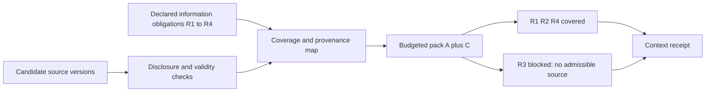

# Astra review of Book candidates from the 170-skill campaign

Planning review, 2026-09-24. No Book prose, repository file, commit, or published claim was changed. Scope: the five candidate plans, B10–B14 research reports, the previous manuscript-grounded Astra study, and targeted current manuscript passages and primary sources. This is not an independent reread of all 170 skill bundles or verification of the Book's proofs.

## Decision and priority

Keep candidates 1–5, but distinguish teaching additions from proposed results. Candidate 3 needs an explicit premise reconciliation, not merely a new warning about correlated judges. Candidate 4 is the strongest proposed mechanism among the five, provided its dependency contracts make invalidation auditable. Candidate 5 earns space through its acceptance oracle and controlled benchmark, not through the familiar observation that edits can conflict semantically.

Promote two later-batch leads into planning: **obligation-complete context compilation** and **selection-aware skill promotion**. These add concrete interfaces and experiments not supplied by the five current candidates. They are proposed engineering contributions and teaching examples, not established global novelty. Put FormalJudge's specification-adequacy example inside the existing OP-5 discussion rather than claiming another missing foundational principle. Fold native-unit capacity accounting into the unknown-effect example; the Book already states per-unit conservation.

Recommended order: (1) reconcile the judge premise, (2) specify typed plan invalidation and its oracle, (3) extend the existing positive skill evidence through selection-aware, versioned evaluation, (4) implement the context-coverage experiment, then (5) add the teaching figures. None requires manuscript prose edits now.

## Boundary and source verification

Read worktree: `/Users/erichowens/coding/tmp/agent-skills-expansion-20260924`; branch: `codex/agent-skills-expansion-20260924`; gitdir: `/Users/erichowens/coding/port-daddy/.git/worktrees/agent-skills-expansion-20260924`. Git status was clean at review. The primary checkout `/Users/erichowens/coding/port-daddy` was read only. All eight chapter hashes match `manuscript-snapshot.json` in this handoff; each differs from the campaign worktree version. Anchors below refer to those primary working bytes, not to the campaign branch or a released edition.

The chapter most relevant to the urgent finding, `website-v2/public/whitepaper/spawn-to-person.tex`, has SHA256 `8b629d39d9a24e312ad1c17b1e0bdbcda01b0194fcabb081f7671d4130536684`. The context chapter `whitepaper/legible-swarm.tex` has SHA256 `ca2b4dd5b9d91698ee5550b908a0fa8a4bd0d80ea86f938cb2c98289ef27c8a6`. The kernel chapter `whitepaper/single-writer-kernel.tex` has SHA256 `666473b5ad3db54a40d8386a923ead47a574e55b1a96132dbda8dcae701e6eea`.

No local Port Daddy command, MCP, daemon, hook, service, application, or agent launcher was used. The only new file owned by this review is this external handoff artifact. No register authority was assumed.

## The five current candidates

### 1. Four relations of agent work: retain as teaching synthesis

The existing communication section in Chapter 1 already separates bus, stigmergy and delegation; Chapter 4 already asks distinct design questions. The useful contribution is comparing relations over the same concrete work, not rediscovering that those relations differ. Keep the new figure paired with a reader exercise: changing transport changes communication edges; revoking a capability changes an authorization relation even if the queued message remains.

Refine the effect panel to show **actual mediation points and any bypass**, rather than another actor-to-actor graph. A request edge is not a checked effect edge. A shared credential can couple two otherwise independent patches. Figure labels must state whether an edge means dependence, delivery, authority, or mediation. Root reports the current four-relations port rendered in all three editions; this review does not independently certify those renderings or in-page fit.

### 2. Unknown effect: retain; add capacity as a worked extension

The work-unit passage at `single-writer-kernel.tex:1767–1838` already includes epoch fencing, idempotency and effect journals and explicitly names effectively-once processing. B10's invocation and resurrection leads therefore sharpen this existing subject. Preserve UNKNOWN until an authoritative effect lookup, sink-enforced idempotency, or independently justified resolution changes it.

B11 adds a useful hand exercise: distinguish a reusable concurrent slot from a consumable token budget. After an ambiguous request, the slot remains held until closure is known; spent tokens are not restored when the slot reopens. A failed transport acknowledgement is not a refund event. Keep separate native-unit ledgers and avoid adding unlike units. Chapter 6 already states per-unit conservation at `harbor-economy.tex:1113–1153`; this is a resource-lifecycle application, not a new conservation theorem. Fault-inject duplicate admission, crash-before-receipt and late acknowledgement; require no early slot release and no re-credit of spent tokens. Root reports the current unknown-effect port rendered in all three editions; no manuscript integration is asserted.

### 3. Judge dependence: promote to premise reconciliation plus measurement

**Exact tension.** Chapter 5 `spawn-to-person.tex:2089–2097` says distinct architectural weights under distinct principals supply the theorem's disjoint cliques, and that corrupt agreement in one clique does not reach the others. That is stronger than the current candidate's description of merely adding measurement to eligibility. Model provenance identifies models; it does not itself establish disjoint error or collusion structure.

**Counterreading that must remain.** At `:2203–2217`, the manuscript expressly limits the theorem to bribery of sampled auditors, names an honest root and sealed sampling, and says cross-clique collusion remains outside the priced model with detection/correlation telemetry outstanding. Thus the Book does acknowledge the issue. The plan should reconcile the earlier architecture-to-cliques assertion with this later boundary, not accuse the chapter of omitting all caveats or claim an empirical paper refutes the conditional theorem. The two concerns also differ: ordinary correlated mistakes are not identical to strategic cross-clique capture.

**Placement and how.** Keep the proposed calibration procedure after the judge ceremony at `:1883–1936`, but add an explicit planned cross-reference beside `:2089–2097` and the riders at `:2203–2217`. State which assumptions are eligibility rules, measured quantities and untested strategic premises. Do not replace the theorem's C with an effective judge count computed from ordinary error covariance.

**Source and limit.** [Hossain, Yousefi and Lim, arXiv:2609.22512v1](https://arxiv.org/html/2609.22512v1), §§2, 4.5 and 6, supplies a dependence-measurement and held-out rule-evaluation precedent. Its effective-size statistic concerns variance, not interchangeable judges or majority accuracy; its evaluated factuality/code filters do not establish general improvement. Source opened and targeted sections read; no replication.

**Hand example and decisive test.** Three differently branded judges repeat the same stale API claim; an independent executable fixture rejects it. Contrast principal independence, evidence-route separation and error dependence on held-out labeled items. Measure incremental harmful-error discovery per total cost, alongside misses and abstentions. A panel that agrees more while discovering fewer errors fails the intended claim. A successful ordinary-error study still does not certify bribery resistance.

**Figure brief.** Three aligned matrices: principal links, shared evidence, observed error vectors. Keep the theorem's strategic clique assumption in a separate labeled box. Calibration and evaluation sets must be visibly separate. Avoid any arrow that makes distinct logos imply independence.

### 4. Typed invalidation: retain as the leading mechanism proposal

Specify each receipt's binding tuple: artifact/input digest, producer configuration, acceptance policy and verifier version, authority scope/epoch where relevant, effect key/status, and validity interval. Without those fields, data/acceptance/authority/effect labels alone cannot calculate a defensible affected set.

Refine the example: changing an acceptance policy can leave compilation reusable while invalidating the old acceptance result; revoking publication authority blocks publication without erasing compile truth; changing source inputs invalidates outputs and dependent reviews; an already attempted publication remains unresolved despite removing its node from the new plan. Define direct invalidation and propagation separately. A conservative algorithm is acceptable; do not call its result minimal until that optimization problem is formalized.

The decisive comparison remains rerun-all versus data-only versus typed invalidation, using seeded changes and an independent oracle. Report unsafe reuse and redundant work separately. This is a proposed protocol and experiment, with workflow/build-system precedents already cited by root. It is not evidence that the current implementation preserves those contracts.

### 5. Semantic conflicts: retain as a benchmark contribution

Make the fixture executable: producer changes a serialized field from seconds to milliseconds; consumer still interprets that field as seconds, in a disjoint file. Freeze a known-duration integration test before either edit. The inverse case is two edits to a generated index whose combined regeneration satisfies the same invariant. The four cells must cross **textual overlap** with **harmful integrated behavior under the frozen oracle**, not mix overlap, similarity and duplicated intent as interchangeable axes.

Distinguish a predictor's score from the oracle's result. Evaluate unnecessary serialization as well as missed harm and total useful work. The previous Astra S2 protocol critique already calls for these oracles, so present this as its concrete extension. No detector accuracy is established.

## Addition 6: Obligation-complete context compilation

**Origins.** B10 `agent-context-partitioner`, `trust-typed-context-compiler`, temporal episodic retrieval; B13 `skillful-node-prompt` and `windags-graft`.

**Existing manuscript and precise placement.** Chapter 4 `legible-swarm.tex:2391–2443` treats context paging, costs and imperfect pinning; `:2455–2473` treats compaction loss, source reconstruction and unreachable evidence. Chapter 5 `spawn-to-person.tex:835–889` distinguishes episodic notes, summary checkpoints and continuity. A compact worked example belongs immediately before the context-degradation cascade at `legible-swarm.tex:2455`, cross-referencing the checkpoint section. Existing material supplies persistence and paging; the additional interface is a receipt accounting for each declared required item after authorization, freshness and budget decisions. This is an extension found useful in the reviewed passages, not an exhaustive absence proof.

**Reader question.** “After a context pack fits the budget, which required facts or obligations did it silently lose?”

**Hand example.** A task has four declared information obligations R1–R4. Admissible source A costs 4 units and covers R1/R2; source C costs 2 and covers R4. Source B costs 3 and would cover R3 but is outside the recipient's disclosure scope. At budget 6, A+C fits and covers three obligations. The compiler must return R3 as BLOCKED, not mark the pack complete or use a semantically similar public statement as a substitute. A future authorized source can fill the gap. An obligation classified mandatory by the task contract blocks dependent action; an explicitly optional omission can be disclosed without blocking unrelated work. Context content itself grants no effect authority.

**Claim kind and prior art.** Proposed compiler contract and experiment, not a new set-cover algorithm or proof of semantic completeness. [W3C PROV-O](https://www.w3.org/TR/prov-o/) supplies derivation/revision/attribution vocabulary; it does not authenticate source truth. [CaMeL](https://arxiv.org/html/2503.18813v1) is prior art for separating trusted control from untrusted data and constraining flows through capabilities. Neither validates this proposed obligation ledger. Both primary sources opened; targeted provenance material read. A solver guarantee would be conditional on correct declared coverage and costs, not on capturing every implicit human requirement.

**Useful result/product and decisive test.** Produce a context-pack receipt mapping required item → included source/version, narrowed representation, authorized omission or blocked gap. Compare ordinary ranking, budget-aware packing and obligation-aware packing at matched context/compute budgets. Seed stale sources, contradictory instructions, inaccessible evidence and misleading substitutes. Independently measure required-item omission, unauthorized disclosure, downstream success, abstention and total recovery cost. Failure: the compiler certifies complete coverage despite a known missing mandatory item. Distinguish declared coverage, semantic adequacy and actual model use; none entails the next.

**Mermaid semantic brief; TikZ adaptation.** A bipartite obligation/source matrix beside a small budget bar. Source B's denied scope is labeled explicitly; R3 ends at BLOCKED. Show coverage states by text/shape in addition to color. Preserve the same requirement IDs from input through output. Suggested flow:

This is a semantic draft, not rendered or compiled figure proof.

## Addition 7: Selection-aware skill promotion

**Origins.** B13 `windags-curator`, `agentic-skill-discovery`, B14 `windags-skill-selector` and case-derived cue elicitation.

**Existing manuscript and placement.** Chapter 5 `spawn-to-person.tex:1735–1825` already distinguishes private contextual routing from public reputation. Its `:1973–2017` skill-helpfulness schema pins versions and explicitly calls matched comparisons observational. Add a worked selection-bias example after that pitfall and a short cross-reference from “What survives the bandit framing” at `:1809`. This should extend the prior Astra executed-task study plan, not displace or claim to invent it.

**Reader question.** “If a curator chooses which skill sees which task, what does its success history actually establish?”

**Hand example, constructed arithmetic only.** Skill S gets easy tasks 9/10 correct and hard tasks 1/2 correct: 10/12 overall. T gets easy 1/1 and hard 6/10: 7/11 overall. S wins the raw average (83.3% versus 63.6%), while an equal easy/hard mixture of those observed cell rates gives S 70% and T 80%. Tiny denominators make the rates uncertain; the example demonstrates composition reversal, not superiority or a causal effect. Repeated near-identical tasks also do not create independent promotion evidence.

**Claim kind and prior art.** Proposed evaluation and release contract, using established contextual-policy evaluation. [Dudík, Langford and Li, Doubly Robust Policy Evaluation and Learning](https://arxiv.org/html/1103.4601) addresses evaluating policies from partially observed rewards and logged action-selection probabilities; it is not a free remedy for absent support or unmeasured confounding. [Russo et al., A Tutorial on Thompson Sampling](https://arxiv.org/abs/1707.02038) provides the allocation background (abstract/metadata opened in this pass; detailed conjugacy claims require its relevant full-text section). The curator's fractional Beta updates should be labeled as a chosen likelihood/heuristic unless justified; graded, correlated judge scores are not automatically Bernoulli trials.

**Useful result/product and decisive test.** A skill release dossier separates selection policy/version, task strata, chosen skill hash, availability/injection/use, observed outcome, evaluator identity and promotion decision. Log propensities where a genuinely randomized selection policy supplies them; never invent them retrospectively for deterministic routing. Prefer a fresh randomized held-out trial for promotion. Adaptive private routing can continue, but its logs do not by themselves establish portable public value. Compare naive success-count promotion, fixed held-out evaluation and selection-aware estimates on a simulated environment with known effects, then a version-pinned executed-task corpus. Test policy drift, no-support cells, duplicated tasks and harmful task-family regressions. Report uncertainty and cost; a promoted harmful slice or unsupported counterfactual claim fails.

**Preserve existing evidence.** The [positive WinDAGs paired Q&A study](https://windags.ai/blog/skills-actually-help-the-numbers) and its already completed focused audit remain valid evidence for the tested composite graft and judges. This pass did not rerun that audit. It does not establish equal-budget executed correctness, each component's causal effect or the efficacy of a later skill version. The proposed study extends that evidence.

**Figure brief.** Side-by-side easy/hard outcome table with the two raw averages and the equal-mixture calculation; next to it, separate lanes for adaptive routing and frozen release evaluation. Selection probabilities and missing support belong in the routing lane. The promotion arrow must originate from the evaluation dossier, not from a rising usage count. A clean matrix is preferable to a generic bandit loop. Semantic draft only; no render performed.

## Useful exercise, not a third new headline: intent coverage before solver certainty

B12 FormalJudge is a strong contemporary teaching case, but Chapter 1 already states the finite-oracle limitation and explicitly leaves oracle completeness open at `single-writer-kernel.tex:1582–1616`. Insert a proposed exercise at the end of OP-5 (`:1616`), with cross-reference to candidate 5's independent integration oracle.

Reader question: “What can a sound solver prove if a required constraint was omitted or an observed fact was extracted incorrectly?” Hand example: a booking must cost at most 100 and arrive before noon. The compiled predicate checks only price; a 90-cost 14:00 booking passes. Restoring the arrival predicate catches it; feeding the solver a falsely extracted 11:00 arrival still passes. Distinguish intent coverage, fact extraction, formula semantics and solver correctness.

[FormalJudge v2](https://arxiv.org/html/2602.11136v2), §3 and the limitations following its main results, explicitly acknowledges decomposition and extraction errors. Full HTML and those passages were opened in this review. This is primary precedent and a conditional verification teaching exercise, not a claim that formal verification is useless or a new discovery of specification adequacy. Seed omission, mistranslation and extraction faults; report each separately. Figure: four columns (requirement, encoded predicate, grounded observation, verdict), with an uncovered requirement remaining visible outside the proof box. No agent-safety theorem or local efficacy follows.

## Later-batch dispositions that should not inflate the candidate count

| Lead | Disposition |
|---|---|
| Stigmergic communication versus messages | Existing Chapter 1 bus/markers and Chapter 4 decay; extend four-relations teaching. Do not import a sheaf theorem as proof of a scalar diffusion implementation. |
| Invocation ambiguity, body succession and replay | Fold into candidate 2 and candidate 4; existing continuity sections already separate identity from live process state. |
| Native-unit resources and settlement | Fold into candidate 2's slot/token exercise; Chapter 6 already forbids silently scalarizing unlike units. |
| Cryptographic attribution, receipts and provenance | Existing central boundary; update skill examples and citations. A new receipt schema needs a concrete interoperability/evaluation result to justify a separate Book claim. |
| Multi-modal evidence and status freshness | Useful product case studies with exact state/fixture provenance; no demonstrated product result in these reports. |
| FormalJudge | OP-5 exercise above; verification-of-formula versus validation-of-intent is established. |
| Hook normalization and fail-open semantics | Versioned conformance appendix/skill fixture suite, not evergreen manuscript claims. No runtime testing under the halt. |
| B14 failure diagnosis, uncertainty ledgers and clarification | Incorporate into typed plan revision and context coverage where consequential; arbitrary confidence thresholds do not become calibrated probabilities. |
| Calendar recurrence, UX undo, product self-report | Domain exercises when a chapter needs them; not new agent-system theory. |
| Xie/Lyapunov identity mismatch | Provenance repair first. Zhai is a topic replacement candidate, not recovered original identity. No control-to-agent theorem transfer. |

## Source-version discrepancy resolved in B13

During review, B13's website-PDF figures and the prior Astra v4 figures referred to different snapshots. Root has now corrected [B13's research record and version receipt](research/skills-lifecycle-B13.md), and I read back the corrected lines 8 and 45. Root identified the project-site PDF as a 34-page preprint dated 13 February 2026, with an 86-task/11-domain abstract inventory but an 84-task evaluated cohort and +16.2pp. The later [SkillsBench arXiv v4, 14 June 2026](https://arxiv.org/html/2602.12670v4) reports 87 tasks, 8 domains, 18 model–harness configurations and +16.6pp (33.9% to 50.5%). I independently reopened v4 and its §6.1 limitations: stronger length-matched controls and transfer beyond the evaluated setting remain open. B13 now distinguishes revisions, cohorts and access depth. This review finding is resolved as a source-version repair, not an unresolved citation defect. Preserve that distinction downstream; none of these aggregate results establishes efficacy of this campaign's skill revisions.

## Evidence limits and handoff

All examples introduced here are constructed. No benchmark, mechanism, solver, host, compiler or product was executed. FormalJudge/CaMeL/SkillsBench and the judge-dependence sources were opened as primary full HTML, with only the sections stated above read closely; PROV-O and the policy-evaluation source were opened and targeted material inspected. The Thompson tutorial was accessed at abstract/metadata depth. Earlier WinDAGs evidence is inherited from the scoped existing audit, not remeasured here.

The two Mermaid/TikZ descriptions for additions 6–7 and the OP-5 exercise are semantic briefs. Root's existing ports remain standalone artifacts; no new figure has been claimed integrated into the manuscript. Promote additions only with explicit origin, placement, claim kind and decisive test preserved. This file is ready for parent review; it authorizes no Book edits or repository publication.
