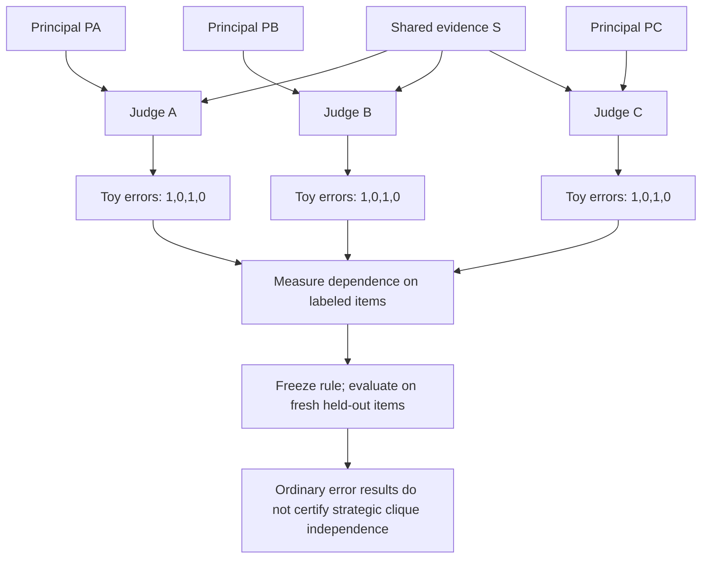
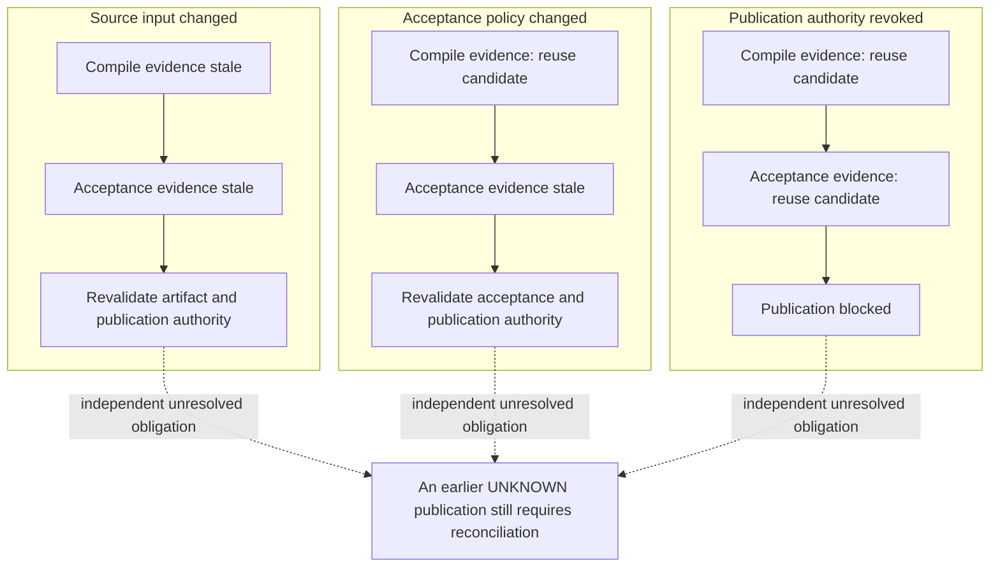
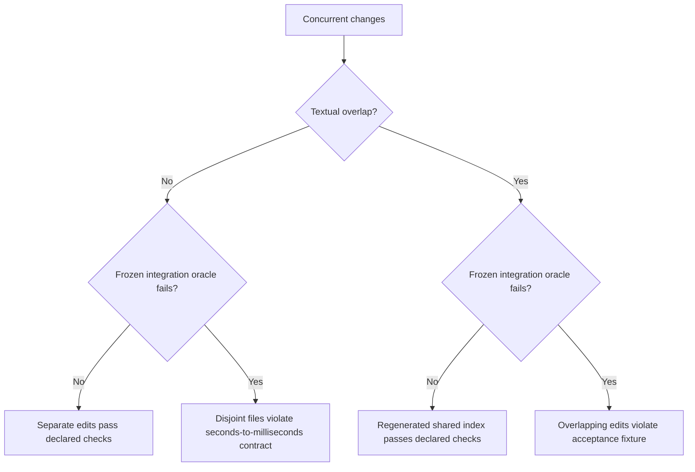

# Figure briefs for the three remaining reviewed candidates

Planning artifacts, not manuscript edits or experimental results. Read [Astra's review](ASTRA-BOOK-REVIEW.md) for exact manuscript anchors, sources and counterreadings. Stable IDs below identify proposed figures; they are outside the accepted Book atlas. All three Mermaid sources parsed/rendered with pinned Mermaid12 and were visually reviewed; [manifest](book-drafts/remaining-mermaid/manifest.json) and [root review](book-drafts/remaining-mermaid/root-review.json). TikZ ports and manuscript integration remain pending.

## Candidate 3 — Distinct principals can still repeat an error

**ID:** `draft/judge-dependence-premises`. **Placement:** Chapter 5 after the judge ceremony around line 1883, with cross-references to the architecture/clique assertion around 2089 and its later riders around 2203. **Reader question:** What does a third agreeing judge add when all three reuse the same mistaken evidence? **Claim kind:** constructed counterexample and proposed measurement interface, not a refutation of a conditional strategic theorem.

Use aligned rows for judges A/B/C, distinct principal IDs PA/PB/PC, shared evidence S, and observed error vectors over labeled toy items 1–4. All three vectors are `1,0,1,0`: same two wrong answers, same two correct answers. These are constructed bits, not data. Distinct IDs establish neither independent errors nor disjoint strategic capture. The ordinary-error illustration must remain separate from the theorem's assumed strategic cliques.

A TikZ matrix should do the work: three distinct principal entries; one visibly shared source column; three identical four-cell error rows. Add a compact calibration → freeze rule → fresh evaluation strip. Keep a separate box stating that bribery/collusion assumptions require their own model. Do not substitute an ordinary-error effective panel size for the theorem's C. Labels and hatching must carry meaning without color.

**Counterreading and test:** Shared evidence need not cause error on every task. Measure incremental harmful-error discovery and misses at matched total cost with independent labels; agreement alone is not success. This diagram reports no dependence estimate or detection improvement.

## Candidate 4 — A plan revision changes different receipt obligations

**ID:** `draft/typed-plan-revision`. **Placement:** Chapter 4 versioned roadmap around line 934, cross-referencing Chapter 1 work-unit lifecycle and Chapter 5 checkpoints. **Reader question:** Which evidence can this revision reuse, and which pending effect still needs reconciliation? **Claim kind:** proposed typed invalidation contract and experiment.

Use three aligned rows (source input changed / acceptance policy changed / publication authority revoked) and three columns (compile evidence / acceptance evidence / publication). Suggested conditional dispositions:

| Revision | Compile evidence | Acceptance evidence | Publication |
|---|---|---|---|
| Source input changed | Stale | Stale | Revalidate new artifact and authority |
| Acceptance policy changed | Reuse candidate | Stale | Revalidate new acceptance and authority |
| Publication authority revoked | Reuse candidate | Reuse candidate | Block |

“Reuse candidate” means all relevant binding fields still match; it is not automatic approval. Each receipt must bind input/artifact digest, producer configuration, acceptance policy/verifier version, applicable authority epoch/scope, effect key/status and validity interval. Direct invalidation and its propagation are separate rules. A previously attempted publication with UNKNOWN outcome stays unresolved under every row; removing its node does not reverse the external effect.

**Counterreading and test:** A green cell is conditional reuse, not a proof of correctness, minimal work or authorization. Compare rerun-all, data-only invalidation and typed invalidation using independently labeled seeded revisions. Report unsafe reuse and unnecessary recomputation separately. No implementation or minimality result exists in these drafts.

## Candidate 5 — Text overlap and harmful integration are different axes

**ID:** `draft/conflict-four-cells`. **Placement:** Chapter 4 worked afternoon around line 465, cross-referencing Chapter 1 scoped claims. **Reader question:** Which concurrent changes actually break the frozen integration contract? **Claim kind:** benchmark/acceptance-oracle proposal and constructed examples.

Make a two-by-two matrix crossing textual overlap (no/yes) with harmful integrated behavior under a frozen oracle (no/yes). Cell examples: independent documentation/test edits; producer seconds→milliseconds versus consumer still reading seconds in another file; overlapping generated-index edits reconciled by deterministic regeneration; conflicting validation edits in the same function that break a frozen acceptance fixture. Each is a constructed scenario, not a measured benchmark result. The seconds/milliseconds cell gets a short producer → wire value → consumer trace and a known-duration oracle, frozen before either edit.

**Counterreading and test:** Passing a finite oracle does not prove all intended semantics. The predictor is not the oracle. Evaluate missed harmful integrations and unnecessary serialization on held-out repository/task families, preserving unknown cases and independent labels. No detector accuracy or perfect semantic understanding is asserted.
