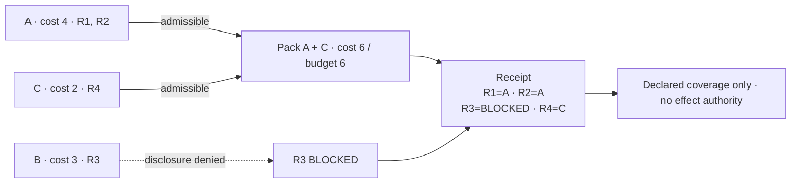
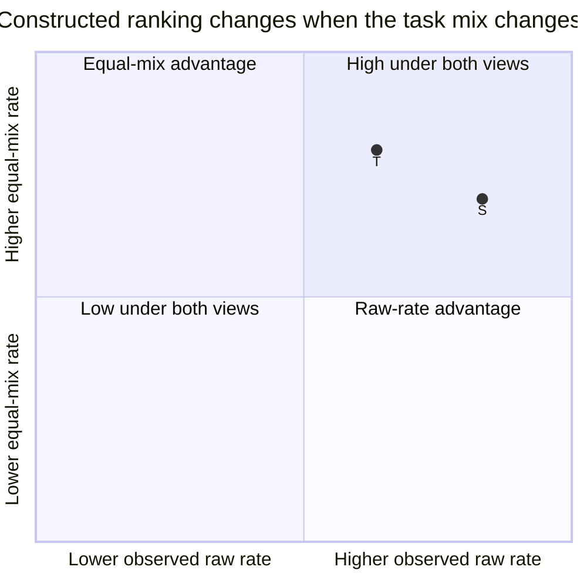

# Mermaid semantic drafts

## Obligation-complete context compilation

## Selection-aware skill promotion

This scatter-style comparison is intentionally limited to the constructed ranking reversal. The Book port adds the separate evidence lane: adaptive routing records hypotheses about policy, strata, support, use, and outcome; fresh version-pinned held-out evaluation precedes a release decision.

