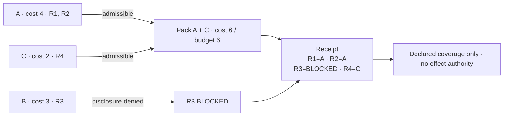
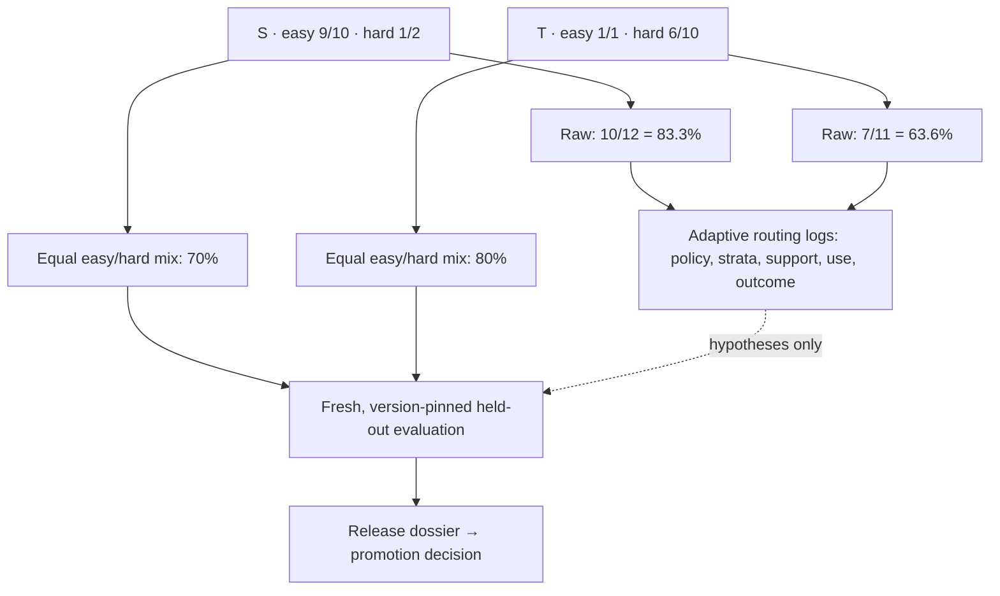

# Mermaid semantic drafts

## Obligation-complete context compilation

```mermaid
flowchart LR
    A["A · cost 4 · R1, R2"] -->|admissible| P["Pack A + C · cost 6 / budget 6"]
    C["C · cost 2 · R4"] -->|admissible| P
    B["B · cost 3 · R3"] -.->|disclosure denied| X["R3 BLOCKED"]
    P --> Y["Receipt<br/>R1=A · R2=A<br/>R3=BLOCKED · R4=C"]
    X --> Y
    Y --> L["Declared coverage only · no effect authority"]
```

## Selection-aware skill promotion

```mermaid
flowchart TB
    S["S · easy 9/10 · hard 1/2"] --> R["Raw: 10/12 = 83.3%"]
    T["T · easy 1/1 · hard 6/10"] --> Q["Raw: 7/11 = 63.6%"]
    S --> M["Equal easy/hard mix: 70%"]
    T --> N["Equal easy/hard mix: 80%"]
    R --> L["Adaptive routing logs: policy, strata, support, use, outcome"]
    Q --> L
    M --> U["Fresh, version-pinned held-out evaluation"]
    N --> U
    L -.->|hypotheses only| U
    U --> D["Release dossier → promotion decision"]
```
