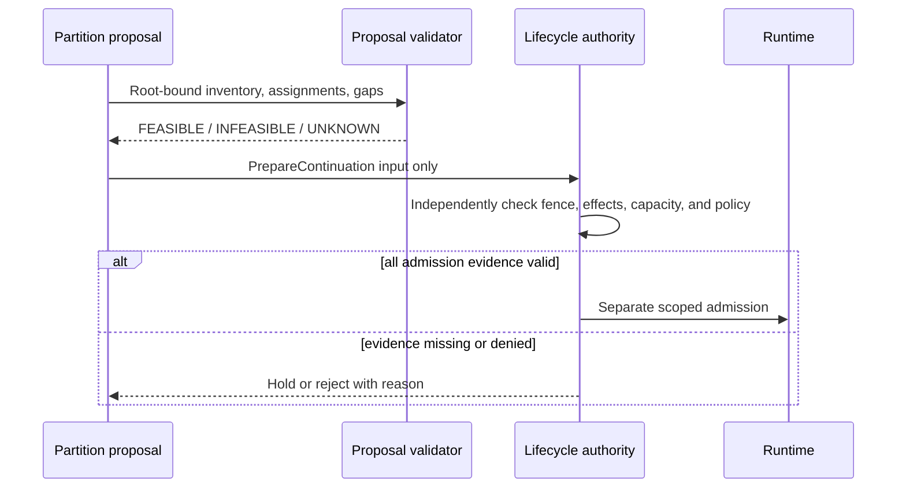

# Context IR and continuation boundary

A Context IR is a typed inventory, not a prompt. It lets a partition proposal preserve what each item means, where it came from, whether it can direct behavior, and what work remains unresolved.

## Minimum useful item record

For each item, retain stable ID; content or immutable content reference; source root and digest; source revision/validity interval; trust/evidence class; audience and disclosure scope; retention rule; token estimate and estimation method; causal parents; linked obligations; effect status; required capabilities; and allowed omission dispositions. Keep raw primary evidence and derived summaries distinguishable. A summary cannot silently replace its source.

For each open obligation, record the user/task clause, owner or unresolved-owner state, acceptance evidence, dependencies, and whether omission is allowed. Unresolved external effects remain explicit obligations; do not compress “request timed out” into “no effect.”

## Continuation requirement versus successor

A continuation package can state an abstract slot requirement: skills/capabilities needed, evidence required, input inventory, size, and dependencies. It carries no process ID, credential, identity, authority lease, or inferred successor. A separate lifecycle authority decides whether to fence an old body, reconcile effects, reserve capacity, admit a successor, and mint scoped capabilities.

A validator can recompute a digest from its input. That proves internal consistency of the supplied bytes, not signer identity, authority, complete discovery, truth, or current runtime state.

## Omission and transfer accounting

Each root item must receive one explicit disposition. A transfer must join a declared source, destination, dependency, and disclosure proof. A duplicate hash may justify deduplication only when the digest was computed over the correct scope and the original lineage remains available. A redacted item needs a tombstone containing its stable identity, reason, and invalidated descendants; the tombstone itself does not resurrect deleted content.

## Worked example

Constructed example: a legal-review obligation depends on a source contract and a dated pricing schedule. The schedule’s disclosure audience is narrower than the already-admitted implementation body. A semantic match to a public rate card is not a substitute. The partition result is `INFEASIBLE` if no authorized target can receive the source, or `UNKNOWN` if the audience/authority evidence is missing. The obligation stays open and the result records the exact gap.
