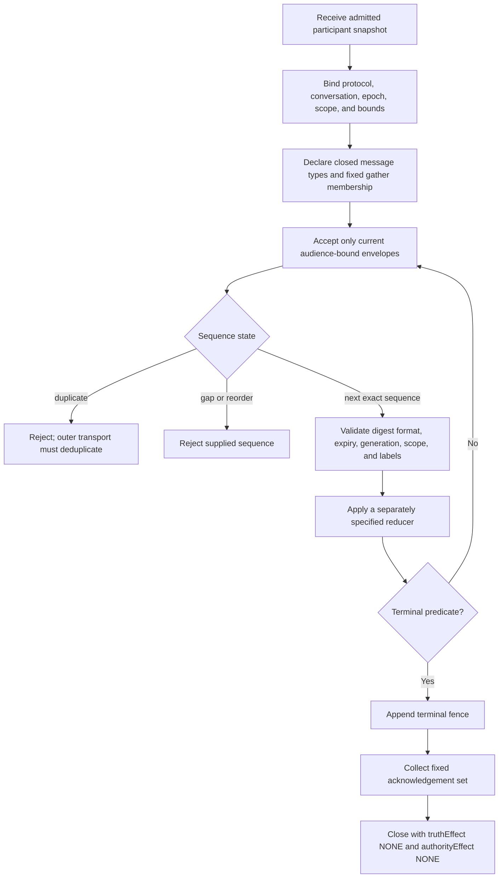
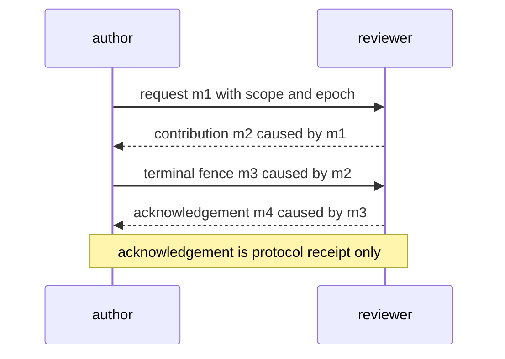

# Agent Conversation Protocols

## Source and implementation boundary

FIPA interaction-specification bodies were not accessible for this draft. The [A2A v1.0 specification](https://a2a-protocol.org/latest/specification/), its [pinned v1.0.0 protobuf source](https://raw.githubusercontent.com/a2aproject/A2A/v1.0.0/specification/a2a.proto), and the [MCP 2026-07-28 changelog](https://modelcontextprotocol.io/specification/2026-07-28/changelog) were read as protocol vocabulary sources. They inform external protocol vocabulary only. Neither their message/request IDs nor this skill’s trace IDs are business-operation identifiers, identity proof, effect authority, or a claim of wire conformance. The trace schema is a local offline contract.

Design a finite protocol over identities and authority supplied by other systems. A valid trace says which messages were accepted and why. It never creates a principal, body, lease, capability, truth verdict, or permission to cause an effect.

## Use this skill when

- already admitted bodies need a request/response, critique, handoff, or gather protocol;
- duplicate, stale, reordered, missing, or replayed messages must fail deterministically;
- a fixed participant set must converge to a closed terminal;
- a transcript must replay to the same semantic state;
- a terminal fence and explicit acknowledgement set are required.

## Do not use it for

- choosing, spawning, admitting, resurrecting, or paying agents;
- deciding star, mesh, tree, or runtime placement;
- ordinary human discourse or conflict mediation;
- serialization, queues, sockets, or transport deployment;
- adjudicating claim truth or granting action authority.

## Protocol design procedure



1. **Bind the snapshot.** Record exact participant principals, body generations, audience labels, protocol epoch, scope, deadline, and message ceiling. This skill does not admit them. A participant's `audiences` is the set of labels it accepts; every message declares nonempty `audienceLabels`, and each addressed participant must advertise every declared label.
2. **Close the language.** Enumerate message kinds and payload types. Unknown kinds fail closed.
3. **Sequence per sender.** Sequence numbers start at 1 and are contiguous inside one epoch and body generation. This offline validator rejects all duplicate message IDs. A transport may deduplicate byte-identical envelopes before presenting a trace, but that transport step is not implemented or tested here; the validator does not classify equivocation.
4. **Filter before reduce.** Reject stale epoch/generation, wrong scope/audience label, malformed verification-reference field, expired message, late gather contribution, and non-predecessor causation before a separately supplied reducer changes semantic state. The validator only checks the receipt reference's local type/nonempty form; it does not verify signatures or principals.
5. **Freeze gathers.** Membership and reducer are fixed when the gather opens. Silence, timeout, majority, and acknowledgement do not imply assent, truth, or authority.
6. **Fence termination.** Exactly one terminal fence closes semantic mutation. Required participants acknowledge the fence; an acknowledgement means receipt only.
7. **Replay semantically.** A full protocol implementation may define canonical replay and payload/state-digest recomputation, but this offline validator only checks the supplied message sequence. It has no payloads, reducer implementation, state input, cryptographic receipts, delivery logs, or stable concurrent-event tie-break, so it cannot recompute digests or prove replay equivalence.

## Non-authority invariants

- Messages transport assertions; they do not mint identity, body continuity, admission, leases, capabilities, or permissions.
- `ACK` records a receipt assertion by the named participant generation in the supplied trace; cryptographic sender verification is outside this validator.
- `GATHER_RESULT` is a deterministic reduction of declared inputs, not a truth verdict.
- A protocol terminal does not prove an external effect stopped, succeeded, failed, or settled.
- Every terminal has `truthEffect: NONE` and `authorityEffect: NONE`.

## Ordering and replay rules

| Condition | Required disposition |
|---|---|
| exact next sender sequence | validate, then reduce |
| duplicate message ID | `E_DUPLICATE_MESSAGE`; deduplication, byte equality, and equivocation handling belong to an outer transport not implemented here |
| sequence gap or later message first | `E_SEQUENCE_GAP` |
| stale epoch or body generation | `E_STALE_EPOCH` / `E_STALE_GENERATION` |
| unknown recipient or wrong scope | `E_AUDIENCE_SCOPE` |
| recipient does not advertise every declared audience label | `E_AUDIENCE_LABEL` |
| unknown causation parent | `E_CAUSATION_GAP` |
| message after terminal fence | `E_POST_TERMINAL_MESSAGE` |
| terminal missing required acknowledgements | valid `BLOCKED`, never complete |

## Gather rules

- `membership` is a sorted, nonempty list of participant refs and cannot change.
- `ALL` waits for one accepted contribution from every member.
- `QUORUM` requires an explicit integer threshold and preserves every dissenting contribution.
- `FIRST_SUCCESS` is permitted only for inert candidate production and must use a deterministic tie-break; it cannot decide truth or authority.
- Timeout yields an explicit partial/blocked result. It never fabricates missing input.
- A production reducer should consume typed message IDs and record its semantic value plus unresolved members. This schema has no payload or reducer-output field, so the offline validator cannot run a reducer or bind a state digest to its output.

## Terminals

`COMPLETED`, `BLOCKED`, `TIMED_OUT`, `CANCELLED`, and `DISSENT_RECORDED` are the only terminals. `COMPLETED` means only that the protocol's declared semantic predicate was met. Any external lifecycle or effect claim requires independent evidence.

## Anti-patterns

### Ack means done

**Wrong:** treat delivery acknowledgement as task completion or stopped process.

**Right:** receipt, semantic closure, lifecycle state, and external effect state remain separate.

### Majority mints truth

**Wrong:** collapse a quorum result into fact or permission.

**Right:** preserve inputs and dissent; pass the candidate to an independent evaluator or authority.

### Dynamic gather membership

**Wrong:** add a friendly voter after seeing early results.

**Right:** freeze membership and epoch before contributions.

### Replay by timestamp

**Wrong:** trust wall-clock order across senders.

**Right:** verify the supplied sequence, per-sender sequence, and explicit predecessor causation. A canonical concurrent tie-break belongs to a separate, tested replay implementation; this validator does not provide one.

## Terminal fence example



## Output contract

Emit a JSON trace conforming to [`schemas/conversation-trace-v2.schema.json`](schemas/conversation-trace-v2.schema.json). Validate it with:

```bash
node skills/agent-conversation-protocols/scripts/validate-conversation-trace.mjs \
  skills/agent-conversation-protocols/examples/valid-trace.json

node skills/agent-conversation-protocols/scripts/test-bundle.mjs
```

## Load only when needed

- [`references/INDEX.md`](references/INDEX.md) — short routing for the protocol references.
- [`references/envelope-and-ordering.md`](references/envelope-and-ordering.md) — exact envelope fields, duplicate handling, and the supplied-sequence replay boundary.
- [`references/gathers-and-terminals.md`](references/gathers-and-terminals.md) — fixed gathers, reducers, terminal fences, and acknowledgements.
- [`references/pattern-selection-boundary.md`](references/pattern-selection-boundary.md) — select a conversation pattern before instantiating this closed protocol; a pattern does not grant authority or settle an effect.
- [`references/fipa-a2a-mcp-boundary.md`](references/fipa-a2a-mcp-boundary.md) — distinguishes historical FIPA access limits, A2A/MCP wire sources, and this local trace contract.
- [`diagrams/01_terminal-fence.md`](diagrams/01_terminal-fence.md) and [`diagrams/02_replay-order.md`](diagrams/02_replay-order.md) — terminal and replay boundaries.
- [`examples/valid-trace.json`](examples/valid-trace.json) — valid supplied trace fixture used by the validator.
- [`scripts/validate-conversation-trace.mjs`](scripts/validate-conversation-trace.mjs) — closed-shape and semantic validator.
- [`scripts/test-bundle.mjs`](scripts/test-bundle.mjs) — valid fixture plus adversarial mutation suite.
- [`tests/activation.md`](tests/activation.md) — positive and negative activation corpus.

## Offline validator coverage

The validator checks JSON shape, required fields, primitive types, dates, closed enums, local digest **format**, participant/audience-label binding, supplied per-sender sequence, causal predecessor order, gather deadlines/membership, terminal/acknowledgement consistency, and no unresolved participant in `COMPLETED`. It does not receive payload bytes or reducer state, so a stated `stateDigest` is unchecked input beyond its regex. It does not validate cryptographic receipts, identity, transport deduplication, delivery, durable storage, canonical concurrency order, runtime liveness, containment, or external effects.
