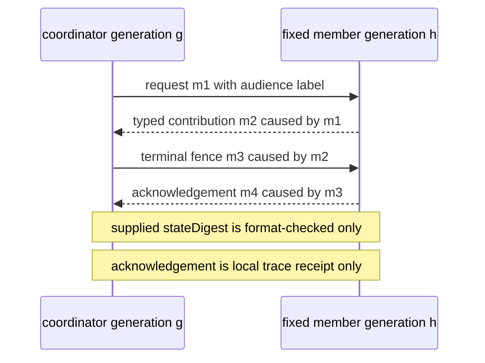

# Terminal fence

```mermaid
sequenceDiagram
  participant C as coordinator generation g
  participant M as fixed member generation h
  C->>M: request m1 with audience label
  M-->>C: typed contribution m2 caused by m1
  C->>M: terminal fence m3 caused by m2
  M-->>C: acknowledgement m4 caused by m3
  Note over C,M: supplied stateDigest is format-checked only
  Note over C,M: acknowledgement is local trace receipt only
```
