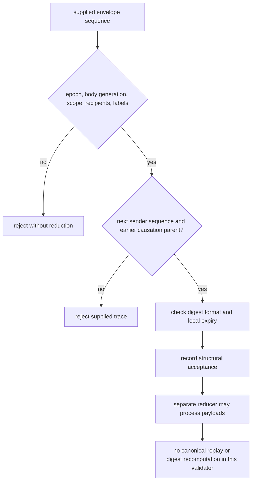

# Supplied-sequence validation boundary

```mermaid
flowchart TD
  A[supplied envelope sequence] --> B{epoch, body generation, scope, recipients, labels}
  B -->|no| X[reject without reduction]
  B -->|yes| C{next sender sequence and earlier causation parent?}
  C -->|no| Y[reject supplied trace]
  C -->|yes| D[check digest format and local expiry]
  D --> E[record structural acceptance]
  E --> F[separate reducer may process payloads]
  F --> G[no canonical replay or digest recomputation in this validator]
```
