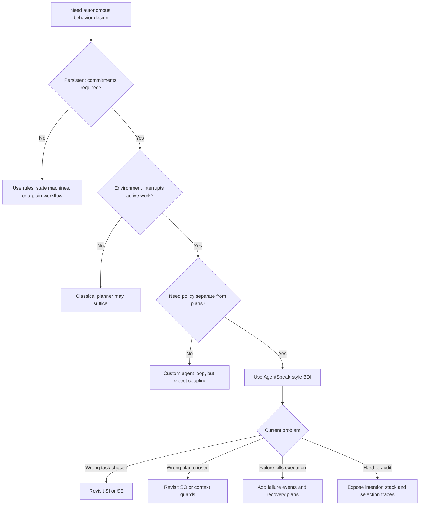
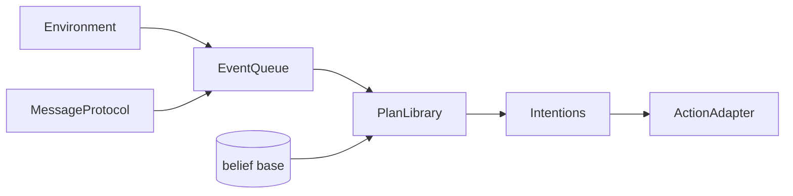
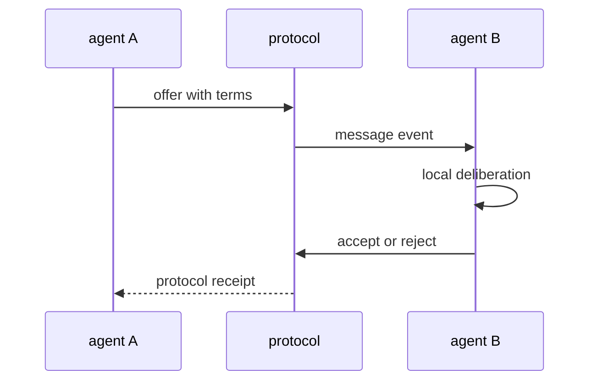

# AgentSpeak(L) BDI Architecture

Use this skill when the hard part is not writing another workflow, but deciding how an autonomous agent should react, commit, suspend work, and explain its choices under changing conditions.

## When to Use

- A system must react to new events without abandoning longer-running commitments.
- You need a plan library with reusable behaviors selected by current context rather than one monolithic controller.
- Agent policy must stay separate from domain knowledge so urgency, fairness, or risk tolerance can change without rewriting plans.
- Failures should trigger recovery behavior and replanning instead of collapsing the whole agent.
- You need an inspectable mental model for why an agent chose one task or plan over another.

## NOT for

- Simple rule engines where no persistent commitments or intention stacks are needed.
- Static planning problems where the environment does not interrupt execution.
- Centralized workflow systems where one scheduler already dictates every step.
- Prompt-only agent loops that never represent beliefs, plans, or policy separately.

## Core Mental Models

### Beliefs, Desires, and Intentions Are Different Objects

Beliefs model the current world, desires define candidate outcomes, and intentions are the specific committed plan stacks currently consuming execution budget. If those collapse into one blob, the agent stops being interpretable.

### Plans Are Situated Knowledge

AgentSpeak plans are not generic procedures. They are event-triggered recipes with context guards, so the same goal can invoke different behaviors depending on what the agent currently believes.

### Selection Functions Hold the Policy

The event selector, option selector, and intention selector are where urgency, fairness, and risk tolerance belong. Plans should encode know-how; selection functions should encode strategy.

### Interruptibility Is a Feature, Not a Bug

Intentions are partially executed stacks that can be interleaved, suspended, and resumed. That is what allows responsive agents to handle interrupts without turning every long task into a restart.

### Formalize Upward from the Running System

The practical lesson from AgentSpeak(L) is to start from an operational agent cycle and formalize what it actually does. Do not write an elegant abstract theory that has to be approximated into runtime behavior later.

## Decision Points

- Use AgentSpeak-style modeling when the system must balance reactivity with commitment rather than choosing one.
- Put world assumptions in belief queries and plan guards, not as conditionals buried deep inside actions.
- If strategy changes but domain knowledge does not, change selection functions before rewriting plans.
- Decompose long tasks into subgoals so intention stacks remain inspectable and interruptible.

## Failure Modes

### Goal-Intention Collapse

Cue: the design says the agent "has a goal" but cannot show whether it has actually committed resources to it.

Fix: represent candidate goals separately from currently active intention stacks.

### Policy Hidden in Plans

Cue: every plan body contains priority, fairness, or urgency branching.

Fix: move those choices into event, option, or intention selection functions.

### Monolithic Plans

Cue: plans are so long that any interrupt forces the whole sequence to restart mentally.

Fix: split long behaviors into shorter plans with explicit subgoal boundaries.

### Failure as Crash, Not Event

Cue: a failed subgoal aborts the whole agent or silently disappears.

Fix: model failure as an event that can trigger recovery, retry, or abandonment plans.

### Ungrounded Context Guards

Cue: plans match on vague world assumptions that are never tied to real beliefs or observations.

Fix: make belief update paths explicit and keep guards queryable against current belief state.

## Worked Examples

### Tool-Using LLM Agent with Urgent Interrupts

A coding agent is working through a long refactor when a high-severity production alert arrives. Model the refactor as one intention stack and the alert as a new event. Let selection functions preempt the refactor, then resume it later without losing state.

### Warehouse Coordination Without a Central Dispatcher

Several mobile agents share a belief base about aisle congestion and inventory state. Their domain knowledge stays in plans, while selection functions encode which urgent pick jobs outrank replenishment work under congestion.

## Reference Files

- `references/agent-vs-logic-programs-key-distinctions.md` — Contrasts AgentSpeak plans with Prolog clauses. **Read when** clarifying why plans are not just logic rules.
- `references/agentspeak-and-multi-agent-coordination.md` — Extends single-agent BDI to multi-agent systems without central control. **Read when** designing agent orchestration across multiple autonomous entities.
- `references/bdi-architecture-for-agent-orchestration.md` — Translates BDI formalism into design principles for task routing and state management. **Read when** architecting orchestration systems like WinDAGs.
- `references/bdi-mental-architecture-for-agent-systems.md` — Justifies why agents need separate beliefs, desires, and intentions structures. **Read when** designing agent mental models or questioning the three-part separation.
- `references/belief-grounding-and-context-checking.md` — Explains how plan contexts anchor to current world state via belief base. **Read when** implementing context guards or plan applicability checks.
- `references/belief-management-and-world-modeling.md` — Details belief base as agent's epistemic foundation and its role in plan selection. **Read when** designing belief update mechanisms or query semantics.
- `references/bridging-theory-practice-gap-in-agent-systems.md` — Identifies the gap between formal BDI theory and working implementations. **Read when** justifying why formal foundations matter for practical systems.
- `references/closing-theory-practice-gap-in-agent-systems.md` — Shows how Rao grounds theory in dMARS implementation experience. **Read when** understanding the paper's motivation or balancing formalism with pragmatism.
- `references/context-sensitive-plans-as-agent-knowledge.md` — Defines plans as event-triggered, context-guarded recipes encoding situated knowledge. **Read when** designing plan libraries or understanding plan structure.
- `references/event-driven-reactivity-in-bdi-systems.md` — Formalizes the four event types and how agents react without abandoning goals. **Read when** implementing event queues or designing reactive behavior.
- `references/failure-modes-in-bdi-systems.md` — Catalogs failures the architecture prevents and those it does not. **Read when** assessing robustness or designing failure recovery.
- `references/intention-management-and-goal-decomposition.md` — Distinguishes goals (desires) from intentions (committed action stacks). **Read when** clarifying the goal-intention boundary or managing hierarchical decomposition.
- `references/intention-stacks-and-hierarchical-decomposition.md` — Explains intention stacks as memory of commitment preserving causal history. **Read when** implementing intention stack management or understanding plan hierarchy.
- `references/multi-agent-coordination-without-central-control.md` — Addresses coordination challenges when no single agent has complete knowledge. **Read when** designing decentralized multi-agent systems.
- `references/operational-semantics-as-interpreter-specification.md` — Justifies operational semantics over axiomatic or denotational approaches for agent systems. **Read when** implementing an agent interpreter or verifying execution correctness.
- `references/plans-as-context-sensitive-event-triggered-recipes.md` — Formalizes plan structure as the core architectural unit. **Read when** defining plan syntax or understanding conditional competence.
- `references/proof-theory-and-verifiable-agent-behavior.md` — Shows how labeled transition systems enable verification of agent correctness. **Read when** proving agent behavior properties or validating orchestration logic.
- `references/selection-functions-as-agent-policy.md` — Separates plan library (what agent knows) from selection functions (how agent decides). **Read when** isolating policy from domain knowledge or making strategy replaceable.
- `references/selection-functions-as-policy-locus.md` — Details the three selection functions (SE, SO, SI) governing decision-making at each level. **Read when** implementing urgency, fairness, or risk tolerance policies.

## Quality Gates

- Beliefs, desires, and intentions are represented separately.
- Each major triggering event has at least one plan with an explicit context guard.
- The design names where SE, SO, and SI policy lives.
- Failure paths create events or recovery plans instead of silent collapse.
- A reviewer can inspect active intentions and explain why one plan was selected over another.

## Shibboleths

- If someone cannot explain the difference between a goal the agent wants and an intention it has committed to, they have not internalized the model.
- If "strategy" changes require rewriting plan bodies, policy and knowledge were never separated.
- If the agent cannot say what interrupted it and what it will resume next, it is not really using intention stacks.

## Reference Routing

- `references/bdi-architecture-for-agent-orchestration.md`: load for the full agent cycle and B/D/I interplay.
- `references/context-sensitive-plans-as-agent-knowledge.md`: load when plan structure and guard design are the main issue.
- `references/selection-functions-as-agent-policy.md`: load when priority, fairness, or risk tolerance need explicit policy treatment.
- `references/intention-management-and-goal-decomposition.md`: load when suspend/resume, subgoals, or intention auditability are central.
- `references/failure-modes-in-bdi-systems.md`: load when the current design already exists and you are debugging breakdowns.

## Evidence boundary and repaired diagrams

This companion path covers interpreter embedding and system boundaries, rather than repeating language semantics. Keep belief bases local; specify message framing, authority, retry, supervision, and receipts as separate contracts.

See [`references/evidence-scope.md`](references/evidence-scope.md) for source scope. Existing bundle references are preserved as source snapshots and need primary-source revalidation before supporting current framework, platform, price, limit, legal, clinical, or performance claims.
