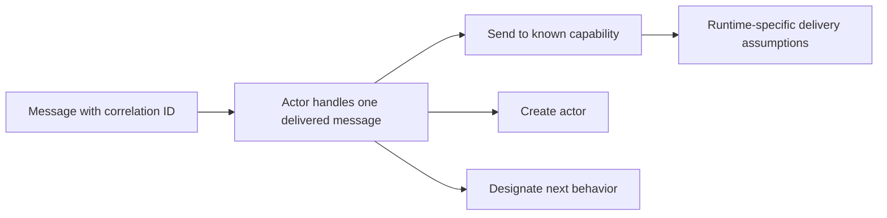
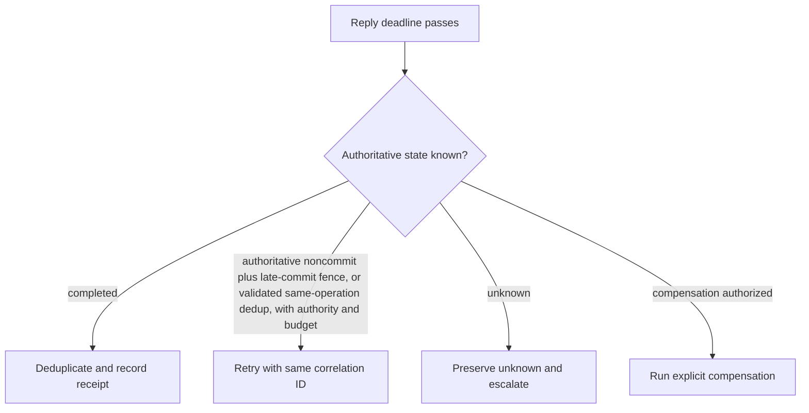

# Agha actor model

Use the actor model to assign encapsulated behavior, send messages, and create actors in an open concurrent system. These semantics do not guarantee delivery, FIFO ordering, fairness, persistence, authorization, or a supervisor’s restart policy; name the runtime and application assumptions that supply any such property.

## 1. Define the local behavior and message contract

For each message, state correlation ID, sender capability, expected reply, replacement behavior, and durable recovery state. A recipient may send messages, create actors, and designate behavior for its next message; the model’s open-system account and Agha’s 1986 framing do not supply an end-to-end effect receipt.

## 2. Treat timeout as unknown

A missing reply can mean delay, loss, recipient failure, partition, or a completed effect whose reply was lost. Before retrying a non-idempotent request, query authoritative state. Retry only with documented idempotency/deduplication and authority; otherwise retain unknown and escalate or compensate under an explicit policy.

## 3. Worked trace

A client sends `extract(id=42)` to a worker with reply address `customer-42`. The worker may create a parser actor and send its result directly to that customer; the client remains available for unrelated messages. If the deadline passes, the customer asks the durable job record for `42`. A returned result is accepted once by correlation ID. This is a constructed protocol overlay, not an actor-model theorem.

## 4. Review

Check encapsulated state, named capabilities, behavior replacement, message correlation, runtime delivery assumptions, and an unknown-effect branch. Shared-memory/lock designs remain valid when their substrate is required.

## Sources and limits

[Agha 1986](https://mitpress.mit.edu/9780262511414/actors/) establishes the primary model framing; [Agha et al. 1992](https://osl.cs.illinois.edu/publications/conf/concur/AghaMST92.html) gives operational semantics for open actor systems and equivalence under stated fairness assumptions. [Erlang/OTP supervision](https://www.erlang.org/docs/17/design_principles/sup_princ.html) is an implementation policy, not an actor axiom.

## 5. Delegation, long work, and observational review

Use the customer pattern for `A→B→C`: A creates continuation `kBC`, sends A’s result request to B with `kBC`; `kBC` sends B’s result to C with `kC`; `kC` sends C’s result to the final customer. A becomes ready for its next message after creating the continuation. For long work, an insensitive actor delegates incoming work to a buffer/customer rather than blocking its own delivery path. Dynamic creation and addresses carried as message data permit capability routing; they do not authorize a recipient.

Agha et al. 1992 §2 models fair asynchronous message delivery: a message cannot remain queued forever when its receiver is external or ready infinitely often. That formal assumption differs from deployment proof of a particular network’s delivery. The paper also models `become` through anonymous continuation/clone behavior and distinguishes uninitialized, ready, and busy actor states. §3 distinguishes may/must observation under contexts; test composed behavior and event traces, not final output alone. The Brock-Ackerman lesson is a diagnostic: equal outputs can conceal different composition behavior.
