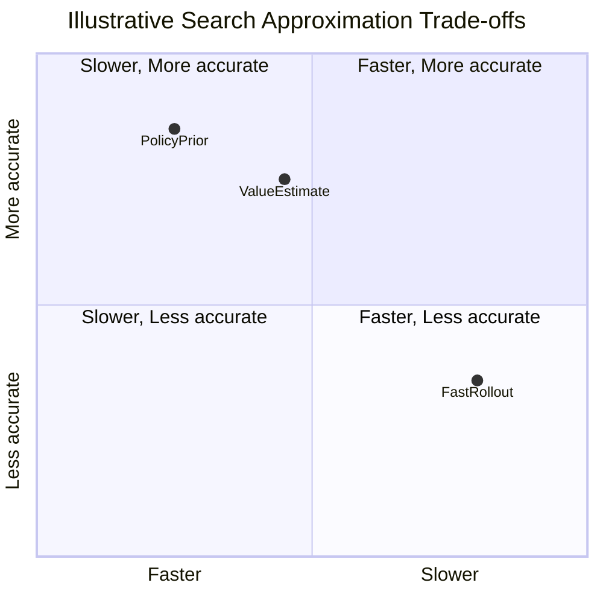

# Cascading Approximation: Speed vs. Accuracy Trade-offs

```mermaid
quadrantChart
    title Illustrative Search Approximation Trade-offs
    x-axis Faster --> Slower
    y-axis Less accurate --> More accurate
    
    quadrant-1 Faster, More accurate
    quadrant-2 Slower, More accurate
    quadrant-3 Slower, Less accurate
    quadrant-4 Faster, Less accurate
    
    PolicyPrior: [0.25, 0.85]
    ValueEstimate: [0.45, 0.75]
    FastRollout: [0.80, 0.35]
```
