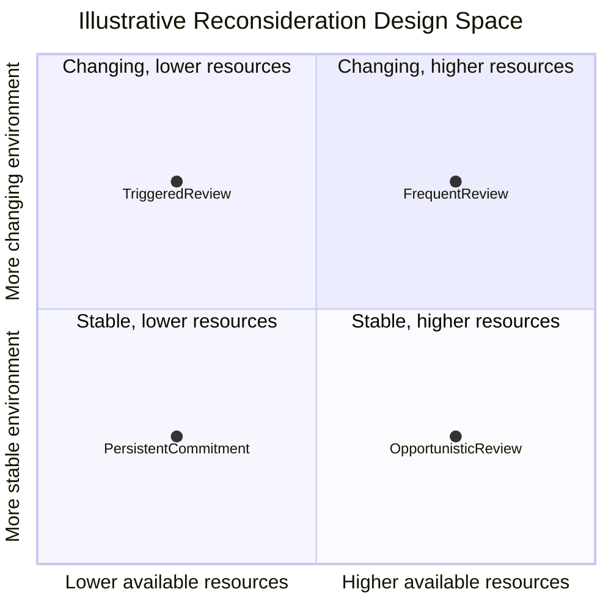

# Environment Dynamics vs. Computational Cost: Reconsideration Strategy Selection

```mermaid
quadrantChart
    title Illustrative Reconsideration Design Space
    x-axis Lower available resources --> Higher available resources
    y-axis More stable environment --> More changing environment
    
    quadrant-1 Changing, higher resources
    quadrant-2 Changing, lower resources
    quadrant-3 Stable, lower resources
    quadrant-4 Stable, higher resources
    
    TriggeredReview: [0.25, 0.75]
    PersistentCommitment: [0.25, 0.25]
    OpportunisticReview: [0.75, 0.25]
    FrequentReview: [0.75, 0.75]
```
