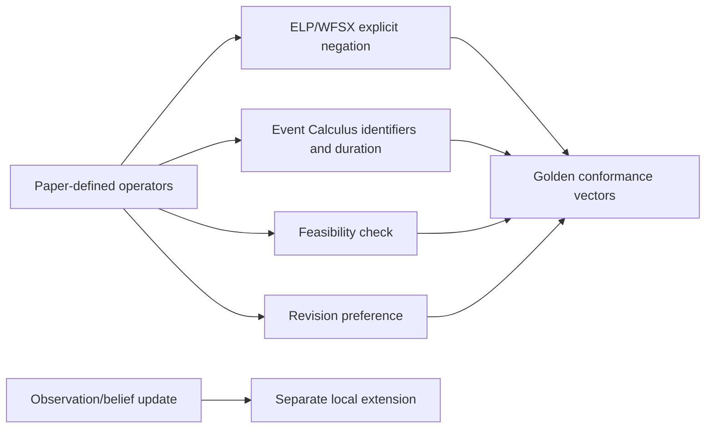
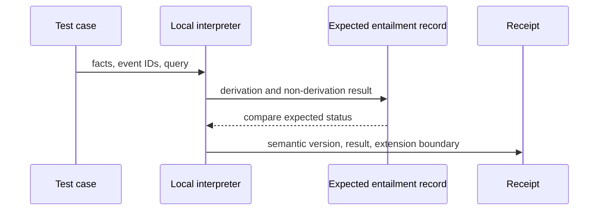

# Paper scope and conformance boundary

## Paper and local-extension boundary

Móra et al. (ATAL 1998; LNAI 1555, 1999) was read at formal-representation, desire/intention-formation, revision, and conclusion depth on 2026-09-24. It proposes ELP/WFSX, Event Calculus, abductive feasibility, and preference revision, assumes initially consistent beliefs, and explicitly leaves belief update out of scope. Any observation ingestion, belief-update adapter, event delivery, threshold, scheduling, or effect path below is a local extension that needs its own typed inputs, failure handling, measurements, and authorization boundary.

**Primary source:** M. C. Móra, J. G. Lopes, R. M. Viccari, and H. Coelho, “BDI Models and Systems: Reducing the Gap,” ATAL 1998; LNAI 1555, published 1999, DOI https://doi.org/10.1007/3-540-49057-4_2. **Accessed:** 2026-09-24. **Access depth:** author-uploaded full text read; publisher DOI identity checked. The paper proposes ELP with explicit negation/WFSX, Event Calculus, abductive feasibility, and preference relations, assumes initially consistent beliefs, and explicitly leaves belief update out of scope.

Use distinct vectors for paper-defined behavior and for extensions. A contradictory port report is a test of explicit representation, not proof that a sensor update or permission decision is correct.
