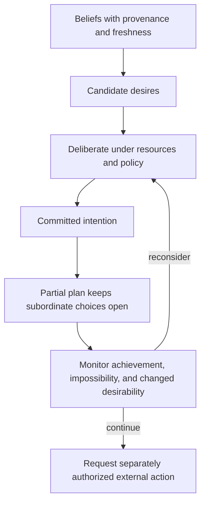
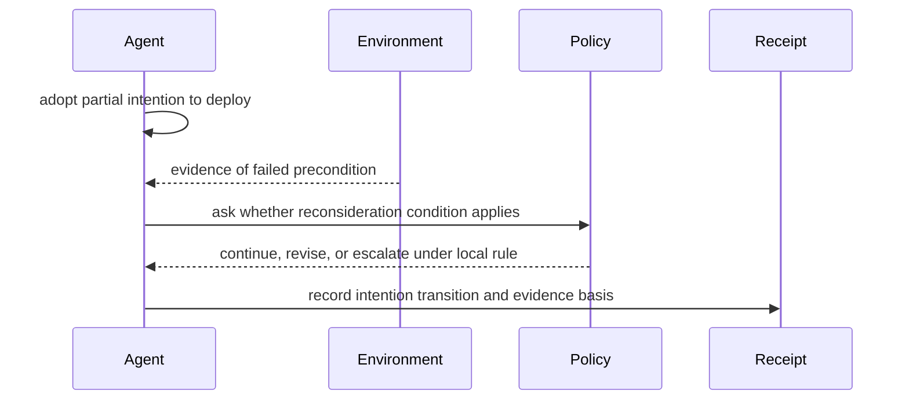

# Commitment boundary and trace

**Primary sources:** Michael Bratman, David Israel, and Martha Pollack, “Plans and Resource-Bounded Practical Reasoning,” *Computational Intelligence* 4 (1988), DOI https://doi.org/10.1111/j.1467-8640.1988.tb00284.x; Philip R. Cohen and Hector J. Levesque, “Intention Is Choice with Commitment,” *Artificial Intelligence* 42 (1990), DOI https://doi.org/10.1016/0004-3702(90)90055-5; Rao and Georgeff, “BDI Agents: From Theory to Practice” (1995). **Accessed:** 2026-09-24. **Access depth:** Bratman full author/institutional copy read; Cohen/Levesque publisher abstract/metadata read; Rao/Georgeff 1995 official PDF read. These sources support resource-bounded commitment and reconsideration as a trade-off, not a universal architecture, fixed threshold, multi-agent protocol, or external-action authorization rule.

Worked example: a partial intention to deploy preserves an explicit commitment while leaving rollout steps open. If a prerequisite becomes infeasible, the agent may reconsider under its configured policy. Neither intention nor a BDI label authorizes an external deployment; an effect needs independent authority and a receipt.
