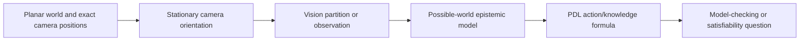
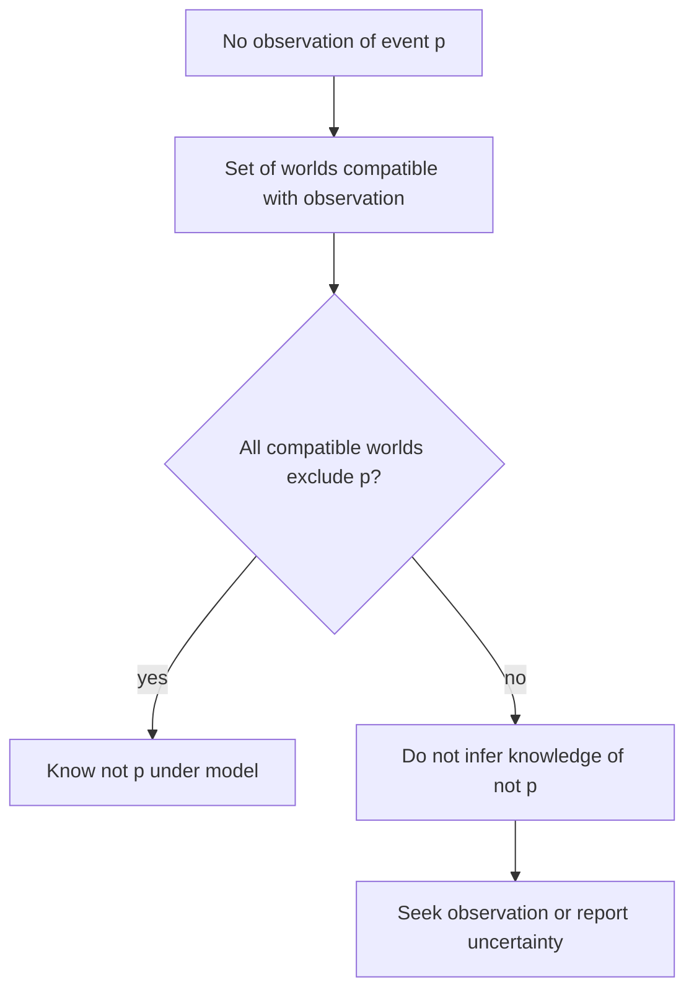

# Big Brother Logic: surveillance assumptions made explicit

Charrier et al. (AAMAS 2014) model stationary planar cameras with known exact
positions, changing orientation/vision, a finite vision abstraction, and PDL
translation. The paper leaves mobile-camera model checking/satisfiability for
future work. Its complexity statements belong to specified logic fragments.

## Extension gate

A mobile camera, uncertain camera pose, noisy detection, asynchronous delivery,
or privacy boundary changes the model. Name the state transition, observation
relation, and logic before reusing a stationary-camera result. Do not call
absence of an observation evidence of absence without the possible-world set.

See [Kripke models](references/kripke-models-for-agent-uncertainty.md),
[knowledge operators](references/distributed-vs-common-knowledge.md), and
[model-checking limits](references/model-checking-vs-satisfiability-dual-problems.md).