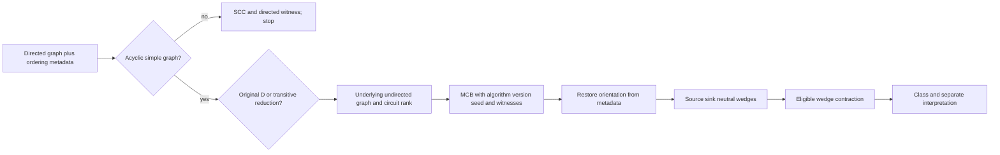
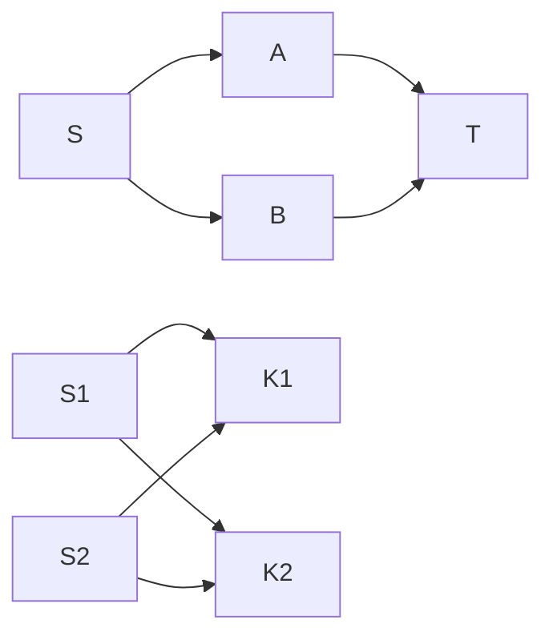

# DAG Cycle Analysis

This skill retains the paper-specific method of [Vasiliauskaite, Evans and
Expert (2022)](https://discovery.ucl.ac.uk/id/eprint/10154887/1/1-s2.0-S0378437122001340-main.pdf).
It begins with an undirected cycle basis and maps each selected cycle through
stored direction/order metadata. It is not an SCC checklist: undirected cycles
can exist in a valid DAG, while a directed feedback witness invalidates the DAG
premise.

## Method 1 — establish graph and metadata scope

Record whether an edge means precedence, data dependency, or another relation;
record the pairwise ordering metadata `O`; validate a simple graph (no loop or
parallel edge) and acyclicity. The paper's `F_dir(G,O)` orients existing
substrate edges, while `F_undir(D)` forgets direction. If a directed cycle is
found, report SCC plus directed witness and stop the DAG classification pending
semantic repair.

Choose original `D` or transitive reduction `D_TR` before analysis. A DAG's TR
preserves reachability but removes shortcut edges and changes its undirected
cycle space, so retain both input identities. TR neither preserves an MCB as a
set nor proves a stable unique basis.

## Method 2 — select and orient a basis

For selected underlying graph compute circuit rank `d=E−N+n_c`. Obtain a
minimum cycle basis (MCB: a cycle-space basis of minimum total length), recording
algorithm, library/version, tie treatment/seed, and exact edge-set witnesses.
An MCB need not be unique. The paper uses De Pina and describes a fundamental
basis property; do not turn “no basis-cycle edge set is contained in another”
into the definition of all MCBs. In standard usage, a fundamental cycle basis is
usually defined relative to a spanning tree and its chords; report the selected
algorithm's terminology rather than asserting a universal equivalence.

For each selected undirected cycle, restore edge orientation from `O`. Classify
each cycle node as source (both cycle edges outward), sink (both inward), or
neutral (one of each). Iteratively contract a neutral wedge only when its
boundary condition has at most one source/sink, preserving non-neutral nodes and
source/sink-pair structure. Then report the contracted paper class and separate
structural observation from any domain interpretation.

## Method 3 — report the four generalized-cycle images

The four names apply after the paper's directed metadata and wedge contraction,
not to every graph motif. Feedback is a directed-cycle violation for a claimed
DAG. A shortcut has one source/sink pair joined directly and is removed by TR.
A diamond has one source/sink pair with indirect alternatives and an intermediate
non-unitary antichain. A mixer has multiple source/sink pairs and source/sink
antichains. In a reduced valid DAG only diamond/mixer images remain.

The left square is a diamond (`S` to `T` through `A,B`); the right is a mixer
(`S1,S2` to `K1,K2`). They are hand fixtures, not evidence of resilient runtime
paths, actual payload fusion, synchronization, or a safe coordination policy.

## Hand checks and limits

For diamond `S-A-T-B-S`, `N=4,E=4,n_c=1`, hence `d=1`; orientation yields
source `{S}`, sink `{T}`, neutrals `{A,B}`, and an intermediate antichain after
contraction. The mixer square also has `d=1`, with two source/sink antichains.
Negative: `A→B→C→A` is feedback, so report a DAG violation rather than keep
analyzing it as a healthy class. MCB statistics in the paper were evaluated on
named generated ER/Price families; repeat runs may be necessary when selection
is nondeterministic.

## References

Open [method notes](references/INDEX.md) for antichains, coordinates, MCB,
metadata, TR, four classes, assumptions, and failure boundaries. Tarjan is a
separate [SCC diagnostic source](https://epubs.siam.org/doi/abs/10.1137/0201010);
[NetworkX DAG documentation](https://networkx.org/documentation/stable/reference/algorithms/dag.html)
documents DAG-only operations. Neither source proves runtime resilience or
execution correctness.
