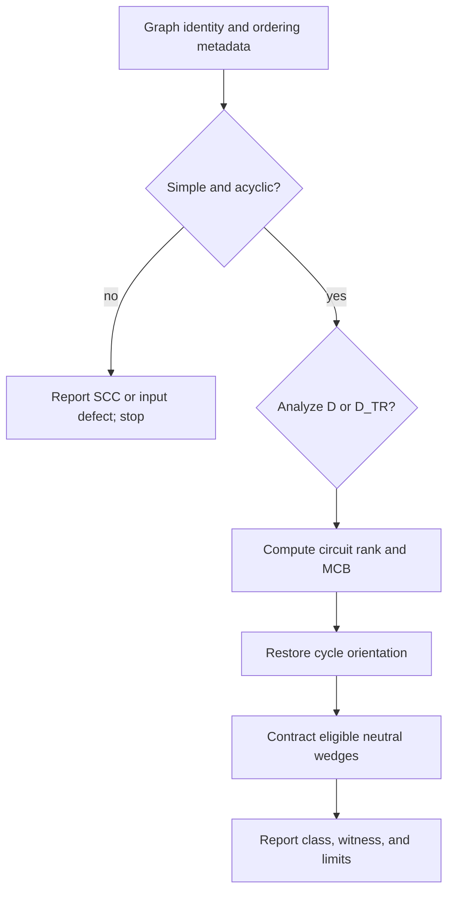

# Cycle-basis analysis decision

```mermaid
flowchart TD
  I[Graph identity and ordering metadata] --> A{Simple and acyclic?}
  A -->|no| X[Report SCC or input defect; stop]
  A -->|yes| S{Analyze D or D_TR?}
  S --> B[Compute circuit rank and MCB]
  B --> O[Restore cycle orientation]
  O --> C[Contract eligible neutral wedges]
  C --> R[Report class, witness, and limits]
```
