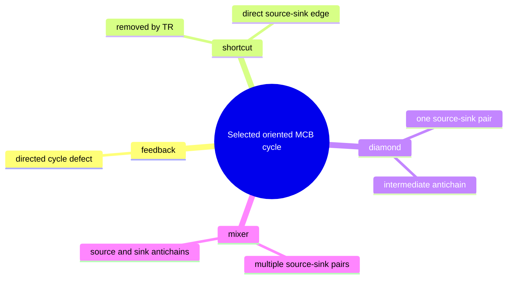

# Generalized-cycle taxonomy

```mermaid
mindmap
  root((Selected oriented MCB cycle))
    feedback
      directed cycle defect
    shortcut
      direct source-sink edge
      removed by TR
    diamond
      one source-sink pair
      intermediate antichain
    mixer
      multiple source-sink pairs
      source and sink antichains
```
