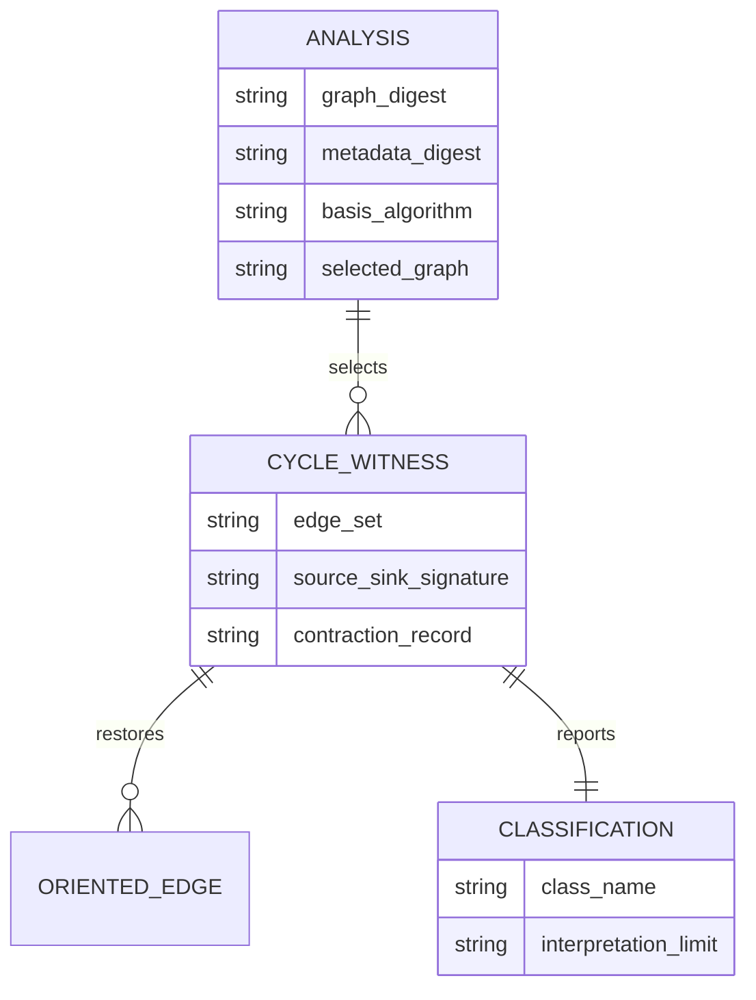

# Witness record fields

```mermaid
erDiagram
  ANALYSIS ||--o{ CYCLE_WITNESS : selects
  CYCLE_WITNESS ||--o{ ORIENTED_EDGE : restores
  CYCLE_WITNESS ||--|| CLASSIFICATION : reports
  ANALYSIS {
    string graph_digest
    string metadata_digest
    string basis_algorithm
    string selected_graph
  }
  CYCLE_WITNESS {
    string edge_set
    string source_sink_signature
    string contraction_record
  }
  CLASSIFICATION {
    string class_name
    string interpretation_limit
  }
```
