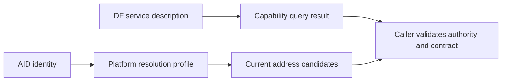
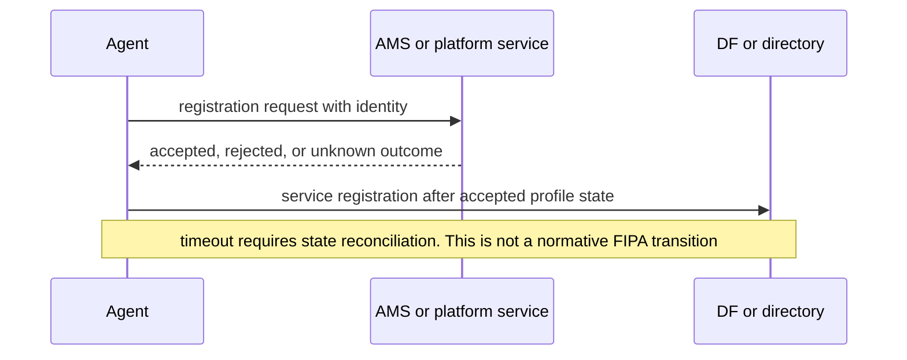

# FIPA agent management

FIPA Agent Management distinguishes an agent identifier (AID), platform services, lifecycle operations, and directory descriptions. The canonical SC00023K endpoint was unavailable during this repair, so this entry treats FIPA-specific details as source pointers and labels discovery topology, stale-state handling, and retries as deployment policy.

## 1. Keep identity, location, and service descriptions separate

Store an AID as identity; resolve transport addresses under the selected platform/profile; query a directory for service descriptions. A lookup result is neither an availability proof nor authority to invoke an agent.

## 2. Register and recover with explicit policy

For a local profile, record registration request ID, response, expiry/staleness rule, and actor authorized to alter platform state. A timeout yields `unknown`, not an AMS lifecycle transition. Re-read authoritative registration state before an idempotent re-registration or directory update.

## 3. Worked discovery case

A client asks its configured directory for `translation(en,es)`, receives two service descriptions, validates the caller’s authority and the requested contract, then resolves the selected AID through its platform profile. Empty results and timeouts are distinct outputs. A client must not persist a temporary address as the AID.

## Sources and limits

[FIPA SC00023K](https://www.fipa.org/specs/fipa00023/SC00023K.html) is the canonical target but was inaccessible on 2026-09-24. [JADE FIPA Agent Management docs](https://jade.tilab.com/doc/api/jade/domain/FIPAAgentManagement/package-summary.html) document one implementation mapping, not normative reachability, security, federation, or lifecycle-on-timeout rules.

## 4. Decision table and recovery trace

| Question | Procedure | Do not infer |
| --- | --- | --- |
| Who is this agent? | Keep AID/identity in the white-pages management record. | A current address or capability. |
| What service is offered? | Query DF/yellow-pages descriptions locally, then only along a configured bounded federation route. | Reachability or authority. |
| Can it be invoked? | Validate contract and caller authority, then resolve address through the platform profile. | That a directory hit permits an effect. |
| Did registration finish? | Read the authoritative registration record using the request ID. | A timeout means lifecycle `Unknown`. |

Constructed federation trace: client queries local DF for `translate(en,es)`; empty local result may invoke a configured peer query with request ID and expiry; returned service records are filtered by local contract/authority; selected AID is resolved by its named platform profile. For re-registration, submit `register(r17)`, record accepted/rejected/unknown, and on unknown reconcile `r17` before a deduplicated retry. Typed exception recovery is profile-specific: malformed request is corrected, unauthorized is escalated, stale identity is rediscovered, and internal failure is recorded for profile-defined recovery—no universal retry count.
