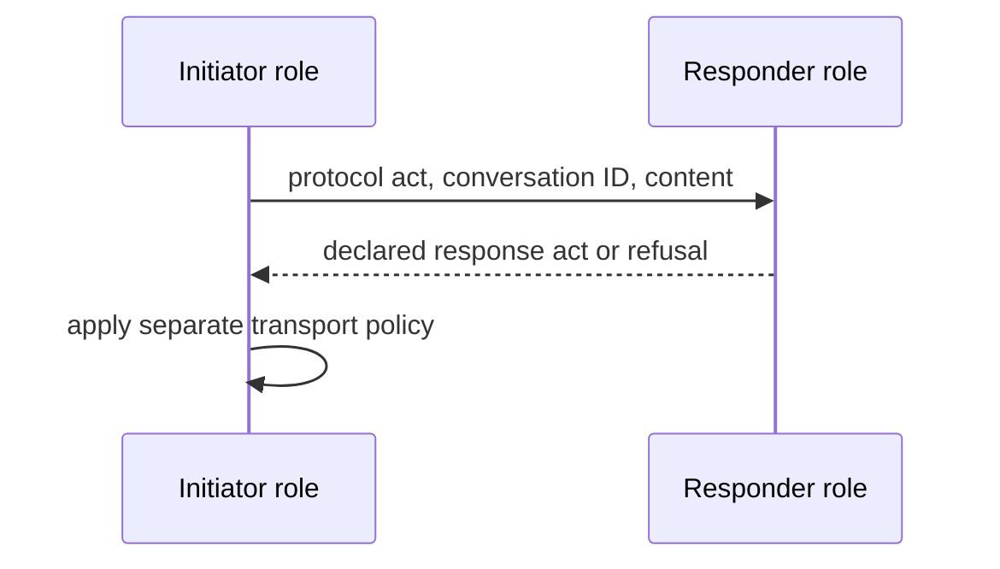
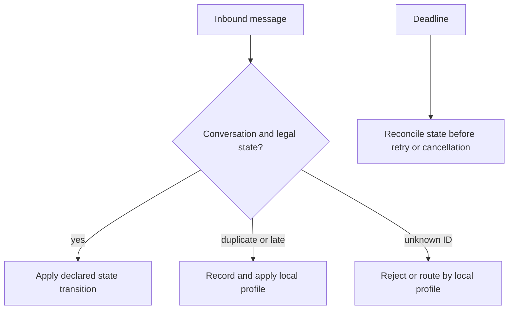

# FIPA interaction protocol library

Choose a named protocol version only after defining roles, communicative acts, content language/ontology, conversation identity, terminal states, and the profile that owns timeout, duplicate, cancellation, and late-message handling. A nominal FIPA state machine does not make those transport or effect rules universal.

## 1. Instantiate a role protocol

Bind initiator/responder roles, conversation ID, protocol/version, content schema, deadline owner, and expected terminal acts. Correlate every inbound message to the declared conversation before changing local state.

## 2. Overlay failure rules without rewriting protocol semantics

A local profile says whether a deadline means abandon, query state, retry an idempotent request, or escalate. It must preserve duplicate and late messages for correlation/audit rather than treating absence as success.

## 3. Worked request exchange

For `conversation=quote-7`, bind a requester and provider, an exact request content schema, and a terminal inform/refuse/failure set. A late `inform` after local cancellation is not silently accepted: consult the cancellation/effect profile and record the result. This is a constructed operational profile, not a claim about every FIPA library protocol.

## Sources and limits

[FIPA XC00025D](https://citeseerx.ist.psu.edu/document?doi=e772d3fb25d0edc5d39caed97dc1c21841935d97&repid=rep1&type=pdf) metadata was available but its body was not used. [FIPA XC00037H](https://jmvidal.cse.sc.edu/library/XC00037H.pdf) was read for communicative-act semantics and its conformance-testing limit. [JADE documentation](https://jade.tilab.com/doc/api/jade/domain/FIPAAgentManagement/package-summary.html) is implementation provenance only.

## 4. Selection, composition, and diagnosis

| Need | Protocol design move | Failure diagnostic |
| --- | --- | --- |
| Replaceable participants | Name initiator/responder roles, then bind identities at instantiation. | Identity-based routing hides replacement coupling. |
| Reuse | Parameterize roles, content, deadlines, and terminal acts. | One-off copies drift in exception handling. |
| Multi-stage conversation | Compose nested (one protocol inside a state), interleaved (distinct IDs progress independently), or parameterized family instances. | A shared ID merges concurrent state. |
| Concurrent choices | State AND, OR, or XOR explicitly in the protocol artifact. | “branch” alone gives participants incompatible interpretations. |

Worked composition: `procure-9` uses a request subconversation `quote-9` nested before award, while `audit-9` is interleaved under its own ID. A response for `quote-9` cannot advance `audit-9`. The protocol artifact records whether both quotes are required (AND), one viable quote suffices (OR), or exactly one supplier may win (XOR). Compliance with a nominal act sequence is not robust interoperability: the local profile still must define duplicate, late, cancellation, and effect reconciliation behavior.
