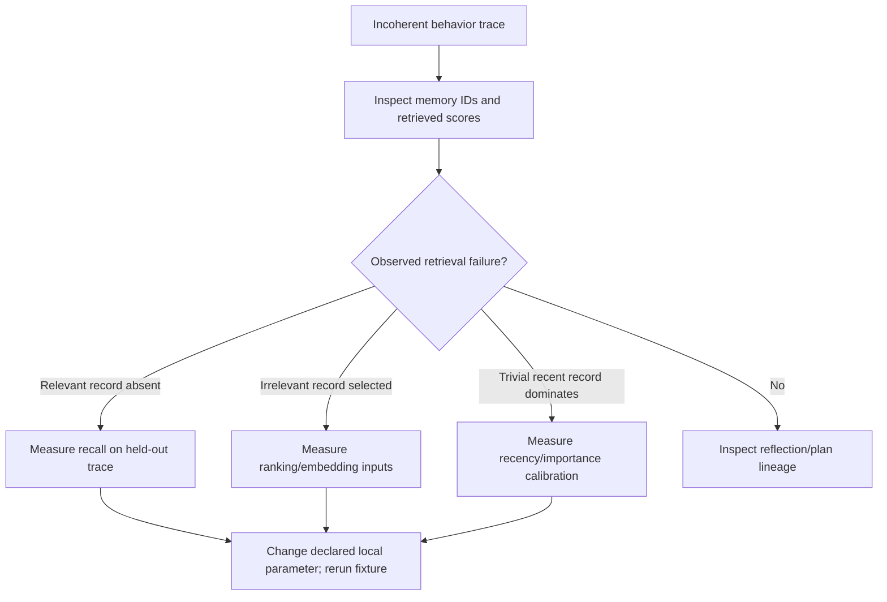
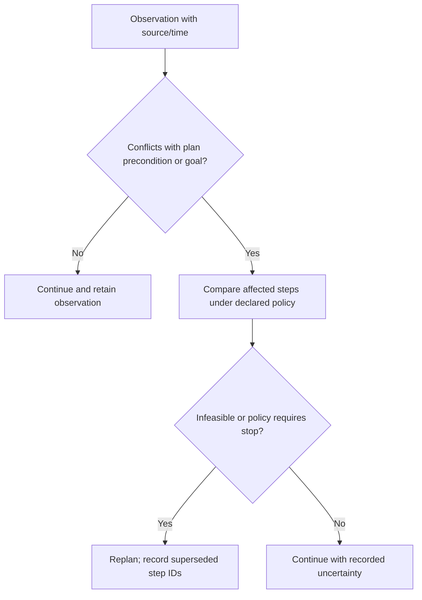
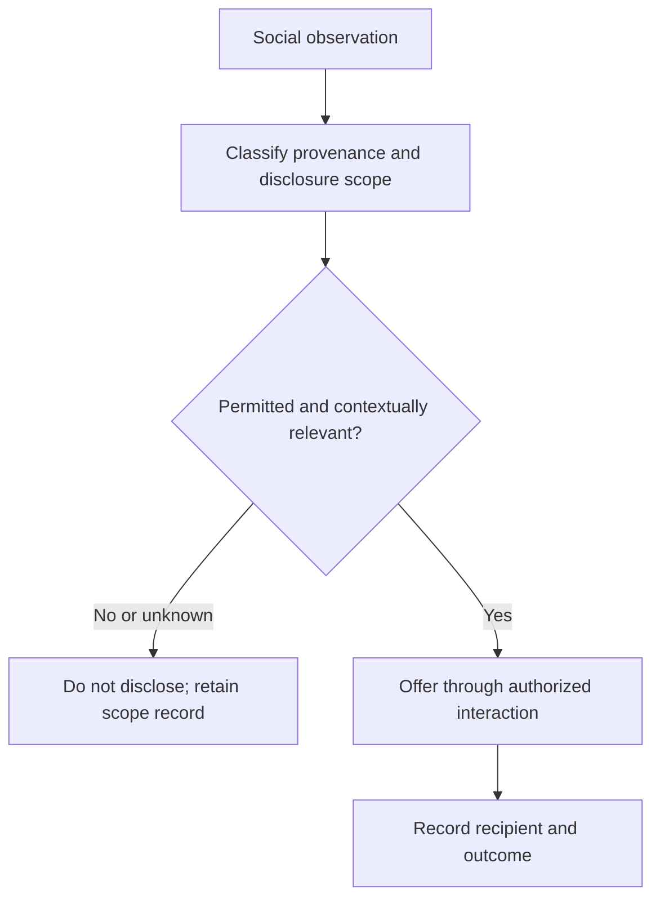

# SKILL: Generative Agents Architecture

## When to Use This Skill

Use for simulation architectures with a memory stream, retrieval, reflection, and planning. Park et al.'s pinned arXiv v2 (2023-08-06) and paper mirror were read at methods/evaluation/ablation depth on 2026-09-24: the reported system used a 25-agent Smallville sandbox and interview/believability evaluation. It is not evidence of human cognition, factual truth, safe autonomy, or a general social-coordination result.

**NOT for**: Single-turn responses, prompt engineering, task-specific tools, or centrally coordinated systems.

## Decision Points

### Memory System Design Decision Tree

### Reflection Triggering Decision Matrix
| Source condition | Action |
| --- | --- |
| Crosses a fixture-defined signal/window | Generate a reflection citing memory IDs |
| Does not cross it | Preserve observations and recheck on the next fixture step |

### Planning Replan Threshold

### Multi-Agent Information Diffusion

## Failure Modes

### 1. **Retrieval Cascade Failure**
**Detection**: Agent denies knowledge of information they previously demonstrated knowing
**Symptom**: "I don't know about X" when agent stored observations about X
**Diagnosis**: Retrieval function weights are mistuned, causing relevant memories to score below threshold
**Fix**: inspect memory IDs and retrieval scores, then compare a declared local change on held-out traces.

### 2. **Reflection Vacuum**
**Detection**: Agent repeats same mistakes despite having multiple similar experiences
**Symptom**: No behavioral learning from patterns (e.g., always late to meetings despite noting lateness)
**Diagnosis**: Reflection not triggering on significant patterns OR reflections not being stored with sufficient importance
**Fix**: require reflections to cite their memory IDs; calibrate a declared trigger on held-out traces.

### 3. **Plan Rigidity Lock**
**Detection**: Agent continues obviously suboptimal plans when context changes
**Symptom**: Walking to closed locations, pursuing obsolete goals, ignoring environmental changes
**Diagnosis**: Replanning thresholds too high OR commitment override too strong
**Fix**: compare plan preconditions with sourced observations under a declared reconsideration policy.

### 4. **Social Isolation Spiral**
**Detection**: Agents stop interacting despite being in proximity and having social motivations
**Symptom**: Multiple agents in same location but no conversation or coordination
**Diagnosis**: Social observations scoring too low in importance OR reflection not synthesizing social patterns
**Fix**: Boost importance scoring for social events (conversations, relationships) OR add social-specific reflection triggers

### 5. **Memory Importance Inflation**
**Detection**: Agent treats mundane events as highly significant, drowning out actual important events
**Symptom**: Reflection on trivial activities, treating routine tasks as major life events
**Diagnosis**: Importance scoring model lacks calibration OR no relative scoring mechanism
**Fix**: Implement comparative importance scoring (rate events relative to recent history) OR add importance decay over time

## Worked Examples

### Example 1: Source Party Demonstration (reported, not a production fixture)

Park et al. report two simulated game days in Smallville. Isabella Rodriguez is the café owner. The reported party demonstration traces information spread and attendance; it should not be rephrased as a three-day scripted scenario or as evidence that every stored claim is true.

1. Keep an observed social statement with speaker/time/provenance and disclosure scope.
2. A source-style retrieval can condition a language-model prompt on ranked records; it does not establish the statement’s truth.
3. If a reflection cites records, preserve those identifiers and mark it **derived**. On later contradiction, retrieve the competing records, correct or supersede dependent reflections, and leave the source claim visible.
4. Treat reported counts (for example, agents who heard of or attended the party) as a study observation with its stated interview/evaluation conditions, not a reliability or authorization guarantee.

A production system may add authority filters, an immutable compatible `spaceId`, and hybrid lexical+dense retrieval only as an explicit local policy; those are not claims about the paper’s cosine-based implementation.

### Example 2: Conflicting Plans Resolution

**Scenario**: Tom has standing plan to work on novel 2-4pm, but Maya asks him to coffee at 3pm.

**Decision Process**:
1. Observation: "Maya invited me to coffee at 3pm" [Importance: 6]
2. Retrieval surfaces: current plan [Recent], Maya relationship memories [Relevant], past coffee meetings [Similar]
3. Conflict detection: overlap between 3-4pm work block and coffee invitation
4. Reflection synthesis: "Maya is a good friend, but I've been inconsistent with writing schedule"
5. Planning decision: Moderate conflict + relationship importance → replan work to 1-3pm, accept coffee

**What novice would miss**: Treating this as binary choice (work OR coffee) instead of temporal reoptimization
**What expert catches**: Relationship maintenance has long-term importance, schedule flexibility enables both goals

## Reference Files

- `references/memory-retrieval-as-attention-mechanism.md` — Three-factor model (recency, importance, relevance) for tuning memory retrieval weights. **Read when** agent exhibits incoherent behavior or retrieves irrelevant memories.
- `references/reflection-as-hierarchical-synthesis.md` — Hierarchical synthesis pattern (leaf observations → patterns → identity insights). **Read when** agent repeats mistakes despite accumulated experience.
- `references/planning-as-recursive-decomposition.md` — Multi-timescale planning decomposition (day/hour/minute intentions). **Read when** agent lacks long-term coherence or replans too frequently.
- `references/grounding-language-models-in-structured-environments.md` — Tree representation pattern for bridging language models to structured environments. **Read when** designing agent perception of spatial/hierarchical worlds.
- `references/emergent-coordination-without-central-control.md` — Distributed multi-agent synchronization without central planner. **Read when** designing information diffusion or social interaction protocols.
- `references/failure-modes-and-boundary-conditions.md` — Documented failure modes and erratic behavior patterns from original research. **Read when** diagnosing unexpected agent behavior or planning robustness improvements.
- `references/prompt-engineering-as-cognitive-architecture.md` — Prompt design as reasoning architecture component. **Read when** tuning agent decision-making or reflection triggers.
- `diagrams/01_flowchart_agent_coherence_decision_tree.md` — Decision tree for diagnosing incoherent behavior and selecting remediation. **Read when** troubleshooting agent failures.
- `diagrams/02_stateDiagram-v2_agent_behavior_loop-_memory-re.md` — State machine of memory-reflection-planning cycle. **Read when** understanding agent execution flow or timing.
- `diagrams/03_timeline_multi-timescale_planning_decom.md` — Timeline visualization of hierarchical planning across timescales. **Read when** designing multi-level intention structures.
- `references/source-boundary-memory-lineage.md` — Source depth, memory-ID lineage, false-event correction, and believability versus factual grounding. **Read when** evaluating a Park-style simulation.

## Quality Gates

- [ ] Retrieval quality is evaluated on a declared corpus with memory IDs, recall/ranking results, and an abstention path.
- [ ] Agent behavior remains consistent with established personality traits across >24 hour periods
- [ ] Reflection triggers produce insights that influence future behavior (testable through repeated scenarios)
- [ ] Plans adapt appropriately to environmental changes without complete goal abandonment
- [ ] Multi-agent information spreads through social networks without telepathic coordination
- [ ] Agent can reference specific past events when asked, not just general patterns
- [ ] Social relationships strengthen/weaken based on interaction history and outcomes
- [ ] Importance calibration is evaluated against labeled fixture cases; values are local parameters, not paper defaults.
- [ ] Temporal coherence maintained: actions reference appropriate past context for current situation
- [ ] Scale behavior is measured on the target memory corpus with declared latency and quality criteria.

## NOT-FOR Boundaries

**Don't use this architecture for**:
- **Single-turn Q&A**: Use standard prompt engineering instead
- **Task automation**: For IFTTT-style workflows, use [workflow-automation] skill
- **Real-time coordination**: For <1 second response requirements, use [reactive-systems] skill
- **Factual knowledge queries**: For information retrieval, use [knowledge-base] skill
- **Mathematical reasoning**: For computation-heavy problems, use [symbolic-reasoning] skill

**Delegate when**:
- Memory requirements exceed computational budget → Use [stateless-agents] skill
- Behavior must be completely predictable → Use [rule-based-systems] skill
- Privacy cannot tolerate memory persistence → Use [ephemeral-agents] skill
- Environment changes faster than agent can observe → Use [reactive-control] skill
