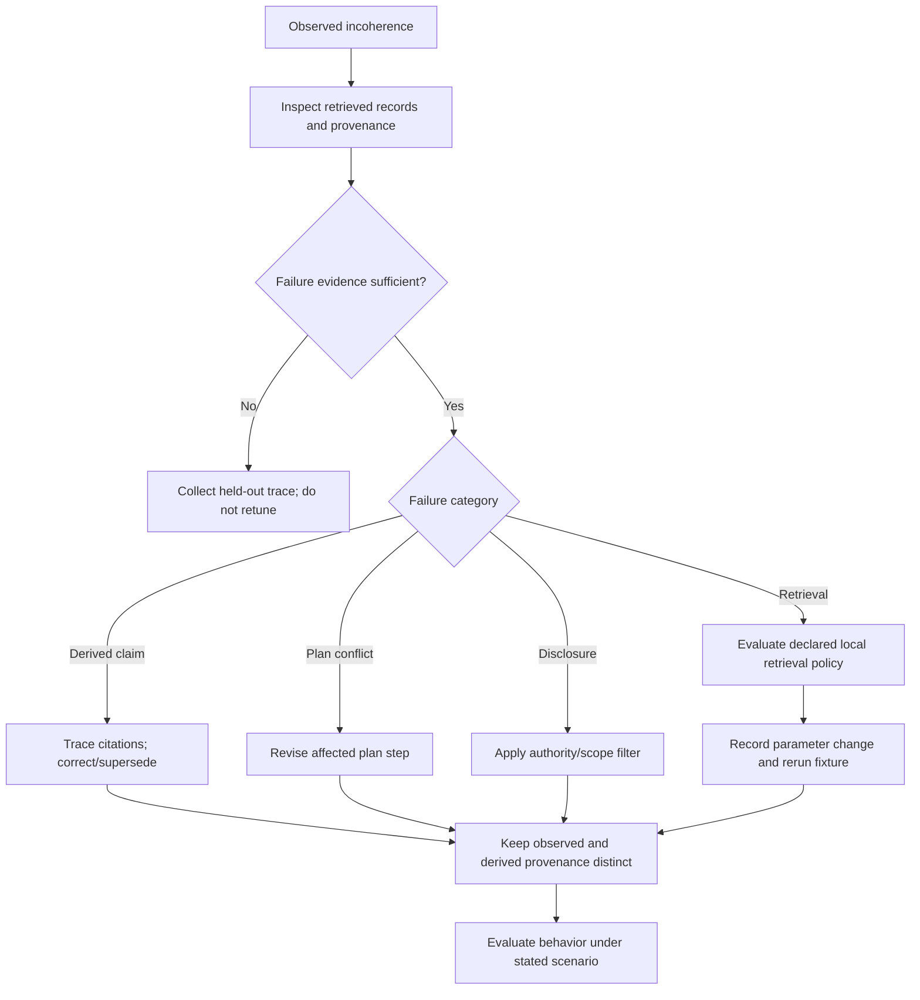

# Agent Coherence Decision Tree

```mermaid
flowchart TD
    A[Observed incoherence] --> B[Inspect retrieved records and provenance]
    B --> C{Failure evidence sufficient?}
    C -->|No| D[Collect held-out trace; do not retune]
    C -->|Yes| E{Failure category}
    E -->|Retrieval| F[Evaluate declared local retrieval policy]
    E -->|Derived claim| G[Trace citations; correct/supersede]
    E -->|Plan conflict| H[Revise affected plan step]
    E -->|Disclosure| I[Apply authority/scope filter]
    F --> J[Record parameter change and rerun fixture]
    G --> K[Keep observed and derived provenance distinct]
    H --> K
    I --> K
    J --> K
    K --> L[Evaluate behavior under stated scenario]
```
