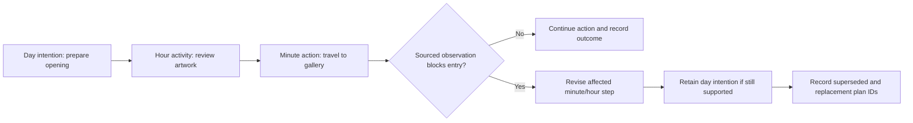

# Multi-Timescale Planning Decomposition

```mermaid
flowchart LR
  A[Day intention: prepare opening] --> B[Hour activity: review artwork]
  B --> C[Minute action: travel to gallery]
  C --> D{Sourced observation blocks entry?}
  D -->|No| E[Continue action and record outcome]
  D -->|Yes| F[Revise affected minute/hour step]
  F --> G[Retain day intention if still supported]
  G --> H[Record superseded and replacement plan IDs]
```
