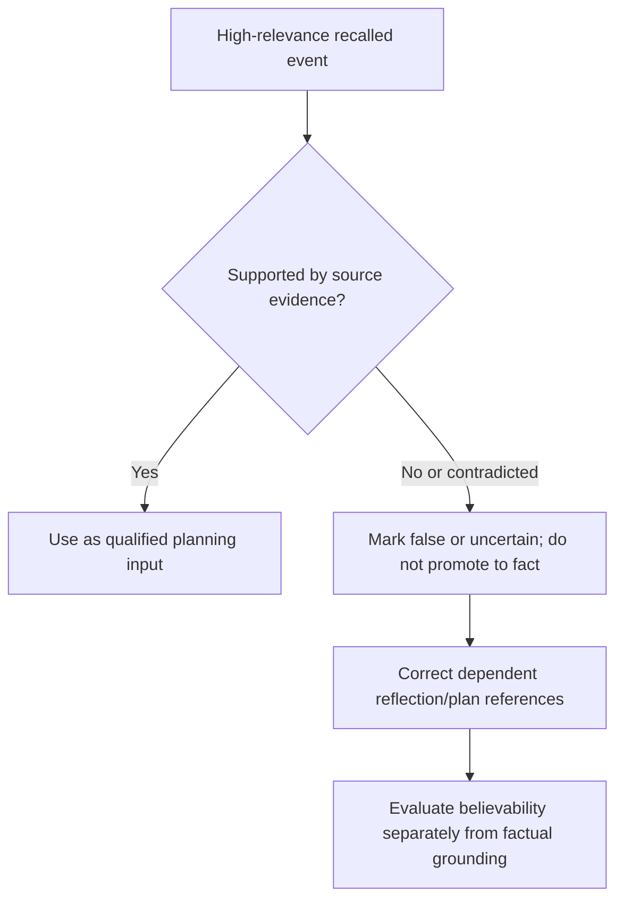

# Park-style memory lineage, correction, and source scope

Park et al., “Generative Agents: Interactive Simulacra of Human Behavior,” arXiv:2304.03442 v2 (2023-08-06), later PACM HCI 7 CSCW1, was read on 2026-09-24 at methods, evaluation, and ablation depth from the [pinned record](https://arxiv.org/abs/2304.03442v2) and a paper mirror. The paper reports memory stream, recency/importance/relevance retrieval, reflection, recursive planning, and a 25-agent Smallville sandbox. Its evaluation concerns interview/believability and ablations; it does not certify memory truth or human cognition.

Constructed fixture: `m17` says a party was cancelled, `m03` is an earlier invitation, and a later organizer record contradicts `m17`. Retrieval can surface `m17` because it is relevant; it must retain source status, correct dependent reflections, and avoid treating a plausible memory as truth.
