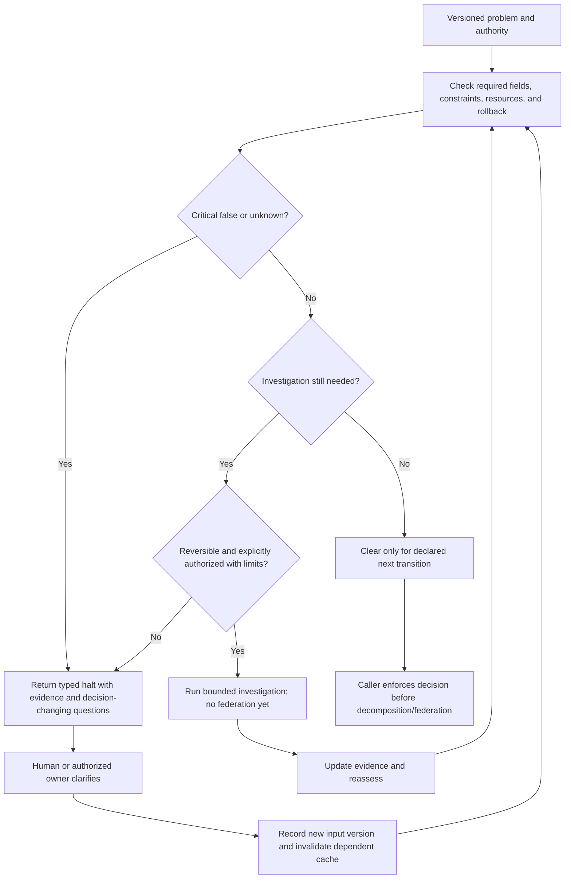

# Diagram 1: Typed gate and fresh reassessment

```mermaid
flowchart TD
  A[Versioned problem and authority] --> B[Check required fields, constraints, resources, and rollback]
  B --> C{Critical false or unknown?}
  C -->|Yes| D[Return typed halt with evidence and decision-changing questions]
  D --> E[Human or authorized owner clarifies]
  E --> F[Record new input version and invalidate dependent cache]
  F --> B
  C -->|No| G{Investigation still needed?}
  G -->|Yes| H{Reversible and explicitly authorized with limits?}
  H -->|No| D
  H -->|Yes| I[Run bounded investigation; no federation yet]
  I --> J[Update evidence and reassess]
  J --> B
  G -->|No| K[Clear only for declared next transition]
  K --> L[Caller enforces decision before decomposition/federation]
```
