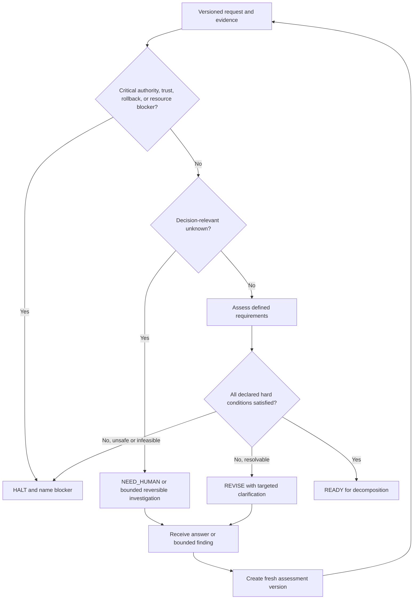

# H01 — Typed pre-federation gate (rewrites existing Mermaid)

```mermaid
flowchart TD
  A[Versioned request and evidence] --> B{Critical authority, trust, rollback, or resource blocker?}
  B -->|Yes| H[HALT and name blocker]
  B -->|No| C{Decision-relevant unknown?}
  C -->|Yes| Q[NEED_HUMAN or bounded reversible investigation]
  C -->|No| R[Assess defined requirements]
  R --> D{All declared hard conditions satisfied?}
  D -->|No, resolvable| V[REVISE with targeted clarification]
  D -->|No, unsafe or infeasible| H
  D -->|Yes| G[READY for decomposition]
  Q --> N[Receive answer or bounded finding]
  V --> N
  N --> X[Create fresh assessment version]
  X --> A
```
