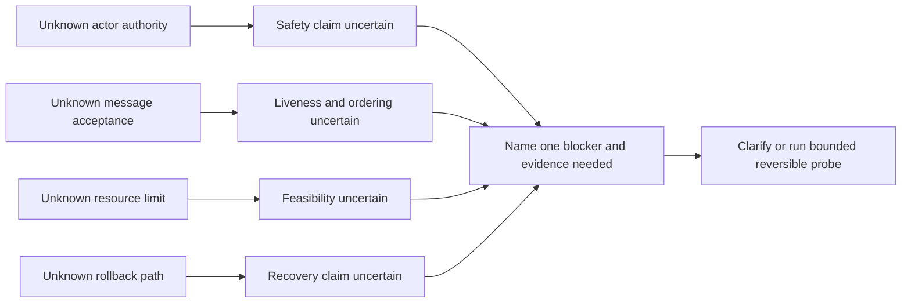

# H02 — Missing definitions to affected guarantees

```mermaid
flowchart LR
  A[Unknown actor authority] --> S[Safety claim uncertain]
  B[Unknown message acceptance] --> L[Liveness and ordering uncertain]
  C[Unknown resource limit] --> R[Feasibility uncertain]
  D[Unknown rollback path] --> F[Recovery claim uncertain]
  S --> H[Name one blocker and evidence needed]
  L --> H
  R --> H
  F --> H
  H --> Q[Clarify or run bounded reversible probe]
```
