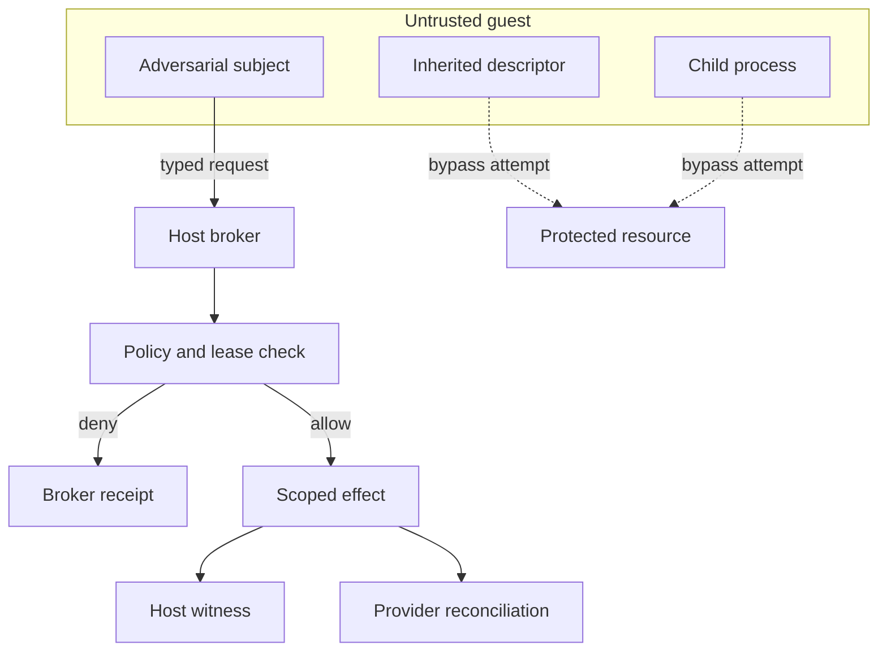

# S01 — Route, boundary, and independent witness

```mermaid
flowchart TB
  subgraph Guest[Untrusted guest]
    Code[Adversarial subject]
    FD[Inherited descriptor]
    Child[Child process]
  end
  Code -->|typed request| Broker[Host broker]
  FD -. bypass attempt .-> Resource[Protected resource]
  Child -. bypass attempt .-> Resource
  Broker --> Gate[Policy and lease check]
  Gate -->|deny| Denial[Broker receipt]
  Gate -->|allow| Effect[Scoped effect]
  Effect --> Host[Host witness]
  Effect --> Provider[Provider reconciliation]
```
