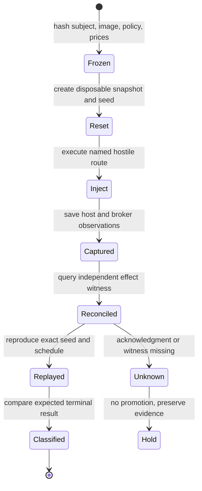

# S02 — Adversarial run and replay lifecycle

```mermaid
stateDiagram-v2
  [*] --> Frozen: hash subject, image, policy, prices
  Frozen --> Reset: create disposable snapshot and seed
  Reset --> Inject: execute named hostile route
  Inject --> Captured: save host and broker observations
  Captured --> Reconciled: query independent effect witness
  Reconciled --> Replayed: reproduce exact seed and schedule
  Reconciled --> Unknown: acknowledgment or witness missing
  Replayed --> Classified: compare expected terminal result
  Unknown --> Hold: no promotion, preserve evidence
  Classified --> [*]
```
