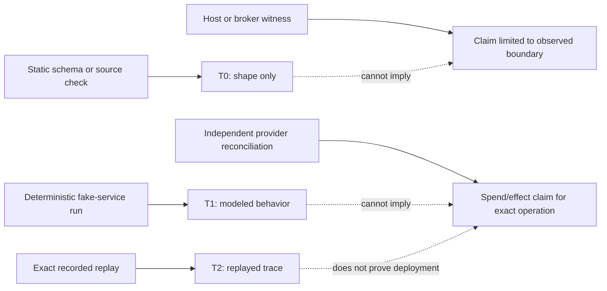

# S03 — Evidence tier and allowed claim

```mermaid
flowchart LR
  Static[Static schema or source check] --> T0[T0: shape only]
  Fake[Deterministic fake-service run] --> T1[T1: modeled behavior]
  Trace[Exact recorded replay] --> T2[T2: replayed trace]
  Host[Host or broker witness] --> Claim[Claim limited to observed boundary]
  Provider[Independent provider reconciliation] --> Spend[Spend/effect claim for exact operation]
  T0 -. cannot imply .-> Claim
  T1 -. cannot imply .-> Spend
  T2 -. does not prove deployment .-> Spend
```
