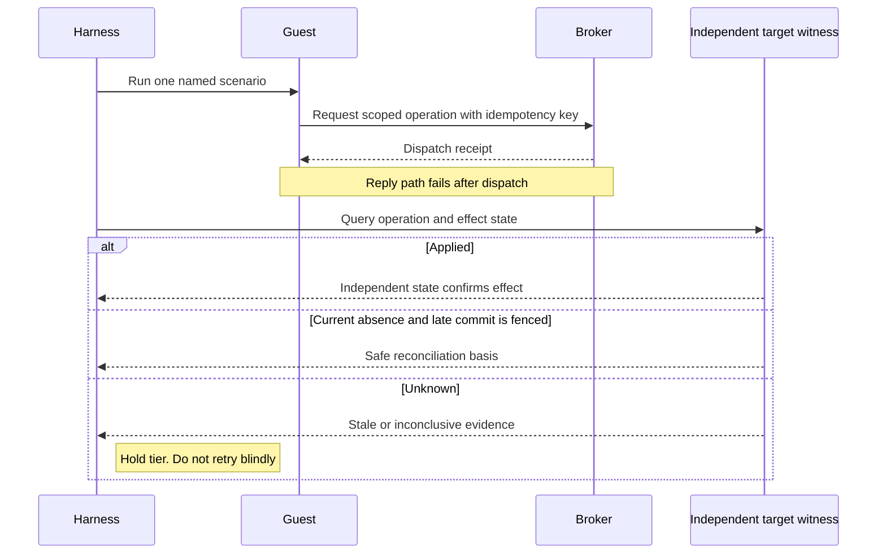

# S04 — Lost acknowledgment is unknown until reconciled

```mermaid
sequenceDiagram
  participant Harness
  participant Guest
  participant Broker
  participant Witness as Independent target witness
  Harness->>Guest: Run one named scenario
  Guest->>Broker: Request scoped operation with idempotency key
  Broker-->>Guest: Dispatch receipt
  Note over Guest,Broker: Reply path fails after dispatch
  Harness->>Witness: Query operation and effect state
  alt Applied
    Witness-->>Harness: Independent state confirms effect
  else Current absence and late commit is fenced
    Witness-->>Harness: Safe reconciliation basis
  else Unknown
    Witness-->>Harness: Stale or inconclusive evidence
    Note right of Harness: Hold tier. Do not retry blindly
  end
```
