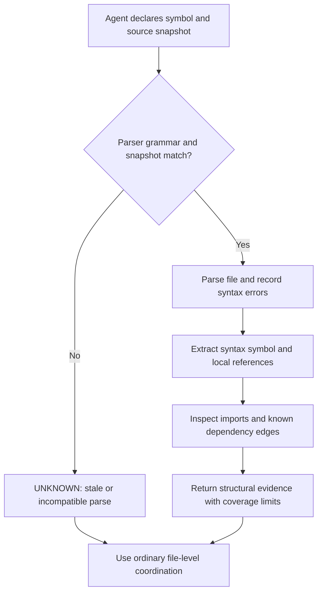

# S05 — Parse and trace a declared symbol claim (ASCII conversion)

```mermaid
flowchart TD
  C[Agent declares symbol and source snapshot] --> V{Parser grammar and snapshot match?}
  V -->|No| U[UNKNOWN: stale or incompatible parse]
  V -->|Yes| P[Parse file and record syntax errors]
  P --> E[Extract syntax symbol and local references]
  E --> I[Inspect imports and known dependency edges]
  I --> R[Return structural evidence with coverage limits]
  U --> H[Use ordinary file-level coordination]
  R --> H
```
