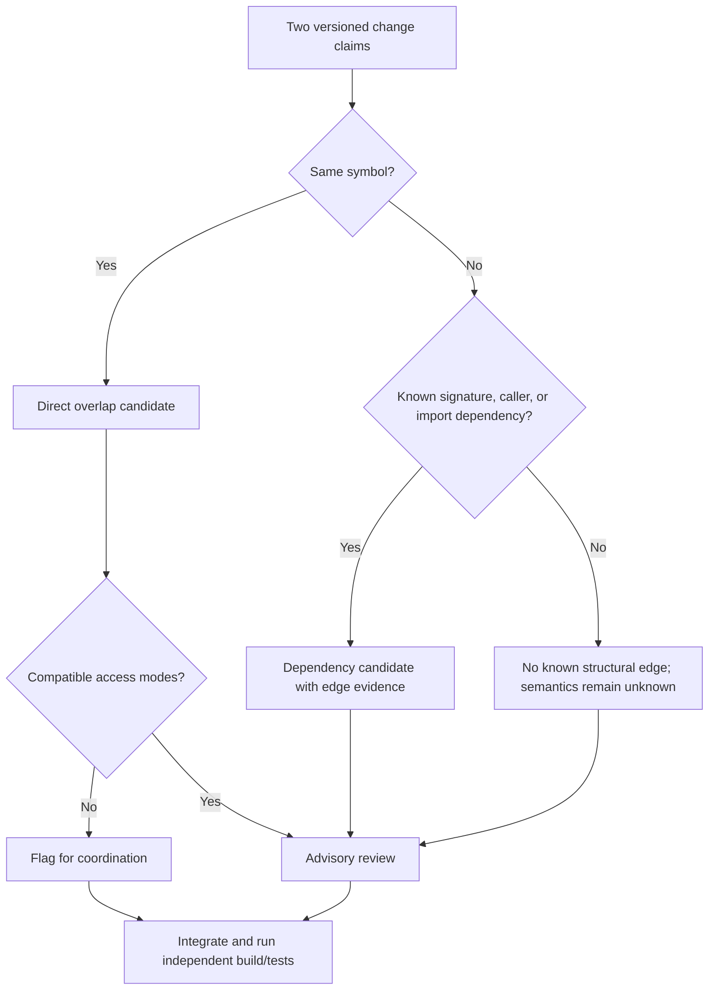

# S06 — Conflict candidates, not semantic verdicts (ASCII conversion)

```mermaid
flowchart TD
  A[Two versioned change claims] --> S{Same symbol?}
  S -->|Yes| D[Direct overlap candidate]
  S -->|No| G{Known signature, caller, or import dependency?}
  G -->|Yes| B[Dependency candidate with edge evidence]
  G -->|No| U[No known structural edge; semantics remain unknown]
  D --> M{Compatible access modes?}
  M -->|No| C[Flag for coordination]
  M -->|Yes| Q[Advisory review]
  B --> Q
  U --> Q
  C --> I[Integrate and run independent build/tests]
  Q --> I
```
