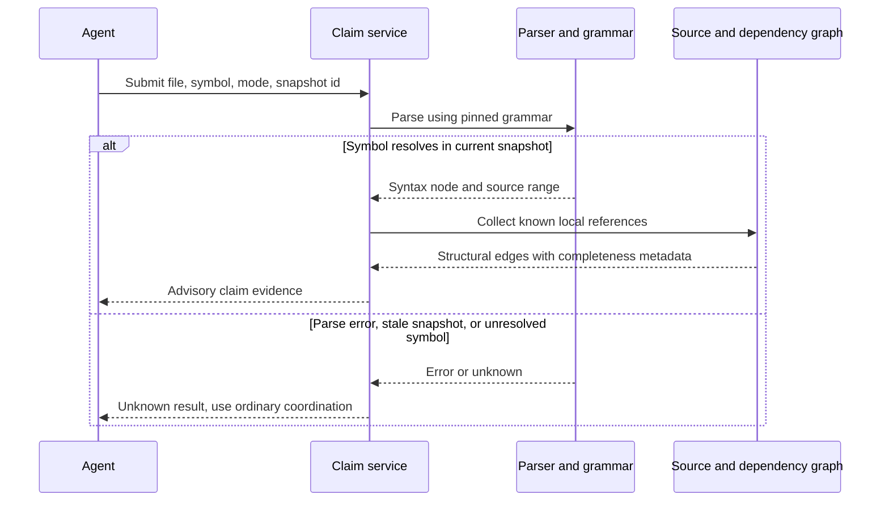

# S07 — Claim submission and parse failure boundary (ASCII conversion)

```mermaid
sequenceDiagram
  participant A as Agent
  participant S as Claim service
  participant P as Parser and grammar
  participant G as Source and dependency graph
  A->>S: Submit file, symbol, mode, snapshot id
  S->>P: Parse using pinned grammar
  alt Symbol resolves in current snapshot
    P-->>S: Syntax node and source range
    S->>G: Collect known local references
    G-->>S: Structural edges with completeness metadata
    S-->>A: Advisory claim evidence
  else Parse error, stale snapshot, or unresolved symbol
    P-->>S: Error or unknown
    S-->>A: Unknown result, use ordinary coordination
  end
```
