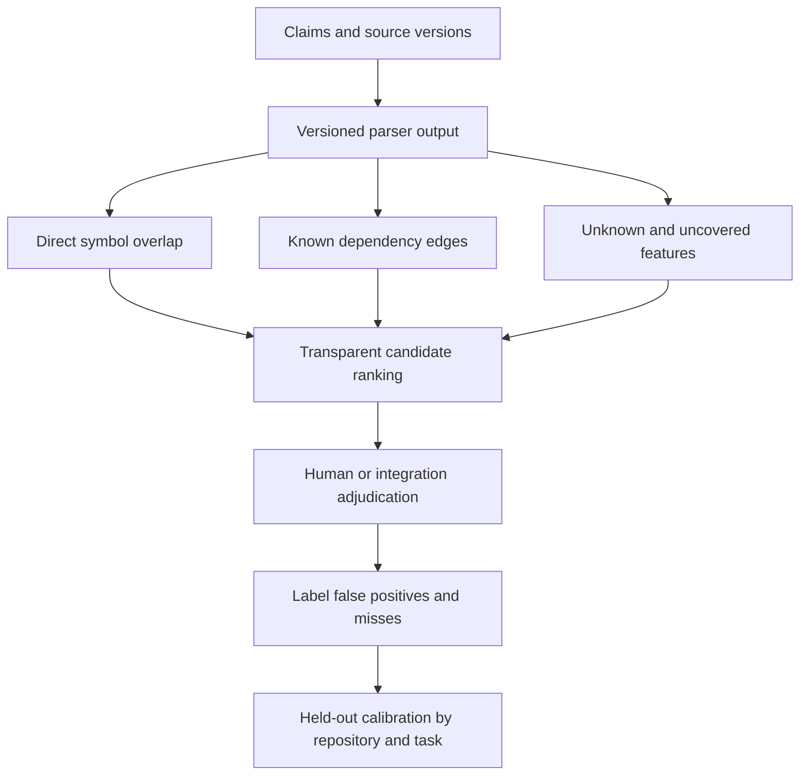

# S08 — Conflict evidence pipeline (ASCII conversion)

```mermaid
flowchart TD
  C[Claims and source versions] --> P[Versioned parser output]
  P --> O[Direct symbol overlap]
  P --> E[Known dependency edges]
  P --> X[Unknown and uncovered features]
  O --> R[Transparent candidate ranking]
  E --> R
  X --> R
  R --> H[Human or integration adjudication]
  H --> L[Label false positives and misses]
  L --> T[Held-out calibration by repository and task]
```
