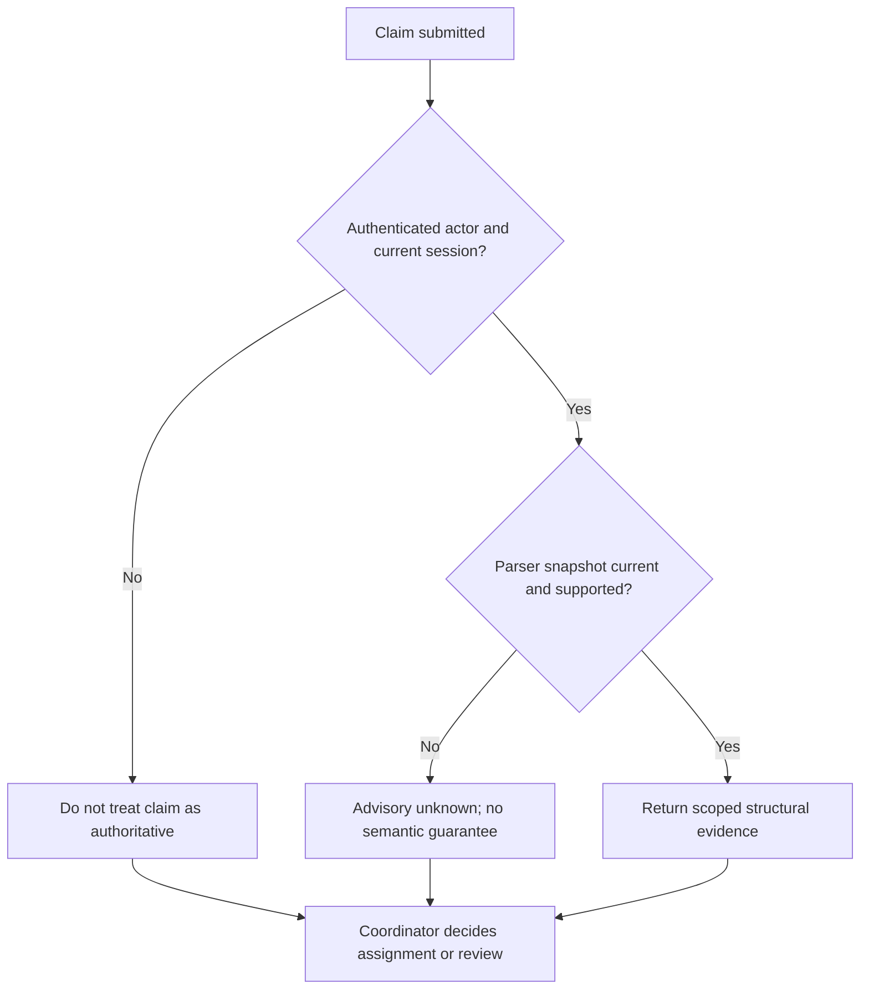

# S09 — Trust boundary for conflict enforcement (ASCII conversion)

```mermaid
flowchart TD
  I[Claim submitted] --> A{Authenticated actor and current session?}
  A -->|No| U[Do not treat claim as authoritative]
  A -->|Yes| C{Parser snapshot current and supported?}
  C -->|No| X[Advisory unknown; no semantic guarantee]
  C -->|Yes| R[Return scoped structural evidence]
  R --> D[Coordinator decides assignment or review]
  U --> D
  X --> D
```
